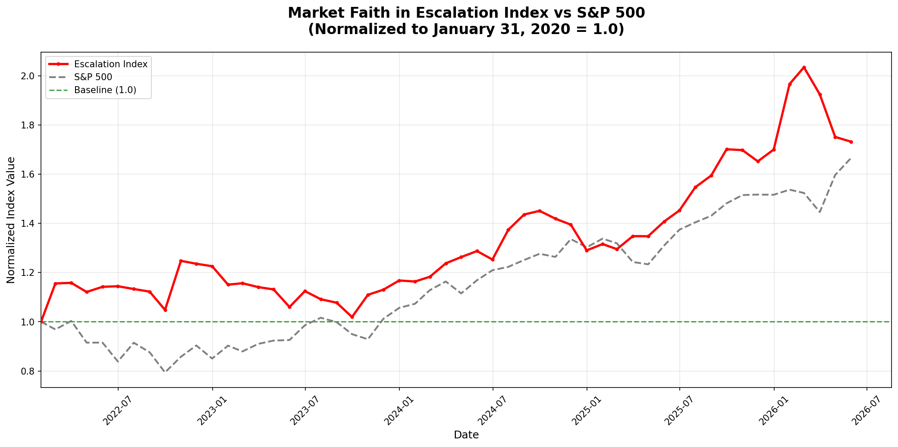

# Market Faith in Escalation Index Report

**Generated:** 2026-05-28 09:57:41

## Description

The **Market Faith in Escalation Index** represents the stock market's collective belief in continued or escalating global conflict. It is calculated as the average of normalized stock prices of the world's top-15 arms manufacturers.

Each stock price is normalized relative to its value on **January 31, 2020** (baseline = 1.0). An index value of 1.0 means all stocks are at their baseline price. An index value above 1.0 indicates that, on average, arms manufacturers' stocks have appreciated since the baseline date.

## Companies in the Index

The following 15 companies are included in the index:

| Ticker | Company Name | Country |
|--------|--------------|---------|
| LMT | Lockheed Martin | USA |
| RTX | RTX Corporation / Raytheon | USA |
| NOC | Northrop Grumman | USA |
| GD | General Dynamics | USA |
| LHX | L3Harris Technologies | USA |

## Data Sources

- **Stock Prices:** [Yahoo Finance](https://finance.yahoo.com/) via `yfinance` library
- **S&P 500:** [Yahoo Finance](https://finance.yahoo.com/quote/%5EGSPC/) (ticker: ^GSPC)
- **Company List:** Based on SIPRI (Stockholm International Peace Research Institute) and public defense industry revenue rankings
- **Baseline Date:** 2022-01-31
- **Data Period:** 2022-01-31 to 2026-05-28

## Methodology

1. Historical monthly closing prices are fetched for each company
2. Each stock's price is normalized: `normalized_price = current_price / price_on_2022_01_31`
3. The index is calculated as: `index = sum(all_normalized_prices) / 15`
4. S&P 500 is also normalized to the same baseline for comparison

## Index Chart

## Monthly Index Values

| Date | Escalation Index | S&P 500 | Escalation vs Baseline |
|------|-----------------|---------|------------------------|
| 2022-01-31 | 1.0000 | 1.0000 | +0.00% |
| 2022-02-28 | 1.1557 | 0.9686 | +15.57% |
| 2022-03-31 | 1.1580 | 1.0033 | +15.80% |
| 2022-04-30 | 1.1209 | 0.9150 | +12.09% |
| 2022-05-31 | 1.1419 | 0.9151 | +14.19% |
| 2022-06-30 | 1.1443 | 0.8383 | +14.43% |
| 2022-07-31 | 1.1330 | 0.9147 | +13.30% |
| 2022-08-31 | 1.1224 | 0.8759 | +12.24% |
| 2022-09-30 | 1.0480 | 0.7941 | +4.80% |
| 2022-10-31 | 1.2476 | 0.8575 | +24.76% |
| 2022-11-30 | 1.2357 | 0.9036 | +23.57% |
| 2022-12-31 | 1.2256 | 0.8503 | +22.56% |
| 2023-01-31 | 1.1506 | 0.9028 | +15.06% |
| 2023-02-28 | 1.1565 | 0.8792 | +15.65% |
| 2023-03-31 | 1.1408 | 0.9100 | +14.08% |
| 2023-04-30 | 1.1312 | 0.9234 | +13.12% |
| 2023-05-31 | 1.0599 | 0.9257 | +5.99% |
| 2023-06-30 | 1.1245 | 0.9856 | +12.45% |
| 2023-07-31 | 1.0914 | 1.0163 | +9.14% |
| 2023-08-31 | 1.0773 | 0.9983 | +7.73% |
| 2023-09-30 | 1.0191 | 0.9496 | +1.91% |
| 2023-10-31 | 1.1094 | 0.9287 | +10.94% |
| 2023-11-30 | 1.1301 | 1.0116 | +13.01% |
| 2023-12-31 | 1.1676 | 1.0563 | +16.76% |
| 2024-01-31 | 1.1634 | 1.0731 | +16.34% |
| 2024-02-29 | 1.1829 | 1.1286 | +18.29% |
| 2024-03-31 | 1.2374 | 1.1636 | +23.74% |
| 2024-04-30 | 1.2627 | 1.1152 | +26.27% |
| 2024-05-31 | 1.2873 | 1.1687 | +28.73% |
| 2024-06-30 | 1.2527 | 1.2093 | +25.27% |
| 2024-07-31 | 1.3737 | 1.2230 | +37.37% |
| 2024-08-31 | 1.4358 | 1.2509 | +43.58% |
| 2024-09-30 | 1.4506 | 1.2761 | +45.06% |
| 2024-10-31 | 1.4188 | 1.2635 | +41.88% |
| 2024-11-30 | 1.3945 | 1.3359 | +39.45% |
| 2024-12-31 | 1.2901 | 1.3025 | +29.01% |
| 2025-01-31 | 1.3156 | 1.3377 | +31.56% |
| 2025-02-28 | 1.2950 | 1.3187 | +29.50% |
| 2025-03-31 | 1.3478 | 1.2428 | +34.78% |
| 2025-04-30 | 1.3475 | 1.2333 | +34.75% |
| 2025-05-31 | 1.4070 | 1.3092 | +40.70% |
| 2025-06-30 | 1.4522 | 1.3741 | +45.22% |
| 2025-07-31 | 1.5466 | 1.4039 | +54.66% |
| 2025-08-31 | 1.5941 | 1.4307 | +59.41% |
| 2025-09-30 | 1.7009 | 1.4812 | +70.09% |
| 2025-10-31 | 1.6976 | 1.5148 | +69.76% |
| 2025-11-30 | 1.6519 | 1.5168 | +65.19% |
| 2025-12-31 | 1.6998 | 1.5160 | +69.98% |
| 2026-01-31 | 1.9663 | 1.5367 | +96.63% |
| 2026-02-28 | 2.0342 | 1.5234 | +103.42% |
| 2026-03-31 | 1.9241 | 1.4458 | +92.41% |
| 2026-04-30 | 1.7511 | 1.5965 | +75.11% |
| 2026-05-31 | 1.7318 | 1.6654 | +73.18% |

## Latest Stock Prices (Normalized)

| Ticker | Company | Current Price | Normalized Value |
|--------|---------|---------------|------------------|
| LMT | Lockheed Martin (USA) | $531.14 | 1.5280 |
| RTX | RTX Corporation / Raytheon (USA) | $176.59 | 2.1601 |
| NOC | Northrop Grumman (USA) | $551.34 | 1.5952 |
| GD | General Dynamics (USA) | $342.69 | 1.7660 |
| LHX | L3Harris Technologies (USA) | $309.05 | 1.6097 |

*Note: Values marked with * are calculated from the last available price for that stock, which may not align with the US market calendar.

## Summary

- **Baseline Index Value:** 1.00 (all stocks = 1.0)
- **First Index Value (January 2022):** 1.0000
- **Latest Index Value (May 2026):** 1.7318
- **Total Change from Baseline:** +73.18%

- **S&P 500 Latest Value:** 1.6654
- **S&P 500 Total Change from Baseline:** +66.54%

**Interpretation:** The market has increased its faith in escalation. Arms manufacturers' stocks, on average, have appreciated since January 2020.
