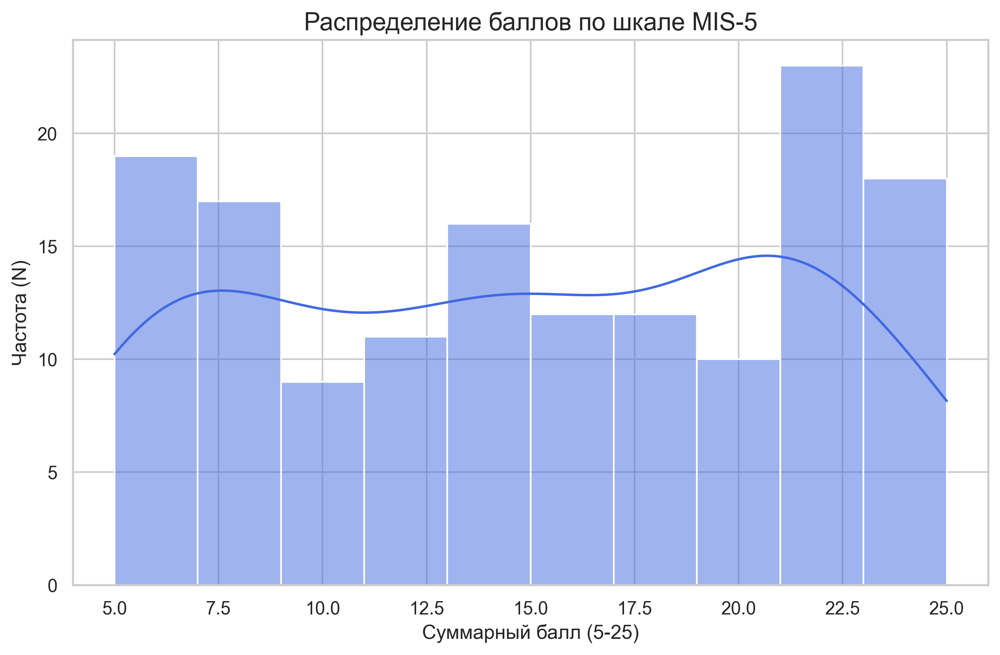
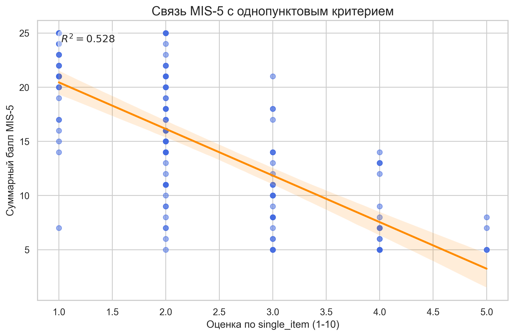

# Психометрический отчет по шкале MIS (30 пунктов)

**N = 147**

## 1. Надежность полной шкалы

- **Общая Альфа Кронбаха (MIS Total): 0.975**

### Надежность субшкал (блоков):

| Субшкала | Альфа |
|---|---|
| Вторжения и нарушения планов | 0.924 |
| Дефицит ресурсов для важного | 0.929 |
| Реактивность / 'Пожарный режим' | 0.921 |
| Влияние на долгосрочные цели | 0.936 |
| Истощение ресурсов и усталость | 0.853 |

## 2. Факторная структура (PCA)

### Собственные числа (Eigenvalues):
32.45, 3.82, 2.82, 1.93, 1.34, 1.23, 1.18, 1.11, 0.93, 0.74 ...

### Дисперсия (PCA):

| Показатель | F1 | F2 | F3 | F4 | F5 |
|---|---|---|---|---|---|
| Доля дисперсии | 58.6% | 6.9% | 5.1% | 3.5% | 2.4% |
| Накопленная дисп. | 58.6% | 65.5% | 70.6% | 74.1% | 76.6% |

### Нагрузки факторов (PCA):

| Пункт | F1 | F2 | F3 | F4 | F5 |
|---|---|---|---|---|---|
| MIS_q_14 | 0.756 | 0.206 | 0.310 | 0.238 | 0.187 |
| MIS_q_25 | 0.716 | 0.241 | 0.427 | 0.234 | -0.056 |
| MIS_q_15 | 0.669 | 0.275 | 0.366 | 0.327 | 0.156 |
| MIS_q_10 | 0.627 | 0.234 | 0.265 | 0.225 | 0.123 |
| MIS_q_23 | 0.614 | 0.258 | 0.288 | 0.405 | 0.090 |
| MIS_q_27 | 0.592 | 0.272 | 0.301 | 0.187 | -0.032 |
| MIS_q_22 | 0.554 | 0.322 | 0.514 | 0.247 | -0.021 |
| MIS_q_17 | 0.519 | 0.266 | 0.221 | 0.600 | 0.108 |
| MIS_q_28 | 0.502 | 0.297 | 0.546 | 0.394 | 0.217 |
| MIS_q_26 | 0.502 | 0.227 | 0.599 | 0.379 | 0.074 |
| MIS_q_9 | 0.481 | 0.348 | 0.279 | 0.346 | 0.487 |
| MIS_q_12 | 0.478 | 0.338 | 0.646 | 0.113 | 0.156 |
| MIS_q_24 | 0.444 | 0.323 | 0.587 | 0.375 | 0.085 |
| MIS_q_18 | 0.429 | 0.285 | 0.085 | 0.577 | 0.103 |
| MIS_q_11 | 0.410 | 0.213 | 0.689 | 0.105 | 0.157 |
| MIS_q_5 | 0.393 | 0.672 | 0.272 | 0.219 | 0.032 |
| MIS_q_13 | 0.377 | 0.562 | 0.461 | 0.215 | 0.142 |
| MIS_q_21 | 0.371 | 0.308 | 0.457 | 0.388 | 0.143 |
| MIS_q_16 | 0.351 | 0.372 | 0.426 | 0.547 | 0.240 |
| MIS_q_20 | 0.317 | 0.338 | 0.204 | 0.781 | 0.004 |
| MIS_q_7 | 0.299 | 0.558 | 0.106 | 0.233 | 0.294 |
| MIS_q_8 | 0.256 | 0.575 | 0.194 | 0.160 | 0.152 |
| MIS_q_30 | 0.253 | 0.305 | 0.714 | 0.072 | -0.076 |
| MIS_q_4 | 0.251 | 0.757 | 0.218 | 0.151 | 0.048 |
| MIS_q_29 | 0.202 | 0.237 | 0.641 | 0.442 | 0.102 |
| MIS_q_6 | 0.187 | 0.588 | 0.297 | 0.124 | 0.285 |
| MIS_q_3 | 0.181 | 0.844 | 0.187 | 0.192 | -0.028 |
| MIS_q_19 | 0.158 | 0.242 | 0.181 | 0.797 | 0.038 |
| MIS_q_2 | 0.145 | 0.753 | 0.130 | 0.307 | -0.110 |
| MIS_q_1 | 0.075 | 0.721 | 0.266 | 0.243 | 0.064 |

---

# Краткая версия шкалы (MIS-5)

На основе анализа факторных нагрузок и unidimensional-структуры была выделена краткая версия шкалы из 5 пунктов.

## 1. Психометрические свойства MIS-5

- **Альфа Кронбаха (MIS-5): 0.945**
- **Омега Макдональда (MIS-5): 0.945**
- **Доля дисперсии (PCA F1): 82.0%**
- **Мера адекватности выборки KMO: 0.897**
- **Критерий сферичности Барлетта: p < 0.001*****

### Собственные числа (MIS-5):
8.25, 0.63, 0.52, 0.35, 0.31

### Распределение баллов:

### Валидность (визуализация связи):

### Факторные нагрузки MIS-5 (EFA):

| Пункт | Нагрузка (Factor 1) |
|---|---|
| MIS_q_28 | -0.925 |
| MIS_q_24 | -0.875 |
| MIS_q_16 | -0.851 |
| MIS_q_26 | -0.894 |
| MIS_q_15 | -0.855 |

### Пункты MIS-5 и их характеристики:

| # | Текст пункта | Mean | SD | r-total | α-deleted |
|---|---|---|---|---|---|
| 28 | Я чувствую, что мои ресурсы (время и энергия) исчерпываются на срочное | 3.12 | 1.43 | 0.890 | 0.925 |
| 24 | Срочные дела мешают мне развиваться в нужном мне направлении | 2.92 | 1.38 | 0.845 | 0.933 |
| 16 | Я живу в режиме "тушения пожаров" большую часть времени | 2.71 | 1.45 | 0.825 | 0.937 |
| 26 | Мой потенциал не реализуется из-за необходимости постоянно реагировать на срочное | 2.89 | 1.41 | 0.861 | 0.930 |
| 15 | Срочные дела забирают мою лучшую энергию, важное получает остатки | 3.16 | 1.41 | 0.828 | 0.936 |

## 2. Валидность и Сравнение

Сравнение корреляций полной (MIS-30) и краткой (MIS-5) версий с внешними критериями:

| Критерий | MIS-Total (30) | MIS-5 (Краткая) | Сохранение связи |
|---|---|---|---|
| Планомерность | -0.453 | -0.442 | 97.6% |
| Целеустремленность | -0.335 | -0.347 | 103.3% |
| Настойчивость | -0.514 | -0.489 | 95.0% |
| Фиксация на структурировании | 0.476 | 0.466 | 97.8% |
| Самоорганизация | -0.125 | -0.102 | 81.2% |
| Ориентация на настоящее | -0.157 | -0.166 | 105.6% |
| ОСД Итого | -0.396 | -0.385 | 97.4% |
| single_item | -0.751 | -0.726 | 96.7% |

## 3. Таблица всех корреляций

| Шкала MIS | Планомерность | Целеустремленность | Настойчивость | Фиксация на структурировании | Самоорганизация | Ориентация на настоящее | ОСД Итого | single_item |
|---|---|---|---|---|---|---|---|---|
| Вторжения и нарушения планов | -0.320*** | -0.165* | -0.360*** | 0.363*** | -0.118 | -0.113 | -0.250** | -0.602*** |
| Дефицит ресурсов для важного | -0.384*** | -0.305*** | -0.467*** | 0.476*** | -0.058 | -0.154 | -0.327*** | -0.720*** |
| Реактивность / 'Пожарный режим' | -0.559*** | -0.457*** | -0.552*** | 0.411*** | -0.206* | -0.122 | -0.525*** | -0.676*** |
| Влияние на долгосрочные цели | -0.421*** | -0.299*** | -0.530*** | 0.469*** | -0.102 | -0.158 | -0.373*** | -0.713*** |
| Истощение ресурсов и усталость | -0.381*** | -0.327*** | -0.438*** | 0.450*** | -0.079 | -0.183* | -0.339*** | -0.708*** |
| Общий балл MIS (30 пунктов) | -0.453*** | -0.335*** | -0.514*** | 0.476*** | -0.125 | -0.157 | -0.396*** | -0.751*** |
| MIS_5 | -0.442*** | -0.347*** | -0.489*** | 0.466*** | -0.102 | -0.166* | -0.385*** | -0.726*** |
