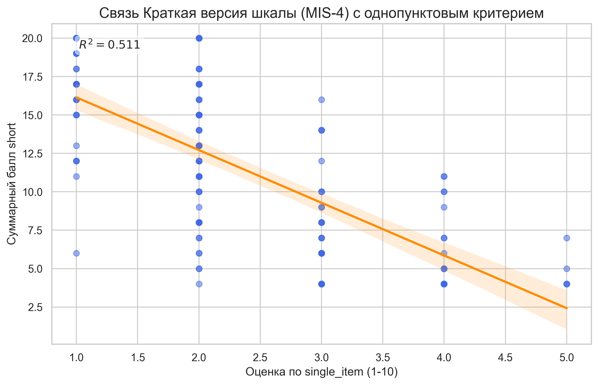
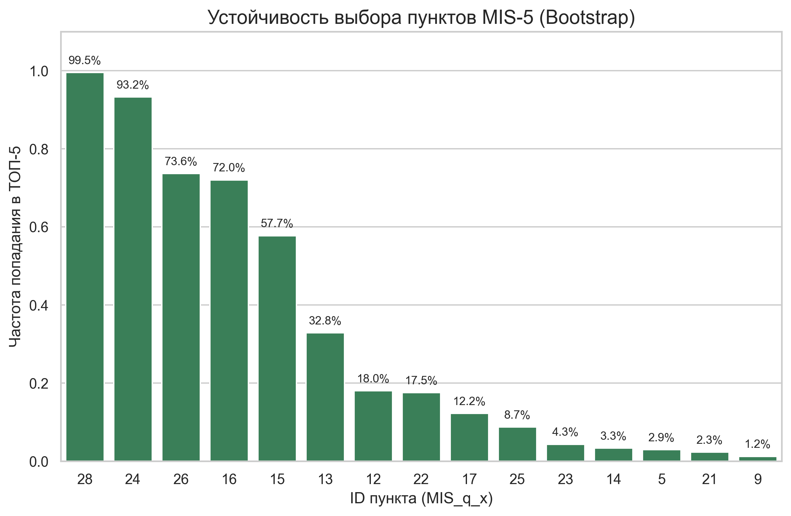
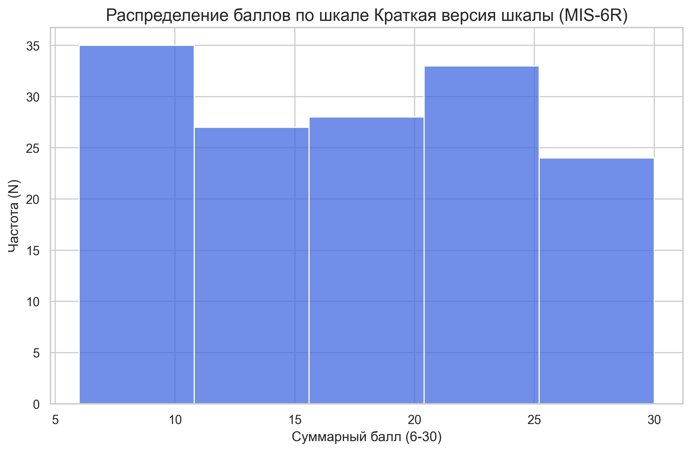
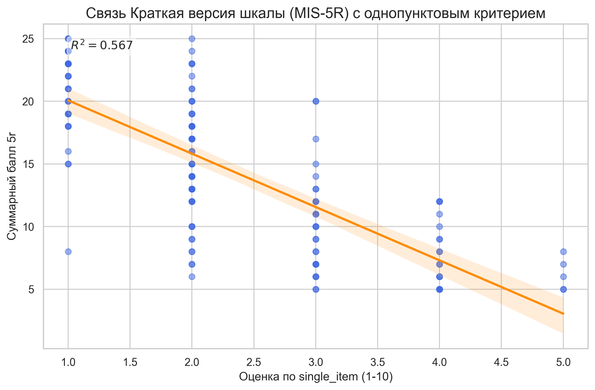
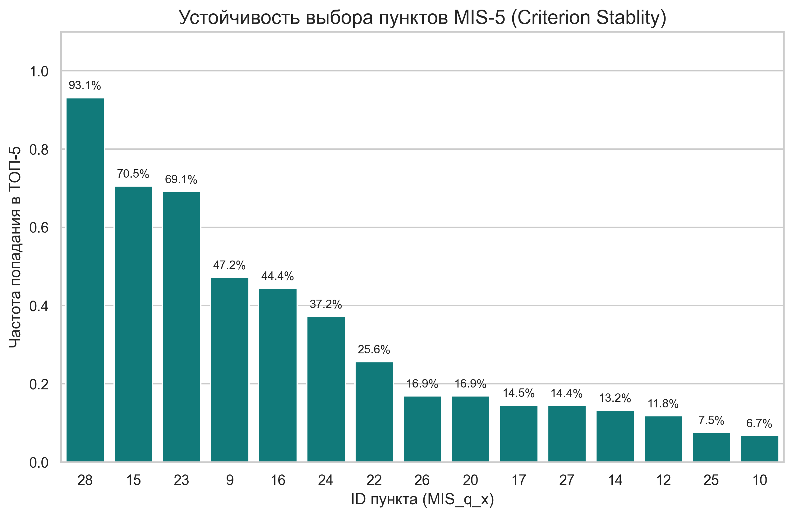
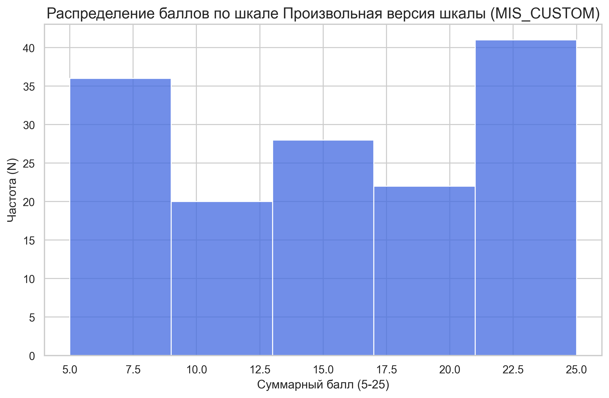
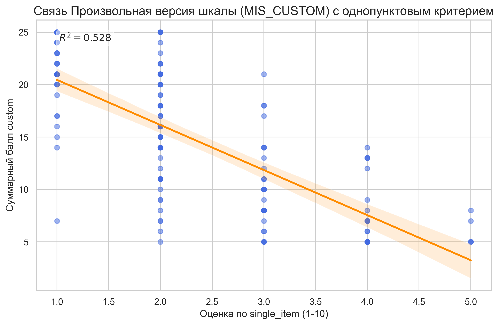

# Психометрический отчет по шкале MIS (30 пунктов)

**N = 147**

## 1. Надежность полной шкалы

- **Общая Альфа Кронбаха (MIS Total): 0.975**

### Надежность субшкал (блоков):

| Субшкала | Альфа |
|---|---|
| Вторжения и нарушения планов | 0.924 |
| Дефицит ресурсов для важного | 0.929 |
| Реактивность / 'Пожарный режим' | 0.921 |
| Влияние на долгосрочные цели | 0.936 |
| Истощение ресурсов и усталость | 0.853 |

## 2. Факторная структура (PCA)

### Собственные числа (Eigenvalues):
32.45, 3.82, 2.82, 1.93, 1.34, 1.23, 1.18, 1.11, 0.93, 0.74 ...

### Накопленная дисперсия (PCA):

| Показатель | F1 | F2 | F3 | F4 | F5 |
|---|---|---|---|---|---|
| Доля дисперсии | 58.6% | 6.9% | 5.1% | 3.5% | 2.4% |
| Накопленная дисп. | 58.6% | 65.5% | 70.6% | 74.1% | 76.6% |

### Нагрузки факторов (без вращения):

> [!NOTE]
> В этой таблице представлены нагрузки на первые 5 факторов до применения вращения. Первый фактор (F1) здесь отражает общее ядро шкалы (General Factor), по которому отбирались пункты для MIS-6.

| Пункт | F1 | F2 | F3 | F4 | F5 |
|---|---|---|---|---|---|
| MIS_q_28 | 0.891 | -0.178 | -0.016 | -0.064 | -0.099 |
| MIS_q_24 | 0.866 | -0.138 | -0.060 | -0.143 | 0.016 |
| MIS_q_16 | 0.858 | -0.018 | 0.168 | -0.130 | -0.140 |
| MIS_q_26 | 0.855 | -0.247 | -0.049 | -0.126 | 0.034 |
| MIS_q_15 | 0.846 | -0.209 | 0.017 | 0.169 | 0.003 |
| MIS_q_13 | 0.830 | 0.137 | -0.164 | -0.017 | -0.039 |
| MIS_q_22 | 0.821 | -0.155 | -0.136 | 0.000 | 0.143 |
| MIS_q_12 | 0.820 | -0.150 | -0.312 | -0.054 | -0.054 |
| MIS_q_25 | 0.814 | -0.265 | -0.095 | 0.152 | 0.212 |
| MIS_q_17 | 0.798 | -0.114 | 0.326 | 0.056 | 0.030 |
| MIS_q_14 | 0.797 | -0.285 | -0.019 | 0.290 | -0.012 |
| MIS_q_9 | 0.793 | -0.050 | 0.083 | 0.158 | -0.351 |
| MIS_q_23 | 0.793 | -0.175 | 0.125 | 0.140 | 0.059 |
| MIS_q_5 | 0.789 | 0.285 | -0.085 | 0.102 | 0.087 |
| MIS_q_20 | 0.779 | 0.038 | 0.479 | -0.141 | 0.096 |
| MIS_q_21 | 0.769 | -0.078 | 0.026 | -0.107 | -0.051 |
| MIS_q_29 | 0.747 | -0.121 | -0.008 | -0.369 | -0.060 |
| MIS_q_11 | 0.736 | -0.236 | -0.317 | -0.138 | -0.080 |
| MIS_q_10 | 0.704 | -0.186 | -0.008 | 0.228 | 0.025 |
| MIS_q_4 | 0.702 | 0.440 | -0.123 | 0.077 | 0.045 |
| MIS_q_3 | 0.699 | 0.555 | -0.087 | 0.032 | 0.112 |
| MIS_q_27 | 0.685 | -0.142 | -0.069 | 0.171 | 0.168 |
| MIS_q_18 | 0.682 | -0.013 | 0.377 | 0.090 | 0.022 |
| MIS_q_30 | 0.663 | -0.086 | -0.374 | -0.278 | 0.116 |
| MIS_q_1 | 0.652 | 0.468 | -0.058 | -0.104 | -0.010 |
| MIS_q_19 | 0.643 | 0.035 | 0.527 | -0.244 | 0.025 |
| MIS_q_2 | 0.643 | 0.510 | 0.053 | -0.022 | 0.184 |
| MIS_q_7 | 0.641 | 0.274 | 0.043 | 0.172 | -0.186 |
| MIS_q_6 | 0.641 | 0.295 | -0.148 | 0.017 | -0.213 |
| MIS_q_8 | 0.618 | 0.289 | -0.069 | 0.090 | -0.063 |

### Нагрузки факторов (EFA Varimax):

> [!NOTE]
> Использовано вращение **Varimax** для лучшей интерпретируемости пятифакторной структуры. Нагрузки перераспределены для выделения независимых субшкал (блоков).

| Пункт | F1 | F2 | F3 | F4 | F5 |
|---|---|---|---|---|---|
| MIS_q_14 | 0.756 | 0.206 | 0.310 | 0.238 | 0.187 |
| MIS_q_25 | 0.716 | 0.241 | 0.427 | 0.234 | -0.056 |
| MIS_q_15 | 0.669 | 0.275 | 0.366 | 0.327 | 0.156 |
| MIS_q_10 | 0.627 | 0.234 | 0.265 | 0.225 | 0.123 |
| MIS_q_23 | 0.614 | 0.258 | 0.288 | 0.405 | 0.090 |
| MIS_q_27 | 0.592 | 0.272 | 0.301 | 0.187 | -0.032 |
| MIS_q_22 | 0.554 | 0.322 | 0.514 | 0.247 | -0.021 |
| MIS_q_17 | 0.519 | 0.266 | 0.221 | 0.600 | 0.108 |
| MIS_q_28 | 0.502 | 0.297 | 0.546 | 0.394 | 0.217 |
| MIS_q_26 | 0.502 | 0.227 | 0.599 | 0.379 | 0.074 |
| MIS_q_9 | 0.481 | 0.348 | 0.279 | 0.346 | 0.487 |
| MIS_q_12 | 0.478 | 0.338 | 0.646 | 0.113 | 0.156 |
| MIS_q_24 | 0.444 | 0.323 | 0.587 | 0.375 | 0.085 |
| MIS_q_18 | 0.429 | 0.285 | 0.085 | 0.577 | 0.103 |
| MIS_q_11 | 0.410 | 0.213 | 0.689 | 0.105 | 0.157 |
| MIS_q_5 | 0.393 | 0.672 | 0.272 | 0.219 | 0.032 |
| MIS_q_13 | 0.377 | 0.562 | 0.461 | 0.215 | 0.142 |
| MIS_q_21 | 0.371 | 0.308 | 0.457 | 0.388 | 0.143 |
| MIS_q_16 | 0.351 | 0.372 | 0.426 | 0.547 | 0.240 |
| MIS_q_20 | 0.317 | 0.338 | 0.204 | 0.781 | 0.004 |
| MIS_q_7 | 0.299 | 0.558 | 0.106 | 0.233 | 0.294 |
| MIS_q_8 | 0.256 | 0.575 | 0.194 | 0.160 | 0.152 |
| MIS_q_30 | 0.253 | 0.305 | 0.714 | 0.072 | -0.076 |
| MIS_q_4 | 0.251 | 0.757 | 0.218 | 0.151 | 0.048 |
| MIS_q_29 | 0.202 | 0.237 | 0.641 | 0.442 | 0.102 |
| MIS_q_6 | 0.187 | 0.588 | 0.297 | 0.124 | 0.285 |
| MIS_q_3 | 0.181 | 0.844 | 0.187 | 0.192 | -0.028 |
| MIS_q_19 | 0.158 | 0.242 | 0.181 | 0.797 | 0.038 |
| MIS_q_2 | 0.145 | 0.753 | 0.130 | 0.307 | -0.110 |
| MIS_q_1 | 0.075 | 0.721 | 0.266 | 0.243 | 0.064 |

---

# Краткая версия шкалы (MIS-6)

Размер шкалы: 6 пунктов.

> [!TIP]
> Для выбора пунктов использовалось **однофакторное невращаемое решение**. Порядок пунктов в таблице полной шкалы может отличаться, так как там применено вращение Varimax для 5 факторов, перераспределяющее нагрузку. Для краткой версии мы выбираем пункты, максимально нагруженные на общий 'General Factor'.

## 1. Психометрические свойства short

- **Альфа Кронбаха: 0.947**
- **Омега Макдональда: 0.948**
- **Средняя межпунктовая корреляция: 0.750**
- **Доля дисперсии (PCA F1): 79.5%**
- **Мера адекватности выборки KMO: 0.921**
- **Критерий сферичности Барлетта: p < 0.001*****

### Собственные числа (short):
9.32, 0.67, 0.61, 0.47, 0.35, 0.31

### Распределение баллов:

### Валидность (визуализация связи):

### Анализ устойчивости выбора (Bootstrap):

> [!NOTE]
> График показывает, как часто каждый пункт попадал в ТОП при 1000 повторных расчетах на случайных подвыборках (методом Факторного анализа). Пункты с частотой выше 0.8-0.9 считаются абсолютно стабильными для этой шкалы.

| Пункт | Частота попадания в ТОП |
|---|---|
| **MIS_q_24** | 100.0% |
| **MIS_q_28** | 100.0% |
| **MIS_q_26** | 99.4% |
| **MIS_q_16** | 99.0% |
| **MIS_q_15** | 89.0% |
| **MIS_q_13** | 52.9% |
| MIS_q_22 | 23.3% |
| MIS_q_12 | 16.2% |
| MIS_q_17 | 9.5% |
| MIS_q_25 | 6.1% |
| MIS_q_23 | 2.0% |
| MIS_q_14 | 1.7% |
| MIS_q_5 | 0.8% |
| MIS_q_21 | 0.1% |
| MIS_q_11 | 0.0% |

### Факторные нагрузки short (EFA):

| Пункт | Нагрузка (Factor 1) |
|---|---|
| MIS_q_28 | 0.917 |
| MIS_q_24 | 0.881 |
| MIS_q_16 | 0.864 |
| MIS_q_26 | 0.884 |
| MIS_q_15 | 0.854 |
| MIS_q_13 | 0.795 |

### Матрица межпунктовых корреляций short:

| | MIS_q_28 | MIS_q_24 | MIS_q_16 | MIS_q_26 | MIS_q_15 | MIS_q_13 |
|---|---|---|---|---|---|---|
| **MIS_q_28** | 1.000 | 0.798 | 0.787 | 0.828 | 0.802 | 0.708 |
| **MIS_q_24** | 0.798 | 1.000 | 0.749 | 0.822 | 0.717 | 0.716 |
| **MIS_q_16** | 0.787 | 0.749 | 1.000 | 0.728 | 0.759 | 0.724 |
| **MIS_q_26** | 0.828 | 0.822 | 0.728 | 1.000 | 0.754 | 0.677 |
| **MIS_q_15** | 0.802 | 0.717 | 0.759 | 0.754 | 1.000 | 0.675 |
| **MIS_q_13** | 0.708 | 0.716 | 0.724 | 0.677 | 0.675 | 1.000 |

### Пункты short и их характеристики:

| # | Текст пункта | Mean | SD | r-total | α-deleted |
|---|---|---|---|---|---|
| 28 | Я чувствую, что мои ресурсы (время и энергия) исчерпываются на срочное | 3.12 | 1.43 | 0.886 | 0.932 |
| 24 | Срочные дела мешают мне развиваться в нужном мне направлении | 2.92 | 1.38 | 0.853 | 0.936 |
| 16 | Я живу в режиме "тушения пожаров" большую часть времени | 2.71 | 1.45 | 0.838 | 0.938 |
| 26 | Мой потенциал не реализуется из-за необходимости постоянно реагировать на срочное | 2.89 | 1.41 | 0.855 | 0.936 |
| 15 | Срочные дела забирают мою лучшую энергию, важное получает остатки | 3.16 | 1.41 | 0.828 | 0.939 |
| 13 | Я начинаю работу над важным, но часто срочное заставляет меня её бросить | 2.95 | 1.29 | 0.774 | 0.945 |

## 2. Валидность и Сравнение

Сравнение корреляций полной (MIS-30) и исследуемой (short) версий с внешними критериями:

| Критерий | MIS-Total (30) | short | Сохранение связи |
|---|---|---|---|
| Планомерность | -0.453 | -0.428 | 94.5% |
| Целеустремленность | -0.335 | -0.338 | 100.8% |
| Настойчивость | -0.514 | -0.490 | 95.2% |
| Фиксация на структурировании | 0.476 | 0.471 | 98.9% |
| Самоорганизация | -0.125 | -0.094 | 74.9% |
| Ориентация на настоящее | -0.157 | -0.156 | 99.4% |
| ОСД Итого | -0.396 | -0.373 | 94.3% |
| single_item | -0.751 | -0.727 | 96.8% |

---

# Краткая версия шкалы (MIS-6R)

Размер шкалы: 6 пунктов.

## 1. Психометрические свойства 5r

- **Альфа Кронбаха: 0.943**
- **Омега Макдональда: 0.943**
- **Средняя межпунктовая корреляция: 0.732**
- **Доля дисперсии (PCA F1): 78.0%**
- **Мера адекватности выборки KMO: 0.912**
- **Критерий сферичности Барлетта: p < 0.001*****

### Собственные числа (5r):
8.98, 0.66, 0.58, 0.54, 0.46, 0.30

### Распределение баллов:

### Валидность (визуализация связи):

### Анализ устойчивости выбора (Bootstrap):

> [!NOTE]
> График показывает, как часто каждый пункт попадал в ТОП при 1000 повторных расчетах на случайных подвыборках (по корреляции с критерием single_item). Пункты с частотой выше 0.8-0.9 считаются абсолютно стабильными для этой шкалы.

| Пункт | Частота попадания в ТОП |
|---|---|
| **MIS_q_28** | 100.0% |
| **MIS_q_23** | 97.1% |
| **MIS_q_15** | 96.9% |
| **MIS_q_9** | 75.8% |
| **MIS_q_24** | 65.6% |
| **MIS_q_16** | 65.1% |
| MIS_q_22 | 23.9% |
| MIS_q_26 | 20.2% |
| MIS_q_20 | 16.2% |
| MIS_q_17 | 9.4% |
| MIS_q_14 | 8.0% |
| MIS_q_27 | 7.5% |
| MIS_q_12 | 5.8% |
| MIS_q_25 | 4.6% |
| MIS_q_10 | 2.7% |

### Факторные нагрузки 5r (EFA):

| Пункт | Нагрузка (Factor 1) |
|---|---|
| MIS_q_28 | -0.902 |
| MIS_q_15 | -0.872 |
| MIS_q_23 | -0.819 |
| MIS_q_9 | -0.812 |
| MIS_q_16 | -0.864 |
| MIS_q_24 | -0.866 |

### Матрица межпунктовых корреляций 5r:

| | MIS_q_28 | MIS_q_15 | MIS_q_23 | MIS_q_9 | MIS_q_16 | MIS_q_24 |
|---|---|---|---|---|---|---|
| **MIS_q_28** | 1.000 | 0.802 | 0.697 | 0.731 | 0.787 | 0.798 |
| **MIS_q_15** | 0.802 | 1.000 | 0.737 | 0.703 | 0.759 | 0.717 |
| **MIS_q_23** | 0.697 | 0.737 | 1.000 | 0.677 | 0.678 | 0.750 |
| **MIS_q_9** | 0.731 | 0.703 | 0.677 | 1.000 | 0.718 | 0.682 |
| **MIS_q_16** | 0.787 | 0.759 | 0.678 | 0.718 | 1.000 | 0.749 |
| **MIS_q_24** | 0.798 | 0.717 | 0.750 | 0.682 | 0.749 | 1.000 |

### Пункты 5r и их характеристики:

| # | Текст пункта | Mean | SD | r-total | α-deleted |
|---|---|---|---|---|---|
| 28 | Я чувствую, что мои ресурсы (время и энергия) исчерпываются на срочное | 3.12 | 1.43 | 0.868 | 0.927 |
| 15 | Срочные дела забирают мою лучшую энергию, важное получает остатки | 3.16 | 1.41 | 0.842 | 0.930 |
| 23 | Мне трудно видеть прогресс в важных проектах, потому что до них редко доходит очередь | 2.99 | 1.33 | 0.793 | 0.936 |
| 9 | Я не могу отвести время на важное, потому что оно полностью занято срочным | 2.50 | 1.30 | 0.786 | 0.937 |
| 16 | Я живу в режиме "тушения пожаров" большую часть времени | 2.71 | 1.45 | 0.835 | 0.931 |
| 24 | Срочные дела мешают мне развиваться в нужном мне направлении | 2.92 | 1.38 | 0.836 | 0.931 |

## 2. Валидность и Сравнение

Сравнение корреляций полной (MIS-30) и исследуемой (5r) версий с внешними критериями:

| Критерий | MIS-Total (30) | 5r | Сохранение связи |
|---|---|---|---|
| Планомерность | -0.453 | -0.451 | 99.5% |
| Целеустремленность | -0.335 | -0.352 | 105.1% |
| Настойчивость | -0.514 | -0.515 | 100.2% |
| Фиксация на структурировании | 0.476 | 0.474 | 99.6% |
| Самоорганизация | -0.125 | -0.103 | 82.5% |
| Ориентация на настоящее | -0.157 | -0.158 | 100.5% |
| ОСД Итого | -0.396 | -0.398 | 100.5% |
| single_item | -0.751 | -0.752 | 100.1% |

---

# Произвольная версия шкалы (MIS_CUSTOM)

Размер шкалы: 5 пунктов.

## 1. Психометрические свойства custom

- **Альфа Кронбаха: 0.945**
- **Омега Макдональда: 0.945**
- **Средняя межпунктовая корреляция: 0.774**
- **Доля дисперсии (PCA F1): 82.0%**
- **Мера адекватности выборки KMO: 0.897**
- **Критерий сферичности Барлетта: p < 0.001*****

### Собственные числа (custom):
8.25, 0.63, 0.52, 0.35, 0.31

### Распределение баллов:

### Валидность (визуализация связи):

### Факторные нагрузки custom (EFA):

| Пункт | Нагрузка (Factor 1) |
|---|---|
| MIS_q_15 | -0.855 |
| MIS_q_16 | -0.851 |
| MIS_q_24 | -0.875 |
| MIS_q_26 | -0.894 |
| MIS_q_28 | -0.925 |

### Матрица межпунктовых корреляций custom:

| | MIS_q_15 | MIS_q_16 | MIS_q_24 | MIS_q_26 | MIS_q_28 |
|---|---|---|---|---|---|
| **MIS_q_15** | 1.000 | 0.759 | 0.717 | 0.754 | 0.802 |
| **MIS_q_16** | 0.759 | 1.000 | 0.749 | 0.728 | 0.787 |
| **MIS_q_24** | 0.717 | 0.749 | 1.000 | 0.822 | 0.798 |
| **MIS_q_26** | 0.754 | 0.728 | 0.822 | 1.000 | 0.828 |
| **MIS_q_28** | 0.802 | 0.787 | 0.798 | 0.828 | 1.000 |

### Пункты custom и их характеристики:

| # | Текст пункта | Mean | SD | r-total | α-deleted |
|---|---|---|---|---|---|
| 15 | Срочные дела забирают мою лучшую энергию, важное получает остатки | 3.16 | 1.41 | 0.828 | 0.936 |
| 16 | Я живу в режиме "тушения пожаров" большую часть времени | 2.71 | 1.45 | 0.825 | 0.937 |
| 24 | Срочные дела мешают мне развиваться в нужном мне направлении | 2.92 | 1.38 | 0.845 | 0.933 |
| 26 | Мой потенциал не реализуется из-за необходимости постоянно реагировать на срочное | 2.89 | 1.41 | 0.861 | 0.930 |
| 28 | Я чувствую, что мои ресурсы (время и энергия) исчерпываются на срочное | 3.12 | 1.43 | 0.890 | 0.925 |

## 2. Валидность и Сравнение

Сравнение корреляций полной (MIS-30) и исследуемой (custom) версий с внешними критериями:

| Критерий | MIS-Total (30) | custom | Сохранение связи |
|---|---|---|---|
| Планомерность | -0.453 | -0.442 | 97.6% |
| Целеустремленность | -0.335 | -0.347 | 103.3% |
| Настойчивость | -0.514 | -0.489 | 95.0% |
| Фиксация на структурировании | 0.476 | 0.466 | 97.8% |
| Самоорганизация | -0.125 | -0.102 | 81.2% |
| Ориентация на настоящее | -0.157 | -0.166 | 105.6% |
| ОСД Итого | -0.396 | -0.385 | 97.4% |
| single_item | -0.751 | -0.726 | 96.7% |

## 3. Таблица всех корреляций (Все версии)

| Шкала MIS | Планомерность | Целеустремленность | Настойчивость | Фиксация на структурировании | Самоорганизация | Ориентация на настоящее | ОСД Итого | single_item |
|---|---|---|---|---|---|---|---|---|
| Вторжения и нарушения планов | -0.320*** | -0.165* | -0.360*** | 0.363*** | -0.118 | -0.113 | -0.250** | -0.602*** |
| Дефицит ресурсов для важного | -0.384*** | -0.305*** | -0.467*** | 0.476*** | -0.058 | -0.154 | -0.327*** | -0.720*** |
| Реактивность / 'Пожарный режим' | -0.559*** | -0.457*** | -0.552*** | 0.411*** | -0.206* | -0.122 | -0.525*** | -0.676*** |
| Влияние на долгосрочные цели | -0.421*** | -0.299*** | -0.530*** | 0.469*** | -0.102 | -0.158 | -0.373*** | -0.713*** |
| Истощение ресурсов и усталость | -0.381*** | -0.327*** | -0.438*** | 0.450*** | -0.079 | -0.183* | -0.339*** | -0.708*** |
| Общий балл MIS (30 пунктов) | -0.453*** | -0.335*** | -0.514*** | 0.476*** | -0.125 | -0.157 | -0.396*** | -0.751*** |
| MIS_short | -0.428*** | -0.338*** | -0.490*** | 0.471*** | -0.094 | -0.156 | -0.373*** | -0.727*** |
| MIS_5R | -0.451*** | -0.352*** | -0.515*** | 0.474*** | -0.103 | -0.158 | -0.398*** | -0.752*** |
| MIS_custom | -0.442*** | -0.347*** | -0.489*** | 0.466*** | -0.102 | -0.166* | -0.385*** | -0.726*** |
