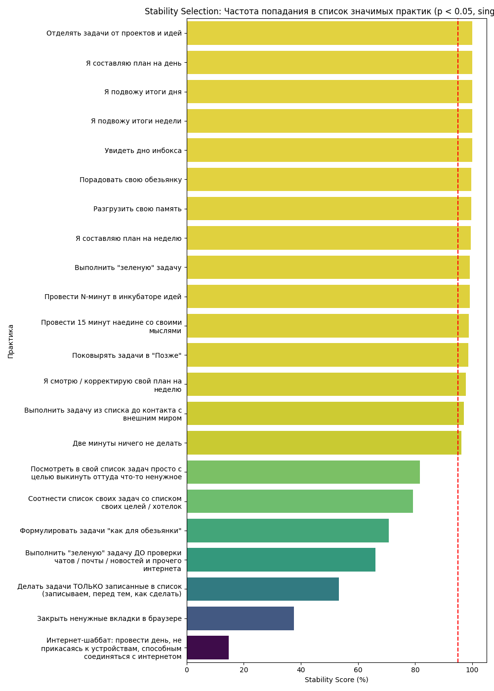

# Анализ устойчивости (Stability Selection)

Параметры: 10 итераций, подвыборка 180 человек (~80%).
Stability Score показывает, в каком проценте случаев практика попадала в 'Топ-15 консенсуса' в 3 из 3 алгоритмов при случайных изменениях в выборке.

| № | Практика | Stability Score (%) | Статус |
| :--- | :--- | :---: | :--- |
| 1 | Отделять задачи от проектов и идей | 100.0% | 🔥 Ядро (Strong) |
| 2 | Я составляю план на день | 100.0% | 🔥 Ядро (Strong) |
| 3 | Я подвожу итоги недели | 100.0% | 🔥 Ядро (Strong) |
| 4 | Порадовать свою обезьянку | 100.0% | 🔥 Ядро (Strong) |
| 5 | Увидеть дно инбокса | 100.0% | 🔥 Ядро (Strong) |
| 6 | Я подвожу итоги дня | 90.0% | 🔥 Ядро (Strong) |
| 7 | Я смотрю / корректирую свой план на неделю | 90.0% | 🔥 Ядро (Strong) |
| 8 | Провести 15 минут наедине со своими мыслями | 90.0% | 🔥 Ядро (Strong) |
| 9 | Я составляю план на неделю | 80.0% | 🔥 Ядро (Strong) |
| 10 | Выполнить "зеленую" задачу | 80.0% | 🔥 Ядро (Strong) |
| 11 | Разгрузить свою память | 60.0% | ✅ Устойчивая |
| 12 | Соотнести список своих задач со списком своих целей / хотелок | 40.0% | ⚠️ Нестабильная |
| 13 | Две минуты ничего не делать | 30.0% | ⚠️ Нестабильная |
| 14 | Формулировать задачи "как для обезьянки" | 30.0% | ⚠️ Нестабильная |
| 15 | Провести N-минут в инкубаторе идей | 20.0% | ❌ Шумовая |
| 16 | Делать задачи ТОЛЬКО записанные в список (записываем, перед тем, как сделать) | 10.0% | ❌ Шумовая |
| 17 | Закрыть ненужные вкладки в браузере | 10.0% | ❌ Шумовая |
| 18 | Лежа в постели не пользоваться устройствами с экранами | 0.0% | ❌ Шумовая |
| 19 | Поковырять задачи в "Позже" | 0.0% | ❌ Шумовая |
| 20 | Отключать средства коммуникации на время сосредоточенной работы (блоки тишины) | 0.0% | ❌ Шумовая |
| 21 | Провести утро без смартфона | 0.0% | ❌ Шумовая |
| 22 | Выполнить хотя бы одну задачу из списка до проверки почты / чатов / новостей | 0.0% | ❌ Шумовая |
| 23 | Сходить на тренировку и позаниматься спортом | 0.0% | ❌ Шумовая |
| 24 | Во время работы прятать смартфон от самого себя (не держать его на виду) | 0.0% | ❌ Шумовая |
| 25 | Интернет-шаббат: провести день, не прикасаясь к устройствам, способным соединяться с интернетом | 0.0% | ❌ Шумовая |
| 26 | Выполнить задачу из списка до контакта с внешним миром | 0.0% | ❌ Шумовая |
| 27 | Выполнить "зеленую" задачу ДО проверки чатов / почты / новостей и прочего интернета | 0.0% | ❌ Шумовая |
| 28 | Пользоваться смартфоном в туалете | 0.0% | ❌ Шумовая |
| 29 | Посмотреть в свой список задач просто с целью выкинуть оттуда что-то ненужное | 0.0% | ❌ Шумовая |
| 30 | Вести лог дня (дневник) | 0.0% | ❌ Шумовая |
| 31 | Провести день стесняясь смартфона | 0.0% | ❌ Шумовая |
| 32 | Установить фильтр синего (ночной режим или режим чтения) на экранах | 0.0% | ❌ Шумовая |
| 33 | Провести ревизию спального места на предмет светового шума | 0.0% | ❌ Шумовая |
| 34 | Установить автоматический (по расписанию) режим "не беспокоить" на смартфоне (минимум на 8 часов в день) | 0.0% | ❌ Шумовая |
| 35 | Удалить приложения социальных сетей со своего смартфона | 0.0% | ❌ Шумовая |
| 36 | Отключить красные кружочки на иконках приложений в смартфоне | 0.0% | ❌ Шумовая |
| 37 | Установить плагины и настройки против рекламных баннеров | 0.0% | ❌ Шумовая |
| 38 | Отключить оповещения о новых сообщениях в чатах | 0.0% | ❌ Шумовая |
| 39 | Отключить оповещения о новых сообщениях в электронной почте | 0.0% | ❌ Шумовая |
| 40 | Отключить push-оповещения от приложений в смартфоне (соцсети, магазины, заправки) | 0.0% | ❌ Шумовая |
| 41 | Отключить оповещения на смарт-часах | 0.0% | ❌ Шумовая |
| 42 | Настроить автоматическое отмечание входящих писем в электронной почте прочитанными | 0.0% | ❌ Шумовая |

---

# Психометрический анализ 'Ядра' практик

В ядро вошли практики с устойчивостью >= 75%.

- **Альфа Кронбаха:** 0.841
- **Омега МакДональда:** 0.847

- **Корреляция с целевой шкалой (Pearson r):** -0.497
- **Корреляция с целевой шкалой (Spearman ρ):** -0.488

### Факторный анализ ядра

- **KMO:** 0.853
- **Тест Бартлетта:** p=0.0000

**Дисперсия, объясненная фактором (EFA):** 37.0%
**Собственные числа (Eigenvalues) и полная дисперсия (PCA):**

| Фактор | Собств. число | % Полной дисперсии |
| :--- | :---: | :---: |
| 1 | 4.262 | 42.6% |
| 2 | 1.117 | 11.2% |
| 3 | 0.898 | 9.0% |
| 4 | 0.761 | 7.6% |
| 5 | 0.675 | 6.7% |
| 6 | 0.639 | 6.4% |
| 7 | 0.600 | 6.0% |
| 8 | 0.501 | 5.0% |
| 9 | 0.294 | 2.9% |
| 10 | 0.255 | 2.5% |

| Практика | Нагрузка (1 фактор) |
| :--- | :---: |
| Отделять задачи от проектов и идей | 0.475 |
| Я составляю план на день | 0.716 |
| Я подвожу итоги недели | 0.732 |
| Порадовать свою обезьянку | 0.395 |
| Увидеть дно инбокса | 0.370 |
| Я подвожу итоги дня | 0.650 |
| Я смотрю / корректирую свой план на неделю | 0.739 |
| Провести 15 минут наедине со своими мыслями | 0.497 |
| Я составляю план на неделю | 0.796 |
| Выполнить "зеленую" задачу | 0.535 |
