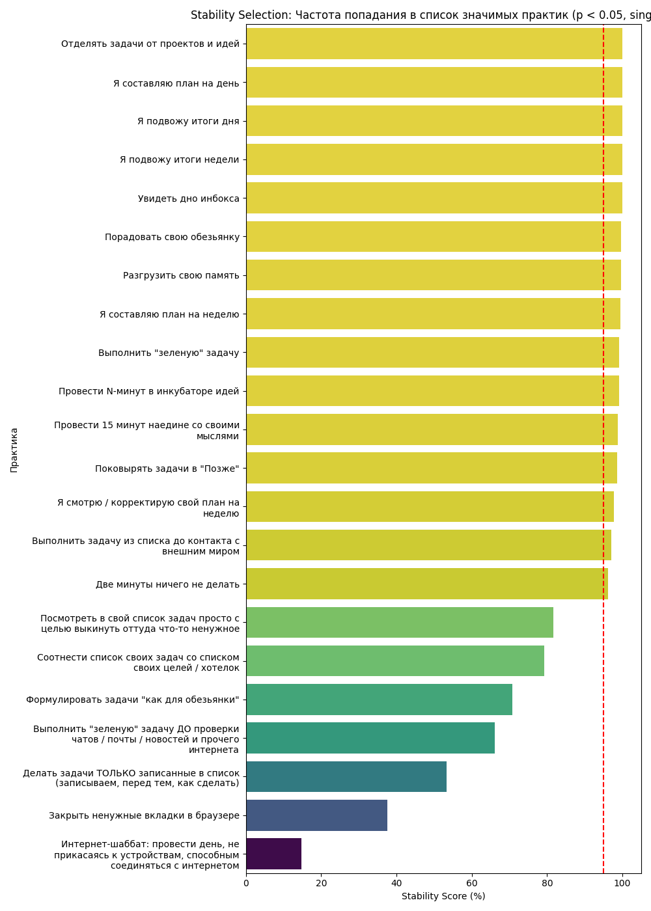
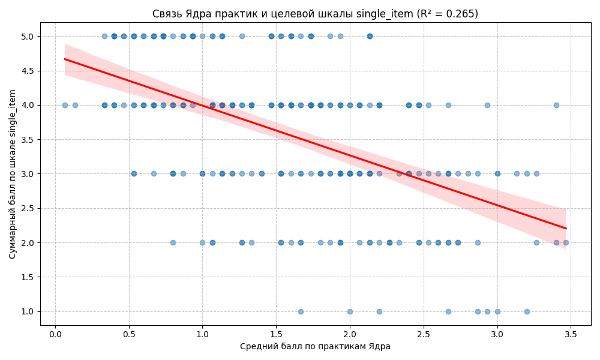

# Анализ устойчивости (Stability Selection)

Параметры: 1000 итераций, подвыборка 210 человек (~79%).
Целевая шкала: single_item
Отбор практик: все практики с скорректированным p-value < 0.05 (FDR Benjamini-Hochberg).
Консенсус: практика должна попасть в отобранные списки минимум 3 из 3 методов.
Stability Score показывает, в каком проценте случаев практика попадала в список консенсуса при случайных изменениях в выборке.

| № | Практика | Stability Score (%) | Статус |
| :--- | :--- | :---: | :--- |
| 1 | Отделять задачи от проектов и идей | 100.0% | 🔥 Ядро (Strong) |
| 2 | Я составляю план на день | 100.0% | 🔥 Ядро (Strong) |
| 3 | Я подвожу итоги дня | 100.0% | 🔥 Ядро (Strong) |
| 4 | Я подвожу итоги недели | 100.0% | 🔥 Ядро (Strong) |
| 5 | Увидеть дно инбокса | 100.0% | 🔥 Ядро (Strong) |
| 6 | Порадовать свою обезьянку | 99.7% | 🔥 Ядро (Strong) |
| 7 | Разгрузить свою память | 99.6% | 🔥 Ядро (Strong) |
| 8 | Я составляю план на неделю | 99.5% | 🔥 Ядро (Strong) |
| 9 | Выполнить "зеленую" задачу | 99.2% | 🔥 Ядро (Strong) |
| 10 | Провести N-минут в инкубаторе идей | 99.2% | 🔥 Ядро (Strong) |
| 11 | Провести 15 минут наедине со своими мыслями | 98.8% | 🔥 Ядро (Strong) |
| 12 | Поковырять задачи в "Позже" | 98.6% | 🔥 Ядро (Strong) |
| 13 | Я смотрю / корректирую свой план на неделю | 97.8% | 🔥 Ядро (Strong) |
| 14 | Выполнить задачу из списка до контакта с внешним миром | 97.0% | 🔥 Ядро (Strong) |
| 15 | Две минуты ничего не делать | 96.2% | 🔥 Ядро (Strong) |
| 16 | Посмотреть в свой список задач просто с целью выкинуть оттуда что-то ненужное | 81.7% | ✅ Устойчивая |
| 17 | Соотнести список своих задач со списком своих целей / хотелок | 79.3% | ✅ Устойчивая |
| 18 | Формулировать задачи "как для обезьянки" | 70.8% | ✅ Устойчивая |
| 19 | Выполнить "зеленую" задачу ДО проверки чатов / почты / новостей и прочего интернета | 66.1% | ✅ Устойчивая |
| 20 | Делать задачи ТОЛЬКО записанные в список (записываем, перед тем, как сделать) | 53.3% | ✅ Устойчивая |
| 21 | Закрыть ненужные вкладки в браузере | 37.5% | ⚠️ Нестабильная |
| 22 | Интернет-шаббат: провести день, не прикасаясь к устройствам, способным соединяться с интернетом | 14.7% | ❌ Шумовая |
| 23 | Сходить на тренировку и позаниматься спортом | 0.8% | ❌ Шумовая |
| 24 | Выполнить хотя бы одну задачу из списка до проверки почты / чатов / новостей | 0.7% | ❌ Шумовая |
| 25 | Отключать средства коммуникации на время сосредоточенной работы (блоки тишины) | 0.3% | ❌ Шумовая |
| 26 | Лежа в постели не пользоваться устройствами с экранами | 0.0% | ❌ Шумовая |
| 27 | Провести утро без смартфона | 0.0% | ❌ Шумовая |
| 28 | Во время работы прятать смартфон от самого себя (не держать его на виду) | 0.0% | ❌ Шумовая |
| 29 | Пользоваться смартфоном в туалете | 0.0% | ❌ Шумовая |
| 30 | Вести лог дня (дневник) | 0.0% | ❌ Шумовая |
| 31 | Провести день стесняясь смартфона | 0.0% | ❌ Шумовая |
| 32 | Установить фильтр синего (ночной режим или режим чтения) на экранах | 0.0% | ❌ Шумовая |
| 33 | Провести ревизию спального места на предмет светового шума | 0.0% | ❌ Шумовая |
| 34 | Установить автоматический (по расписанию) режим "не беспокоить" на смартфоне (минимум на 8 часов в день) | 0.0% | ❌ Шумовая |
| 35 | Удалить приложения социальных сетей со своего смартфона | 0.0% | ❌ Шумовая |
| 36 | Отключить красные кружочки на иконках приложений в смартфоне | 0.0% | ❌ Шумовая |
| 37 | Установить плагины и настройки против рекламных баннеров | 0.0% | ❌ Шумовая |
| 38 | Отключить оповещения о новых сообщениях в чатах | 0.0% | ❌ Шумовая |
| 39 | Отключить оповещения о новых сообщениях в электронной почте | 0.0% | ❌ Шумовая |
| 40 | Отключить push-оповещения от приложений в смартфоне (соцсети, магазины, заправки) | 0.0% | ❌ Шумовая |
| 41 | Отключить оповещения на смарт-часах | 0.0% | ❌ Шумовая |
| 42 | Настроить автоматическое отмечание входящих писем в электронной почте прочитанными | 0.0% | ❌ Шумовая |

---

# Психометрический анализ 'Ядра' практик

В ядро вошли практики с устойчивостью >= 95%.

- **Альфа Кронбаха:** 0.863
- **Омега МакДональда:** 0.866

- **Корреляция с целевой шкалой (Pearson r):** -0.515
- **Корреляция с целевой шкалой (Spearman ρ):** -0.513

### Факторный анализ ядра

- **KMO:** 0.869
- **Тест Бартлетта:** p=0.0000

**Количество выделенных факторов (EV > 1):** 3
**Суммарная объясненная дисперсия (EFA, 3 факт.):** 40.7%
**Собственные числа (Eigenvalues) и полная дисперсия (PCA):**

| Фактор | Собств. число | % Полной дисперсии |
| :--- | :---: | :---: |
| 1 | 5.296 | 35.3% |
| 2 | 1.314 | 8.8% |
| 3 | 1.138 | 7.6% |
| 4 | 0.960 | 6.4% |
| 5 | 0.858 | 5.7% |
| 6 | 0.756 | 5.0% |
| 7 | 0.749 | 5.0% |
| 8 | 0.727 | 4.8% |
| 9 | 0.646 | 4.3% |
| 10 | 0.594 | 4.0% |
| 11 | 0.542 | 3.6% |
| 12 | 0.470 | 3.1% |
| 13 | 0.442 | 2.9% |
| 14 | 0.268 | 1.8% |
| 15 | 0.241 | 1.6% |

| Практика | Фактор 1 | Фактор 2 | Фактор 3 |
| :--- | :---: | :---: | :---: |
| Отделять задачи от проектов и идей | 0.238 | 0.098 | 0.645 |
| Я составляю план на день | 0.625 | 0.201 | 0.300 |
| Я подвожу итоги дня | 0.560 | 0.311 | 0.181 |
| Я подвожу итоги недели | 0.625 | 0.318 | 0.210 |
| Увидеть дно инбокса | 0.133 | 0.296 | 0.309 |
| Порадовать свою обезьянку | 0.183 | 0.389 | 0.186 |
| Разгрузить свою память | 0.272 | 0.169 | 0.411 |
| Я составляю план на неделю | 0.792 | 0.185 | 0.235 |
| Выполнить "зеленую" задачу | 0.211 | 0.396 | 0.366 |
| Провести N-минут в инкубаторе идей | 0.140 | 0.301 | 0.378 |
| Провести 15 минут наедине со своими мыслями | 0.226 | 0.751 | 0.020 |
| Поковырять задачи в "Позже" | 0.277 | 0.112 | 0.525 |
| Я смотрю / корректирую свой план на неделю | 0.713 | 0.159 | 0.320 |
| Выполнить задачу из списка до контакта с внешним миром | 0.096 | 0.362 | 0.280 |
| Две минуты ничего не делать | 0.155 | 0.507 | 0.129 |

### Прогностическая ценность 'Ядра'

Оценка связи между средним баллом по практикам 'Ядра' и целевой шкалой single_item.

- **Коэффициент детерминации (R²):** 0.265
- **Интерпретация:** Ядро практик объясняет **26.5%** дисперсии целевой шкалы.

