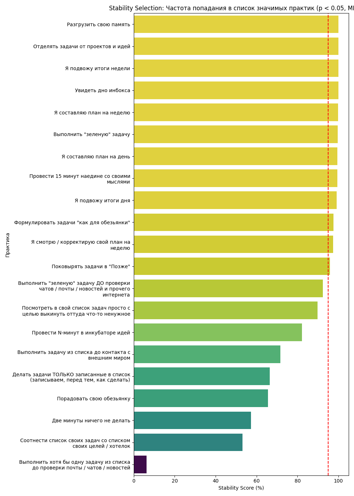
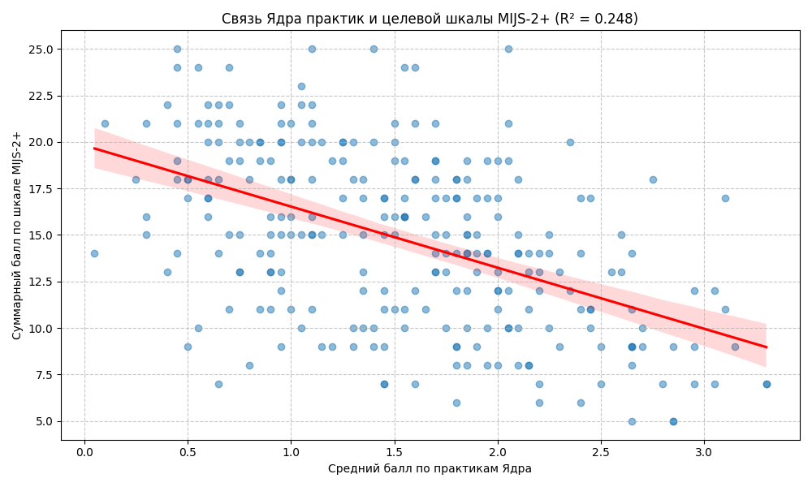

# Анализ устойчивости (Stability Selection)

Параметры: 1000 итераций, подвыборка 210 человек (~79%).
Целевая шкала: MIJS-2+
Отбор практик: все практики с скорректированным p-value < 0.05 (FDR Benjamini-Hochberg).
Консенсус: практика должна попасть в отобранные списки минимум 3 из 3 методов.
Stability Score показывает, в каком проценте случаев практика попадала в список консенсуса при случайных изменениях в выборке.

| № | Практика | Stability Score (%) | Статус |
| :--- | :--- | :---: | :--- |
| 1 | Разгрузить свою память | 100.0% | 🔥 Ядро (Strong) |
| 2 | Отделять задачи от проектов и идей | 100.0% | 🔥 Ядро (Strong) |
| 3 | Я подвожу итоги недели | 100.0% | 🔥 Ядро (Strong) |
| 4 | Увидеть дно инбокса | 100.0% | 🔥 Ядро (Strong) |
| 5 | Я составляю план на неделю | 99.8% | 🔥 Ядро (Strong) |
| 6 | Выполнить "зеленую" задачу | 99.6% | 🔥 Ядро (Strong) |
| 7 | Я составляю план на день | 99.4% | 🔥 Ядро (Strong) |
| 8 | Провести 15 минут наедине со своими мыслями | 99.4% | 🔥 Ядро (Strong) |
| 9 | Я подвожу итоги дня | 99.2% | 🔥 Ядро (Strong) |
| 10 | Формулировать задачи "как для обезьянки" | 97.5% | 🔥 Ядро (Strong) |
| 11 | Я смотрю / корректирую свой план на неделю | 97.4% | 🔥 Ядро (Strong) |
| 12 | Поковырять задачи в "Позже" | 95.9% | 🔥 Ядро (Strong) |
| 13 | Выполнить "зеленую" задачу ДО проверки чатов / почты / новостей и прочего интернета | 92.4% | ✅ Устойчивая |
| 14 | Посмотреть в свой список задач просто с целью выкинуть оттуда что-то ненужное | 89.7% | ✅ Устойчивая |
| 15 | Провести N-минут в инкубаторе идей | 82.2% | ✅ Устойчивая |
| 16 | Выполнить задачу из списка до контакта с внешним миром | 71.7% | ✅ Устойчивая |
| 17 | Делать задачи ТОЛЬКО записанные в список (записываем, перед тем, как сделать) | 66.4% | ✅ Устойчивая |
| 18 | Порадовать свою обезьянку | 65.6% | ✅ Устойчивая |
| 19 | Две минуты ничего не делать | 57.2% | ✅ Устойчивая |
| 20 | Соотнести список своих задач со списком своих целей / хотелок | 53.1% | ✅ Устойчивая |
| 21 | Выполнить хотя бы одну задачу из списка до проверки почты / чатов / новостей | 6.2% | ❌ Шумовая |
| 22 | Интернет-шаббат: провести день, не прикасаясь к устройствам, способным соединяться с интернетом | 2.6% | ❌ Шумовая |
| 23 | Сходить на тренировку и позаниматься спортом | 0.3% | ❌ Шумовая |
| 24 | Отключать средства коммуникации на время сосредоточенной работы (блоки тишины) | 0.1% | ❌ Шумовая |
| 25 | Закрыть ненужные вкладки в браузере | 0.1% | ❌ Шумовая |
| 26 | Лежа в постели не пользоваться устройствами с экранами | 0.0% | ❌ Шумовая |
| 27 | Провести утро без смартфона | 0.0% | ❌ Шумовая |
| 28 | Во время работы прятать смартфон от самого себя (не держать его на виду) | 0.0% | ❌ Шумовая |
| 29 | Пользоваться смартфоном в туалете | 0.0% | ❌ Шумовая |
| 30 | Вести лог дня (дневник) | 0.0% | ❌ Шумовая |
| 31 | Провести день стесняясь смартфона | 0.0% | ❌ Шумовая |
| 32 | Установить фильтр синего (ночной режим или режим чтения) на экранах | 0.0% | ❌ Шумовая |
| 33 | Провести ревизию спального места на предмет светового шума | 0.0% | ❌ Шумовая |
| 34 | Установить автоматический (по расписанию) режим "не беспокоить" на смартфоне (минимум на 8 часов в день) | 0.0% | ❌ Шумовая |
| 35 | Удалить приложения социальных сетей со своего смартфона | 0.0% | ❌ Шумовая |
| 36 | Отключить красные кружочки на иконках приложений в смартфоне | 0.0% | ❌ Шумовая |
| 37 | Установить плагины и настройки против рекламных баннеров | 0.0% | ❌ Шумовая |
| 38 | Отключить оповещения о новых сообщениях в чатах | 0.0% | ❌ Шумовая |
| 39 | Отключить оповещения о новых сообщениях в электронной почте | 0.0% | ❌ Шумовая |
| 40 | Отключить push-оповещения от приложений в смартфоне (соцсети, магазины, заправки) | 0.0% | ❌ Шумовая |
| 41 | Отключить оповещения на смарт-часах | 0.0% | ❌ Шумовая |
| 42 | Настроить автоматическое отмечание входящих писем в электронной почте прочитанными | 0.0% | ❌ Шумовая |

---

# Психометрический анализ 'Ядра' практик

В ядро вошли практики с устойчивостью >= 50%.

- **Альфа Кронбаха:** 0.888
- **Омега МакДональда:** 0.891

- **Корреляция с целевой шкалой (Pearson r):** -0.498
- **Корреляция с целевой шкалой (Spearman ρ):** -0.491

### Факторный анализ ядра

- **KMO:** 0.864
- **Тест Бартлетта:** p=0.0000

**Количество выделенных факторов (EV > 1):** 4
**Суммарная объясненная дисперсия (EFA, 4 факт.):** 43.8%
**Собственные числа (Eigenvalues) и полная дисперсия (PCA):**

| Фактор | Собств. число | % Полной дисперсии |
| :--- | :---: | :---: |
| 1 | 6.599 | 33.0% |
| 2 | 1.663 | 8.3% |
| 3 | 1.386 | 6.9% |
| 4 | 1.119 | 5.6% |
| 5 | 0.964 | 4.8% |
| 6 | 0.884 | 4.4% |
| 7 | 0.840 | 4.2% |
| 8 | 0.789 | 3.9% |
| 9 | 0.739 | 3.7% |
| 10 | 0.721 | 3.6% |
| 11 | 0.608 | 3.0% |
| 12 | 0.588 | 2.9% |
| 13 | 0.536 | 2.7% |
| 14 | 0.522 | 2.6% |
| 15 | 0.451 | 2.3% |
| 16 | 0.432 | 2.2% |
| 17 | 0.397 | 2.0% |
| 18 | 0.315 | 1.6% |
| 19 | 0.234 | 1.2% |
| 20 | 0.213 | 1.1% |

| Практика | Фактор 1 | Фактор 2 | Фактор 3 | Фактор 4 |
| :--- | :---: | :---: | :---: | :---: |
| Разгрузить свою память | 0.269 | 0.370 | 0.057 | 0.204 |
| Отделять задачи от проектов и идей | 0.184 | 0.694 | 0.178 | 0.075 |
| Я подвожу итоги недели | 0.624 | 0.216 | 0.164 | 0.280 |
| Увидеть дно инбокса | 0.122 | 0.298 | 0.067 | 0.323 |
| Я составляю план на неделю | 0.757 | 0.270 | 0.136 | 0.170 |
| Выполнить "зеленую" задачу | 0.179 | 0.299 | 0.492 | 0.310 |
| Я составляю план на день | 0.623 | 0.320 | 0.081 | 0.188 |
| Провести 15 минут наедине со своими мыслями | 0.211 | 0.069 | 0.158 | 0.698 |
| Я подвожу итоги дня | 0.573 | 0.164 | 0.115 | 0.290 |
| Формулировать задачи "как для обезьянки" | 0.161 | 0.527 | 0.129 | 0.153 |
| Я смотрю / корректирую свой план на неделю | 0.690 | 0.331 | 0.113 | 0.169 |
| Поковырять задачи в "Позже" | 0.241 | 0.519 | 0.106 | 0.147 |
| Выполнить "зеленую" задачу ДО проверки чатов / почты / новостей и прочего интернета | 0.095 | 0.114 | 0.920 | 0.086 |
| Посмотреть в свой список задач просто с целью выкинуть оттуда что-то ненужное | 0.197 | 0.429 | 0.121 | 0.273 |
| Провести N-минут в инкубаторе идей | 0.127 | 0.296 | 0.257 | 0.290 |
| Выполнить задачу из списка до контакта с внешним миром | 0.114 | 0.135 | 0.576 | 0.199 |
| Делать задачи ТОЛЬКО записанные в список (записываем, перед тем, как сделать) | 0.333 | 0.564 | 0.117 | -0.066 |
| Порадовать свою обезьянку | 0.189 | 0.097 | 0.173 | 0.394 |
| Две минуты ничего не делать | 0.151 | 0.107 | 0.109 | 0.507 |
| Соотнести список своих задач со списком своих целей / хотелок | 0.135 | 0.342 | 0.348 | 0.312 |

### Прогностическая ценность 'Ядра'

Оценка связи между средним баллом по практикам 'Ядра' и целевой шкалой MIJS-2+.

- **Коэффициент детерминации (R²):** 0.248
- **Интерпретация:** Ядро практик объясняет **24.8%** дисперсии целевой шкалы.

