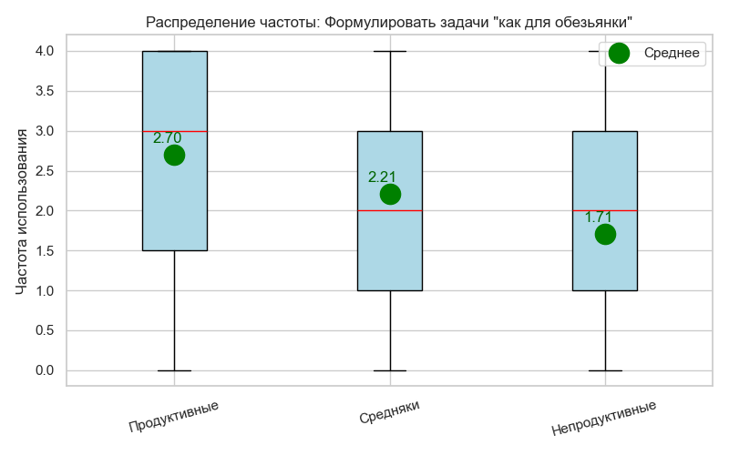
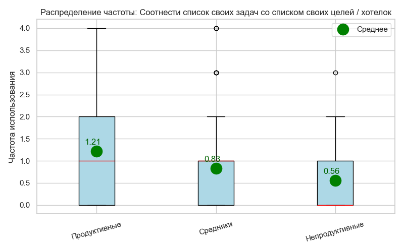
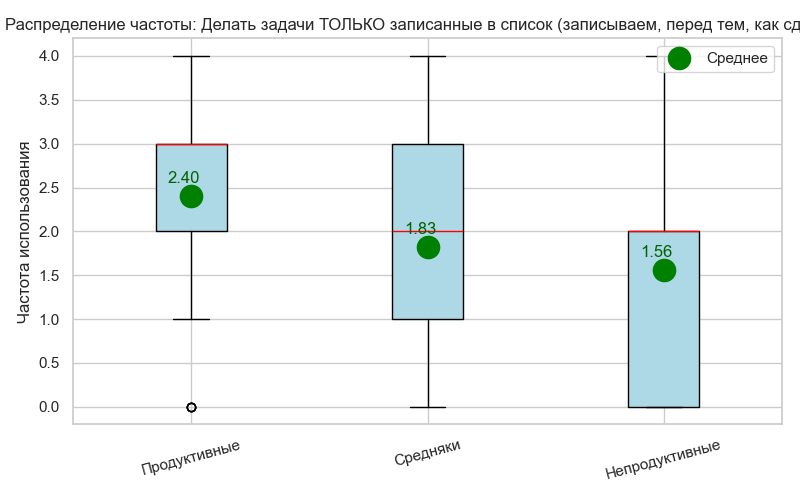

# Отчет по исследованию джедайских приемов

# 1. Информация о выборке

Всего в опросе приняло участие **235** человек. После очистки данных для анализа психометрики шкал использовано **234** анкет.

## 1.1. Демографические характеристики

### 1.1.1. Распределение по возрасту

### 1.1.2. Распределение по полу

### 1.1.3. Однопунктовая 'Джедайская шкала'

### 1.1.4. Хронотип

### 1.1.5. Режим работы

# 2. Анализ используемых шкал

## 2.1. Шкала: MIJS

Состав пунктов:
- mijs_q1: Каждый день появляются незапланированные срочные задачи, которые я не могу отложить
- mijs_q2: Я не могу отвести время на важное, потому что оно полностью занято срочным
- mijs_q3: Я в большей степени тушу кризисы, чем их предотвращаю
- mijs_q4: Мне трудно видеть прогресс в важных проектах, потому что до них редко доходит очередь
- mijs_q5: К концу дня у меня почти нет энергии на важное
- mijs_q6: Я чувствую, что мои ресурсы (время и энергия) исчерпываются на срочное

### 2.1.1. Надежность (Reliability)

- **Альфа Кронбаха:** 0.840
- **Омега МакДональда:** 0.847

#### Коэффициенты при исключении пункта:

| Исключенный пункт | Альфа (if deleted) | Омега (if deleted) | Корреляция пункт-итог |
| :--- | :---: | :---: | :---: |
| mijs_q1 | 0.850 | 0.855 | 0.419 |
| mijs_q2 | 0.798 | 0.808 | 0.701 |
| mijs_q3 | 0.811 | 0.823 | 0.628 |
| mijs_q4 | 0.801 | 0.812 | 0.678 |
| mijs_q5 | 0.827 | 0.834 | 0.562 |
| mijs_q6 | 0.789 | 0.799 | 0.739 |

### 2.1.2. Эксплораторный факторный анализ (EFA)

- **Критерий KMO:** 0.855
- **Тест Бартлетта:** chi2=543.82, p=0.0000

#### Собственные значения факторов (Eigenvalues):
3.396, 0.888, 0.546, 0.480, 0.346, 0.344

#### Факторные нагрузки (1 фактор):

| Пункт | Нагрузка |
| :--- | :---: |
| mijs_q1 | -0.464 |
| mijs_q2 | -0.774 |
| mijs_q3 | -0.687 |
| mijs_q4 | -0.757 |
| mijs_q5 | -0.623 |
| mijs_q6 | -0.823 |

- **Объясненная дисперсия (1 фактор):** 48.75%
- **Собственное число основного фактора:** 2.925

### 2.1.3. Резюме по применимости

| Параметр | Значение | Комментарий |
| :--- | :---: | :--- |
| Alpha | 0.840 | ОК |
| KMO | 0.855 | ОК |
| Variance | 48.8% | Хорошо |
| **ИТОГ** | **Применима** | |

---

## 2.2. Шкала: MIJS-2

Состав пунктов:
- mijs_q2: Я не могу отвести время на важное, потому что оно полностью занято срочным
- mijs_q3: Я в большей степени тушу кризисы, чем их предотвращаю
- mijs_q4: Мне трудно видеть прогресс в важных проектах, потому что до них редко доходит очередь
- mijs_q6: Я чувствую, что мои ресурсы (время и энергия) исчерпываются на срочное

### 2.2.1. Надежность (Reliability)

- **Альфа Кронбаха:** 0.842
- **Омега МакДональда:** 0.843

#### Коэффициенты при исключении пункта:

| Исключенный пункт | Альфа (if deleted) | Омега (if deleted) | Корреляция пункт-итог |
| :--- | :---: | :---: | :---: |
| mijs_q2 | 0.792 | 0.795 | 0.694 |
| mijs_q3 | 0.824 | 0.825 | 0.617 |
| mijs_q4 | 0.798 | 0.800 | 0.680 |
| mijs_q6 | 0.782 | 0.784 | 0.715 |

### 2.2.2. Эксплораторный факторный анализ (EFA)

- **Критерий KMO:** 0.813
- **Тест Бартлетта:** chi2=365.16, p=0.0000

#### Собственные значения факторов (Eigenvalues):
2.716, 0.516, 0.416, 0.353

#### Факторные нагрузки (1 фактор):

| Пункт | Нагрузка |
| :--- | :---: |
| mijs_q2 | -0.777 |
| mijs_q3 | -0.680 |
| mijs_q4 | -0.760 |
| mijs_q6 | -0.808 |

- **Объясненная дисперсия (1 фактор):** 57.40%
- **Собственное число основного фактора:** 2.296

### 2.2.3. Резюме по применимости

| Параметр | Значение | Комментарий |
| :--- | :---: | :--- |
| Alpha | 0.842 | ОК |
| KMO | 0.813 | ОК |
| Variance | 57.4% | Хорошо |
| **ИТОГ** | **Применима** | |

---

## 2.3. Шкала: MIJS-2+

Состав пунктов:
- mijs_q2: Я не могу отвести время на важное, потому что оно полностью занято срочным
- mijs_q3: Я в большей степени тушу кризисы, чем их предотвращаю
- mijs_q4: Мне трудно видеть прогресс в важных проектах, потому что до них редко доходит очередь
- mijs_q6: Я чувствую, что мои ресурсы (время и энергия) исчерпываются на срочное
- jedi_inv: Инвертированная Джедайская шкала

### 2.3.1. Надежность (Reliability)

- **Альфа Кронбаха:** 0.861
- **Омега МакДональда:** 0.862

#### Коэффициенты при исключении пункта:

| Исключенный пункт | Альфа (if deleted) | Омега (if deleted) | Корреляция пункт-итог |
| :--- | :---: | :---: | :---: |
| mijs_q2 | 0.823 | 0.827 | 0.711 |
| mijs_q3 | 0.850 | 0.852 | 0.602 |
| mijs_q4 | 0.827 | 0.830 | 0.697 |
| mijs_q6 | 0.813 | 0.815 | 0.748 |
| jedi_inv | 0.842 | 0.843 | 0.638 |

### 2.3.2. Эксплораторный факторный анализ (EFA)

- **Критерий KMO:** 0.862
- **Тест Бартлетта:** chi2=497.16, p=0.0000

#### Собственные значения факторов (Eigenvalues):
3.217, 0.608, 0.437, 0.396, 0.341

#### Факторные нагрузки (1 фактор):

| Пункт | Нагрузка |
| :--- | :---: |
| mijs_q2 | -0.779 |
| mijs_q3 | -0.652 |
| mijs_q4 | -0.763 |
| mijs_q6 | -0.828 |
| jedi_inv | -0.698 |

- **Объясненная дисперсия (1 фактор):** 55.74%
- **Собственное число основного фактора:** 2.787

### 2.3.3. Резюме по применимости

| Параметр | Значение | Комментарий |
| :--- | :---: | :--- |
| Alpha | 0.861 | ОК |
| KMO | 0.862 | ОК |
| Variance | 55.7% | Хорошо |
| **ИТОГ** | **Применима** | |

---

## 2.4. Шкала: MIJS-3+

Состав пунктов:
- mijs_q2: Я не могу отвести время на важное, потому что оно полностью занято срочным
- mijs_q4: Мне трудно видеть прогресс в важных проектах, потому что до них редко доходит очередь
- mijs_q6: Я чувствую, что мои ресурсы (время и энергия) исчерпываются на срочное
- jedi_inv: Инвертированная Джедайская шкала

### 2.4.1. Надежность (Reliability)

- **Альфа Кронбаха:** 0.850
- **Омега МакДональда:** 0.852

#### Коэффициенты при исключении пункта:

| Исключенный пункт | Альфа (if deleted) | Омега (if deleted) | Корреляция пункт-итог |
| :--- | :---: | :---: | :---: |
| mijs_q2 | 0.813 | 0.816 | 0.683 |
| mijs_q4 | 0.814 | 0.815 | 0.684 |
| mijs_q6 | 0.787 | 0.790 | 0.741 |
| jedi_inv | 0.824 | 0.825 | 0.657 |

### 2.4.2. Эксплораторный факторный анализ (EFA)

- **Критерий KMO:** 0.821
- **Тест Бартлетта:** chi2=386.04, p=0.0000

#### Собственные значения факторов (Eigenvalues):
2.766, 0.467, 0.424, 0.343

#### Факторные нагрузки (1 фактор):

| Пункт | Нагрузка |
| :--- | :---: |
| mijs_q2 | -0.755 |
| mijs_q4 | -0.757 |
| mijs_q6 | -0.834 |
| jedi_inv | -0.724 |

- **Объясненная дисперсия (1 фактор):** 59.04%
- **Собственное число основного фактора:** 2.362

### 2.4.3. Резюме по применимости

| Параметр | Значение | Комментарий |
| :--- | :---: | :--- |
| Alpha | 0.850 | ОК |
| KMO | 0.821 | ОК |
| Variance | 59.0% | Хорошо |
| **ИТОГ** | **Применима** | |

---

## 2.5. Итого по шкалам

| Шкала | Alpha | Omega | % Variance | KMO | Bartlett χ² | Bartlett p |
| :--- | :---: | :---: | :---: | :---: | :---: | :---: |
| MIJS | 0.840 | 0.847 | 48.8% | 0.855 | 543.82 | 0.0000 |
| MIJS-2 | 0.842 | 0.843 | 57.4% | 0.813 | 365.16 | 0.0000 |
| MIJS-2+ | 0.861 | 0.862 | 55.7% | 0.862 | 497.16 | 0.0000 |
| **MIJS-3+** | **0.850** | **0.852** | **59.0%** | **0.821** | **386.04** | **0.0000** |

==Дальнейший анализ основан на шкале  **MIJS-3+**==.
# 3. Выбираем лучшие приемы и практики

## 3.1. Корреляционный анализ (ранговая корреляция)

В данном разделе представлена связь различных практик с целевой шкалой **MIJS-3+**. Для анализа используется коэффициент ранговой корреляции Спирмена (ρ).

| № | Прием | ρ (Rho) | p-value | Знач. |
| :--- | :--- | :---: | :---: | :---: |
| 1 | Выполнить "зеленую" задачу | -0.343 | 0.0000 | **** |
| 2 | Отделять задачи от проектов и идей | -0.341 | 0.0000 | **** |
| 3 | Я подвожу итоги недели | -0.340 | 0.0000 | **** |
| 4 | Я составляю план на неделю | -0.339 | 0.0000 | **** |
| 5 | Разгрузить свою память | -0.326 | 0.0000 | **** |
| 6 | Увидеть дно инбокса | -0.312 | 0.0000 | **** |
| 7 | Я подвожу итоги дня | -0.303 | 0.0000 | **** |
| 8 | Я составляю план на день | -0.294 | 0.0000 | **** |
| 9 | Провести 15 минут наедине со своими мыслями | -0.293 | 0.0000 | **** |
| 10 | Я смотрю / корректирую свой план на неделю | -0.286 | 0.0000 | **** |
| 11 | Формулировать задачи "как для обезьянки" | -0.277 | 0.0000 | **** |
| 12 | Соотнести список своих задач со списком своих целей / хотелок | -0.268 | 0.0000 | **** |
| 13 | Делать задачи ТОЛЬКО записанные в список (записываем, перед тем, как сделать) | -0.251 | 0.0001 | *** |
| 14 | Поковырять задачи в "Позже" | -0.251 | 0.0001 | *** |
| 15 | Провести N-минут в инкубаторе идей | -0.241 | 0.0002 | *** |
| 16 | Порадовать свою обезьянку | -0.231 | 0.0004 | *** |
| 17 | Выполнить "зеленую" задачу ДО проверки чатов / почты / новостей и прочего интернета | -0.217 | 0.0008 | *** |
| 18 | Две минуты ничего не делать | -0.213 | 0.0011 | ** |
| 19 | Посмотреть в свой список задач просто с целью выкинуть оттуда что-то ненужное | -0.205 | 0.0017 | ** |
| 20 | Выполнить хотя бы одну задачу из списка до проверки почты / чатов / новостей | -0.386 | 0.0081 | ** |
| 21 | Интернет-шаббат: провести день, не прикасаясь к устройствам, способным соединяться с интернетом | -0.158 | 0.0155 | * |
| 22 | Выполнить задачу из списка до контакта с внешним миром | -0.145 | 0.0263 | * |
| 23 | Закрыть ненужные вкладки в браузере | -0.144 | 0.0278 | * |
| 24 | Настроить автоматическое отмечание входящих писем в электронной почте прочитанными | -0.142 | 0.0301 | * |
| 25 | Сходить на тренировку и позаниматься спортом | -0.140 | 0.0329 | * |
| 26 | Отключать средства коммуникации на время сосредоточенной работы (блоки тишины) | -0.129 | 0.0483 | * |
| 27 | На сколько удачливым человеком вы себя считаете? | -0.121 | 0.0647 |  |
| 28 | Отключить push-оповещения от приложений в смартфоне (соцсети, магазины, заправки) | -0.114 | 0.0810 |  |
| 29 | Отключить красные кружочки на иконках приложений в смартфоне | -0.101 | 0.1229 |  |
| 30 | В среднем, сколько дней в неделю вы работаете в офисе, а сколько удаленно? | -0.111 | 0.1361 |  |
| 31 | Установить автоматический (по расписанию) режим "не беспокоить" на смартфоне (минимум на 8 часов в день) | -0.094 | 0.1523 |  |
| 32 | Провести утро без смартфона | -0.083 | 0.2045 |  |
| 33 | Установить плагины и настройки против рекламных баннеров | -0.073 | 0.2649 |  |
| 34 | Во время работы прятать смартфон от самого себя (не держать его на виду) | -0.071 | 0.2793 |  |
| 35 | Провести ревизию спального места на предмет светового шума | -0.062 | 0.3428 |  |
| 36 | Отключить оповещения о новых сообщениях в чатах | -0.062 | 0.3463 |  |
| 37 | Пользоваться смартфоном в туалете | 0.048 | 0.4686 |  |
| 38 | Установить фильтр синего (ночной режим или режим чтения) на экранах | -0.043 | 0.5165 |  |
| 39 | Отключить оповещения о новых сообщениях в электронной почте | -0.028 | 0.6691 |  |
| 40 | Отключить оповещения на смарт-часах | -0.016 | 0.8050 |  |
| 41 | Удалить приложения социальных сетей со своего смартфона | 0.016 | 0.8094 |  |
| 42 | Лежа в постели не пользоваться устройствами с экранами | 0.015 | 0.8226 |  |
| 43 | Провести день стесняясь смартфона | 0.013 | 0.8415 |  |
| 44 | Вести лог дня (дневник) | 0.010 | 0.8732 |  |

*Примечание: * p < 0.05, ** p < 0.01, *** p < 0.001. Отрицательная корреляция означает, что использование приема связано с более низким баллом по шкале MIJS (меньше стресса/завала).* 

## 3.2. Сравнение средних (ANOVA)

В данном разделе анализируется, как частота использования или уровень внедрения приема связаны со средним значением продуктивности. Для проверки значимости различий между группами используется однофакторный дисперсионный анализ (One-way ANOVA).

### 3.2.1. Частота использования приемов

Респонденты разделены на группы по частоте использования (0 — никогда, 4 — всегда).

| № | Прием | Ср. (0) | Ср. (1) | Ср. (2) | Ср. (3) | Ср. (4) | F | p-value | Знач. |
| :--- | :--- | :---: | :---: | :---: | :---: | :---: | :---: | :---: | :---: |
| 1 | Выполнить "зеленую" задачу | 13.1 | 12.5 | 11.4 | 9.7 | 8.7 | 9.04 | 0.0000 | **** |
| 2 | Отделять задачи от проектов и идей | 13.3 | 12.8 | 11.4 | 10.5 | 9.7 | 8.47 | 0.0000 | **** |
| 3 | Я подвожу итоги недели | 13.1 | 11.4 | 11.4 | 10.0 | 9.1 | 8.31 | 0.0000 | **** |
| 4 | Я составляю план на неделю | 13.1 | 13.2 | 11.6 | 10.5 | 9.9 | 8.21 | 0.0000 | **** |
| 5 | Разгрузить свою память | 13.1 | 13.1 | 12.1 | 12.0 | 9.5 | 8.02 | 0.0000 | **** |
| 6 | Я смотрю / корректирую свой план на неделю | 12.8 | 12.8 | 11.2 | 11.6 | 8.6 | 7.22 | 0.0000 | **** |
| 7 | Увидеть дно инбокса | 13.2 | 13.0 | 11.3 | 10.7 | 10.4 | 6.81 | 0.0000 | **** |
| 8 | Выполнить "зеленую" задачу ДО проверки чатов / почты / новостей и прочего интернета | 12.3 | 12.3 | 9.2 | 8.6 | - | 7.89 | 0.0001 | **** |
| 9 | Я подвожу итоги дня | 13.1 | 12.1 | 11.5 | 10.1 | 9.6 | 6.13 | 0.0001 | *** |
| 10 | Я составляю план на день | 13.4 | 12.9 | 12.2 | 11.3 | 10.0 | 5.79 | 0.0002 | *** |
| 11 | Провести 15 минут наедине со своими мыслями | 13.2 | 12.8 | 11.2 | 10.6 | 10.2 | 5.68 | 0.0002 | *** |
| 12 | Формулировать задачи "как для обезьянки" | 12.9 | 13.3 | 11.8 | 11.5 | 10.0 | 5.66 | 0.0002 | *** |
| 13 | Соотнести список своих задач со списком своих целей / хотелок | 12.6 | 11.9 | 9.9 | 9.6 | - | 6.53 | 0.0003 | *** |
| 14 | Провести N-минут в инкубаторе идей | 12.6 | 10.9 | 10.2 | - | - | 7.38 | 0.0008 | *** |
| 15 | Делать задачи ТОЛЬКО записанные в список (записываем, перед тем, как сделать) | 13.3 | 12.0 | 11.9 | 10.9 | 10.1 | 4.36 | 0.0020 | ** |
| 16 | Поковырять задачи в "Позже" | 13.1 | 11.7 | 10.6 | 10.1 | - | 5.03 | 0.0022 | ** |
| 17 | Выполнить задачу из списка до контакта с внешним миром | 12.0 | 12.7 | 11.4 | 9.3 | 10.4 | 4.03 | 0.0035 | ** |
| 18 | Посмотреть в свой список задач просто с целью выкинуть оттуда что-то ненужное | 13.1 | 11.8 | 11.2 | 10.1 | 12.1 | 3.58 | 0.0075 | ** |
| 19 | Порадовать свою обезьянку | 12.7 | 12.5 | 11.9 | 10.8 | 9.7 | 3.47 | 0.0089 | ** |
| 20 | Две минуты ничего не делать | 12.6 | 12.5 | 11.1 | 11.1 | 10.4 | 3.09 | 0.0166 | * |
| 21 | Провести утро без смартфона | 12.0 | 12.4 | 10.1 | 12.6 | 11.1 | 2.55 | 0.0402 | * |
| 22 | Выполнить хотя бы одну задачу из списка до проверки почты / чатов / новостей | 14.5 | 11.9 | - | - | - | 3.54 | 0.0699 |  |
| 23 | Сходить на тренировку и позаниматься спортом | 13.0 | 11.4 | 11.9 | 11.6 | 10.3 | 2.04 | 0.0893 |  |
| 24 | Отключать средства коммуникации на время сосредоточенной работы (блоки тишины) | 12.0 | 12.6 | 12.0 | 10.9 | 10.3 | 2.03 | 0.0914 |  |
| 25 | Лежа в постели не пользоваться устройствами с экранами | 11.6 | 11.9 | 10.9 | 13.2 | 11.2 | 1.83 | 0.1235 |  |
| 26 | Интернет-шаббат: провести день, не прикасаясь к устройствам, способным соединяться с интернетом | 12.0 | 11.1 | - | - | - | 2.10 | 0.1491 |  |
| 27 | Провести день стесняясь смартфона | 11.7 | 12.9 | - | - | - | 1.90 | 0.1694 |  |
| 28 | Пользоваться смартфоном в туалете | 12.0 | 11.8 | 10.4 | 11.0 | 12.2 | 1.61 | 0.1734 |  |
| 29 | Закрыть ненужные вкладки в браузере | 12.9 | 11.6 | 12.4 | 11.6 | 11.1 | 1.58 | 0.1811 |  |
| 30 | Во время работы прятать смартфон от самого себя (не держать его на виду) | 11.9 | 12.5 | 11.5 | 10.9 | 11.2 | 0.83 | 0.5053 |  |
| 31 | Вести лог дня (дневник) | 11.7 | 11.8 | 12.2 | 12.8 | 10.9 | 0.71 | 0.5838 |  |

*Примечание: 0 — никогда/редко, 4 — всегда. В ячейках указан средний балл по шкале MIJS-3+. Чем ниже балл, тем выше продуктивность.* 

### 3.2.2. Уровень внедрения приемов

Респонденты разделены на группы по уровню внедрения (0 — не применил(а), 3 — применил(а) по максимуму).

| № | Прием | Ср. (0) | Ср. (1) | Ср. (2) | Ср. (3) | F | p-value | Знач. |
| :--- | :--- | :---: | :---: | :---: | :---: | :---: | :---: | :---: |
| 1 | Отключить push-оповещения от приложений в смартфоне (соцсети, магазины, заправки) | - | 12.1 | 12.6 | 10.8 | 4.51 | 0.0120 | * |
| 2 | Удалить приложения социальных сетей со своего смартфона | 11.3 | 12.8 | 12.1 | 10.5 | 3.43 | 0.0179 | * |
| 3 | Настроить автоматическое отмечание входящих писем в электронной почте прочитанными | 12.1 | 10.9 | 12.6 | 10.2 | 2.75 | 0.0438 | * |
| 4 | Отключить красные кружочки на иконках приложений в смартфоне | 11.9 | 13.0 | 11.5 | 11.0 | 2.24 | 0.0849 |  |
| 5 | Отключить оповещения о новых сообщениях в чатах | - | 12.4 | 11.5 | 11.5 | 1.48 | 0.2289 |  |
| 6 | Провести ревизию спального места на предмет светового шума | 11.0 | 12.2 | 12.2 | 11.2 | 1.39 | 0.2478 |  |
| 7 | Отключить оповещения о новых сообщениях в электронной почте | 11.2 | 12.3 | 12.4 | 11.5 | 0.95 | 0.4153 |  |
| 8 | Установить автоматический (по расписанию) режим "не беспокоить" на смартфоне (минимум на 8 часов в день) | 12.0 | 12.3 | 12.1 | 11.3 | 0.84 | 0.4734 |  |
| 9 | Установить плагины и настройки против рекламных баннеров | 11.8 | 12.0 | 12.2 | 11.2 | 0.71 | 0.5471 |  |
| 10 | Установить фильтр синего (ночной режим или режим чтения) на экранах | 11.6 | 12.4 | 11.8 | 11.4 | 0.67 | 0.5696 |  |
| 11 | Отключить оповещения на смарт-часах | 11.7 | 11.6 | 12.4 | 11.6 | 0.44 | 0.7232 |  |

*Примечание: 0 — не применил(а), 3 — по максимуму. В ячейках указан средний балл по шкале MIJS-3+.*

## 3.3. Сравнение трёх групп продуктивности (Kruskal-Wallis)

Респонденты разделены на три группы по терцилям (33-й и 66-й перцентили) суммарного балла продуктивности. Низкая группа – наиболее продуктивные (низкие баллы MIJS), высокая группа – наименее продуктивные (высокие баллы). Для каждой практики проверяется гипотеза о различиях распределений частоты использования между тремя группами с помощью критерия Краскела-Уоллиса. В случае значимых различий (p < 0.05 после FDR‑коррекции) выполняются попарные пост‑хок тесты Данна.

- **Группа Продуктивные:** 84 респондентов
- **Группа Средняки:** 89 респондентов
- **Группа Непродуктивные:** 61 респондентов

| № | Практика | Ср. Продуктивные | Ср. Средняки | Ср. Непродуктивные | H-статистика | p (исх.) | p (скорр.) | Значима |
| :--- | :--- | :---: | :---: | :---: | :---: | :---: | :---: | :---: |
| 1 | Увидеть дно инбокса | 2.51 | 2.09 | 1.20 | 24.47 | 0.0000 | 0.0002 | Да |
| 2 | Отделять задачи от проектов и идей | 2.35 | 1.67 | 1.30 | 21.12 | 0.0000 | 0.0003 | Да |
| 3 | Я составляю план на неделю | 2.44 | 1.67 | 1.36 | 21.27 | 0.0000 | 0.0003 | Да |
| 4 | Я подвожу итоги недели | 1.76 | 1.20 | 0.72 | 20.81 | 0.0000 | 0.0003 | Да |
| 5 | Выполнить "зеленую" задачу | 1.89 | 1.36 | 0.97 | 20.23 | 0.0000 | 0.0003 | Да |
| 6 | Разгрузить свою память | 2.79 | 2.21 | 1.95 | 17.34 | 0.0002 | 0.0012 | Да |
| 7 | Формулировать задачи "как для обезьянки" | 2.71 | 2.03 | 1.89 | 15.97 | 0.0003 | 0.0016 | Да |
| 8 | Я смотрю / корректирую свой план на неделю | 2.08 | 1.43 | 1.20 | 16.19 | 0.0003 | 0.0016 | Да |
| 9 | Провести 15 минут наедине со своими мыслями | 2.18 | 1.89 | 1.30 | 16.17 | 0.0003 | 0.0016 | Да |
| 10 | Я подвожу итоги дня | 1.92 | 1.37 | 1.05 | 15.40 | 0.0005 | 0.0018 | Да |
| 11 | Порадовать свою обезьянку | 2.17 | 1.75 | 1.41 | 15.16 | 0.0005 | 0.0018 | Да |
| 12 | Соотнести список своих задач со списком своих целей / хотелок | 1.21 | 0.83 | 0.56 | 15.16 | 0.0005 | 0.0018 | Да |
| 13 | Делать задачи ТОЛЬКО записанные в список (записываем, перед тем, как сделать) | 2.26 | 1.84 | 1.44 | 13.68 | 0.0011 | 0.0032 | Да |
| 14 | Я составляю план на день | 2.67 | 2.25 | 1.87 | 13.68 | 0.0011 | 0.0032 | Да |
| 15 | Две минуты ничего не делать | 2.07 | 1.47 | 1.25 | 13.53 | 0.0012 | 0.0032 | Да |
| 16 | Поковырять задачи в "Позже" | 1.35 | 1.11 | 0.85 | 10.73 | 0.0047 | 0.0123 | Да |
| 17 | Провести N-минут в инкубаторе идей | 0.83 | 0.62 | 0.48 | 10.20 | 0.0061 | 0.0150 | Да |
| 18 | Выполнить "зеленую" задачу ДО проверки чатов / почты / новостей и прочего интернета | 0.96 | 0.57 | 0.48 | 8.85 | 0.0120 | 0.0279 | Да |
| 19 | Посмотреть в свой список задач просто с целью выкинуть оттуда что-то ненужное | 1.63 | 1.56 | 1.15 | 8.29 | 0.0158 | 0.0350 | Да |
| 20 | Интернет-шаббат: провести день, не прикасаясь к устройствам, способным соединяться с интернетом | 0.43 | 0.15 | 0.16 | 7.55 | 0.0229 | 0.0482 | Да |
| 21 | Закрыть ненужные вкладки в браузере | 2.76 | 2.33 | 2.15 | 7.11 | 0.0285 | 0.0570 | Нет |
| 22 | Выполнить хотя бы одну задачу из списка до проверки почты / чатов / новостей | 1.62 | 1.54 | 0.70 | 6.98 | 0.0306 | 0.0583 | Нет |
| 23 | Сходить на тренировку и позаниматься спортом | 2.32 | 1.87 | 1.98 | 5.25 | 0.0723 | 0.1265 | Нет |
| 24 | Отключить push-оповещения от приложений в смартфоне (соцсети, магазины, заправки) | 2.18 | 1.92 | 1.95 | 5.31 | 0.0702 | 0.1265 | Нет |
| 25 | Отключать средства коммуникации на время сосредоточенной работы (блоки тишины) | 1.74 | 1.35 | 1.20 | 5.09 | 0.0783 | 0.1316 | Нет |
| 26 | Установить плагины и настройки против рекламных баннеров | 1.68 | 1.28 | 1.38 | 4.80 | 0.0907 | 0.1465 | Нет |
| 27 | Отключить красные кружочки на иконках приложений в смартфоне | 1.65 | 1.34 | 1.25 | 4.70 | 0.0956 | 0.1487 | Нет |
| 28 | Выполнить задачу из списка до контакта с внешним миром | 1.33 | 1.04 | 0.84 | 4.14 | 0.1260 | 0.1891 | Нет |
| 29 | Настроить автоматическое отмечание входящих писем в электронной почте прочитанными | 0.77 | 0.66 | 0.38 | 4.05 | 0.1319 | 0.1910 | Нет |
| 30 | Отключить оповещения о новых сообщениях в электронной почте | 2.17 | 1.89 | 2.16 | 3.97 | 0.1371 | 0.1919 | Нет |
| 31 | Отключить оповещения о новых сообщениях в чатах | 1.82 | 1.89 | 1.66 | 3.35 | 0.1877 | 0.2542 | Нет |
| 32 | Провести ревизию спального места на предмет светового шума | 1.98 | 2.06 | 1.79 | 3.22 | 0.1998 | 0.2622 | Нет |
| 33 | Во время работы прятать смартфон от самого себя (не держать его на виду) | 1.35 | 0.99 | 1.07 | 2.95 | 0.2286 | 0.2909 | Нет |
| 34 | Установить автоматический (по расписанию) режим "не беспокоить" на смартфоне (минимум на 8 часов в день) | 2.04 | 1.94 | 1.74 | 2.44 | 0.2959 | 0.3656 | Нет |
| 35 | Провести утро без смартфона | 1.57 | 1.39 | 1.18 | 2.28 | 0.3191 | 0.3829 | Нет |
| 36 | Пользоваться смартфоном в туалете | 2.37 | 2.67 | 2.46 | 1.78 | 0.4104 | 0.4787 | Нет |
| 37 | Удалить приложения социальных сетей со своего смартфона | 1.12 | 0.91 | 1.02 | 0.97 | 0.6156 | 0.6819 | Нет |
| 38 | Отключить оповещения на смарт-часах | 2.33 | 2.25 | 2.21 | 0.97 | 0.6170 | 0.6819 | Нет |
| 39 | Установить фильтр синего (ночной режим или режим чтения) на экранах | 1.75 | 1.61 | 1.59 | 0.80 | 0.6706 | 0.7222 | Нет |
| 40 | Вести лог дня (дневник) | 0.98 | 0.92 | 1.00 | 0.51 | 0.7743 | 0.8130 | Нет |
| 41 | Лежа в постели не пользоваться устройствами с экранами | 1.68 | 1.69 | 1.79 | 0.39 | 0.8243 | 0.8243 | Нет |
| 42 | Провести день стесняясь смартфона | 0.40 | 0.31 | 0.23 | 0.40 | 0.8203 | 0.8243 | Нет |

**Значимых различий после коррекции (padj < 0.05): 20**

#### Увидеть дно инбокса

**Попарные сравнения (p-скорр.):**

|                |   Непродуктивные |   Средняки |   Продуктивные |
|:---------------|-----------------:|-----------:|---------------:|
| Непродуктивные |           1.0000 |     0.0012 |         0.0000 |
| Средняки       |           0.0012 |     1.0000 |         0.0791 |
| Продуктивные   |           0.0000 |     0.0791 |         1.0000 |

#### Отделять задачи от проектов и идей

**Попарные сравнения (p-скорр.):**

|                |   Непродуктивные |   Средняки |   Продуктивные |
|:---------------|-----------------:|-----------:|---------------:|
| Непродуктивные |           1.0000 |     0.1113 |         0.0000 |
| Средняки       |           0.1113 |     1.0000 |         0.0024 |
| Продуктивные   |           0.0000 |     0.0024 |         1.0000 |

#### Я составляю план на неделю

**Попарные сравнения (p-скорр.):**

|                |   Непродуктивные |   Средняки |   Продуктивные |
|:---------------|-----------------:|-----------:|---------------:|
| Непродуктивные |           1.0000 |     0.2350 |         0.0000 |
| Средняки       |           0.2350 |     1.0000 |         0.0008 |
| Продуктивные   |           0.0000 |     0.0008 |         1.0000 |

#### Я подвожу итоги недели

**Попарные сравнения (p-скорр.):**

|                |   Непродуктивные |   Средняки |   Продуктивные |
|:---------------|-----------------:|-----------:|---------------:|
| Непродуктивные |           1.0000 |     0.0457 |         0.0000 |
| Средняки       |           0.0457 |     1.0000 |         0.0080 |
| Продуктивные   |           0.0000 |     0.0080 |         1.0000 |

#### Выполнить "зеленую" задачу

**Попарные сравнения (p-скорр.):**

|                |   Непродуктивные |   Средняки |   Продуктивные |
|:---------------|-----------------:|-----------:|---------------:|
| Непродуктивные |           1.0000 |     0.0414 |         0.0000 |
| Средняки       |           0.0414 |     1.0000 |         0.0109 |
| Продуктивные   |           0.0000 |     0.0109 |         1.0000 |

#### Разгрузить свою память

**Попарные сравнения (p-скорр.):**

|                |   Непродуктивные |   Средняки |   Продуктивные |
|:---------------|-----------------:|-----------:|---------------:|
| Непродуктивные |           1.0000 |     0.2163 |         0.0002 |
| Средняки       |           0.2163 |     1.0000 |         0.0039 |
| Продуктивные   |           0.0002 |     0.0039 |         1.0000 |

#### Формулировать задачи "как для обезьянки"

**Попарные сравнения (p-скорр.):**

|                |   Непродуктивные |   Средняки |   Продуктивные |
|:---------------|-----------------:|-----------:|---------------:|
| Непродуктивные |           1.0000 |     0.5031 |         0.0010 |
| Средняки       |           0.5031 |     1.0000 |         0.0018 |
| Продуктивные   |           0.0010 |     0.0018 |         1.0000 |

#### Я смотрю / корректирую свой план на неделю

**Попарные сравнения (p-скорр.):**

|                |   Непродуктивные |   Средняки |   Продуктивные |
|:---------------|-----------------:|-----------:|---------------:|
| Непродуктивные |           1.0000 |     0.3102 |         0.0005 |
| Средняки       |           0.3102 |     1.0000 |         0.0036 |
| Продуктивные   |           0.0005 |     0.0036 |         1.0000 |

#### Провести 15 минут наедине со своими мыслями

**Попарные сравнения (p-скорр.):**

|                |   Непродуктивные |   Средняки |   Продуктивные |
|:---------------|-----------------:|-----------:|---------------:|
| Непродуктивные |           1.0000 |     0.0109 |         0.0002 |
| Средняки       |           0.0109 |     1.0000 |         0.1367 |
| Продуктивные   |           0.0002 |     0.1367 |         1.0000 |

#### Я подвожу итоги дня

**Попарные сравнения (p-скорр.):**

|                |   Непродуктивные |   Средняки |   Продуктивные |
|:---------------|-----------------:|-----------:|---------------:|
| Непродуктивные |           1.0000 |     0.2180 |         0.0006 |
| Средняки       |           0.2180 |     1.0000 |         0.0079 |
| Продуктивные   |           0.0006 |     0.0079 |         1.0000 |

#### Порадовать свою обезьянку

**Попарные сравнения (p-скорр.):**

|                |   Непродуктивные |   Средняки |   Продуктивные |
|:---------------|-----------------:|-----------:|---------------:|
| Непродуктивные |           1.0000 |     0.0526 |         0.0003 |
| Средняки       |           0.0526 |     1.0000 |         0.0457 |
| Продуктивные   |           0.0003 |     0.0457 |         1.0000 |

#### Соотнести список своих задач со списком своих целей / хотелок

**Попарные сравнения (p-скорр.):**

|                |   Непродуктивные |   Средняки |   Продуктивные |
|:---------------|-----------------:|-----------:|---------------:|
| Непродуктивные |           1.0000 |     0.1504 |         0.0005 |
| Средняки       |           0.1504 |     1.0000 |         0.0139 |
| Продуктивные   |           0.0005 |     0.0139 |         1.0000 |

#### Делать задачи ТОЛЬКО записанные в список (записываем, перед тем, как сделать)

**Попарные сравнения (p-скорр.):**

|                |   Непродуктивные |   Средняки |   Продуктивные |
|:---------------|-----------------:|-----------:|---------------:|
| Непродуктивные |           1.0000 |     0.0671 |         0.0007 |
| Средняки       |           0.0671 |     1.0000 |         0.0584 |
| Продуктивные   |           0.0007 |     0.0584 |         1.0000 |

#### Я составляю план на день

**Попарные сравнения (p-скорр.):**

|                |   Непродуктивные |   Средняки |   Продуктивные |
|:---------------|-----------------:|-----------:|---------------:|
| Непродуктивные |           1.0000 |     0.0828 |         0.0007 |
| Средняки       |           0.0828 |     1.0000 |         0.0466 |
| Продуктивные   |           0.0007 |     0.0466 |         1.0000 |

#### Две минуты ничего не делать

**Попарные сравнения (p-скорр.):**

|                |   Непродуктивные |   Средняки |   Продуктивные |
|:---------------|-----------------:|-----------:|---------------:|
| Непродуктивные |           1.0000 |     0.3963 |         0.0020 |
| Средняки       |           0.3963 |     1.0000 |         0.0070 |
| Продуктивные   |           0.0020 |     0.0070 |         1.0000 |

## 3.4. Сводная таблица лучших практик

В этой таблице представлены практики, которые вошли в топ-15 по каждому из использованных методов анализа. ✅ означает, что практика входит в топ-15 по версии данного метода.

| № | Практика | Корреляция (Spearman) | ANOVA (частота) | Kruskal-Wallis | Сумма |
| :---: | :--- | :---: | :---: | :---: | :---: |
| 1 | Выполнить "зеленую" задачу | ✅ | ✅ | ✅ | 3 |
| 2 | Делать задачи ТОЛЬКО записанные в список (записываем, перед тем, как сделать) | ✅ | ✅ | ✅ | 3 |
| 3 | Отделять задачи от проектов и идей | ✅ | ✅ | ✅ | 3 |
| 4 | Провести 15 минут наедине со своими мыслями | ✅ | ✅ | ✅ | 3 |
| 5 | Разгрузить свою память | ✅ | ✅ | ✅ | 3 |
| 6 | Соотнести список своих задач со списком своих целей / хотелок | ✅ | ✅ | ✅ | 3 |
| 7 | Увидеть дно инбокса | ✅ | ✅ | ✅ | 3 |
| 8 | Формулировать задачи "как для обезьянки" | ✅ | ✅ | ✅ | 3 |
| 9 | Я подвожу итоги дня | ✅ | ✅ | ✅ | 3 |
| 10 | Я подвожу итоги недели | ✅ | ✅ | ✅ | 3 |
| 11 | Я смотрю / корректирую свой план на неделю | ✅ | ✅ | ✅ | 3 |
| 12 | Я составляю план на день | ✅ | ✅ | ✅ | 3 |
| 13 | Я составляю план на неделю | ✅ | ✅ | ✅ | 3 |
| 14 | Провести N-минут в инкубаторе идей | ✅ | ✅ |  | 2 |
| 15 | Выполнить "зеленую" задачу ДО проверки чатов / почты / новостей и прочего интернета |  | ✅ |  | 1 |
| 16 | Две минуты ничего не делать |  |  | ✅ | 1 |
| 17 | Поковырять задачи в "Позже" | ✅ |  |  | 1 |
| 18 | Порадовать свою обезьянку |  |  | ✅ | 1 |
| 19 | Вести лог дня (дневник) |  |  |  | 0 |
| 20 | Во время работы прятать смартфон от самого себя (не держать его на виду) |  |  |  | 0 |
| 21 | Выполнить задачу из списка до контакта с внешним миром |  |  |  | 0 |
| 22 | Выполнить хотя бы одну задачу из списка до проверки почты / чатов / новостей |  |  |  | 0 |
| 23 | Закрыть ненужные вкладки в браузере |  |  |  | 0 |
| 24 | Интернет-шаббат: провести день, не прикасаясь к устройствам, способным соединяться с интернетом |  |  |  | 0 |
| 25 | Лежа в постели не пользоваться устройствами с экранами |  |  |  | 0 |
| 26 | Настроить автоматическое отмечание входящих писем в электронной почте прочитанными |  |  |  | 0 |
| 27 | Отключать средства коммуникации на время сосредоточенной работы (блоки тишины) |  |  |  | 0 |
| 28 | Отключить push-оповещения от приложений в смартфоне (соцсети, магазины, заправки) |  |  |  | 0 |
| 29 | Отключить красные кружочки на иконках приложений в смартфоне |  |  |  | 0 |
| 30 | Отключить оповещения на смарт-часах |  |  |  | 0 |
| 31 | Отключить оповещения о новых сообщениях в чатах |  |  |  | 0 |
| 32 | Отключить оповещения о новых сообщениях в электронной почте |  |  |  | 0 |
| 33 | Пользоваться смартфоном в туалете |  |  |  | 0 |
| 34 | Посмотреть в свой список задач просто с целью выкинуть оттуда что-то ненужное |  |  |  | 0 |
| 35 | Провести день стесняясь смартфона |  |  |  | 0 |
| 36 | Провести ревизию спального места на предмет светового шума |  |  |  | 0 |
| 37 | Провести утро без смартфона |  |  |  | 0 |
| 38 | Сходить на тренировку и позаниматься спортом |  |  |  | 0 |
| 39 | Удалить приложения социальных сетей со своего смартфона |  |  |  | 0 |
| 40 | Установить автоматический (по расписанию) режим "не беспокоить" на смартфоне (минимум на 8 часов в день) |  |  |  | 0 |
| 41 | Установить плагины и настройки против рекламных баннеров |  |  |  | 0 |
| 42 | Установить фильтр синего (ночной режим или режим чтения) на экранах |  |  |  | 0 |

# 4. Анализ шкалы из практик, получивших наибольший консенсус

В этом разделе мы отбираем практики, которые вошли в топ‑15 хотя бы трёх из четырёх использованных методов (корреляционный анализ, ANOVA для частоты, ANOVA для внедрения, критерий Краскела‑Уоллиса). Из этих практик формируется новая шкала, и проводится её детальный психометрический анализ.

**Отобрано практик:** 13

Состав шкалы:
1. Выполнить "зеленую" задачу
2. Делать задачи ТОЛЬКО записанные в список (записываем, перед тем, как сделать)
3. Отделять задачи от проектов и идей
4. Провести 15 минут наедине со своими мыслями
5. Разгрузить свою память
6. Соотнести список своих задач со списком своих целей / хотелок
7. Увидеть дно инбокса
8. Формулировать задачи "как для обезьянки"
9. Я подвожу итоги дня
10. Я подвожу итоги недели
11. Я смотрю / корректирую свой план на неделю
12. Я составляю план на день
13. Я составляю план на неделю

**Число респондентов для анализа:** 234

## 4.1. Надёжность общей шкалы

- **Альфа Кронбаха:** 0.866
- **Омега МакДональда:** 0.870

## 4.2. Пригодность для факторного анализа

- **KMO (мера выборочной адекватности):** 0.867
- **Тест сферичности Бартлетта:** χ² = 1077.35, p = 0.0000

## 4.3. Эксплораторный факторный анализ (вращение oblimin)

**Собственные значения:**
  Фактор 1: 5.140
  Фактор 2: 1.177
  Фактор 3: 1.141
  Фактор 4: 0.914
  Фактор 5: 0.809
  Фактор 6: 0.719
  Фактор 7: 0.630
  Фактор 8: 0.512
  Фактор 9: 0.500
  Фактор 10: 0.491
  Фактор 11: 0.442
  Фактор 12: 0.272
  Фактор 13: 0.253

Факторов с собственным значением > 1: **3**

**Объяснённая дисперсия:**

| Фактор | Собственное значение | % дисперсии | Накопленный % |
| :--- | :---: | :---: | :---: |
| 1 | 2.908 | 22.37% | 22.37% |
| 2 | 1.190 | 9.15% | 31.52% |
| 3 | 1.177 | 9.06% | 40.58% |

**Факторные нагрузки (после oblimin):**

| Практика | Фактор 1 | Фактор 2 | Фактор 3 |
| :--- | :---: | :---: | :---: |
| Выполнить "зеленую" задачу | 0.069 | 0.076 | 0.654 |
| Делать задачи ТОЛЬКО записанные в список (записываем, перед тем, как сделать) | 0.202 | 0.584 | -0.086 |
| Отделять задачи от проектов и идей | -0.021 | 0.702 | 0.131 |
| Провести 15 минут наедине со своими мыслями | 0.338 | -0.149 | 0.386 |
| Разгрузить свою память | 0.277 | 0.266 | 0.001 |
| Соотнести список своих задач со списком своих целей / хотелок | -0.022 | 0.078 | 0.684 |
| Увидеть дно инбокса | 0.163 | 0.077 | 0.233 |
| Формулировать задачи "как для обезьянки" | 0.015 | 0.463 | 0.170 |
| Я подвожу итоги дня | 0.686 | -0.076 | 0.038 |
| Я подвожу итоги недели | 0.684 | -0.030 | 0.132 |
| Я смотрю / корректирую свой план на неделю | 0.728 | 0.106 | -0.043 |
| Я составляю план на день | 0.707 | 0.112 | -0.062 |
| Я составляю план на неделю | 0.823 | -0.013 | 0.018 |

**Корреляционная матрица факторов:**

| | Фактор 1 | Фактор 2 | Фактор 3 |
| :--- | :---: | :---: | :---: |
| Фактор 1 | 1.000 | 0.526 | 0.560 |
| Фактор 2 | 0.526 | 1.000 | 0.423 |
| Фактор 3 | 0.560 | 0.423 | 1.000 |

## 4.4. Анализ подшкал, соответствующих факторам

#### Подшкала фактора 1

Состав:
- Я подвожу итоги дня
- Я подвожу итоги недели
- Я смотрю / корректирую свой план на неделю
- Я составляю план на день
- Я составляю план на неделю

- **Альфа Кронбаха:** 0.862
- **Омега МакДональда:** 0.862
- **Корреляция с целевой шкалой (Spearman ρ):** -0.384, p = 0.0000

#### Подшкала фактора 2

Состав:
- Делать задачи ТОЛЬКО записанные в список (записываем, перед тем, как сделать)
- Отделять задачи от проектов и идей
- Формулировать задачи "как для обезьянки"

- **Альфа Кронбаха:** 0.698
- **Омега МакДональда:** 0.698
- **Корреляция с целевой шкалой (Spearman ρ):** -0.366, p = 0.0000

#### Подшкала фактора 3

Состав:
- Выполнить "зеленую" задачу
- Соотнести список своих задач со списком своих целей / хотелок

- **Альфа Кронбаха:** 0.690
- **Омега МакДональда:** 0.700
- **Корреляция с целевой шкалой (Spearman ρ):** -0.356, p = 0.0000

## 4.5. Валидность по отношению к целевой шкале

- **Корреляция с MIJS-3+ (Пирсон r):** -0.501, p = 0.0000
- **Корреляция с MIJS-3+ (Спирмен ρ):** -0.488, p = 0.0000

