# Отчет по исследованию джедайских приемов

# 1. Информация о выборке

Всего в опросе приняло участие **239** человек. После очистки данных для анализа психометрики шкал использовано **238** анкет.

## 1.1. Демографические характеристики

### 1.1.1. Распределение по возрасту
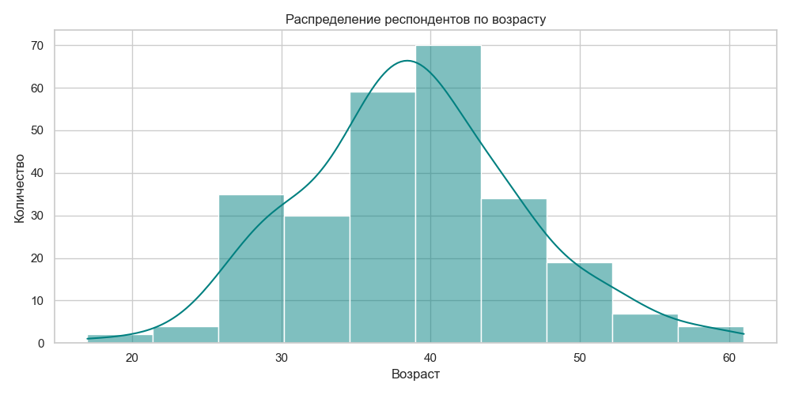

### 1.1.2. Распределение по полу
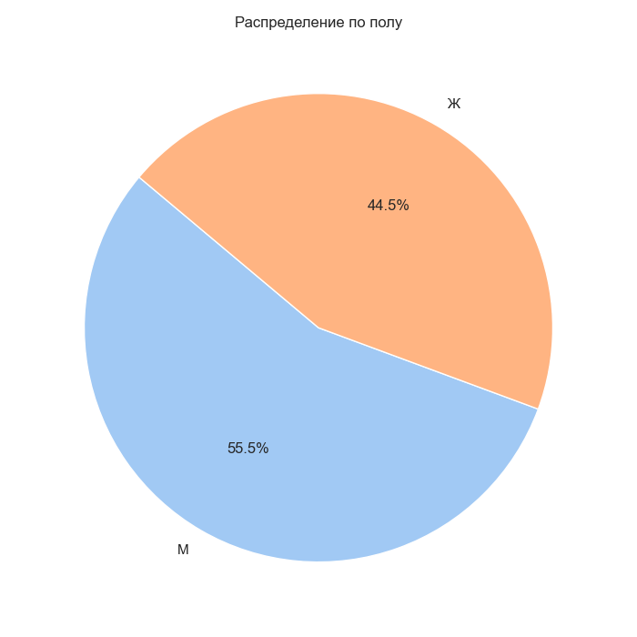

### 1.1.3. Однопунктовая 'Джедайская шкала'
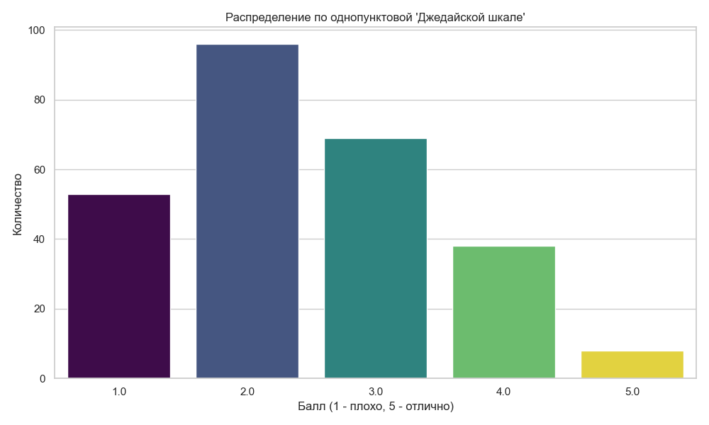

### 1.1.4. Хронотип
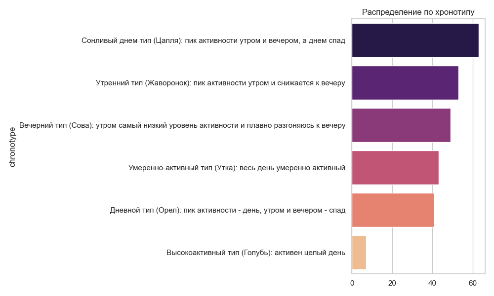

### 1.1.5. Режим работы
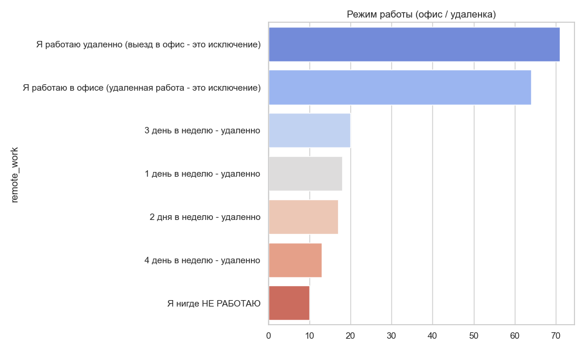

# 2. Анализ используемых шкал

## 2.1. Шкала: MIJS

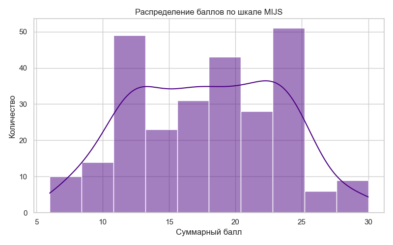

Состав пунктов:
- mijs_q1: Каждый день появляются незапланированные срочные задачи, которые я не могу отложить
- mijs_q2: Я не могу отвести время на важное, потому что оно полностью занято срочным
- mijs_q3: Я в большей степени тушу кризисы, чем их предотвращаю
- mijs_q4: Мне трудно видеть прогресс в важных проектах, потому что до них редко доходит очередь
- mijs_q5: К концу дня у меня почти нет энергии на важное
- mijs_q6: Я чувствую, что мои ресурсы (время и энергия) исчерпываются на срочное

### 2.1.1. Надежность (Reliability)

- **Альфа Кронбаха:** 0.839
- **Омега МакДональда:** 0.846

#### Коэффициенты при исключении пункта:

| Исключенный пункт | Альфа (if deleted) | Омега (if deleted) | Корреляция пункт-итог |
| :--- | :---: | :---: | :---: |
| mijs_q1 | 0.849 | 0.854 | 0.415 |
| mijs_q2 | 0.798 | 0.808 | 0.696 |
| mijs_q3 | 0.810 | 0.822 | 0.628 |
| mijs_q4 | 0.800 | 0.811 | 0.677 |
| mijs_q5 | 0.826 | 0.832 | 0.564 |
| mijs_q6 | 0.788 | 0.797 | 0.738 |

### 2.1.2. Эксплораторный факторный анализ (EFA)

- **Критерий KMO:** 0.853
- **Тест Бартлетта:** chi2=550.10, p=0.0000

#### Собственные значения факторов (Eigenvalues):
3.387, 0.891, 0.538, 0.493, 0.348, 0.343

#### Факторные нагрузки (1 фактор):

| Пункт | Нагрузка |
| :--- | :---: |
| mijs_q1 | -0.460 |
| mijs_q2 | -0.768 |
| mijs_q3 | -0.687 |
| mijs_q4 | -0.757 |
| mijs_q5 | -0.626 |
| mijs_q6 | -0.823 |

- **Объясненная дисперсия (1 фактор):** 48.59%
- **Собственное число основного фактора:** 2.915

### 2.1.3. Резюме по применимости

| Параметр | Значение | Комментарий |
| :--- | :---: | :--- |
| Alpha | 0.839 | ОК |
| KMO | 0.853 | ОК |
| Variance | 48.6% | Хорошо |
| **ИТОГ** | **Применима** | |

---

## 2.2. Шкала: MIJS-2

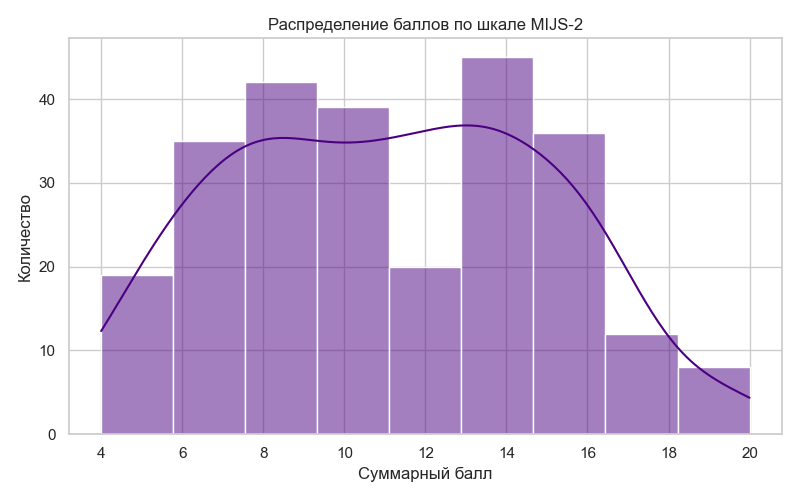

Состав пунктов:
- mijs_q2: Я не могу отвести время на важное, потому что оно полностью занято срочным
- mijs_q3: Я в большей степени тушу кризисы, чем их предотвращаю
- mijs_q4: Мне трудно видеть прогресс в важных проектах, потому что до них редко доходит очередь
- mijs_q6: Я чувствую, что мои ресурсы (время и энергия) исчерпываются на срочное

### 2.2.1. Надежность (Reliability)

- **Альфа Кронбаха:** 0.840
- **Омега МакДональда:** 0.842

#### Коэффициенты при исключении пункта:

| Исключенный пункт | Альфа (if deleted) | Омега (if deleted) | Корреляция пункт-итог |
| :--- | :---: | :---: | :---: |
| mijs_q2 | 0.792 | 0.795 | 0.688 |
| mijs_q3 | 0.823 | 0.825 | 0.613 |
| mijs_q4 | 0.796 | 0.798 | 0.679 |
| mijs_q6 | 0.779 | 0.780 | 0.716 |

### 2.2.2. Эксплораторный факторный анализ (EFA)

- **Критерий KMO:** 0.812
- **Тест Бартлетта:** chi2=368.11, p=0.0000

#### Собственные значения факторов (Eigenvalues):
2.708, 0.517, 0.422, 0.353

#### Факторные нагрузки (1 фактор):

| Пункт | Нагрузка |
| :--- | :---: |
| mijs_q2 | -0.771 |
| mijs_q3 | -0.676 |
| mijs_q4 | -0.760 |
| mijs_q6 | -0.811 |

- **Объясненная дисперсия (1 фактор):** 57.17%
- **Собственное число основного фактора:** 2.287

### 2.2.3. Резюме по применимости

| Параметр | Значение | Комментарий |
| :--- | :---: | :--- |
| Alpha | 0.840 | ОК |
| KMO | 0.812 | ОК |
| Variance | 57.2% | Хорошо |
| **ИТОГ** | **Применима** | |

---

## 2.3. Шкала: MIJS-2+

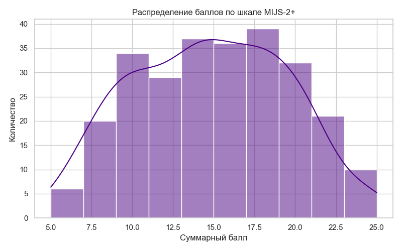

Состав пунктов:
- mijs_q2: Я не могу отвести время на важное, потому что оно полностью занято срочным
- mijs_q3: Я в большей степени тушу кризисы, чем их предотвращаю
- mijs_q4: Мне трудно видеть прогресс в важных проектах, потому что до них редко доходит очередь
- mijs_q6: Я чувствую, что мои ресурсы (время и энергия) исчерпываются на срочное
- jedi_inv: Инвертированная Джедайская шкала

### 2.3.1. Надежность (Reliability)

- **Альфа Кронбаха:** 0.860
- **Омега МакДональда:** 0.862

#### Коэффициенты при исключении пункта:

| Исключенный пункт | Альфа (if deleted) | Омега (if deleted) | Корреляция пункт-итог |
| :--- | :---: | :---: | :---: |
| mijs_q2 | 0.823 | 0.827 | 0.706 |
| mijs_q3 | 0.850 | 0.852 | 0.599 |
| mijs_q4 | 0.826 | 0.829 | 0.695 |
| mijs_q6 | 0.811 | 0.814 | 0.750 |
| jedi_inv | 0.840 | 0.842 | 0.639 |

### 2.3.2. Эксплораторный факторный анализ (EFA)

- **Критерий KMO:** 0.862
- **Тест Бартлетта:** chi2=503.52, p=0.0000

#### Собственные значения факторов (Eigenvalues):
3.212, 0.607, 0.439, 0.403, 0.339

#### Факторные нагрузки (1 фактор):

| Пункт | Нагрузка |
| :--- | :---: |
| mijs_q2 | -0.774 |
| mijs_q3 | -0.649 |
| mijs_q4 | -0.762 |
| mijs_q6 | -0.831 |
| jedi_inv | -0.700 |

- **Объясненная дисперсия (1 фактор):** 55.62%
- **Собственное число основного фактора:** 2.781

### 2.3.3. Резюме по применимости

| Параметр | Значение | Комментарий |
| :--- | :---: | :--- |
| Alpha | 0.860 | ОК |
| KMO | 0.862 | ОК |
| Variance | 55.6% | Хорошо |
| **ИТОГ** | **Применима** | |

---

## 2.4. Шкала: MIJS-3+

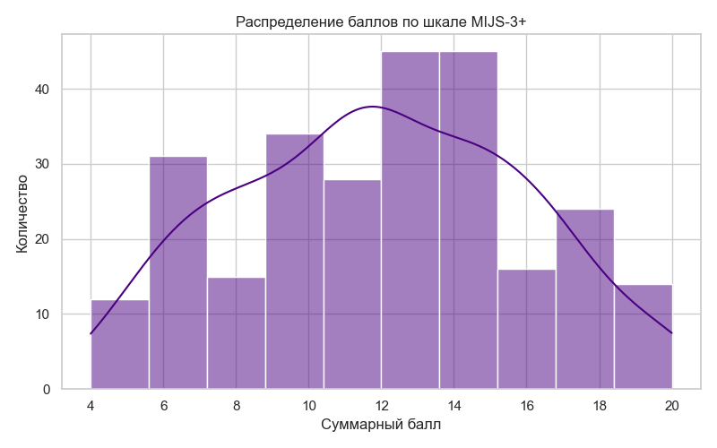

Состав пунктов:
- mijs_q2: Я не могу отвести время на важное, потому что оно полностью занято срочным
- mijs_q4: Мне трудно видеть прогресс в важных проектах, потому что до них редко доходит очередь
- mijs_q6: Я чувствую, что мои ресурсы (время и энергия) исчерпываются на срочное
- jedi_inv: Инвертированная Джедайская шкала

### 2.4.1. Надежность (Reliability)

- **Альфа Кронбаха:** 0.850
- **Омега МакДональда:** 0.852

#### Коэффициенты при исключении пункта:

| Исключенный пункт | Альфа (if deleted) | Омега (if deleted) | Корреляция пункт-итог |
| :--- | :---: | :---: | :---: |
| mijs_q2 | 0.813 | 0.817 | 0.680 |
| mijs_q4 | 0.814 | 0.816 | 0.683 |
| mijs_q6 | 0.786 | 0.788 | 0.743 |
| jedi_inv | 0.823 | 0.825 | 0.659 |

### 2.4.2. Эксплораторный факторный анализ (EFA)

- **Критерий KMO:** 0.820
- **Тест Бартлетта:** chi2=392.44, p=0.0000

#### Собственные значения факторов (Eigenvalues):
2.765, 0.466, 0.428, 0.341

#### Факторные нагрузки (1 фактор):

| Пункт | Нагрузка |
| :--- | :---: |
| mijs_q2 | -0.752 |
| mijs_q4 | -0.754 |
| mijs_q6 | -0.836 |
| jedi_inv | -0.726 |

- **Объясненная дисперсия (1 фактор):** 59.01%
- **Собственное число основного фактора:** 2.360

### 2.4.3. Резюме по применимости

| Параметр | Значение | Комментарий |
| :--- | :---: | :--- |
| Alpha | 0.850 | ОК |
| KMO | 0.820 | ОК |
| Variance | 59.0% | Хорошо |
| **ИТОГ** | **Применима** | |

---

## 2.5. Шкала: single_item

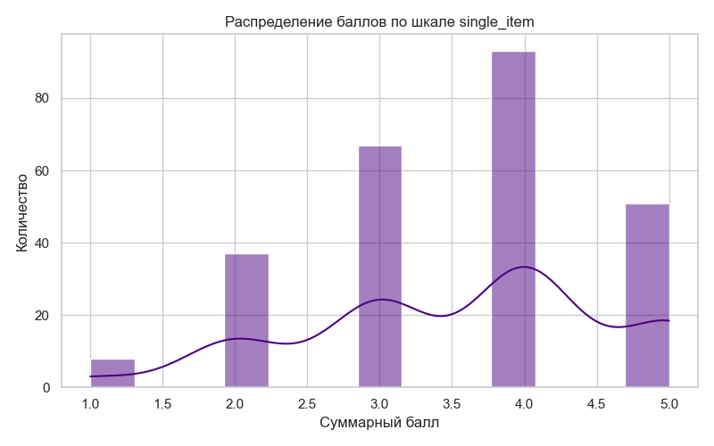

Состав пунктов:
- jedi_inv: Инвертированная Джедайская шкала

## 2.6. Итого по шкалам

| Шкала | Alpha | Omega | % Variance | KMO | Bartlett χ² | Bartlett p |
| :--- | :---: | :---: | :---: | :---: | :---: | :---: |
| MIJS | 0.839 | 0.846 | 48.6% | 0.853 | 550.10 | 0.0000 |
| MIJS-2 | 0.840 | 0.842 | 57.2% | 0.812 | 368.11 | 0.0000 |
| MIJS-2+ | 0.860 | 0.862 | 55.6% | 0.862 | 503.52 | 0.0000 |
| MIJS-3+ | 0.850 | 0.852 | 59.0% | 0.820 | 392.44 | 0.0000 |

==Дальнейший анализ основан на шкале  **single_item**==.
# 3. Выбираем лучшие приемы и практики

## 3.1. Корреляционный анализ (ранговая корреляция)

В данном разделе представлена связь различных практик с целевой шкалой **single_item**. Для анализа используется коэффициент ранговой корреляции Спирмена (ρ).

| № | Прием | ρ (Rho) | p-value | p (adj) | Знач. |
| :--- | :--- | :---: | :---: | :---: | :---: |
| 1 | Выполнить "зеленую" задачу | -0.347 | 0.0000 | 0.0000 | **** |
| 2 | Я подвожу итоги недели | -0.337 | 0.0000 | 0.0000 | **** |
| 3 | Увидеть дно инбокса | -0.332 | 0.0000 | 0.0000 | **** |
| 4 | Я подвожу итоги дня | -0.330 | 0.0000 | 0.0000 | **** |
| 5 | Отделять задачи от проектов и идей | -0.312 | 0.0000 | 0.0000 | **** |
| 6 | Я составляю план на день | -0.309 | 0.0000 | 0.0000 | **** |
| 7 | Я составляю план на неделю | -0.308 | 0.0000 | 0.0000 | **** |
| 8 | Порадовать свою обезьянку | -0.301 | 0.0000 | 0.0000 | **** |
| 9 | Я смотрю / корректирую свой план на неделю | -0.298 | 0.0000 | 0.0000 | **** |
| 10 | Провести 15 минут наедине со своими мыслями | -0.288 | 0.0000 | 0.0000 | **** |
| 11 | Разгрузить свою память | -0.273 | 0.0000 | 0.0001 | **** |
| 12 | Делать задачи ТОЛЬКО записанные в список (записываем, перед тем, как сделать) | -0.271 | 0.0000 | 0.0001 | **** |
| 13 | Закрыть ненужные вкладки в браузере | -0.266 | 0.0000 | 0.0001 | *** |
| 14 | Соотнести список своих задач со списком своих целей / хотелок | -0.261 | 0.0000 | 0.0001 | *** |
| 15 | Провести N-минут в инкубаторе идей | -0.245 | 0.0001 | 0.0004 | *** |
| 16 | Поковырять задачи в "Позже" | -0.239 | 0.0002 | 0.0005 | *** |
| 17 | Две минуты ничего не делать | -0.234 | 0.0003 | 0.0007 | *** |
| 18 | Формулировать задачи "как для обезьянки" | -0.229 | 0.0004 | 0.0009 | *** |
| 19 | Выполнить хотя бы одну задачу из списка до проверки почты / чатов / новостей | -0.467 | 0.0011 | 0.0025 | ** |
| 20 | Выполнить "зеленую" задачу ДО проверки чатов / почты / новостей и прочего интернета | -0.193 | 0.0027 | 0.0060 | ** |
| 21 | Посмотреть в свой список задач просто с целью выкинуть оттуда что-то ненужное | -0.188 | 0.0036 | 0.0076 | ** |
| 22 | Выполнить задачу из списка до контакта с внешним миром | -0.183 | 0.0047 | 0.0094 | ** |
| 23 | Интернет-шаббат: провести день, не прикасаясь к устройствам, способным соединяться с интернетом | -0.157 | 0.0156 | 0.0298 | * |
| 24 | Настроить автоматическое отмечание входящих писем в электронной почте прочитанными | -0.154 | 0.0178 | 0.0326 | * |
| 25 | Отключать средства коммуникации на время сосредоточенной работы (блоки тишины) | -0.145 | 0.0258 | 0.0454 | * |
| 26 | Сходить на тренировку и позаниматься спортом | -0.134 | 0.0382 | 0.0647 |  |
| 27 | На сколько удачливым человеком вы себя считаете? | -0.128 | 0.0482 | 0.0785 |  |
| 28 | Во время работы прятать смартфон от самого себя (не держать его на виду) | -0.101 | 0.1218 | 0.1860 |  |
| 29 | Провести утро без смартфона | -0.100 | 0.1226 | 0.1860 |  |
| 30 | Отключить красные кружочки на иконках приложений в смартфоне | -0.088 | 0.1756 | 0.2575 |  |
| 31 | Провести ревизию спального места на предмет светового шума | -0.085 | 0.1896 | 0.2691 |  |
| 32 | В среднем, сколько дней в неделю вы работаете в офисе, а сколько удаленно? | -0.093 | 0.2035 | 0.2713 |  |
| 33 | Установить автоматический (по расписанию) режим "не беспокоить" на смартфоне (минимум на 8 часов в день) | -0.083 | 0.2021 | 0.2713 |  |
| 34 | Отключить оповещения о новых сообщениях в чатах | -0.080 | 0.2181 | 0.2822 |  |
| 35 | Установить фильтр синего (ночной режим или режим чтения) на экранах | -0.055 | 0.3999 | 0.5028 |  |
| 36 | Установить плагины и настройки против рекламных баннеров | -0.052 | 0.4242 | 0.5185 |  |
| 37 | Провести день стесняясь смартфона | 0.037 | 0.5717 | 0.6795 |  |
| 38 | Отключить оповещения о новых сообщениях в электронной почте | 0.034 | 0.5986 | 0.6795 |  |
| 39 | Лежа в постели не пользоваться устройствами с экранами | -0.034 | 0.6023 | 0.6795 |  |
| 40 | Удалить приложения социальных сетей со своего смартфона | -0.024 | 0.7111 | 0.7822 |  |
| 41 | Пользоваться смартфоном в туалете | -0.022 | 0.7393 | 0.7934 |  |
| 42 | Отключить оповещения на смарт-часах | -0.004 | 0.9465 | 0.9736 |  |
| 43 | Вести лог дня (дневник) | -0.003 | 0.9677 | 0.9736 |  |
| 44 | Отключить push-оповещения от приложений в смартфоне (соцсети, магазины, заправки) | -0.002 | 0.9736 | 0.9736 |  |

*Примечание: Значимость (*) указана на основе скорректированного p-value (FDR). p < 0.05, ** p < 0.01, *** p < 0.001. Отрицательная корреляция означает, что использование приема связано с более низким баллом по шкале single_item (меньше стресса/завала).* 

## 3.2. Сравнение средних (ANOVA)

В данном разделе анализируется, как частота использования или уровень внедрения приема связаны со средним значением продуктивности. Для проверки значимости различий между группами используется однофакторный дисперсионный анализ (One-way ANOVA).

### 3.2.1. Частота использования приемов

Респонденты разделены на группы по частоте использования (0 — никогда, 4 — всегда).

| № | Прием | Ср. (0) | Ср. (1) | Ср. (2) | Ср. (3) | Ср. (4) | F | p-value | p (adj) | Знач. |
| :--- | :--- | :---: | :---: | :---: | :---: | :---: | :---: | :---: | :---: | :---: |
| 1 | Выполнить "зеленую" задачу | 3.9 | 3.6 | 3.5 | 3.1 | 2.4 | 9.93 | 0.0000 | 0.0000 | **** |
| 2 | Увидеть дно инбокса | 4.0 | 3.9 | 3.3 | 3.1 | 3.1 | 8.37 | 0.0000 | 0.0000 | **** |
| 3 | Я подвожу итоги недели | 3.9 | 3.5 | 3.4 | 3.0 | 2.9 | 8.01 | 0.0000 | 0.0000 | **** |
| 4 | Я смотрю / корректирую свой план на неделю | 3.9 | 3.8 | 3.3 | 3.5 | 2.7 | 7.64 | 0.0000 | 0.0001 | **** |
| 5 | Я подвожу итоги дня | 4.0 | 3.5 | 3.3 | 3.1 | 3.0 | 7.37 | 0.0000 | 0.0001 | **** |
| 6 | Я составляю план на день | 3.9 | 4.0 | 3.6 | 3.3 | 3.1 | 7.06 | 0.0000 | 0.0001 | **** |
| 7 | Закрыть ненужные вкладки в браузере | 4.2 | 3.4 | 3.9 | 3.4 | 3.2 | 7.06 | 0.0000 | 0.0001 | **** |
| 8 | Отделять задачи от проектов и идей | 3.9 | 3.7 | 3.5 | 3.4 | 2.9 | 6.81 | 0.0000 | 0.0001 | *** |
| 9 | Я составляю план на неделю | 3.9 | 3.9 | 3.4 | 3.2 | 3.1 | 6.59 | 0.0000 | 0.0002 | *** |
| 10 | Выполнить задачу из списка до контакта с внешним миром | 3.6 | 3.7 | 3.6 | 2.7 | 2.8 | 6.27 | 0.0001 | 0.0003 | *** |
| 11 | Порадовать свою обезьянку | 4.0 | 3.8 | 3.4 | 3.2 | 3.0 | 6.10 | 0.0001 | 0.0003 | *** |
| 12 | Разгрузить свою память | 3.8 | 3.9 | 3.6 | 3.5 | 3.0 | 5.62 | 0.0002 | 0.0006 | *** |
| 13 | Выполнить "зеленую" задачу ДО проверки чатов / почты / новостей и прочего интернета | 3.7 | 3.7 | 3.0 | 2.6 | - | 6.58 | 0.0003 | 0.0007 | *** |
| 14 | Провести 15 минут наедине со своими мыслями | 3.8 | 3.8 | 3.5 | 3.3 | 3.0 | 4.98 | 0.0007 | 0.0016 | ** |
| 15 | Провести N-минут в инкубаторе идей | 3.8 | 3.3 | 3.2 | - | - | 7.17 | 0.0010 | 0.0020 | ** |
| 16 | Соотнести список своих задач со списком своих целей / хотелок | 3.8 | 3.5 | 3.1 | 3.1 | - | 5.41 | 0.0013 | 0.0025 | ** |
| 17 | Формулировать задачи "как для обезьянки" | 3.7 | 3.9 | 3.6 | 3.5 | 3.1 | 4.50 | 0.0016 | 0.0029 | ** |
| 18 | Делать задачи ТОЛЬКО записанные в список (записываем, перед тем, как сделать) | 3.9 | 3.7 | 3.6 | 3.2 | 3.1 | 4.38 | 0.0020 | 0.0034 | ** |
| 19 | Поковырять задачи в "Позже" | 3.8 | 3.6 | 3.2 | 3.1 | - | 4.84 | 0.0028 | 0.0045 | ** |
| 20 | Две минуты ничего не делать | 3.8 | 3.8 | 3.3 | 3.3 | 3.1 | 4.01 | 0.0037 | 0.0057 | ** |
| 21 | Посмотреть в свой список задач просто с целью выкинуть оттуда что-то ненужное | 3.9 | 3.5 | 3.4 | 3.2 | 3.6 | 2.70 | 0.0314 | 0.0463 | * |
| 22 | Отключать средства коммуникации на время сосредоточенной работы (блоки тишины) | 3.6 | 3.7 | 3.6 | 3.3 | 3.1 | 2.26 | 0.0632 | 0.0852 |  |
| 23 | Интернет-шаббат: провести день, не прикасаясь к устройствам, способным соединяться с интернетом | 3.6 | 3.3 | - | - | - | 3.51 | 0.0621 | 0.0852 |  |
| 24 | Провести день стесняясь смартфона | 3.5 | 3.9 | - | - | - | 2.87 | 0.0917 | 0.1184 |  |
| 25 | Сходить на тренировку и позаниматься спортом | 3.9 | 3.4 | 3.5 | 3.4 | 3.3 | 1.99 | 0.0966 | 0.1198 |  |
| 26 | Провести утро без смартфона | 3.6 | 3.6 | 3.2 | 3.7 | 3.3 | 1.74 | 0.1410 | 0.1681 |  |
| 27 | Лежа в постели не пользоваться устройствами с экранами | 3.6 | 3.5 | 3.3 | 3.9 | 3.3 | 1.69 | 0.1522 | 0.1748 |  |
| 28 | Выполнить хотя бы одну задачу из списка до проверки почты / чатов / новостей | 4.2 | 3.9 | - | - | - | 1.29 | 0.2662 | 0.2947 |  |
| 29 | Пользоваться смартфоном в туалете | 3.7 | 3.6 | 3.3 | 3.3 | 3.6 | 1.15 | 0.3344 | 0.3575 |  |
| 30 | Во время работы прятать смартфон от самого себя (не держать его на виду) | 3.6 | 3.7 | 3.4 | 3.3 | 3.3 | 0.96 | 0.4301 | 0.4444 |  |
| 31 | Вести лог дня (дневник) | 3.5 | 3.5 | 3.6 | 3.7 | 3.4 | 0.28 | 0.8910 | 0.8910 |  |

*Примечание: Значимость (*) указана на основе скорректированного p-value (FDR). 0 — никогда/редко, 4 — всегда. В ячейках указан средний балл по шкале single_item. Чем ниже балл, тем выше продуктивность.* 

### 3.2.2. Уровень внедрения приемов

Респонденты разделены на группы по уровню внедрения (0 — не применил(а), 3 — применил(а) по максимуму).

| № | Прием | Ср. (0) | Ср. (1) | Ср. (2) | Ср. (3) | F | p-value | p (adj) | Знач. |
| :--- | :--- | :---: | :---: | :---: | :---: | :---: | :---: | :---: | :---: |
| 1 | Настроить автоматическое отмечание входящих писем в электронной почте прочитанными | 3.6 | 3.5 | 3.6 | 3.0 | 3.42 | 0.0181 | 0.1989 |  |
| 2 | Установить фильтр синего (ночной режим или режим чтения) на экранах | 3.5 | 3.7 | 3.6 | 3.4 | 0.94 | 0.4240 | 0.5829 |  |
| 3 | Провести ревизию спального места на предмет светового шума | 3.5 | 3.6 | 3.6 | 3.4 | 0.98 | 0.4020 | 0.5829 |  |
| 4 | Удалить приложения социальных сетей со своего смартфона | 3.5 | 3.7 | 3.5 | 3.2 | 1.25 | 0.2919 | 0.5829 |  |
| 5 | Отключить красные кружочки на иконках приложений в смартфоне | 3.6 | 3.8 | 3.5 | 3.3 | 1.22 | 0.3036 | 0.5829 |  |
| 6 | Отключить оповещения о новых сообщениях в чатах | - | 3.7 | 3.5 | 3.4 | 1.61 | 0.2022 | 0.5829 |  |
| 7 | Отключить оповещения о новых сообщениях в электронной почте | 3.3 | 3.7 | 3.6 | 3.5 | 0.99 | 0.3990 | 0.5829 |  |
| 8 | Отключить push-оповещения от приложений в смартфоне (соцсети, магазины, заправки) | - | 3.5 | 3.7 | 3.4 | 1.89 | 0.1537 | 0.5829 |  |
| 9 | Установить плагины и настройки против рекламных баннеров | 3.5 | 3.5 | 3.6 | 3.4 | 0.61 | 0.6066 | 0.7415 |  |
| 10 | Установить автоматический (по расписанию) режим "не беспокоить" на смартфоне (минимум на 8 часов в день) | 3.6 | 3.6 | 3.5 | 3.4 | 0.50 | 0.6794 | 0.7473 |  |
| 11 | Отключить оповещения на смарт-часах | 3.4 | 3.6 | 3.6 | 3.5 | 0.23 | 0.8782 | 0.8782 |  |

*Примечание: Значимость (*) указана на основе скорректированного p-value (FDR). 0 — не применил(а), 3 — по максимуму. В ячейках указан средний балл по шкале single_item.*

## 3.3. Сравнение трёх групп продуктивности (Kruskal-Wallis)

Респонденты разделены на три группы по терцилям (20-й и 80-й перцентили) суммарного балла продуктивности. Низкая группа – наиболее продуктивные (низкие баллы single_item), высокая группа – наименее продуктивные (высокие баллы single_item). Для каждой практики проверяется гипотеза о различиях распределений частоты использования между тремя группами с помощью критерия Краскела-Уоллиса. В случае значимых различий (p < 0.05 после FDR‑коррекции) выполняются попарные пост‑хок тесты Данна.

- **Группа Продуктивные:** 43 респондентов
- **Группа Средняки:** 152 респондентов
- **Группа Непродуктивные:** 43 респондентов

| № | Практика | Ср. Продуктивные | Ср. Средняки | Ср. Непродуктивные | H-статистика | p (исх.) | p (скорр.) | Значима |
| :--- | :--- | :---: | :---: | :---: | :---: | :---: | :---: | :---: |
| 1 | Разгрузить свою память | 3.12 | 2.20 | 2.09 | 20.83 | 0.0000 | 0.0004 | ✅ |
| 2 | Я составляю план на день | 2.98 | 2.27 | 1.74 | 19.93 | 0.0000 | 0.0004 | ✅ |
| 3 | Я подвожу итоги дня | 2.12 | 1.46 | 0.88 | 19.79 | 0.0001 | 0.0004 | ✅ |
| 4 | Я подвожу итоги недели | 2.00 | 1.25 | 0.67 | 20.08 | 0.0000 | 0.0004 | ✅ |
| 5 | Увидеть дно инбокса | 2.79 | 1.99 | 1.19 | 22.08 | 0.0000 | 0.0004 | ✅ |
| 6 | Выполнить "зеленую" задачу | 2.02 | 1.45 | 0.77 | 20.40 | 0.0000 | 0.0004 | ✅ |
| 7 | Отделять задачи от проектов и идей | 2.53 | 1.78 | 1.21 | 18.83 | 0.0001 | 0.0005 | ✅ |
| 8 | Порадовать свою обезьянку | 2.40 | 1.79 | 1.33 | 17.52 | 0.0002 | 0.0008 | ✅ |
| 9 | Я составляю план на неделю | 2.47 | 1.88 | 1.21 | 15.33 | 0.0005 | 0.0022 | ✅ |
| 10 | Я смотрю / корректирую свой план на неделю | 2.14 | 1.59 | 1.05 | 13.77 | 0.0010 | 0.0043 | ✅ |
| 11 | Провести N-минут в инкубаторе идей | 0.72 | 0.76 | 0.26 | 13.05 | 0.0015 | 0.0056 | ✅ |
| 12 | Провести 15 минут наедине со своими мыслями | 2.28 | 1.86 | 1.26 | 12.80 | 0.0017 | 0.0058 | ✅ |
| 13 | Выполнить хотя бы одну задачу из списка до проверки почты / чатов / новостей | 2.67 | 1.27 | 0.43 | 12.04 | 0.0024 | 0.0079 | ✅ |
| 14 | Две минуты ничего не делать | 2.19 | 1.57 | 1.16 | 11.45 | 0.0033 | 0.0091 | ✅ |
| 15 | Выполнить задачу из списка до контакта с внешним миром | 1.47 | 1.16 | 0.51 | 11.49 | 0.0032 | 0.0091 | ✅ |
| 16 | Делать задачи ТОЛЬКО записанные в список (записываем, перед тем, как сделать) | 2.30 | 1.91 | 1.37 | 10.78 | 0.0046 | 0.0120 | ✅ |
| 17 | Соотнести список своих задач со списком своих целей / хотелок | 1.09 | 0.95 | 0.47 | 10.64 | 0.0049 | 0.0121 | ✅ |
| 18 | Формулировать задачи "как для обезьянки" | 2.74 | 2.21 | 1.84 | 10.24 | 0.0060 | 0.0139 | ✅ |
| 19 | Поковырять задачи в "Позже" | 1.33 | 1.18 | 0.72 | 10.02 | 0.0067 | 0.0147 | ✅ |
| 20 | Интернет-шаббат: провести день, не прикасаясь к устройствам, способным соединяться с интернетом | 0.51 | 0.20 | 0.14 | 9.34 | 0.0094 | 0.0197 | ✅ |
| 21 | Закрыть ненужные вкладки в браузере | 2.98 | 2.36 | 2.07 | 8.86 | 0.0119 | 0.0238 | ✅ |
| 22 | Посмотреть в свой список задач просто с целью выкинуть оттуда что-то ненужное | 1.56 | 1.58 | 1.02 | 8.43 | 0.0148 | 0.0282 | ✅ |
| 23 | Выполнить "зеленую" задачу ДО проверки чатов / почты / новостей и прочего интернета | 1.07 | 0.67 | 0.33 | 7.63 | 0.0220 | 0.0402 | ✅ |
| 24 | Сходить на тренировку и позаниматься спортом | 2.42 | 2.03 | 1.70 | 7.27 | 0.0264 | 0.0462 | ✅ |
| 25 | Настроить автоматическое отмечание входящих писем в электронной почте прочитанными | 1.05 | 0.57 | 0.37 | 6.78 | 0.0338 | 0.0568 |  |
| 26 | Отключить оповещения о новых сообщениях в чатах | 1.79 | 1.87 | 1.51 | 6.15 | 0.0461 | 0.0745 |  |
| 27 | Отключать средства коммуникации на время сосредоточенной работы (блоки тишины) | 1.77 | 1.43 | 1.12 | 3.84 | 0.1465 | 0.2279 |  |
| 28 | Установить автоматический (по расписанию) режим "не беспокоить" на смартфоне (минимум на 8 часов в день) | 2.02 | 1.95 | 1.65 | 3.03 | 0.2197 | 0.3295 |  |
| 29 | Провести утро без смартфона | 1.65 | 1.43 | 1.09 | 2.95 | 0.2283 | 0.3307 |  |
| 30 | Во время работы прятать смартфон от самого себя (не держать его на виду) | 1.33 | 1.18 | 0.81 | 2.73 | 0.2552 | 0.3458 |  |
| 31 | Отключить красные кружочки на иконках приложений в смартфоне | 1.56 | 1.45 | 1.14 | 2.74 | 0.2546 | 0.3458 |  |
| 32 | Установить плагины и настройки против рекламных баннеров | 1.63 | 1.37 | 1.56 | 1.96 | 0.3762 | 0.4937 |  |
| 33 | Лежа в постели не пользоваться устройствами с экранами | 1.98 | 1.65 | 1.63 | 1.80 | 0.4059 | 0.5166 |  |
| 34 | Отключить оповещения о новых сообщениях в электронной почте | 2.16 | 2.01 | 2.14 | 1.23 | 0.5416 | 0.6691 |  |
| 35 | Отключить push-оповещения от приложений в смартфоне (соцсети, магазины, заправки) | 1.93 | 2.07 | 1.93 | 1.16 | 0.5594 | 0.6712 |  |
| 36 | Установить фильтр синего (ночной режим или режим чтения) на экранах | 1.81 | 1.60 | 1.60 | 1.09 | 0.5808 | 0.6776 |  |
| 37 | Провести ревизию спального места на предмет светового шума | 2.00 | 1.94 | 1.86 | 0.65 | 0.7218 | 0.8194 |  |
| 38 | Удалить приложения социальных сетей со своего смартфона | 1.14 | 0.97 | 1.02 | 0.42 | 0.8111 | 0.8965 |  |
| 39 | Провести день стесняясь смартфона | 0.35 | 0.32 | 0.28 | 0.27 | 0.8752 | 0.9190 |  |
| 40 | Отключить оповещения на смарт-часах | 2.28 | 2.28 | 2.26 | 0.27 | 0.8720 | 0.9190 |  |
| 41 | Пользоваться смартфоном в туалете | 2.58 | 2.47 | 2.44 | 0.11 | 0.9470 | 0.9649 |  |
| 42 | Вести лог дня (дневник) | 0.95 | 0.99 | 0.84 | 0.07 | 0.9649 | 0.9649 |  |

**Значимых различий после коррекции (padj < 0.05): 24**

#### Разгрузить свою память

**Попарные сравнения (p-скорр.):**

|                |   Непродуктивные |   Средняки |   Продуктивные |
|:---------------|-----------------:|-----------:|---------------:|
| Непродуктивные |           1.0000 |     0.6009 |         0.0002 |
| Средняки       |           0.6009 |     1.0000 |         0.0000 |
| Продуктивные   |           0.0002 |     0.0000 |         1.0000 |

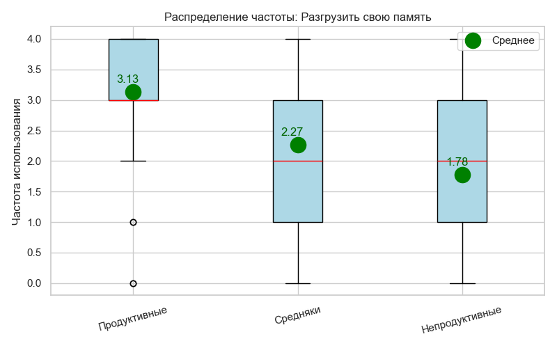

#### Я составляю план на день

**Попарные сравнения (p-скорр.):**

|                |   Непродуктивные |   Средняки |   Продуктивные |
|:---------------|-----------------:|-----------:|---------------:|
| Непродуктивные |           1.0000 |     0.0157 |         0.0000 |
| Средняки       |           0.0157 |     1.0000 |         0.0026 |
| Продуктивные   |           0.0000 |     0.0026 |         1.0000 |

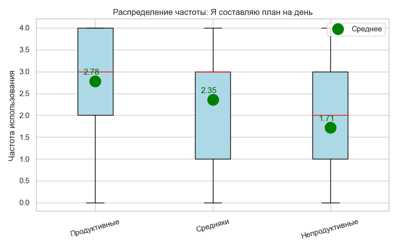

#### Я подвожу итоги дня

**Попарные сравнения (p-скорр.):**

|                |   Непродуктивные |   Средняки |   Продуктивные |
|:---------------|-----------------:|-----------:|---------------:|
| Непродуктивные |           1.0000 |     0.0121 |         0.0000 |
| Средняки       |           0.0121 |     1.0000 |         0.0037 |
| Продуктивные   |           0.0000 |     0.0037 |         1.0000 |

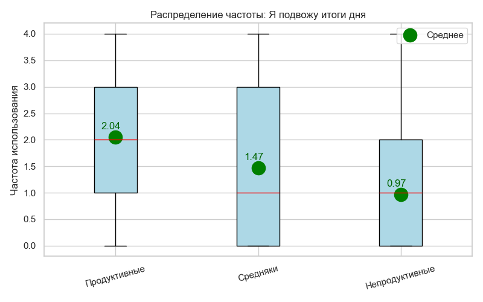

#### Я подвожу итоги недели

**Попарные сравнения (p-скорр.):**

|                |   Непродуктивные |   Средняки |   Продуктивные |
|:---------------|-----------------:|-----------:|---------------:|
| Непродуктивные |           1.0000 |     0.0207 |         0.0000 |
| Средняки       |           0.0207 |     1.0000 |         0.0018 |
| Продуктивные   |           0.0000 |     0.0018 |         1.0000 |

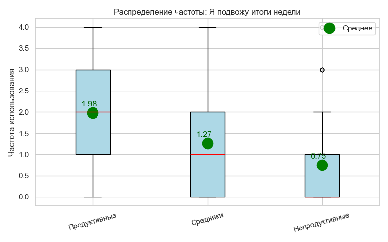

#### Увидеть дно инбокса

**Попарные сравнения (p-скорр.):**

|                |   Непродуктивные |   Средняки |   Продуктивные |
|:---------------|-----------------:|-----------:|---------------:|
| Непродуктивные |           1.0000 |     0.0039 |         0.0000 |
| Средняки       |           0.0039 |     1.0000 |         0.0039 |
| Продуктивные   |           0.0000 |     0.0039 |         1.0000 |

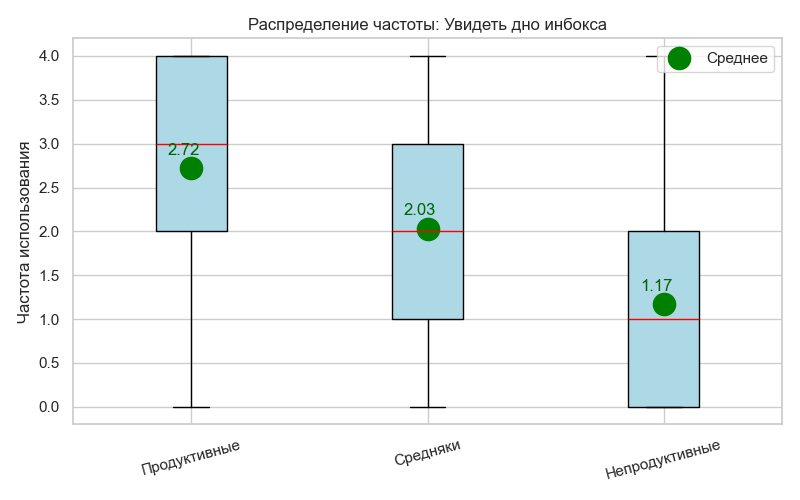

#### Выполнить "зеленую" задачу

**Попарные сравнения (p-скорр.):**

|                |   Непродуктивные |   Средняки |   Продуктивные |
|:---------------|-----------------:|-----------:|---------------:|
| Непродуктивные |           1.0000 |     0.0012 |         0.0000 |
| Средняки       |           0.0012 |     1.0000 |         0.0268 |
| Продуктивные   |           0.0000 |     0.0268 |         1.0000 |

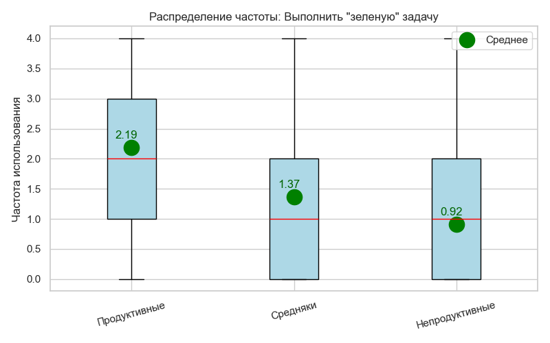

#### Отделять задачи от проектов и идей

**Попарные сравнения (p-скорр.):**

|                |   Непродуктивные |   Средняки |   Продуктивные |
|:---------------|-----------------:|-----------:|---------------:|
| Непродуктивные |           1.0000 |     0.0154 |         0.0000 |
| Средняки       |           0.0154 |     1.0000 |         0.0044 |
| Продуктивные   |           0.0000 |     0.0044 |         1.0000 |

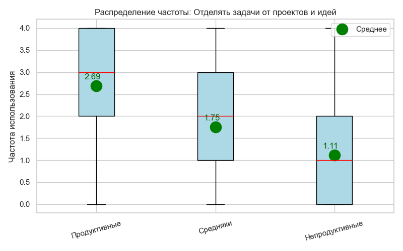

#### Порадовать свою обезьянку

**Попарные сравнения (p-скорр.):**

|                |   Непродуктивные |   Средняки |   Продуктивные |
|:---------------|-----------------:|-----------:|---------------:|
| Непродуктивные |           1.0000 |     0.0191 |         0.0001 |
| Средняки       |           0.0191 |     1.0000 |         0.0062 |
| Продуктивные   |           0.0001 |     0.0062 |         1.0000 |

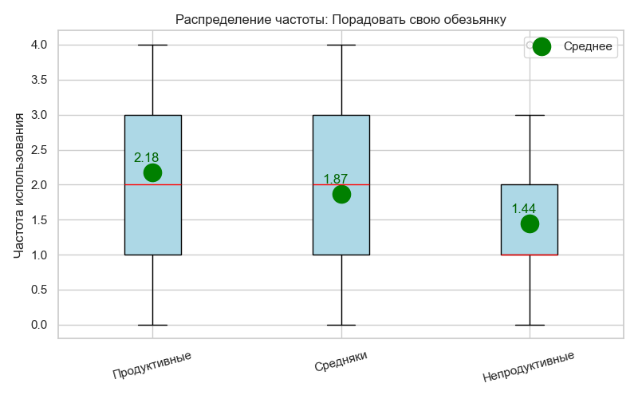

#### Я составляю план на неделю

**Попарные сравнения (p-скорр.):**

|                |   Непродуктивные |   Средняки |   Продуктивные |
|:---------------|-----------------:|-----------:|---------------:|
| Непродуктивные |           1.0000 |     0.0153 |         0.0003 |
| Средняки       |           0.0153 |     1.0000 |         0.0206 |
| Продуктивные   |           0.0003 |     0.0206 |         1.0000 |

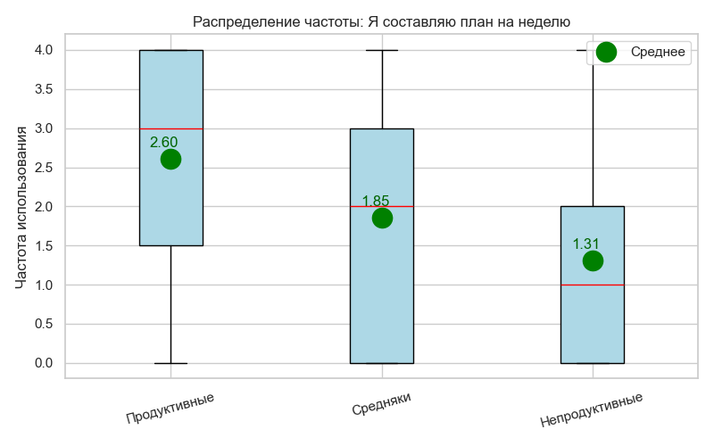

#### Я смотрю / корректирую свой план на неделю

**Попарные сравнения (p-скорр.):**

|                |   Непродуктивные |   Средняки |   Продуктивные |
|:---------------|-----------------:|-----------:|---------------:|
| Непродуктивные |           1.0000 |     0.0234 |         0.0006 |
| Средняки       |           0.0234 |     1.0000 |         0.0234 |
| Продуктивные   |           0.0006 |     0.0234 |         1.0000 |

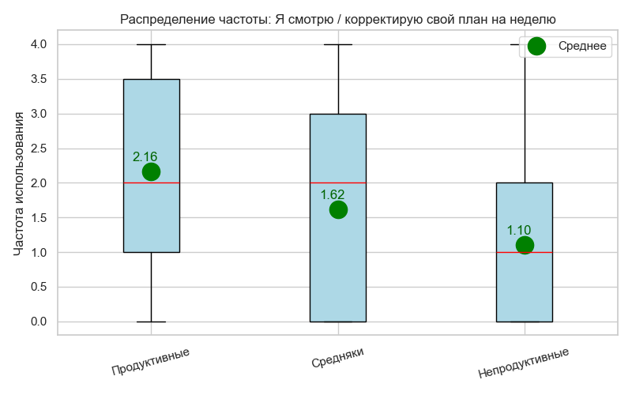

#### Провести N-минут в инкубаторе идей

**Попарные сравнения (p-скорр.):**

|                |   Непродуктивные |   Средняки |   Продуктивные |
|:---------------|-----------------:|-----------:|---------------:|
| Непродуктивные |           1.0000 |     0.0014 |         0.0060 |
| Средняки       |           0.0014 |     1.0000 |         0.9305 |
| Продуктивные   |           0.0060 |     0.9305 |         1.0000 |

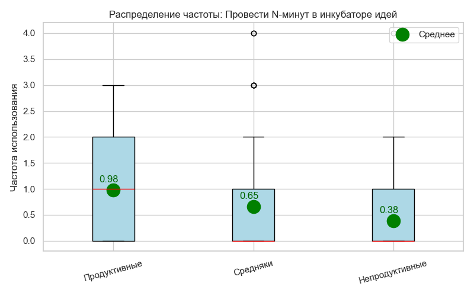

#### Провести 15 минут наедине со своими мыслями

**Попарные сравнения (p-скорр.):**

|                |   Непродуктивные |   Средняки |   Продуктивные |
|:---------------|-----------------:|-----------:|---------------:|
| Непродуктивные |           1.0000 |     0.0130 |         0.0012 |
| Средняки       |           0.0130 |     1.0000 |         0.0734 |
| Продуктивные   |           0.0012 |     0.0734 |         1.0000 |

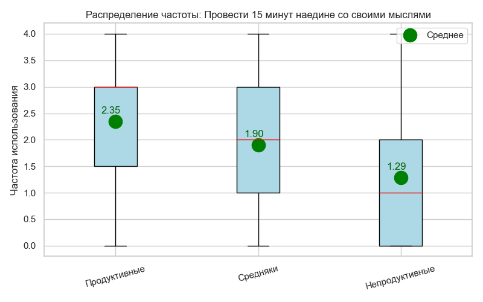

#### Выполнить хотя бы одну задачу из списка до проверки почты / чатов / новостей

**Попарные сравнения (p-скорр.):**

|                |   Непродуктивные |   Средняки |   Продуктивные |
|:---------------|-----------------:|-----------:|---------------:|
| Непродуктивные |           1.0000 |     0.0347 |         0.0024 |
| Средняки       |           0.0347 |     1.0000 |         0.0507 |
| Продуктивные   |           0.0024 |     0.0507 |         1.0000 |

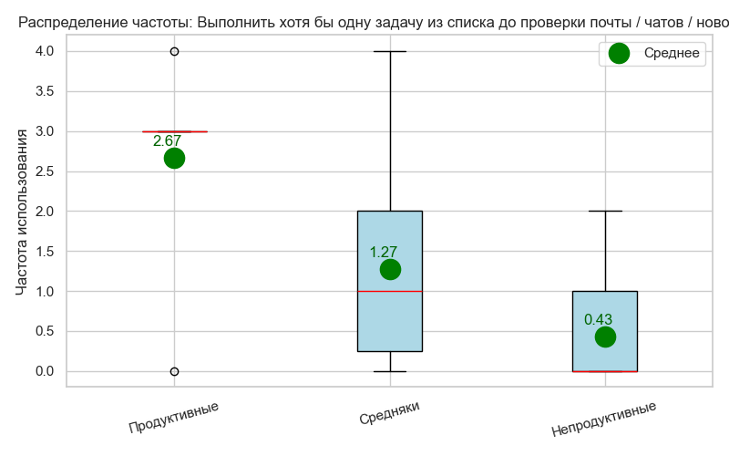

#### Две минуты ничего не делать

**Попарные сравнения (p-скорр.):**

|                |   Непродуктивные |   Средняки |   Продуктивные |
|:---------------|-----------------:|-----------:|---------------:|
| Непродуктивные |           1.0000 |     0.1278 |         0.0028 |
| Средняки       |           0.1278 |     1.0000 |         0.0135 |
| Продуктивные   |           0.0028 |     0.0135 |         1.0000 |

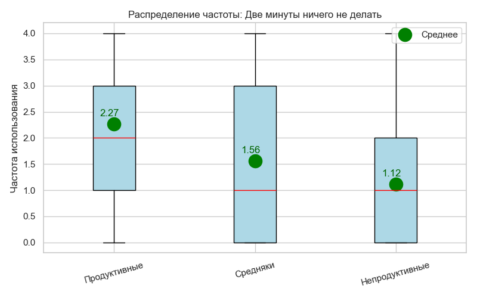

#### Выполнить задачу из списка до контакта с внешним миром

**Попарные сравнения (p-скорр.):**

|                |   Непродуктивные |   Средняки |   Продуктивные |
|:---------------|-----------------:|-----------:|---------------:|
| Непродуктивные |           1.0000 |     0.0036 |         0.0036 |
| Средняки       |           0.0036 |     1.0000 |         0.4170 |
| Продуктивные   |           0.0036 |     0.4170 |         1.0000 |

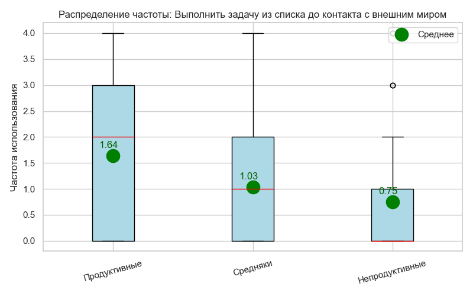

## 3.4. Сводная таблица лучших практик

В этой таблице представлены практики, которые вошли в топ-15 по каждому из использованных методов анализа. ✅ означает, что практика входит в топ-15 по версии данного метода.

| № | Практика | Корреляция (Spearman) | ANOVA (частота) | Kruskal-Wallis | Сумма |
| :---: | :--- | :---: | :---: | :---: | :---: |
| 1 | Выполнить "зеленую" задачу | ✅ | ✅ | ✅ | 3 |
| 2 | Отделять задачи от проектов и идей | ✅ | ✅ | ✅ | 3 |
| 3 | Порадовать свою обезьянку | ✅ | ✅ | ✅ | 3 |
| 4 | Провести 15 минут наедине со своими мыслями | ✅ | ✅ | ✅ | 3 |
| 5 | Провести N-минут в инкубаторе идей | ✅ | ✅ | ✅ | 3 |
| 6 | Разгрузить свою память | ✅ | ✅ | ✅ | 3 |
| 7 | Увидеть дно инбокса | ✅ | ✅ | ✅ | 3 |
| 8 | Я подвожу итоги дня | ✅ | ✅ | ✅ | 3 |
| 9 | Я подвожу итоги недели | ✅ | ✅ | ✅ | 3 |
| 10 | Я смотрю / корректирую свой план на неделю | ✅ | ✅ | ✅ | 3 |
| 11 | Я составляю план на день | ✅ | ✅ | ✅ | 3 |
| 12 | Я составляю план на неделю | ✅ | ✅ | ✅ | 3 |
| 13 | Выполнить задачу из списка до контакта с внешним миром |  | ✅ | ✅ | 2 |
| 14 | Закрыть ненужные вкладки в браузере | ✅ | ✅ |  | 2 |
| 15 | Выполнить "зеленую" задачу ДО проверки чатов / почты / новостей и прочего интернета |  | ✅ |  | 1 |
| 16 | Выполнить хотя бы одну задачу из списка до проверки почты / чатов / новостей |  |  | ✅ | 1 |
| 17 | Две минуты ничего не делать |  |  | ✅ | 1 |
| 18 | Делать задачи ТОЛЬКО записанные в список (записываем, перед тем, как сделать) | ✅ |  |  | 1 |
| 19 | Соотнести список своих задач со списком своих целей / хотелок | ✅ |  |  | 1 |
| 20 | Вести лог дня (дневник) |  |  |  | 0 |
| 21 | Во время работы прятать смартфон от самого себя (не держать его на виду) |  |  |  | 0 |
| 22 | Интернет-шаббат: провести день, не прикасаясь к устройствам, способным соединяться с интернетом |  |  |  | 0 |
| 23 | Лежа в постели не пользоваться устройствами с экранами |  |  |  | 0 |
| 24 | Настроить автоматическое отмечание входящих писем в электронной почте прочитанными |  |  |  | 0 |
| 25 | Отключать средства коммуникации на время сосредоточенной работы (блоки тишины) |  |  |  | 0 |
| 26 | Отключить push-оповещения от приложений в смартфоне (соцсети, магазины, заправки) |  |  |  | 0 |
| 27 | Отключить красные кружочки на иконках приложений в смартфоне |  |  |  | 0 |
| 28 | Отключить оповещения на смарт-часах |  |  |  | 0 |
| 29 | Отключить оповещения о новых сообщениях в чатах |  |  |  | 0 |
| 30 | Отключить оповещения о новых сообщениях в электронной почте |  |  |  | 0 |
| 31 | Поковырять задачи в "Позже" |  |  |  | 0 |
| 32 | Пользоваться смартфоном в туалете |  |  |  | 0 |
| 33 | Посмотреть в свой список задач просто с целью выкинуть оттуда что-то ненужное |  |  |  | 0 |
| 34 | Провести день стесняясь смартфона |  |  |  | 0 |
| 35 | Провести ревизию спального места на предмет светового шума |  |  |  | 0 |
| 36 | Провести утро без смартфона |  |  |  | 0 |
| 37 | Сходить на тренировку и позаниматься спортом |  |  |  | 0 |
| 38 | Удалить приложения социальных сетей со своего смартфона |  |  |  | 0 |
| 39 | Установить автоматический (по расписанию) режим "не беспокоить" на смартфоне (минимум на 8 часов в день) |  |  |  | 0 |
| 40 | Установить плагины и настройки против рекламных баннеров |  |  |  | 0 |
| 41 | Установить фильтр синего (ночной режим или режим чтения) на экранах |  |  |  | 0 |
| 42 | Формулировать задачи "как для обезьянки" |  |  |  | 0 |

# 4. Анализ шкалы из практик, получивших наибольший консенсус

В этом разделе мы отбираем практики, которые вошли в топ‑15 хотя бы трёх из четырёх использованных методов (корреляционный анализ, ANOVA для частоты, критерий Краскела‑Уоллиса). Из этих практик формируется новая шкала, и проводится её детальный психометрический анализ.

**Отобрано практик:** 14

Состав шкалы:
1. Выполнить "зеленую" задачу
2. Выполнить задачу из списка до контакта с внешним миром
3. Закрыть ненужные вкладки в браузере
4. Отделять задачи от проектов и идей
5. Порадовать свою обезьянку
6. Провести 15 минут наедине со своими мыслями
7. Провести N-минут в инкубаторе идей
8. Разгрузить свою память
9. Увидеть дно инбокса
10. Я подвожу итоги дня
11. Я подвожу итоги недели
12. Я смотрю / корректирую свой план на неделю
13. Я составляю план на день
14. Я составляю план на неделю

**Число респондентов для анализа:** 238

## 4.1. Надёжность общей шкалы

- **Альфа Кронбаха:** 0.845
- **Омега МакДональда:** 0.851

#### Коэффициенты при исключении пункта:

| Исключенный пункт | Альфа (if deleted) | Омега (if deleted) |
| :--- | :---: | :---: |
| Выполнить "зеленую" задачу | 0.832 | 0.838 |
| Выполнить задачу из списка до контакта с внешним миром | 0.842 | 0.848 |
| Закрыть ненужные вкладки в браузере | 0.853 | 0.855 |
| Отделять задачи от проектов и идей | 0.836 | 0.842 |
| Порадовать свою обезьянку | 0.839 | 0.846 |
| Провести 15 минут наедине со своими мыслями | 0.836 | 0.842 |
| Провести N-минут в инкубаторе идей | 0.841 | 0.847 |
| Разгрузить свою память | 0.837 | 0.844 |
| Увидеть дно инбокса | 0.842 | 0.847 |
| Я подвожу итоги дня | 0.830 | 0.836 |
| Я подвожу итоги недели | 0.826 | 0.832 |
| Я смотрю / корректирую свой план на неделю | 0.824 | 0.830 |
| Я составляю план на день | 0.826 | 0.831 |
| Я составляю план на неделю | 0.823 | 0.829 |

## 4.2. Валидность по отношению к целевой шкале

- **Корреляция с single_item (Пирсон r):** -0.518, p = 0.0000
- **Корреляция с single_item (Спирмен ρ):** -0.518, p = 0.0000

## 4.3. Описательные характеристики

**Описательные статистики суммарного балла (среднее по пунктам):**

- Среднее: 23.912
- Стандартное отклонение: 10.647
- Минимум: 3.000
- Максимум: 50.000

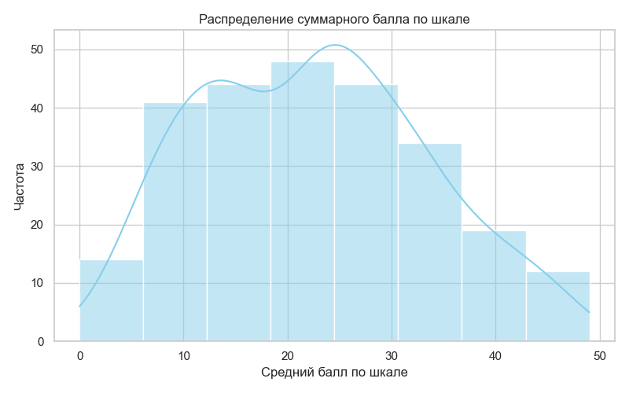

## 4.4. Пригодность для факторного анализа

- **KMO (мера выборочной адекватности):** 0.864
- **Тест сферичности Бартлетта:** χ² = 997.71, p = 0.0000

## 4.5. Эксплораторный факторный анализ (вращение oblimin)

**Объяснённая дисперсия (до вращения):**

| Фактор | Собственное значение | % дисперсии | Накопленный % |
| :--- | :---: | :---: | :---: |
| 1 | 4.894 | 34.95% | 34.95% |
| 2 | 1.238 | 8.84% | 43.80% |
| 3 | 1.179 | 8.42% | 52.22% |
| 4 | 0.962 | 6.87% | 59.09% |
| 5 | 0.849 | 6.06% | 65.15% |
| 6 | 0.758 | 5.41% | 70.57% |
| 7 | 0.704 | 5.03% | 75.60% |
| 8 | 0.671 | 4.80% | 80.39% |
| 9 | 0.622 | 4.44% | 84.83% |
| 10 | 0.595 | 4.25% | 89.08% |
| 11 | 0.519 | 3.70% | 92.79% |
| 12 | 0.480 | 3.43% | 96.22% |
| 13 | 0.284 | 2.03% | 98.24% |
| 14 | 0.246 | 1.76% | 100.00% |

**Факторов с собственным значением > 1:** 3

**Объяснённая дисперсия после вращения (суммы квадратов нагрузок):**

| Фактор | Дисперсия после вращения | % дисперсии | Накопленный % |
| :--- | :---: | :---: | :---: |
| 1 | 2.698 | 19.27% | 19.27% |
| 2 | 1.515 | 10.82% | 30.09% |
| 3 | 0.631 | 4.51% | 34.60% |

**Факторные нагрузки (после oblimin):**

| Практика | Фактор 1 | Фактор 2 | Фактор 3 |
| :--- | :---: | :---: | :---: |
| Выполнить "зеленую" задачу | 0.097 | 👉0.531 | 0.100 |
| Выполнить задачу из списка до контакта с внешним миром | -0.038 | 👉0.534 | -0.020 |
| Закрыть ненужные вкладки в браузере | 0.065 | -0.054 | 👉0.474 |
| Отделять задачи от проектов и идей | 0.302 | 0.099 | 0.307 |
| Порадовать свою обезьянку | -0.032 | 👉0.492 | 0.120 |
| Провести 15 минут наедине со своими мыслями | 0.102 | 👉0.570 | -0.094 |
| Провести N-минут в инкубаторе идей | 0.082 | 👉0.401 | 0.011 |
| Разгрузить свою память | 0.244 | 0.127 | 0.313 |
| Увидеть дно инбокса | -0.037 | 0.323 | 0.385 |
| Я подвожу итоги дня | 👉0.519 | 0.196 | -0.035 |
| Я подвожу итоги недели | 👉0.622 | 0.198 | -0.081 |
| Я смотрю / корректирую свой план на неделю | 👉0.803 | -0.073 | 0.106 |
| Я составляю план на день | 👉0.653 | 0.064 | 0.092 |
| Я составляю план на неделю | 👉0.887 | -0.030 | -0.062 |

**Корреляционная матрица факторов:**

| | Фактор 1 | Фактор 2 | Фактор 3 |
| :--- | :---: | :---: | :---: |
| Фактор 1 | 1.000 | 0.600 | 0.323 |
| Фактор 2 | 0.600 | 1.000 | 0.268 |
| Фактор 3 | 0.323 | 0.268 | 1.000 |

## 4.6. Анализ подшкал, соответствующих факторам

#### Подшкала фактора 1

Состав:
- Я подвожу итоги дня
- Я подвожу итоги недели
- Я смотрю / корректирую свой план на неделю
- Я составляю план на день
- Я составляю план на неделю

**Надёжность подшкалы:**

- **Альфа Кронбаха:** 0.860
- **Омега МакДональда:** 0.861
- **Корреляция с целевой шкалой (Spearman ρ):** -0.385, p = 0.0000

**Описательные статистики суммарного балла (среднее по пунктам):**

- Среднее: 8.513
- Стандартное отклонение: 5.461
- Минимум: 0.000
- Максимум: 20.000

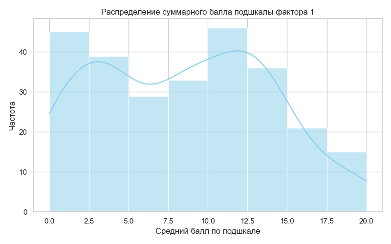

#### Подшкала фактора 2

Состав:
- Выполнить "зеленую" задачу
- Выполнить задачу из списка до контакта с внешним миром
- Порадовать свою обезьянку
- Провести 15 минут наедине со своими мыслями
- Провести N-минут в инкубаторе идей

**Надёжность подшкалы:**

- **Альфа Кронбаха:** 0.668
- **Омега МакДональда:** 0.673
- **Корреляция с целевой шкалой (Spearman ρ):** -0.424, p = 0.0000

**Описательные статистики суммарного балла (среднее по пунктам):**

- Среднее: 6.828
- Стандартное отклонение: 3.846
- Минимум: 0.000
- Максимум: 18.000

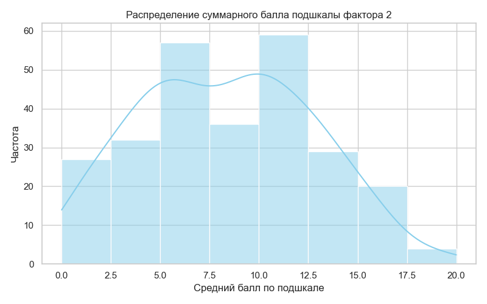

#### Подшкала фактора 3

Состав:
- Закрыть ненужные вкладки в браузере

**Надёжность подшкалы:**

*Подшкала состоит из одной практики – надёжность не вычисляется.*
- **Корреляция с целевой шкалой (Spearman ρ):** -0.266, p = 0.0000

**Описательные статистики суммарного балла (среднее по пунктам):**

- Среднее: 2.416
- Стандартное отклонение: 1.481
- Минимум: 0.000
- Максимум: 4.000

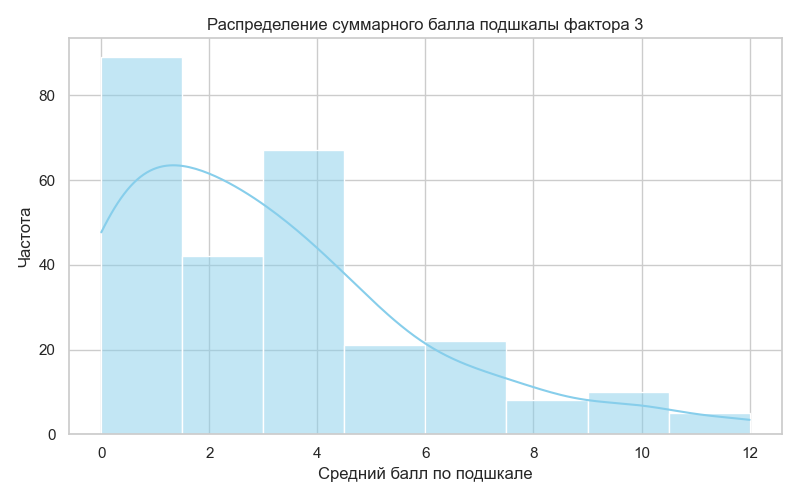

