# Отчет по исследованию джедайских приемов

# 1. Информация о выборке

Всего в опросе приняло участие **265** человек. После очистки данных для анализа психометрики шкал использовано **264** анкет.

## 1.1. Демографические характеристики

### 1.1.1. Распределение по возрасту
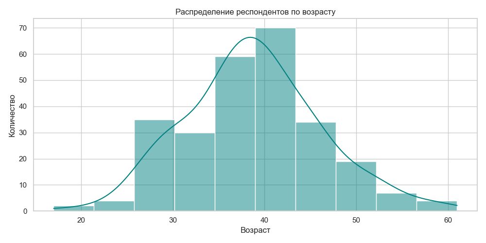

### 1.1.2. Распределение по полу
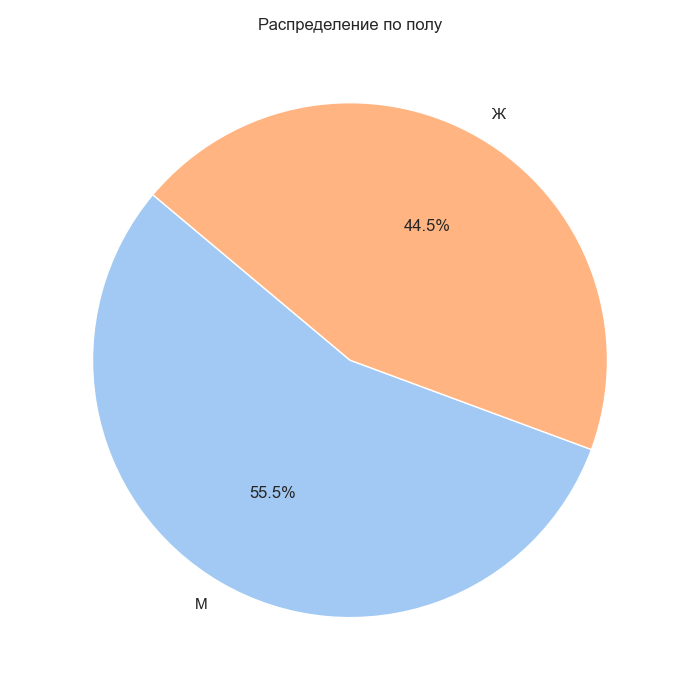

### 1.1.3. Однопунктовая 'Джедайская шкала'
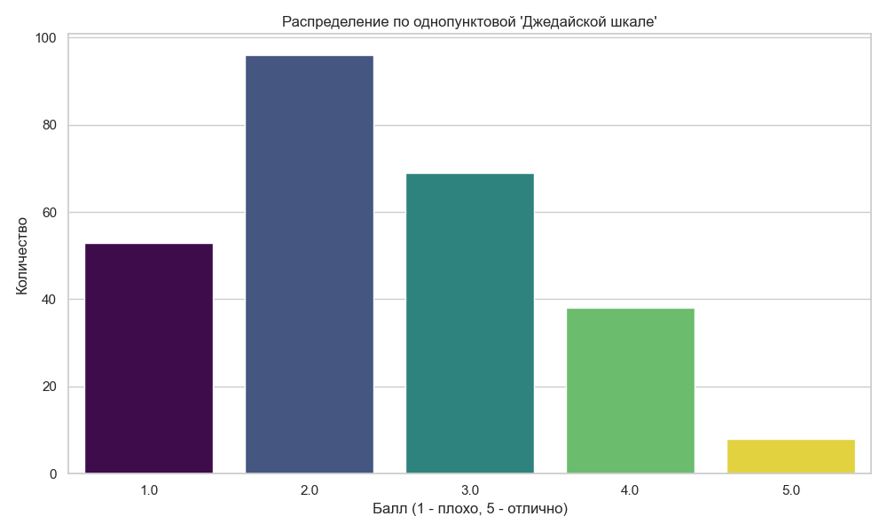

### 1.1.4. Хронотип
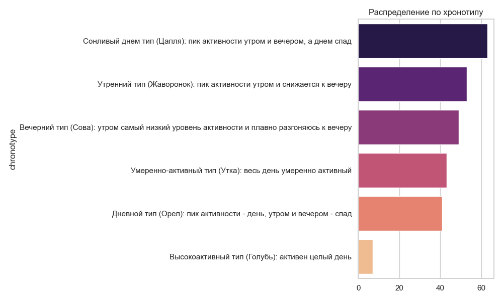

### 1.1.5. Режим работы
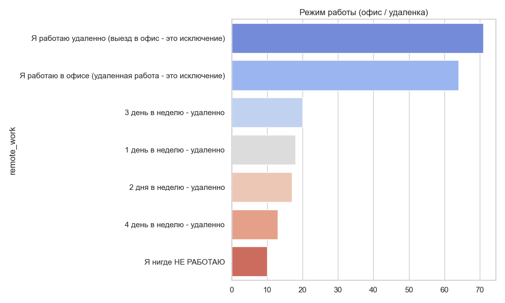

# 2. Анализ используемых шкал

## 2.1. Шкала: MIJS

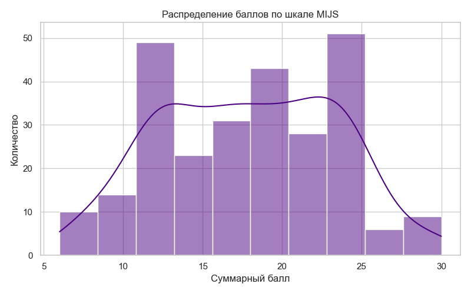

Состав пунктов:
- mijs_q1: Каждый день появляются незапланированные срочные задачи, которые я не могу отложить
- mijs_q2: Я не могу отвести время на важное, потому что оно полностью занято срочным
- mijs_q3: Я в большей степени тушу кризисы, чем их предотвращаю
- mijs_q4: Мне трудно видеть прогресс в важных проектах, потому что до них редко доходит очередь
- mijs_q5: К концу дня у меня почти нет энергии на важное
- mijs_q6: Я чувствую, что мои ресурсы (время и энергия) исчерпываются на срочное

### 2.1.1. Надежность (Reliability)

- **Альфа Кронбаха:** 0.847
- **Омега МакДональда:** 0.853

#### Коэффициенты при исключении пункта:

| Исключенный пункт | Альфа (if deleted) | Омега (if deleted) | Корреляция пункт-итог |
| :--- | :---: | :---: | :---: |
| mijs_q1 | 0.858 | 0.862 | 0.424 |
| mijs_q2 | 0.811 | 0.820 | 0.689 |
| mijs_q3 | 0.820 | 0.831 | 0.638 |
| mijs_q4 | 0.807 | 0.816 | 0.703 |
| mijs_q5 | 0.833 | 0.839 | 0.584 |
| mijs_q6 | 0.796 | 0.805 | 0.758 |

### 2.1.2. Эксплораторный факторный анализ (EFA)

- **Критерий KMO:** 0.858
- **Тест Бартлетта:** chi2=648.80, p=0.0000

#### Собственные значения факторов (Eigenvalues):
3.457, 0.883, 0.522, 0.482, 0.340, 0.316

#### Факторные нагрузки (1 фактор):

| Пункт | Нагрузка |
| :--- | :---: |
| mijs_q1 | -0.466 |
| mijs_q2 | -0.754 |
| mijs_q3 | -0.693 |
| mijs_q4 | -0.781 |
| mijs_q5 | -0.645 |
| mijs_q6 | -0.841 |

- **Объясненная дисперсия (1 фактор):** 49.99%
- **Собственное число основного фактора:** 3.000

### 2.1.3. Резюме по применимости

| Параметр | Значение | Комментарий |
| :--- | :---: | :--- |
| Alpha | 0.847 | ОК |
| KMO | 0.858 | ОК |
| Variance | 50.0% | Хорошо |
| **ИТОГ** | **Применима** | |

---

## 2.2. Шкала: MIJS-2

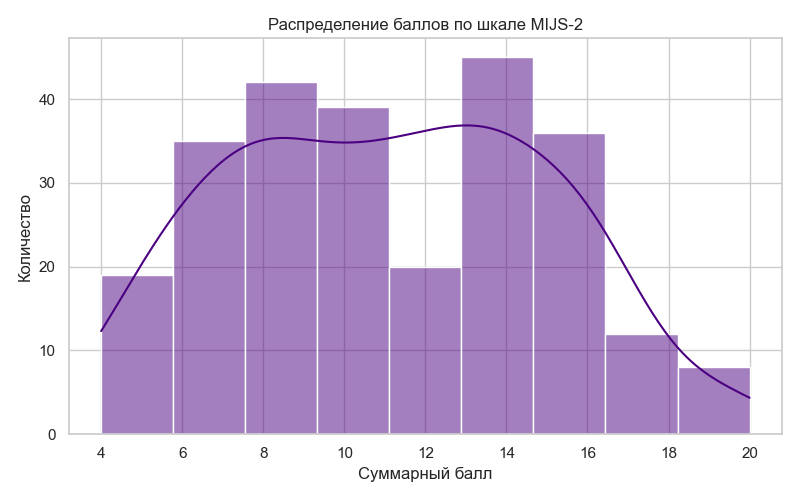

Состав пунктов:
- mijs_q2: Я не могу отвести время на важное, потому что оно полностью занято срочным
- mijs_q3: Я в большей степени тушу кризисы, чем их предотвращаю
- mijs_q4: Мне трудно видеть прогресс в важных проектах, потому что до них редко доходит очередь
- mijs_q6: Я чувствую, что мои ресурсы (время и энергия) исчерпываются на срочное

### 2.2.1. Надежность (Reliability)

- **Альфа Кронбаха:** 0.847
- **Омега МакДональда:** 0.849

#### Коэффициенты при исключении пункта:

| Исключенный пункт | Альфа (if deleted) | Омега (if deleted) | Корреляция пункт-итог |
| :--- | :---: | :---: | :---: |
| mijs_q2 | 0.807 | 0.811 | 0.682 |
| mijs_q3 | 0.831 | 0.833 | 0.623 |
| mijs_q4 | 0.799 | 0.801 | 0.701 |
| mijs_q6 | 0.783 | 0.785 | 0.736 |

### 2.2.2. Эксплораторный факторный анализ (EFA)

- **Критерий KMO:** 0.813
- **Тест Бартлетта:** chi2=431.19, p=0.0000

#### Собственные значения факторов (Eigenvalues):
2.745, 0.501, 0.430, 0.324

#### Факторные нагрузки (1 фактор):

| Пункт | Нагрузка |
| :--- | :---: |
| mijs_q2 | -0.756 |
| mijs_q3 | -0.683 |
| mijs_q4 | -0.782 |
| mijs_q6 | -0.829 |

- **Объясненная дисперсия (1 фактор):** 58.45%
- **Собственное число основного фактора:** 2.338

### 2.2.3. Резюме по применимости

| Параметр | Значение | Комментарий |
| :--- | :---: | :--- |
| Alpha | 0.847 | ОК |
| KMO | 0.813 | ОК |
| Variance | 58.5% | Хорошо |
| **ИТОГ** | **Применима** | |

---

## 2.3. Шкала: MIJS-2+

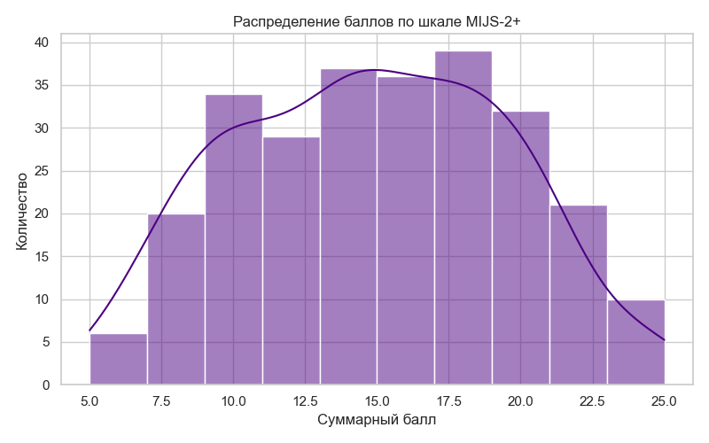

Состав пунктов:
- mijs_q2: Я не могу отвести время на важное, потому что оно полностью занято срочным
- mijs_q3: Я в большей степени тушу кризисы, чем их предотвращаю
- mijs_q4: Мне трудно видеть прогресс в важных проектах, потому что до них редко доходит очередь
- mijs_q6: Я чувствую, что мои ресурсы (время и энергия) исчерпываются на срочное
- jedi_inv: Инвертированная Джедайская шкала

### 2.3.1. Надежность (Reliability)

- **Альфа Кронбаха:** 0.868
- **Омега МакДональда:** 0.870

#### Коэффициенты при исключении пункта:

| Исключенный пункт | Альфа (if deleted) | Омега (if deleted) | Корреляция пункт-итог |
| :--- | :---: | :---: | :---: |
| mijs_q2 | 0.838 | 0.841 | 0.703 |
| mijs_q3 | 0.860 | 0.862 | 0.610 |
| mijs_q4 | 0.834 | 0.837 | 0.718 |
| mijs_q6 | 0.820 | 0.822 | 0.769 |
| jedi_inv | 0.847 | 0.849 | 0.666 |

### 2.3.2. Эксплораторный факторный анализ (EFA)

- **Критерий KMO:** 0.865
- **Тест Бартлетта:** chi2=598.65, p=0.0000

#### Собственные значения факторов (Eigenvalues):
3.282, 0.588, 0.431, 0.387, 0.312

#### Факторные нагрузки (1 фактор):

| Пункт | Нагрузка |
| :--- | :---: |
| mijs_q2 | -0.763 |
| mijs_q3 | -0.655 |
| mijs_q4 | -0.782 |
| mijs_q6 | -0.848 |
| jedi_inv | -0.725 |

- **Объясненная дисперсия (1 фактор):** 57.36%
- **Собственное число основного фактора:** 2.868

### 2.3.3. Резюме по применимости

| Параметр | Значение | Комментарий |
| :--- | :---: | :--- |
| Alpha | 0.868 | ОК |
| KMO | 0.865 | ОК |
| Variance | 57.4% | Хорошо |
| **ИТОГ** | **Применима** | |

---

## 2.4. Шкала: MIJS-3+

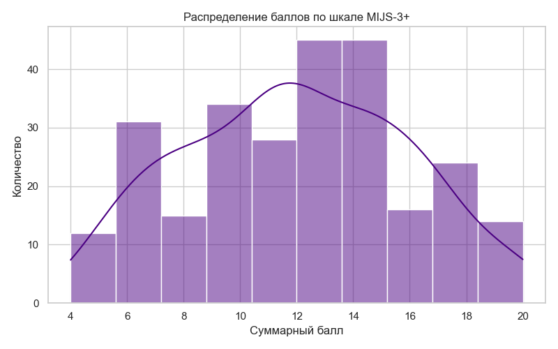

Состав пунктов:
- mijs_q2: Я не могу отвести время на важное, потому что оно полностью занято срочным
- mijs_q4: Мне трудно видеть прогресс в важных проектах, потому что до них редко доходит очередь
- mijs_q6: Я чувствую, что мои ресурсы (время и энергия) исчерпываются на срочное
- jedi_inv: Инвертированная Джедайская шкала

### 2.4.1. Надежность (Reliability)

- **Альфа Кронбаха:** 0.860
- **Омега МакДональда:** 0.862

#### Коэффициенты при исключении пункта:

| Исключенный пункт | Альфа (if deleted) | Омега (if deleted) | Корреляция пункт-итог |
| :--- | :---: | :---: | :---: |
| mijs_q2 | 0.831 | 0.835 | 0.681 |
| mijs_q4 | 0.825 | 0.827 | 0.702 |
| mijs_q6 | 0.796 | 0.799 | 0.763 |
| jedi_inv | 0.831 | 0.833 | 0.685 |

### 2.4.2. Эксплораторный факторный анализ (EFA)

- **Критерий KMO:** 0.824
- **Тест Бартлетта:** chi2=470.73, p=0.0000

#### Собственные значения факторов (Eigenvalues):
2.824, 0.432, 0.431, 0.313

#### Факторные нагрузки (1 фактор):

| Пункт | Нагрузка |
| :--- | :---: |
| mijs_q2 | -0.745 |
| mijs_q4 | -0.770 |
| mijs_q6 | -0.853 |
| jedi_inv | -0.751 |

- **Объясненная дисперсия (1 фактор):** 61.00%
- **Собственное число основного фактора:** 2.440

### 2.4.3. Резюме по применимости

| Параметр | Значение | Комментарий |
| :--- | :---: | :--- |
| Alpha | 0.860 | ОК |
| KMO | 0.824 | ОК |
| Variance | 61.0% | Хорошо |
| **ИТОГ** | **Применима** | |

---

## 2.5. Шкала: single_item

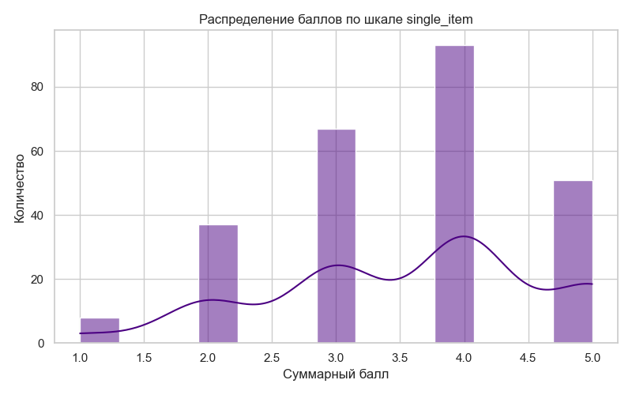

Состав пунктов:
- jedi_inv: Инвертированная Джедайская шкала

## 2.6. Итого по шкалам

| Шкала | Alpha | Omega | % Variance | KMO | Bartlett χ² | Bartlett p |
| :--- | :---: | :---: | :---: | :---: | :---: | :---: |
| MIJS | 0.847 | 0.853 | 50.0% | 0.858 | 648.80 | 0.0000 |
| MIJS-2 | 0.847 | 0.849 | 58.5% | 0.813 | 431.19 | 0.0000 |
| **MIJS-2+** | **0.868** | **0.870** | **57.4%** | **0.865** | **598.65** | **0.0000** |
| MIJS-3+ | 0.860 | 0.862 | 61.0% | 0.824 | 470.73 | 0.0000 |

==Дальнейший анализ основан на шкале  **MIJS-2+**==.
# 3. Выбираем лучшие приемы и практики

## 3.1. Корреляционный анализ (ранговая корреляция)

В данном разделе представлена связь различных практик с целевой шкалой **MIJS-2+**. Для анализа используется коэффициент ранговой корреляции Спирмена (ρ).

| № | Прием | ρ (Rho) | p-value | p (adj) | Знач. |
| :--- | :--- | :---: | :---: | :---: | :---: |
| 1 | Отделять задачи от проектов и идей | -0.367 | 0.0000 | 0.0000 | **** |
| 2 | Разгрузить свою память | -0.344 | 0.0000 | 0.0000 | **** |
| 3 | Я составляю план на неделю | -0.339 | 0.0000 | 0.0000 | **** |
| 4 | Увидеть дно инбокса | -0.326 | 0.0000 | 0.0000 | **** |
| 5 | Я составляю план на день | -0.314 | 0.0000 | 0.0000 | **** |
| 6 | Я подвожу итоги недели | -0.311 | 0.0000 | 0.0000 | **** |
| 7 | Выполнить "зеленую" задачу | -0.306 | 0.0000 | 0.0000 | **** |
| 8 | Я подвожу итоги дня | -0.305 | 0.0000 | 0.0000 | **** |
| 9 | Провести 15 минут наедине со своими мыслями | -0.300 | 0.0000 | 0.0000 | **** |
| 10 | Формулировать задачи "как для обезьянки" | -0.285 | 0.0000 | 0.0000 | **** |
| 11 | Я смотрю / корректирую свой план на неделю | -0.279 | 0.0000 | 0.0000 | **** |
| 12 | Поковырять задачи в "Позже" | -0.272 | 0.0000 | 0.0000 | **** |
| 13 | Соотнести список своих задач со списком своих целей / хотелок | -0.253 | 0.0000 | 0.0001 | *** |
| 14 | Посмотреть в свой список задач просто с целью выкинуть оттуда что-то ненужное | -0.249 | 0.0000 | 0.0001 | *** |
| 15 | Выполнить "зеленую" задачу ДО проверки чатов / почты / новостей и прочего интернета | -0.248 | 0.0000 | 0.0001 | *** |
| 16 | Порадовать свою обезьянку | -0.248 | 0.0000 | 0.0001 | *** |
| 17 | Провести N-минут в инкубаторе идей | -0.229 | 0.0002 | 0.0004 | *** |
| 18 | Делать задачи ТОЛЬКО записанные в список (записываем, перед тем, как сделать) | -0.226 | 0.0002 | 0.0005 | *** |
| 19 | Две минуты ничего не делать | -0.217 | 0.0004 | 0.0009 | *** |
| 20 | Выполнить задачу из списка до контакта с внешним миром | -0.193 | 0.0016 | 0.0035 | ** |
| 21 | Выполнить хотя бы одну задачу из списка до проверки почты / чатов / новостей | -0.362 | 0.0135 | 0.0269 | * |
| 22 | Интернет-шаббат: провести день, не прикасаясь к устройствам, способным соединяться с интернетом | -0.152 | 0.0134 | 0.0269 | * |
| 23 | Закрыть ненужные вкладки в браузере | -0.119 | 0.0541 | 0.1035 |  |
| 24 | Настроить автоматическое отмечание входящих писем в электронной почте прочитанными | -0.116 | 0.0598 | 0.1091 |  |
| 25 | Отключить красные кружочки на иконках приложений в смартфоне | -0.115 | 0.0620 | 0.1091 |  |
| 26 | На сколько удачливым человеком вы себя считаете? | -0.110 | 0.0751 | 0.1271 |  |
| 27 | Сходить на тренировку и позаниматься спортом | -0.104 | 0.0916 | 0.1493 |  |
| 28 | Установить автоматический (по расписанию) режим "не беспокоить" на смартфоне (минимум на 8 часов в день) | -0.099 | 0.1068 | 0.1678 |  |
| 29 | В среднем, сколько дней в неделю вы работаете в офисе, а сколько удаленно? | -0.106 | 0.1256 | 0.1905 |  |
| 30 | Отключить push-оповещения от приложений в смартфоне (соцсети, магазины, заправки) | -0.092 | 0.1352 | 0.1983 |  |
| 31 | Провести утро без смартфона | -0.078 | 0.2048 | 0.2832 |  |
| 32 | Отключать средства коммуникации на время сосредоточенной работы (блоки тишины) | -0.078 | 0.2065 | 0.2832 |  |
| 33 | Установить плагины и настройки против рекламных баннеров | -0.077 | 0.2124 | 0.2832 |  |
| 34 | Провести день стесняясь смартфона | 0.057 | 0.3551 | 0.4530 |  |
| 35 | Лежа в постели не пользоваться устройствами с экранами | 0.057 | 0.3603 | 0.4530 |  |
| 36 | Отключить оповещения на смарт-часах | -0.031 | 0.6113 | 0.7312 |  |
| 37 | Отключить оповещения о новых сообщениях в чатах | -0.030 | 0.6298 | 0.7312 |  |
| 38 | Установить фильтр синего (ночной режим или режим чтения) на экранах | -0.030 | 0.6315 | 0.7312 |  |
| 39 | Вести лог дня (дневник) | 0.027 | 0.6607 | 0.7387 |  |
| 40 | Провести ревизию спального места на предмет светового шума | -0.026 | 0.6716 | 0.7387 |  |
| 41 | Во время работы прятать смартфон от самого себя (не держать его на виду) | -0.016 | 0.7953 | 0.8479 |  |
| 42 | Пользоваться смартфоном в туалете | -0.015 | 0.8093 | 0.8479 |  |
| 43 | Отключить оповещения о новых сообщениях в электронной почте | -0.004 | 0.9488 | 0.9709 |  |
| 44 | Удалить приложения социальных сетей со своего смартфона | 0.002 | 0.9778 | 0.9778 |  |

*Примечание: Значимость (*) указана на основе скорректированного p-value (FDR). p < 0.05, ** p < 0.01, *** p < 0.001. Отрицательная корреляция означает, что использование приема связано с более низким баллом по шкале MIJS-2+ (меньше стресса/завала).* 

## 3.2. Сравнение средних (ANOVA)

В данном разделе анализируется, как частота использования или уровень внедрения приема связаны со средним значением продуктивности. Для проверки значимости различий между группами используется однофакторный дисперсионный анализ (One-way ANOVA).

### 3.2.1. Частота использования приемов

Респонденты разделены на группы по частоте использования (0 — никогда, 4 — всегда).

| № | Прием | Ср. (0) | Ср. (1) | Ср. (2) | Ср. (3) | Ср. (4) | F | p-value | p (adj) | Знач. |
| :--- | :--- | :---: | :---: | :---: | :---: | :---: | :---: | :---: | :---: | :---: |
| 1 | Отделять задачи от проектов и идей | 16.8 | 16.0 | 14.4 | 13.0 | 11.9 | 10.86 | 0.0000 | 0.0000 | **** |
| 2 | Разгрузить свою память | 16.4 | 16.8 | 14.9 | 14.5 | 12.1 | 9.39 | 0.0000 | 0.0000 | **** |
| 3 | Я составляю план на неделю | 16.4 | 16.4 | 14.9 | 13.1 | 12.4 | 8.96 | 0.0000 | 0.0000 | **** |
| 4 | Увидеть дно инбокса | 16.6 | 16.3 | 13.9 | 13.2 | 12.9 | 8.87 | 0.0000 | 0.0000 | **** |
| 5 | Выполнить "зеленую" задачу | 16.2 | 15.5 | 14.7 | 12.3 | 10.9 | 8.50 | 0.0000 | 0.0000 | **** |
| 6 | Я смотрю / корректирую свой план на неделю | 15.9 | 16.2 | 14.2 | 14.4 | 10.9 | 7.74 | 0.0000 | 0.0000 | **** |
| 7 | Я составляю план на день | 16.4 | 16.5 | 15.6 | 13.9 | 12.5 | 7.46 | 0.0000 | 0.0000 | **** |
| 8 | Я подвожу итоги недели | 16.1 | 14.9 | 14.2 | 12.4 | 12.2 | 7.19 | 0.0000 | 0.0001 | **** |
| 9 | Выполнить "зеленую" задачу ДО проверки чатов / почты / новостей и прочего интернета | 15.5 | 14.9 | 11.3 | 11.7 | - | 8.62 | 0.0000 | 0.0001 | **** |
| 10 | Я подвожу итоги дня | 16.2 | 15.4 | 14.3 | 12.6 | 12.3 | 7.08 | 0.0000 | 0.0001 | **** |
| 11 | Формулировать задачи "как для обезьянки" | 16.1 | 16.4 | 15.2 | 14.5 | 12.4 | 6.52 | 0.0001 | 0.0001 | *** |
| 12 | Провести 15 минут наедине со своими мыслями | 16.5 | 16.0 | 14.2 | 13.3 | 12.7 | 6.51 | 0.0001 | 0.0001 | *** |
| 13 | Соотнести список своих задач со списком своих целей / хотелок | 15.7 | 15.1 | 12.4 | 11.8 | - | 7.05 | 0.0001 | 0.0003 | *** |
| 14 | Поковырять задачи в "Позже" | 16.5 | 14.6 | 13.3 | 12.8 | - | 6.46 | 0.0003 | 0.0007 | *** |
| 15 | Выполнить задачу из списка до контакта с внешним миром | 15.4 | 15.7 | 13.9 | 11.5 | 12.8 | 5.09 | 0.0006 | 0.0012 | ** |
| 16 | Порадовать свою обезьянку | 15.9 | 15.7 | 15.1 | 13.3 | 12.2 | 4.77 | 0.0010 | 0.0019 | ** |
| 17 | Посмотреть в свой список задач просто с целью выкинуть оттуда что-то ненужное | 16.4 | 15.1 | 13.9 | 12.5 | 14.4 | 4.65 | 0.0012 | 0.0022 | ** |
| 18 | Провести N-минут в инкубаторе идей | 15.7 | 13.9 | 13.1 | - | - | 6.06 | 0.0027 | 0.0046 | ** |
| 19 | Делать задачи ТОЛЬКО записанные в список (записываем, перед тем, как сделать) | 16.4 | 14.9 | 15.1 | 13.4 | 13.4 | 4.11 | 0.0030 | 0.0049 | ** |
| 20 | Две минуты ничего не делать | 15.6 | 15.9 | 14.2 | 14.0 | 12.6 | 3.76 | 0.0054 | 0.0084 | ** |
| 21 | Лежа в постели не пользоваться устройствами с экранами | 14.5 | 14.6 | 13.6 | 16.8 | 14.5 | 2.50 | 0.0432 | 0.0637 |  |
| 22 | Провести утро без смартфона | 15.0 | 15.9 | 13.0 | 14.8 | 14.1 | 2.33 | 0.0566 | 0.0797 |  |
| 23 | Выполнить хотя бы одну задачу из списка до проверки почты / чатов / новостей | 17.7 | 14.6 | - | - | - | 3.35 | 0.0773 | 0.1042 |  |
| 24 | Отключать средства коммуникации на время сосредоточенной работы (блоки тишины) | 14.7 | 16.1 | 15.2 | 13.8 | 13.5 | 2.02 | 0.0920 | 0.1188 |  |
| 25 | Пользоваться смартфоном в туалете | 15.4 | 15.1 | 13.1 | 13.9 | 15.0 | 1.56 | 0.1845 | 0.2288 |  |
| 26 | Сходить на тренировку и позаниматься спортом | 16.0 | 14.2 | 14.8 | 14.6 | 13.4 | 1.49 | 0.2052 | 0.2356 |  |
| 27 | Интернет-шаббат: провести день, не прикасаясь к устройствам, способным соединяться с интернетом | 15.1 | 14.0 | - | - | - | 1.65 | 0.1998 | 0.2356 |  |
| 28 | Провести день стесняясь смартфона | 14.6 | 16.2 | 14.2 | - | - | 1.41 | 0.2454 | 0.2717 |  |
| 29 | Закрыть ненужные вкладки в браузере | 15.8 | 14.8 | 15.3 | 14.6 | 14.1 | 1.15 | 0.3351 | 0.3462 |  |
| 30 | Вести лог дня (дневник) | 14.5 | 15.2 | 15.7 | 16.1 | 13.5 | 1.16 | 0.3300 | 0.3462 |  |
| 31 | Во время работы прятать смартфон от самого себя (не держать его на виду) | 14.7 | 15.7 | 14.6 | 13.8 | 15.0 | 0.75 | 0.5615 | 0.5615 |  |

*Примечание: Значимость (*) указана на основе скорректированного p-value (FDR). 0 — никогда/редко, 4 — всегда. В ячейках указан средний балл по шкале MIJS-2+. Чем ниже балл, тем выше продуктивность.* 

### 3.2.2. Уровень внедрения приемов

Респонденты разделены на группы по уровню внедрения (0 — не применил(а), 3 — применил(а) по максимуму).

| № | Прием | Ср. (0) | Ср. (1) | Ср. (2) | Ср. (3) | F | p-value | p (adj) | Знач. |
| :--- | :--- | :---: | :---: | :---: | :---: | :---: | :---: | :---: | :---: |
| 1 | Отключить push-оповещения от приложений в смартфоне (соцсети, магазины, заправки) | - | 14.8 | 15.8 | 13.8 | 4.31 | 0.0144 | 0.1589 |  |
| 2 | Удалить приложения социальных сетей со своего смартфона | 14.3 | 16.0 | 14.8 | 13.5 | 2.86 | 0.0372 | 0.1998 |  |
| 3 | Отключить красные кружочки на иконках приложений в смартфоне | 15.1 | 16.2 | 13.9 | 14.1 | 2.57 | 0.0545 | 0.1998 |  |
| 4 | Настроить автоматическое отмечание входящих писем в электронной почте прочитанными | 15.0 | 14.2 | 15.4 | 13.2 | 1.77 | 0.1528 | 0.4201 |  |
| 5 | Провести ревизию спального места на предмет светового шума | 13.8 | 15.1 | 15.1 | 14.3 | 0.90 | 0.4439 | 0.5911 |  |
| 6 | Установить автоматический (по расписанию) режим "не беспокоить" на смартфоне (минимум на 8 часов в день) | 15.0 | 15.5 | 15.5 | 14.2 | 1.31 | 0.2713 | 0.5911 |  |
| 7 | Установить плагины и настройки против рекламных баннеров | 14.9 | 15.2 | 14.8 | 14.1 | 0.74 | 0.5303 | 0.5911 |  |
| 8 | Отключить оповещения о новых сообщениях в чатах | 13.8 | 15.3 | 14.2 | 14.9 | 0.96 | 0.4124 | 0.5911 |  |
| 9 | Отключить оповещения о новых сообщениях в электронной почте | 14.0 | 15.3 | 15.5 | 14.6 | 0.91 | 0.4360 | 0.5911 |  |
| 10 | Отключить оповещения на смарт-часах | 14.5 | 14.7 | 15.7 | 14.5 | 0.73 | 0.5374 | 0.5911 |  |
| 11 | Установить фильтр синего (ночной режим или режим чтения) на экранах | 14.7 | 15.4 | 14.3 | 14.6 | 0.48 | 0.6992 | 0.6992 |  |

*Примечание: Значимость (*) указана на основе скорректированного p-value (FDR). 0 — не применил(а), 3 — по максимуму. В ячейках указан средний балл по шкале MIJS-2+.*

## 3.3. Сравнение трёх групп продуктивности (Kruskal-Wallis)

Респонденты разделены на три группы по терцилям (20-й и 80-й перцентили) суммарного балла продуктивности. Низкая группа – наиболее продуктивные (низкие баллы MIJS-2+), высокая группа – наименее продуктивные (высокие баллы MIJS-2+). Для каждой практики проверяется гипотеза о различиях распределений частоты использования между тремя группами с помощью критерия Краскела-Уоллиса. В случае значимых различий (p < 0.05 после FDR‑коррекции) выполняются попарные пост‑хок тесты Данна.

- **Группа Продуктивные:** 45 респондентов
- **Группа Средняки:** 156 респондентов
- **Группа Непродуктивные:** 63 респондентов

| № | Практика | Ср. Продуктивные | Ср. Средняки | Ср. Непродуктивные | H-статистика | p (исх.) | p (скорр.) | Значима |
| :--- | :--- | :---: | :---: | :---: | :---: | :---: | :---: | :---: |
| 1 | Разгрузить свою память | 3.13 | 2.27 | 1.78 | 30.84 | 0.0000 | 0.0000 | ✅ |
| 2 | Отделять задачи от проектов и идей | 2.69 | 1.75 | 1.11 | 31.72 | 0.0000 | 0.0000 | ✅ |
| 3 | Увидеть дно инбокса | 2.73 | 2.03 | 1.11 | 29.09 | 0.0000 | 0.0000 | ✅ |
| 4 | Я подвожу итоги недели | 2.02 | 1.27 | 0.73 | 22.90 | 0.0000 | 0.0001 | ✅ |
| 5 | Выполнить "зеленую" задачу | 2.16 | 1.37 | 0.95 | 22.27 | 0.0000 | 0.0001 | ✅ |
| 6 | Я составляю план на неделю | 2.62 | 1.85 | 1.30 | 21.07 | 0.0000 | 0.0002 | ✅ |
| 7 | Я составляю план на день | 2.78 | 2.35 | 1.71 | 19.09 | 0.0001 | 0.0004 | ✅ |
| 8 | Провести 15 минут наедине со своими мыслями | 2.36 | 1.89 | 1.27 | 19.27 | 0.0001 | 0.0004 | ✅ |
| 9 | Я подвожу итоги дня | 2.04 | 1.47 | 0.97 | 17.29 | 0.0002 | 0.0008 | ✅ |
| 10 | Формулировать задачи "как для обезьянки" | 2.76 | 2.22 | 1.70 | 15.95 | 0.0003 | 0.0012 | ✅ |
| 11 | Я смотрю / корректирую свой план на неделю | 2.22 | 1.62 | 1.14 | 15.84 | 0.0004 | 0.0012 | ✅ |
| 12 | Выполнить "зеленую" задачу ДО проверки чатов / почты / новостей и прочего интернета | 1.20 | 0.62 | 0.40 | 15.77 | 0.0004 | 0.0012 | ✅ |
| 13 | Провести N-минут в инкубаторе идей | 0.98 | 0.65 | 0.38 | 15.96 | 0.0003 | 0.0012 | ✅ |
| 14 | Поковырять задачи в "Позже" | 1.36 | 1.17 | 0.70 | 15.62 | 0.0004 | 0.0012 | ✅ |
| 15 | Посмотреть в свой список задач просто с целью выкинуть оттуда что-то ненужное | 1.73 | 1.54 | 1.00 | 15.47 | 0.0004 | 0.0012 | ✅ |
| 16 | Интернет-шаббат: провести день, не прикасаясь к устройствам, способным соединяться с интернетом | 0.53 | 0.21 | 0.13 | 11.69 | 0.0029 | 0.0076 | ✅ |
| 17 | Выполнить задачу из списка до контакта с внешним миром | 1.64 | 1.03 | 0.75 | 11.54 | 0.0031 | 0.0077 | ✅ |
| 18 | Делать задачи ТОЛЬКО записанные в список (записываем, перед тем, как сделать) | 2.40 | 1.83 | 1.56 | 10.93 | 0.0042 | 0.0093 | ✅ |
| 19 | Порадовать свою обезьянку | 2.18 | 1.87 | 1.44 | 11.03 | 0.0040 | 0.0093 | ✅ |
| 20 | Две минуты ничего не делать | 2.16 | 1.59 | 1.27 | 10.59 | 0.0050 | 0.0105 | ✅ |
| 21 | Соотнести список своих задач со списком своих целей / хотелок | 1.20 | 0.88 | 0.57 | 9.38 | 0.0092 | 0.0184 | ✅ |
| 22 | Выполнить хотя бы одну задачу из списка до проверки почты / чатов / новостей | 1.88 | 1.41 | 0.56 | 9.05 | 0.0108 | 0.0206 | ✅ |
| 23 | Сходить на тренировку и позаниматься спортом | 2.36 | 1.90 | 2.02 | 4.92 | 0.0853 | 0.1493 |  |
| 24 | Настроить автоматическое отмечание входящих писем в электронной почте прочитанными | 0.98 | 0.57 | 0.46 | 4.93 | 0.0850 | 0.1493 |  |
| 25 | Установить плагины и настройки против рекламных баннеров | 1.76 | 1.35 | 1.41 | 3.89 | 0.1429 | 0.2401 |  |
| 26 | Установить автоматический (по расписанию) режим "не беспокоить" на смартфоне (минимум на 8 часов в день) | 2.11 | 1.92 | 1.68 | 3.81 | 0.1489 | 0.2405 |  |
| 27 | Во время работы прятать смартфон от самого себя (не держать его на виду) | 1.49 | 1.09 | 1.29 | 3.44 | 0.1792 | 0.2787 |  |
| 28 | Отключить оповещения на смарт-часах | 2.22 | 2.36 | 2.14 | 2.79 | 0.2480 | 0.3721 |  |
| 29 | Закрыть ненужные вкладки в браузере | 2.62 | 2.47 | 2.17 | 2.64 | 0.2665 | 0.3859 |  |
| 30 | Отключать средства коммуникации на время сосредоточенной работы (блоки тишины) | 1.76 | 1.44 | 1.29 | 2.49 | 0.2883 | 0.4036 |  |
| 31 | Установить фильтр синего (ночной режим или режим чтения) на экранах | 1.89 | 1.58 | 1.70 | 2.26 | 0.3227 | 0.4152 |  |
| 32 | Провести ревизию спального места на предмет светового шума | 2.09 | 1.93 | 1.84 | 2.27 | 0.3222 | 0.4152 |  |
| 33 | Отключить push-оповещения от приложений в смартфоне (соцсети, магазины, заправки) | 2.20 | 1.99 | 2.00 | 2.24 | 0.3262 | 0.4152 |  |
| 34 | Отключить красные кружочки на иконках приложений в смартфоне | 1.60 | 1.44 | 1.25 | 2.04 | 0.3608 | 0.4457 |  |
| 35 | Отключить оповещения о новых сообщениях в чатах | 1.76 | 1.85 | 1.70 | 1.65 | 0.4384 | 0.5261 |  |
| 36 | Провести утро без смартфона | 1.51 | 1.47 | 1.19 | 1.39 | 0.4992 | 0.5823 |  |
| 37 | Отключить оповещения о новых сообщениях в электронной почте | 2.11 | 2.01 | 2.21 | 1.30 | 0.5232 | 0.5939 |  |
| 38 | Пользоваться смартфоном в туалете | 2.71 | 2.49 | 2.30 | 0.72 | 0.6990 | 0.7726 |  |
| 39 | Лежа в постели не пользоваться устройствами с экранами | 1.78 | 1.71 | 1.83 | 0.31 | 0.8547 | 0.9068 |  |
| 40 | Провести день стесняясь смартфона | 0.31 | 0.37 | 0.30 | 0.29 | 0.8636 | 0.9068 |  |
| 41 | Вести лог дня (дневник) | 0.82 | 0.93 | 0.81 | 0.16 | 0.9221 | 0.9221 |  |
| 42 | Удалить приложения социальных сетей со своего смартфона | 1.16 | 1.01 | 0.98 | 0.21 | 0.9006 | 0.9221 |  |

**Значимых различий после коррекции (padj < 0.01): 19**

#### Разгрузить свою память

**Попарные сравнения (p-скорр.):**

|                |   Непродуктивные |   Средняки |   Продуктивные |
|:---------------|-----------------:|-----------:|---------------:|
| Непродуктивные |           1.0000 |     0.0117 |         0.0000 |
| Средняки       |           0.0117 |     1.0000 |         0.0001 |
| Продуктивные   |           0.0000 |     0.0001 |         1.0000 |

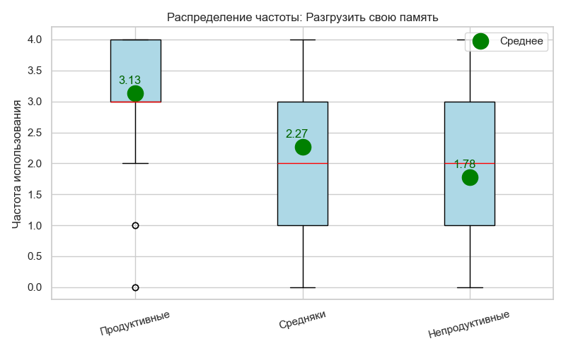

#### Отделять задачи от проектов и идей

**Попарные сравнения (p-скорр.):**

|                |   Непродуктивные |   Средняки |   Продуктивные |
|:---------------|-----------------:|-----------:|---------------:|
| Непродуктивные |           1.0000 |     0.0019 |         0.0000 |
| Средняки       |           0.0019 |     1.0000 |         0.0003 |
| Продуктивные   |           0.0000 |     0.0003 |         1.0000 |

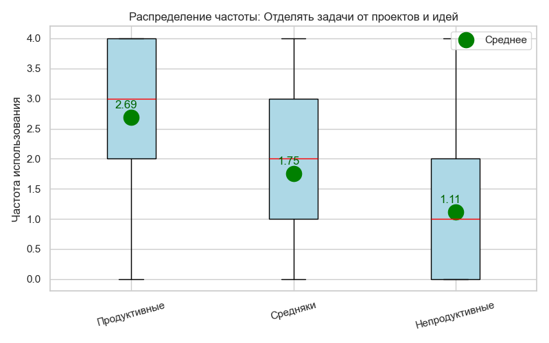

#### Увидеть дно инбокса

**Попарные сравнения (p-скорр.):**

|                |   Непродуктивные |   Средняки |   Продуктивные |
|:---------------|-----------------:|-----------:|---------------:|
| Непродуктивные |           1.0000 |     0.0001 |         0.0000 |
| Средняки       |           0.0001 |     1.0000 |         0.0088 |
| Продуктивные   |           0.0000 |     0.0088 |         1.0000 |

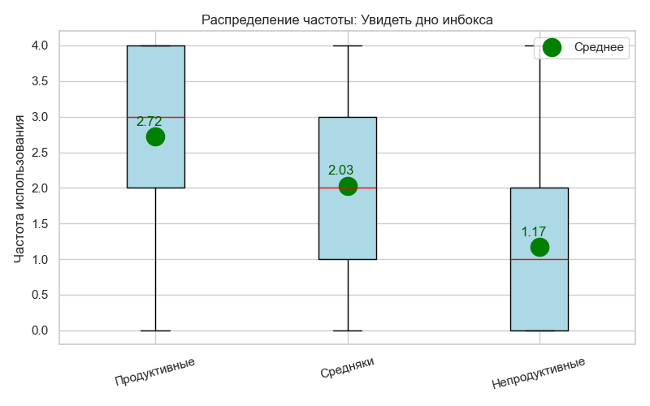

#### Я подвожу итоги недели

**Попарные сравнения (p-скорр.):**

|                |   Непродуктивные |   Средняки |   Продуктивные |
|:---------------|-----------------:|-----------:|---------------:|
| Непродуктивные |           1.0000 |     0.0095 |         0.0000 |
| Средняки       |           0.0095 |     1.0000 |         0.0018 |
| Продуктивные   |           0.0000 |     0.0018 |         1.0000 |

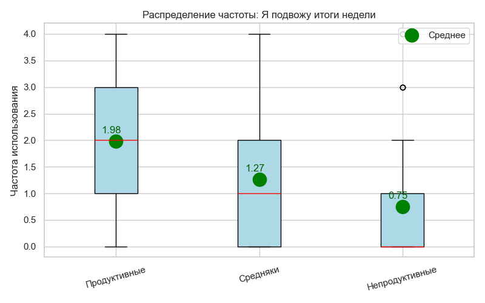

#### Выполнить "зеленую" задачу

**Попарные сравнения (p-скорр.):**

|                |   Непродуктивные |   Средняки |   Продуктивные |
|:---------------|-----------------:|-----------:|---------------:|
| Непродуктивные |           1.0000 |     0.0264 |         0.0000 |
| Средняки       |           0.0264 |     1.0000 |         0.0008 |
| Продуктивные   |           0.0000 |     0.0008 |         1.0000 |

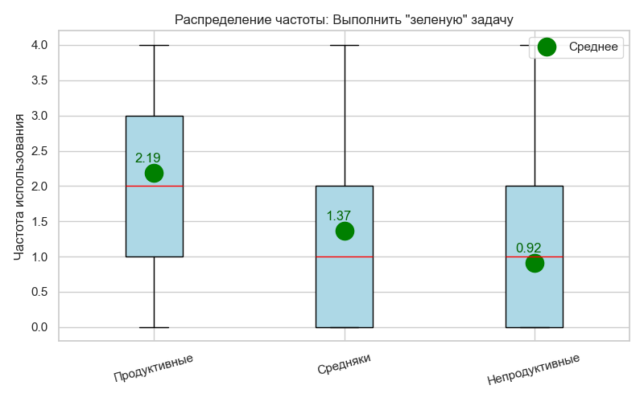

#### Я составляю план на неделю

**Попарные сравнения (p-скорр.):**

|                |   Непродуктивные |   Средняки |   Продуктивные |
|:---------------|-----------------:|-----------:|---------------:|
| Непродуктивные |           1.0000 |     0.0130 |         0.0000 |
| Средняки       |           0.0130 |     1.0000 |         0.0029 |
| Продуктивные   |           0.0000 |     0.0029 |         1.0000 |

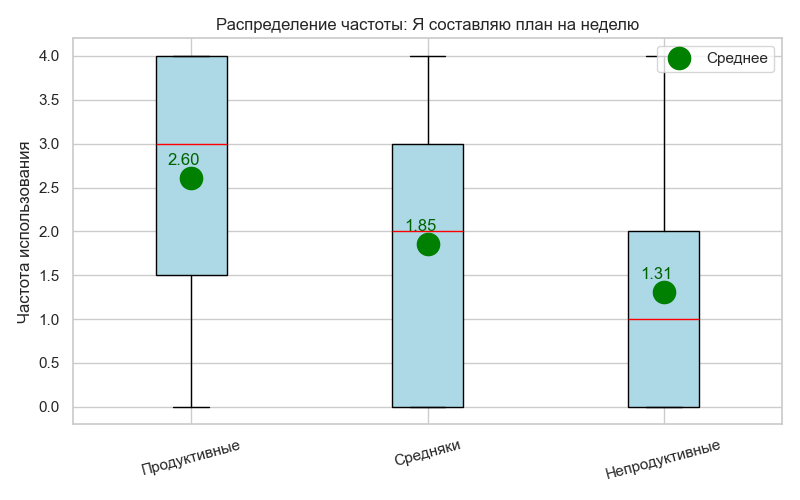

#### Я составляю план на день

**Попарные сравнения (p-скорр.):**

|                |   Непродуктивные |   Средняки |   Продуктивные |
|:---------------|-----------------:|-----------:|---------------:|
| Непродуктивные |           1.0000 |     0.0019 |         0.0001 |
| Средняки       |           0.0019 |     1.0000 |         0.0414 |
| Продуктивные   |           0.0001 |     0.0414 |         1.0000 |

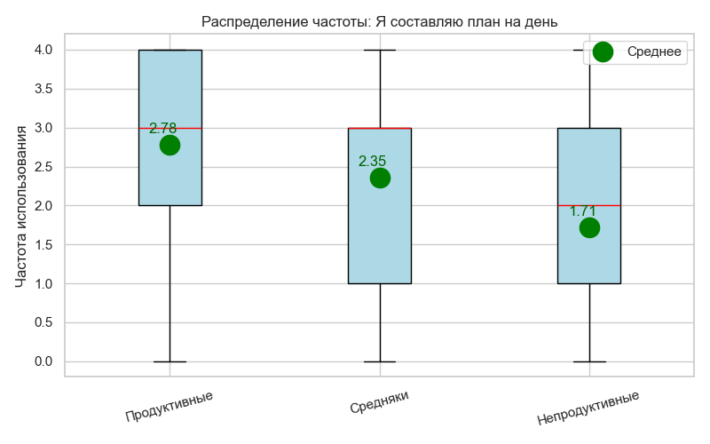

#### Провести 15 минут наедине со своими мыслями

**Попарные сравнения (p-скорр.):**

|                |   Непродуктивные |   Средняки |   Продуктивные |
|:---------------|-----------------:|-----------:|---------------:|
| Непродуктивные |           1.0000 |     0.0024 |         0.0001 |
| Средняки       |           0.0024 |     1.0000 |         0.0314 |
| Продуктивные   |           0.0001 |     0.0314 |         1.0000 |

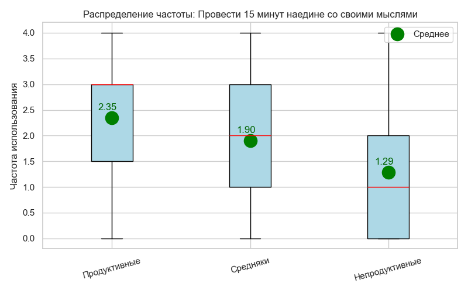

#### Я подвожу итоги дня

**Попарные сравнения (p-скорр.):**

|                |   Непродуктивные |   Средняки |   Продуктивные |
|:---------------|-----------------:|-----------:|---------------:|
| Непродуктивные |           1.0000 |     0.0143 |         0.0001 |
| Средняки       |           0.0143 |     1.0000 |         0.0129 |
| Продуктивные   |           0.0001 |     0.0129 |         1.0000 |

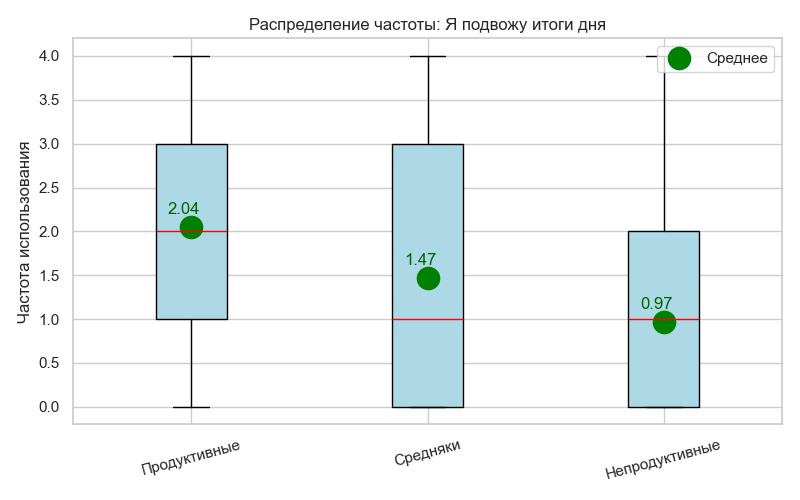

#### Формулировать задачи "как для обезьянки"

**Попарные сравнения (p-скорр.):**

|                |   Непродуктивные |   Средняки |   Продуктивные |
|:---------------|-----------------:|-----------:|---------------:|
| Непродуктивные |           1.0000 |     0.0156 |         0.0002 |
| Средняки       |           0.0156 |     1.0000 |         0.0156 |
| Продуктивные   |           0.0002 |     0.0156 |         1.0000 |

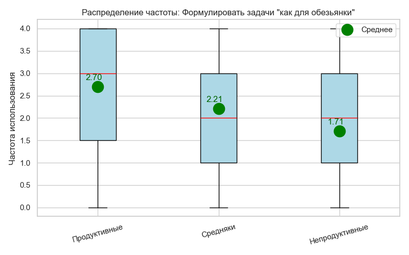

#### Я смотрю / корректирую свой план на неделю

**Попарные сравнения (p-скорр.):**

|                |   Непродуктивные |   Средняки |   Продуктивные |
|:---------------|-----------------:|-----------:|---------------:|
| Непродуктивные |           1.0000 |     0.0168 |         0.0002 |
| Средняки       |           0.0168 |     1.0000 |         0.0168 |
| Продуктивные   |           0.0002 |     0.0168 |         1.0000 |

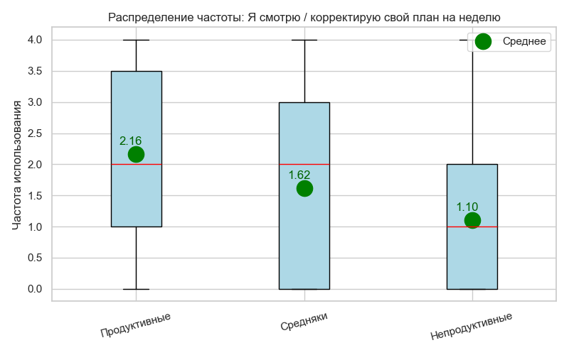

#### Выполнить "зеленую" задачу ДО проверки чатов / почты / новостей и прочего интернета

**Попарные сравнения (p-скорр.):**

|                |   Непродуктивные |   Средняки |   Продуктивные |
|:---------------|-----------------:|-----------:|---------------:|
| Непродуктивные |           1.0000 |     0.1307 |         0.0003 |
| Средняки       |           0.1307 |     1.0000 |         0.0023 |
| Продуктивные   |           0.0003 |     0.0023 |         1.0000 |

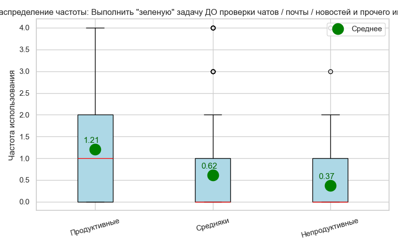

#### Провести N-минут в инкубаторе идей

**Попарные сравнения (p-скорр.):**

|                |   Непродуктивные |   Средняки |   Продуктивные |
|:---------------|-----------------:|-----------:|---------------:|
| Непродуктивные |           1.0000 |     0.0170 |         0.0002 |
| Средняки       |           0.0170 |     1.0000 |         0.0190 |
| Продуктивные   |           0.0002 |     0.0190 |         1.0000 |

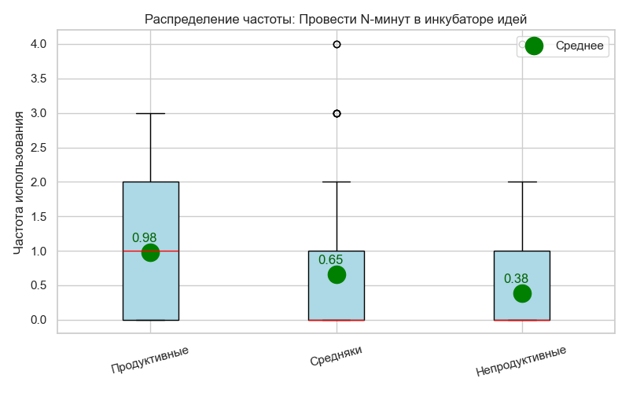

#### Поковырять задачи в "Позже"

**Попарные сравнения (p-скорр.):**

|                |   Непродуктивные |   Средняки |   Продуктивные |
|:---------------|-----------------:|-----------:|---------------:|
| Непродуктивные |           1.0000 |     0.0014 |         0.0009 |
| Средняки       |           0.0014 |     1.0000 |         0.2152 |
| Продуктивные   |           0.0009 |     0.2152 |         1.0000 |

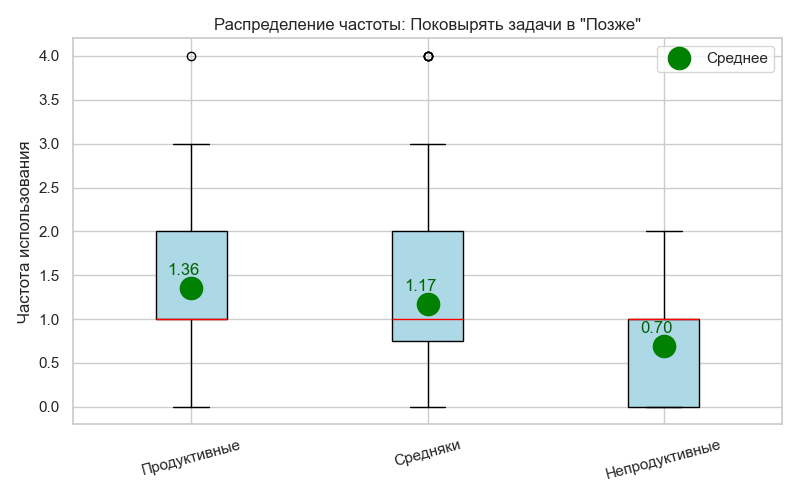

#### Посмотреть в свой список задач просто с целью выкинуть оттуда что-то ненужное

**Попарные сравнения (p-скорр.):**

|                |   Непродуктивные |   Средняки |   Продуктивные |
|:---------------|-----------------:|-----------:|---------------:|
| Непродуктивные |           1.0000 |     0.0012 |         0.0012 |
| Средняки       |           0.0012 |     1.0000 |         0.2577 |
| Продуктивные   |           0.0012 |     0.2577 |         1.0000 |

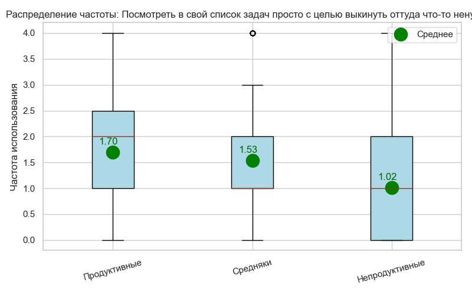

#### Интернет-шаббат: провести день, не прикасаясь к устройствам, способным соединяться с интернетом

**Попарные сравнения (p-скорр.):**

|                |   Непродуктивные |   Средняки |   Продуктивные |
|:---------------|-----------------:|-----------:|---------------:|
| Непродуктивные |           1.0000 |     0.2947 |         0.0029 |
| Средняки       |           0.2947 |     1.0000 |         0.0059 |
| Продуктивные   |           0.0029 |     0.0059 |         1.0000 |

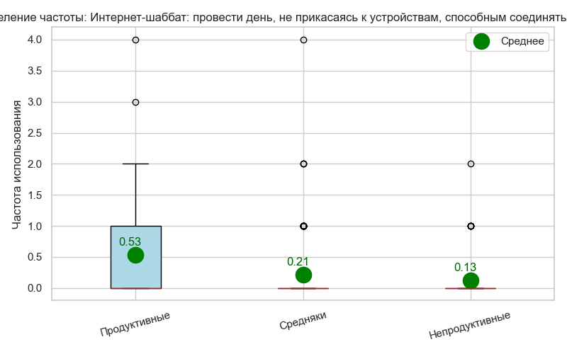

#### Выполнить задачу из списка до контакта с внешним миром

**Попарные сравнения (p-скорр.):**

|                |   Непродуктивные |   Средняки |   Продуктивные |
|:---------------|-----------------:|-----------:|---------------:|
| Непродуктивные |           1.0000 |     0.0663 |         0.0020 |
| Средняки       |           0.0663 |     1.0000 |         0.0323 |
| Продуктивные   |           0.0020 |     0.0323 |         1.0000 |

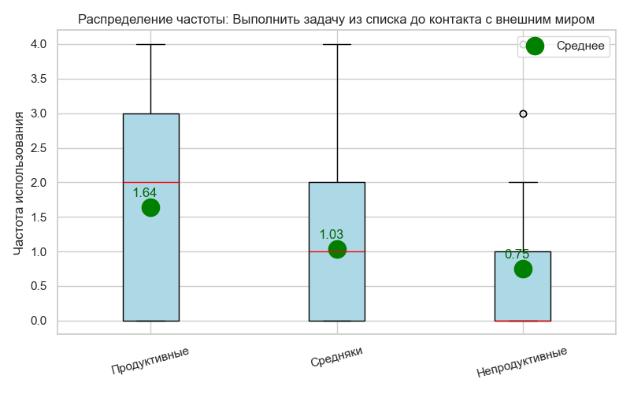

#### Делать задачи ТОЛЬКО записанные в список (записываем, перед тем, как сделать)

**Попарные сравнения (p-скорр.):**

|                |   Непродуктивные |   Средняки |   Продуктивные |
|:---------------|-----------------:|-----------:|---------------:|
| Непродуктивные |           1.0000 |     0.1477 |         0.0031 |
| Средняки       |           0.1477 |     1.0000 |         0.0182 |
| Продуктивные   |           0.0031 |     0.0182 |         1.0000 |

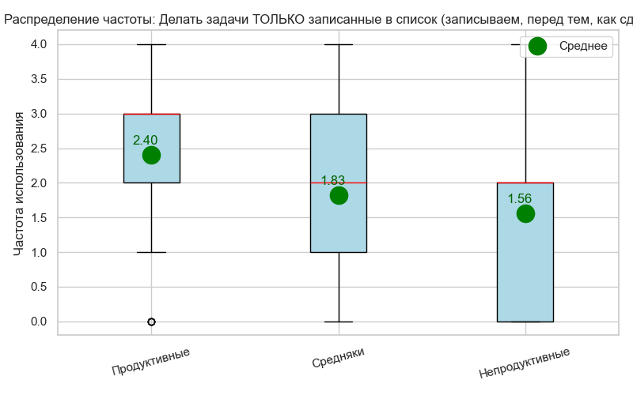

#### Порадовать свою обезьянку

**Попарные сравнения (p-скорр.):**

|                |   Непродуктивные |   Средняки |   Продуктивные |
|:---------------|-----------------:|-----------:|---------------:|
| Непродуктивные |           1.0000 |     0.0219 |         0.0039 |
| Средняки       |           0.0219 |     1.0000 |         0.1198 |
| Продуктивные   |           0.0039 |     0.1198 |         1.0000 |

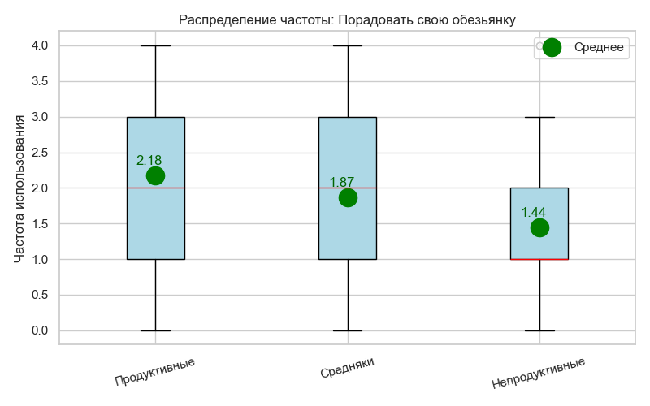

## 3.4. Сводная таблица лучших практик

В этой таблице представлены практики, которые показали значимое различие (p < 0.01 после FDR-коррекции) по каждому из использованных методов анализа. ✅ означает, что практика проходит порог значимости по версии данного метода.

| № | Практика | Корреляция (Spearman) | ANOVA (частота) | Kruskal-Wallis | Сумма |
| :---: | :--- | :---: | :---: | :---: | :---: |
| 1 | Выполнить "зеленую" задачу | ✅ | ✅ | ✅ | 3 |
| 2 | Выполнить "зеленую" задачу ДО проверки чатов / почты / новостей и прочего интернета | ✅ | ✅ | ✅ | 3 |
| 3 | Выполнить задачу из списка до контакта с внешним миром | ✅ | ✅ | ✅ | 3 |
| 4 | Делать задачи ТОЛЬКО записанные в список (записываем, перед тем, как сделать) | ✅ | ✅ | ✅ | 3 |
| 5 | Отделять задачи от проектов и идей | ✅ | ✅ | ✅ | 3 |
| 6 | Поковырять задачи в "Позже" | ✅ | ✅ | ✅ | 3 |
| 7 | Порадовать свою обезьянку | ✅ | ✅ | ✅ | 3 |
| 8 | Посмотреть в свой список задач просто с целью выкинуть оттуда что-то ненужное | ✅ | ✅ | ✅ | 3 |
| 9 | Провести 15 минут наедине со своими мыслями | ✅ | ✅ | ✅ | 3 |
| 10 | Провести N-минут в инкубаторе идей | ✅ | ✅ | ✅ | 3 |
| 11 | Разгрузить свою память | ✅ | ✅ | ✅ | 3 |
| 12 | Увидеть дно инбокса | ✅ | ✅ | ✅ | 3 |
| 13 | Формулировать задачи "как для обезьянки" | ✅ | ✅ | ✅ | 3 |
| 14 | Я подвожу итоги дня | ✅ | ✅ | ✅ | 3 |
| 15 | Я подвожу итоги недели | ✅ | ✅ | ✅ | 3 |
| 16 | Я смотрю / корректирую свой план на неделю | ✅ | ✅ | ✅ | 3 |
| 17 | Я составляю план на день | ✅ | ✅ | ✅ | 3 |
| 18 | Я составляю план на неделю | ✅ | ✅ | ✅ | 3 |
| 19 | Две минуты ничего не делать | ✅ | ✅ |  | 2 |
| 20 | Соотнести список своих задач со списком своих целей / хотелок | ✅ | ✅ |  | 2 |
| 21 | Интернет-шаббат: провести день, не прикасаясь к устройствам, способным соединяться с интернетом |  |  | ✅ | 1 |
| 22 | Вести лог дня (дневник) |  |  |  | 0 |
| 23 | Во время работы прятать смартфон от самого себя (не держать его на виду) |  |  |  | 0 |
| 24 | Выполнить хотя бы одну задачу из списка до проверки почты / чатов / новостей |  |  |  | 0 |
| 25 | Закрыть ненужные вкладки в браузере |  |  |  | 0 |
| 26 | Лежа в постели не пользоваться устройствами с экранами |  |  |  | 0 |
| 27 | Настроить автоматическое отмечание входящих писем в электронной почте прочитанными |  |  |  | 0 |
| 28 | Отключать средства коммуникации на время сосредоточенной работы (блоки тишины) |  |  |  | 0 |
| 29 | Отключить push-оповещения от приложений в смартфоне (соцсети, магазины, заправки) |  |  |  | 0 |
| 30 | Отключить красные кружочки на иконках приложений в смартфоне |  |  |  | 0 |
| 31 | Отключить оповещения на смарт-часах |  |  |  | 0 |
| 32 | Отключить оповещения о новых сообщениях в чатах |  |  |  | 0 |
| 33 | Отключить оповещения о новых сообщениях в электронной почте |  |  |  | 0 |
| 34 | Пользоваться смартфоном в туалете |  |  |  | 0 |
| 35 | Провести день стесняясь смартфона |  |  |  | 0 |
| 36 | Провести ревизию спального места на предмет светового шума |  |  |  | 0 |
| 37 | Провести утро без смартфона |  |  |  | 0 |
| 38 | Сходить на тренировку и позаниматься спортом |  |  |  | 0 |
| 39 | Удалить приложения социальных сетей со своего смартфона |  |  |  | 0 |
| 40 | Установить автоматический (по расписанию) режим "не беспокоить" на смартфоне (минимум на 8 часов в день) |  |  |  | 0 |
| 41 | Установить плагины и настройки против рекламных баннеров |  |  |  | 0 |
| 42 | Установить фильтр синего (ночной режим или режим чтения) на экранах |  |  |  | 0 |

# 4. Анализ шкалы из практик, получивших наибольший консенсус

В этом разделе мы отбираем практики, которые показали значимое различие (p < 0.01) хотя бы в трёх из четырёх использованных методов (корреляционный анализ, ANOVA для частоты, критерий Краскела‑Уоллиса). Из этих практик формируется новая шкала, и проводится её детальный психометрический анализ.

**Отобрано практик:** 20

Состав шкалы:
1. Выполнить "зеленую" задачу
2. Выполнить "зеленую" задачу ДО проверки чатов / почты / новостей и прочего интернета
3. Выполнить задачу из списка до контакта с внешним миром
4. Две минуты ничего не делать
5. Делать задачи ТОЛЬКО записанные в список (записываем, перед тем, как сделать)
6. Отделять задачи от проектов и идей
7. Поковырять задачи в "Позже"
8. Порадовать свою обезьянку
9. Посмотреть в свой список задач просто с целью выкинуть оттуда что-то ненужное
10. Провести 15 минут наедине со своими мыслями
11. Провести N-минут в инкубаторе идей
12. Разгрузить свою память
13. Соотнести список своих задач со списком своих целей / хотелок
14. Увидеть дно инбокса
15. Формулировать задачи "как для обезьянки"
16. Я подвожу итоги дня
17. Я подвожу итоги недели
18. Я смотрю / корректирую свой план на неделю
19. Я составляю план на день
20. Я составляю план на неделю

**Число респондентов для анализа:** 264

## 4.1. Надёжность общей шкалы

- **Альфа Кронбаха:** 0.888
- **Омега МакДональда:** 0.891

#### Коэффициенты при исключении пункта:

| Исключенный пункт | Альфа (if deleted) | Омега (if deleted) |
| :--- | :---: | :---: |
| Выполнить "зеленую" задачу | 0.881 | 0.884 |
| Выполнить "зеленую" задачу ДО проверки чатов / почты / новостей и прочего интернета | 0.885 | 0.888 |
| Выполнить задачу из списка до контакта с внешним миром | 0.885 | 0.888 |
| Две минуты ничего не делать | 0.887 | 0.889 |
| Делать задачи ТОЛЬКО записанные в список (записываем, перед тем, как сделать) | 0.884 | 0.887 |
| Отделять задачи от проектов и идей | 0.881 | 0.885 |
| Поковырять задачи в "Позже" | 0.883 | 0.886 |
| Порадовать свою обезьянку | 0.886 | 0.889 |
| Посмотреть в свой список задач просто с целью выкинуть оттуда что-то ненужное | 0.883 | 0.886 |
| Провести 15 минут наедине со своими мыслями | 0.883 | 0.887 |
| Провести N-минут в инкубаторе идей | 0.885 | 0.888 |
| Разгрузить свою память | 0.884 | 0.888 |
| Соотнести список своих задач со списком своих целей / хотелок | 0.883 | 0.886 |
| Увидеть дно инбокса | 0.888 | 0.889 |
| Формулировать задачи "как для обезьянки" | 0.884 | 0.887 |
| Я подвожу итоги дня | 0.881 | 0.884 |
| Я подвожу итоги недели | 0.879 | 0.882 |
| Я смотрю / корректирую свой план на неделю | 0.878 | 0.882 |
| Я составляю план на день | 0.879 | 0.883 |
| Я составляю план на неделю | 0.878 | 0.881 |

## 4.2. Валидность по отношению к целевой шкале

- **Корреляция с MIJS-2+ (Пирсон r):** -0.498, p = 0.0000
- **Корреляция с MIJS-2+ (Спирмен ρ):** -0.491, p = 0.0000

## 4.3. Описательные характеристики

**Описательные статистики суммарного балла (среднее по пунктам):**

- Среднее: 30.913
- Стандартное отклонение: 14.306
- Минимум: 1.000
- Максимум: 66.000

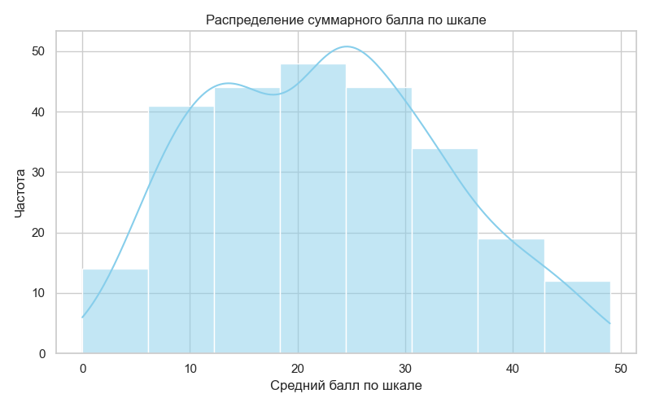

## 4.4. Пригодность для факторного анализа

- **KMO (мера выборочной адекватности):** 0.864
- **Тест сферичности Бартлетта:** χ² = 1886.23, p = 0.0000

## 4.5. Эксплораторный факторный анализ (вращение oblimin)

**Объяснённая дисперсия (до вращения):**

| Фактор | Собственное значение | % дисперсии | Накопленный % |
| :--- | :---: | :---: | :---: |
| 1 | 6.599 | 32.99% | 32.99% |
| 2 | 1.663 | 8.32% | 41.31% |
| 3 | 1.386 | 6.93% | 48.24% |
| 4 | 1.119 | 5.59% | 53.83% |
| 5 | 0.964 | 4.82% | 58.66% |
| 6 | 0.884 | 4.42% | 63.07% |
| 7 | 0.840 | 4.20% | 67.27% |
| 8 | 0.789 | 3.95% | 71.22% |
| 9 | 0.739 | 3.70% | 74.91% |
| 10 | 0.721 | 3.60% | 78.52% |
| 11 | 0.608 | 3.04% | 81.56% |
| 12 | 0.588 | 2.94% | 84.50% |
| 13 | 0.536 | 2.68% | 87.18% |
| 14 | 0.522 | 2.61% | 89.79% |
| 15 | 0.451 | 2.26% | 92.04% |
| 16 | 0.432 | 2.16% | 94.21% |
| 17 | 0.397 | 1.99% | 96.19% |
| 18 | 0.315 | 1.57% | 97.77% |
| 19 | 0.234 | 1.17% | 98.94% |
| 20 | 0.213 | 1.06% | 100.00% |

**Факторов с собственным значением > 1:** 4

**Объяснённая дисперсия после вращения (суммы квадратов нагрузок):**

| Фактор | Дисперсия после вращения | % дисперсии | Накопленный % |
| :--- | :---: | :---: | :---: |
| 1 | 2.754 | 13.77% | 13.77% |
| 2 | 2.038 | 10.19% | 23.96% |
| 3 | 1.507 | 7.54% | 31.50% |
| 4 | 1.296 | 6.48% | 37.97% |

**Факторные нагрузки (после oblimin):**

| Практика | Фактор 1 | Фактор 2 | Фактор 3 | Фактор 4 |
| :--- | :---: | :---: | :---: | :---: |
| Выполнить "зеленую" задачу | 0.040 | 0.225 | 👉0.413 | 0.221 |
| Выполнить "зеленую" задачу ДО проверки чатов / почты / новостей и прочего интернета | 0.005 | -0.023 | 👉0.956 | -0.044 |
| Выполнить задачу из списка до контакта с внешним миром | 0.025 | 0.041 | 👉0.558 | 0.116 |
| Две минуты ничего не делать | 0.054 | 0.056 | -0.002 | 👉0.504 |
| Делать задачи ТОЛЬКО записанные в список (записываем, перед тем, как сделать) | 0.256 | 👉0.523 | 0.018 | -0.211 |
| Отделять задачи от проектов и идей | -0.014 | 👉0.744 | 0.043 | -0.031 |
| Поковырять задачи в "Позже" | 0.109 | 👉0.515 | -0.019 | 0.053 |
| Порадовать свою обезьянку | 0.124 | 0.017 | 0.088 | 0.362 |
| Посмотреть в свой список задач просто с целью выкинуть оттуда что-то ненужное | 0.054 | 👉0.424 | -0.007 | 0.210 |
| Провести 15 минут наедине со своими мыслями | 0.103 | -0.020 | 0.020 | 👉0.697 |
| Провести N-минут в инкубаторе идей | -0.006 | 0.275 | 0.165 | 0.240 |
| Разгрузить свою память | 0.187 | 0.327 | -0.058 | 0.125 |
| Соотнести список своих задач со списком своих целей / хотелок | -0.022 | 0.316 | 0.251 | 0.248 |
| Увидеть дно инбокса | -0.007 | 0.306 | -0.047 | 0.299 |
| Формулировать задачи "как для обезьянки" | -0.002 | 👉0.557 | 0.007 | 0.079 |
| Я подвожу итоги дня | 👉0.631 | -0.067 | 0.009 | 0.148 |
| Я подвожу итоги недели | 👉0.678 | -0.033 | 0.052 | 0.114 |
| Я смотрю / корректирую свой план на неделю | 👉0.752 | 0.082 | -0.008 | -0.028 |
| Я составляю план на день | 👉0.668 | 0.103 | -0.039 | 0.014 |
| Я составляю план на неделю | 👉0.859 | -0.025 | 0.025 | -0.043 |

**Корреляционная матрица факторов:**

| | Фактор 1 | Фактор 2 | Фактор 3 | Фактор 4 |
| :--- | :---: | :---: | :---: | :---: |
| Фактор 1 | 1.000 | 0.322 | 0.618 | 0.446 |
| Фактор 2 | 0.322 | 1.000 | 0.370 | 0.339 |
| Фактор 3 | 0.618 | 0.370 | 1.000 | 0.282 |
| Фактор 4 | 0.446 | 0.339 | 0.282 | 1.000 |

## 4.6. Анализ подшкал, соответствующих факторам

#### Подшкала фактора 1

Состав:
- Я подвожу итоги дня
- Я подвожу итоги недели
- Я смотрю / корректирую свой план на неделю
- Я составляю план на день
- Я составляю план на неделю

**Надёжность подшкалы:**

- **Альфа Кронбаха:** 0.862
- **Омега МакДональда:** 0.863
- **Корреляция с целевой шкалой (Spearman ρ):** -0.378, p = 0.0000

**Описательные статистики суммарного балла (среднее по пунктам):**

- Среднее: 8.451
- Стандартное отклонение: 5.469
- Минимум: 0.000
- Максимум: 20.000

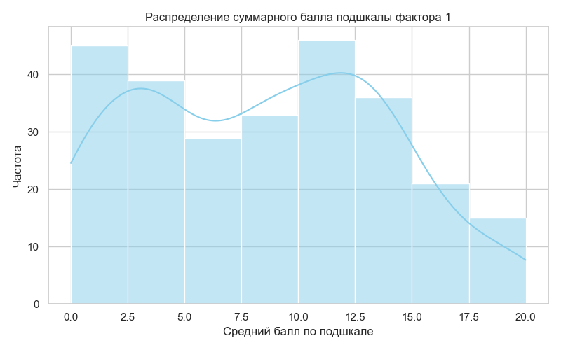

#### Подшкала фактора 2

Состав:
- Делать задачи ТОЛЬКО записанные в список (записываем, перед тем, как сделать)
- Отделять задачи от проектов и идей
- Поковырять задачи в "Позже"
- Посмотреть в свой список задач просто с целью выкинуть оттуда что-то ненужное
- Формулировать задачи "как для обезьянки"

**Надёжность подшкалы:**

- **Альфа Кронбаха:** 0.749
- **Омега МакДональда:** 0.755
- **Корреляция с целевой шкалой (Spearman ρ):** -0.393, p = 0.0000

**Описательные статистики суммарного балла (среднее по пунктам):**

- Среднее: 8.337
- Стандартное отклонение: 4.444
- Минимум: 0.000
- Максимум: 20.000

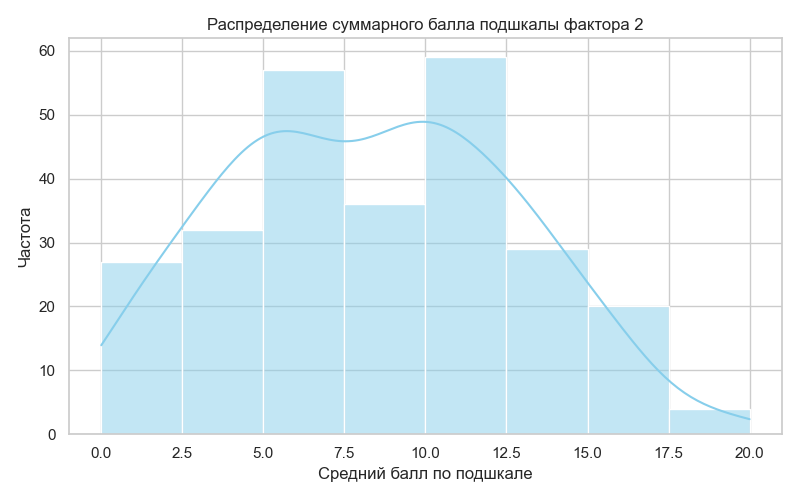

#### Подшкала фактора 3

Состав:
- Выполнить "зеленую" задачу
- Выполнить "зеленую" задачу ДО проверки чатов / почты / новостей и прочего интернета
- Выполнить задачу из списка до контакта с внешним миром

**Надёжность подшкалы:**

- **Альфа Кронбаха:** 0.731
- **Омега МакДональда:** 0.773
- **Корреляция с целевой шкалой (Spearman ρ):** -0.318, p = 0.0000

**Описательные статистики суммарного балла (среднее по пунктам):**

- Среднее: 3.133
- Стандартное отклонение: 2.781
- Минимум: 0.000
- Максимум: 12.000

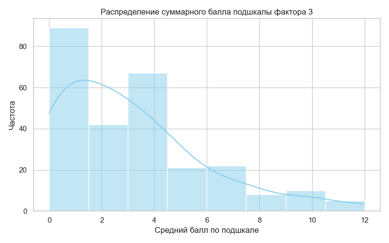

#### Подшкала фактора 4

Состав:
- Две минуты ничего не делать
- Провести 15 минут наедине со своими мыслями

**Надёжность подшкалы:**

- **Альфа Кронбаха:** 0.646
- **Омега МакДональда:** 0.646
- **Корреляция с целевой шкалой (Spearman ρ):** -0.301, p = 0.0000

**Описательные статистики суммарного балла (среднее по пунктам):**

- Среднее: 3.432
- Стандартное отклонение: 2.321
- Минимум: 0.000
- Максимум: 8.000

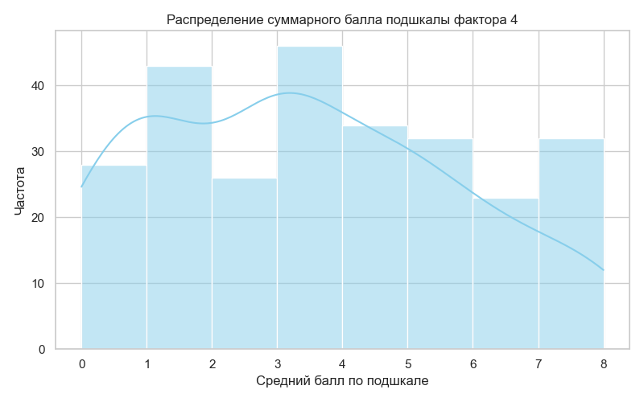

# 5. Гендерные различия в использовании практик и продуктивности

В данном разделе анализируется, есть ли статистически значимые различия в частоте использования практик и баллах по целевой шкале между мужчинами и женщинами. Для анализа используется критерий Манна-Уитни (U-тест), так как частота использования является порядковой переменной.

Сравнение проводится между группами: **М** (n=144) и **Ж** (n=120).

## 5.1. Сравнение по целевой шкале MIJS-2+

- **Средний балл (М):** 14.77
- **Средний балл (Ж):** 14.69
- **U-статистика:** 8801.5, **p-value:** 0.7940

**Статистически значимых различий** по шкале MIJS-2+ между группами **не выявлено**.

## 5.2. Сравнение частоты использования отдельных практик

| № | Практика | Среднее (М) | Среднее (Ж) | U | p‑value | p‑value (adj) | Знач. |
| :--- | :--- | :---: | :---: | :---: | :---: | :---: | :---: |
| 1 | Я составляю план на неделю | 1.53 | 2.23 | 6304.0 | 0.0001 | 0.0034 | ** |
| 2 | Я смотрю / корректирую свой план на неделю | 1.36 | 1.91 | 6599.0 | 0.0007 | 0.0107 | * |
| 3 | Я подвожу итоги недели | 1.04 | 1.54 | 6834.0 | 0.0021 | 0.0221 | * |
| 4 | Я составляю план на день | 2.08 | 2.50 | 7117.0 | 0.0115 | 0.0893 |  |
| 5 | Провести утро без смартфона | 1.61 | 1.18 | 10015.5 | 0.0201 | 0.1018 |  |
| 6 | Разгрузить свою память | 2.12 | 2.51 | 7257.5 | 0.0218 | 0.1018 |  |
| 7 | Лежа в постели не пользоваться устройствами с экранами | 1.94 | 1.52 | 10007.0 | 0.0230 | 0.1018 |  |
| 8 | Отключать средства коммуникации на время сосредоточенной работы (блоки тишины) | 1.61 | 1.27 | 9772.5 | 0.0572 | 0.2217 |  |
| 9 | Я подвожу итоги дня | 1.33 | 1.59 | 7740.0 | 0.1328 | 0.3769 |  |
| 10 | Поковырять задачи в "Позже" | 1.03 | 1.17 | 7800.0 | 0.1496 | 0.3769 |  |
| 11 | Посмотреть в свой список задач просто с целью выкинуть оттуда что-то ненужное | 1.34 | 1.57 | 7795.0 | 0.1565 | 0.3769 |  |
| 12 | Сходить на тренировку и позаниматься спортом | 2.10 | 1.90 | 9479.0 | 0.1618 | 0.3769 |  |
| 13 | Провести 15 минут наедине со своими мыслями | 1.72 | 1.94 | 7803.0 | 0.1657 | 0.3769 |  |
| 14 | Выполнить "зеленую" задачу ДО проверки чатов / почты / новостей и прочего интернета | 0.74 | 0.57 | 9374.0 | 0.1717 | 0.3769 |  |
| 15 | Провести день стесняясь смартфона | 0.29 | 0.40 | 8077.0 | 0.1824 | 0.3769 |  |
| 16 | Увидеть дно инбокса | 2.05 | 1.79 | 9399.5 | 0.2078 | 0.4026 |  |
| 17 | Пользоваться смартфоном в туалете | 2.58 | 2.36 | 9156.0 | 0.3802 | 0.6934 |  |
| 18 | Вести лог дня (дневник) | 0.97 | 0.78 | 9094.0 | 0.4043 | 0.6963 |  |
| 19 | Порадовать свою обезьянку | 1.76 | 1.89 | 8166.5 | 0.4309 | 0.7030 |  |
| 20 | Закрыть ненужные вкладки в браузере | 2.49 | 2.35 | 9084.0 | 0.4579 | 0.7097 |  |
| 21 | Во время работы прятать смартфон от самого себя (не держать его на виду) | 1.23 | 1.18 | 8972.5 | 0.5654 | 0.8347 |  |
| 22 | Отделять задачи от проектов и идей | 1.79 | 1.72 | 8960.5 | 0.5959 | 0.8372 |  |
| 23 | Выполнить задачу из списка до контакта с внешним миром | 1.12 | 1.01 | 8911.0 | 0.6440 | 0.8372 |  |
| 24 | Делать задачи ТОЛЬКО записанные в список (записываем, перед тем, как сделать) | 1.83 | 1.90 | 8364.5 | 0.6481 | 0.8372 |  |
| 25 | Формулировать задачи "как для обезьянки" | 2.15 | 2.23 | 8423.5 | 0.7207 | 0.8708 |  |
| 26 | Соотнести список своих задач со списком своих целей / хотелок | 0.90 | 0.82 | 8839.0 | 0.7304 | 0.8708 |  |
| 27 | Выполнить "зеленую" задачу | 1.39 | 1.42 | 8468.0 | 0.7745 | 0.8815 |  |
| 28 | Две минуты ничего не делать | 1.59 | 1.63 | 8491.0 | 0.8051 | 0.8815 |  |
| 29 | Интернет-шаббат: провести день, не прикасаясь к устройствам, способным соединяться с интернетом | 0.23 | 0.27 | 8549.0 | 0.8297 | 0.8815 |  |
| 30 | Выполнить хотя бы одну задачу из списка до проверки почты / чатов / новостей | 1.15 | 1.23 | 251.5 | 0.8531 | 0.8815 |  |
| 31 | Провести N-минут в инкубаторе идей | 0.61 | 0.68 | 8642.0 | 0.9978 | 0.9978 |  |

*Примечание: 0 — никогда/редко, 4 — всегда. Практики отсортированы по возрастанию p-value (от наиболее значимых различий к наименее).*

# 6. Различия между когортами

Респонденты были разделены на две группы: **Корпоративная** (когорты CORP_GRP и CORP_GRP_RMND) и **Другие** (все остальные). В данном разделе сравниваются показатели между этими двумя группами.

Сравнение проводится между группами: **Корпоративная** (n=107) и **Другие** (n=157).

## 6.1. Сравнение по целевой шкале MIJS-2+

- **Средний балл (Корпоративная):** 13.08
- **Средний балл (Другие):** 15.86
- **U-статистика:** 5469.0, **p-value:** 0.0000

**Выявлены статистически значимые различия.** В среднем баллы группы «Корпоративная» ниже (что означает более высокую продуктивность).

## 6.2. Сравнение частоты использования отдельных практик

| № | Практика | Среднее (Корпоративная) | Среднее (Другие) | U | p‑value | p‑value (adj) | Знач. |
| :--- | :--- | :---: | :---: | :---: | :---: | :---: | :---: |
| 1 | Я смотрю / корректирую свой план на неделю | 2.03 | 1.32 | 10830.0 | 0.0000 | 0.0012 | ** |
| 2 | Поковырять задачи в "Позже" | 1.33 | 0.93 | 10442.5 | 0.0004 | 0.0044 | ** |
| 3 | Провести N-минут в инкубаторе идей | 0.85 | 0.50 | 10323.0 | 0.0004 | 0.0044 | ** |
| 4 | Соотнести список своих задач со списком своих целей / хотелок | 1.09 | 0.71 | 10151.0 | 0.0020 | 0.0117 | * |
| 5 | Я составляю план на неделю | 2.19 | 1.62 | 10227.0 | 0.0022 | 0.0117 | * |
| 6 | Я составляю план на день | 2.57 | 2.07 | 10208.5 | 0.0023 | 0.0117 | * |
| 7 | Разгрузить свою память | 2.57 | 2.11 | 10072.5 | 0.0049 | 0.0209 | * |
| 8 | Вести лог дня (дневник) | 0.62 | 1.06 | 7115.5 | 0.0167 | 0.0625 |  |
| 9 | Посмотреть в свой список задач просто с целью выкинуть оттуда что-то ненужное | 1.63 | 1.32 | 9762.5 | 0.0204 | 0.0630 |  |
| 10 | Выполнить "зеленую" задачу ДО проверки чатов / почты / новостей и прочего интернета | 0.78 | 0.59 | 9621.0 | 0.0210 | 0.0630 |  |
| 11 | Отделять задачи от проектов и идей | 1.98 | 1.61 | 9650.5 | 0.0356 | 0.0970 |  |
| 12 | Я подвожу итоги недели | 1.42 | 1.17 | 9532.0 | 0.0509 | 0.1272 |  |
| 13 | Сходить на тренировку и позаниматься спортом | 2.18 | 1.89 | 9451.5 | 0.0752 | 0.1734 |  |
| 14 | Во время работы прятать смартфон от самого себя (не держать его на виду) | 1.02 | 1.33 | 7431.5 | 0.0894 | 0.1854 |  |
| 15 | Я подвожу итоги дня | 1.62 | 1.33 | 9381.5 | 0.0962 | 0.1854 |  |
| 16 | Увидеть дно инбокса | 2.12 | 1.80 | 9380.5 | 0.0989 | 0.1854 |  |
| 17 | Делать задачи ТОЛЬКО записанные в список (записываем, перед тем, как сделать) | 2.00 | 1.76 | 9247.5 | 0.1538 | 0.2713 |  |
| 18 | Выполнить "зеленую" задачу | 1.51 | 1.32 | 9222.5 | 0.1634 | 0.2723 |  |
| 19 | Отключать средства коммуникации на время сосредоточенной работы (блоки тишины) | 1.36 | 1.52 | 7814.5 | 0.3193 | 0.4736 |  |
| 20 | Пользоваться смартфоном в туалете | 2.63 | 2.38 | 8970.0 | 0.3251 | 0.4736 |  |
| 21 | Лежа в постели не пользоваться устройствами с экранами | 1.63 | 1.83 | 7823.5 | 0.3315 | 0.4736 |  |
| 22 | Выполнить задачу из списка до контакта с внешним миром | 1.14 | 1.02 | 8892.0 | 0.3939 | 0.5371 |  |
| 23 | Провести день стесняясь смартфона | 0.30 | 0.37 | 8092.5 | 0.4612 | 0.5937 |  |
| 24 | Порадовать свою обезьянку | 1.88 | 1.78 | 8823.0 | 0.4750 | 0.5937 |  |
| 25 | Провести утро без смартфона | 1.36 | 1.45 | 8030.5 | 0.5274 | 0.6329 |  |
| 26 | Две минуты ничего не делать | 1.66 | 1.57 | 8719.0 | 0.5909 | 0.6761 |  |
| 27 | Интернет-шаббат: провести день, не прикасаясь к устройствам, способным соединяться с интернетом | 0.24 | 0.25 | 8612.5 | 0.6085 | 0.6761 |  |
| 28 | Закрыть ненужные вкладки в браузере | 2.37 | 2.46 | 8122.5 | 0.6388 | 0.6844 |  |
| 29 | Формулировать задачи "как для обезьянки" | 2.22 | 2.16 | 8643.5 | 0.6827 | 0.7063 |  |
| 30 | Провести 15 минут наедине со своими мыслями | 1.84 | 1.81 | 8598.0 | 0.7393 | 0.7393 |  |

*Примечание: 0 — никогда/редко, 4 — всегда. Практики отсортированы по возрастанию p-value.*

