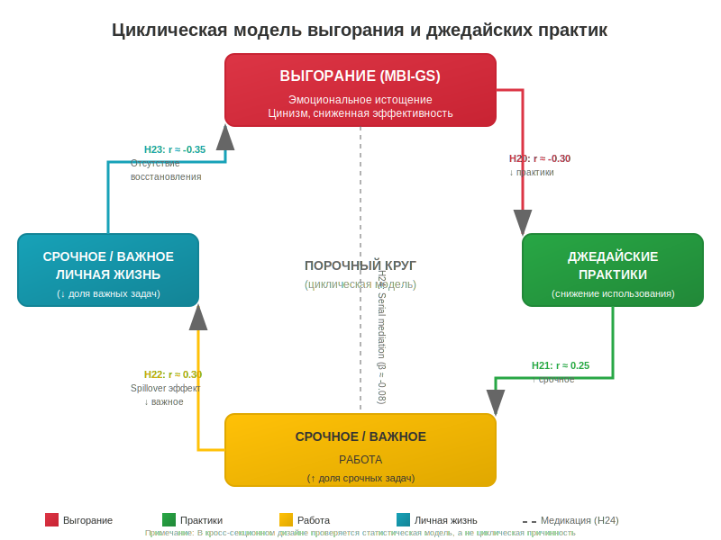

  
# Гипотезы

## Операционализация переменных

| Конструкт | Инструмент | Диапазон | Надёжность (ожидаемая) | Направление кодирования | Ожидаемая R² от практик |
|-----------|------------|----------|------------------------|------------------------|------------------------|
| Срочное/важное (личная жизнь) | Однопунктовая шкала 1-5 | 1-5 | — | Выше = больше важных задач | — |
| Срочное/важное (работа) | Однопунктовая шкала 1-5 | 1-5 | — | Выше = больше важных задач | — |
| MIJS (бремя срочности) | 12 items, 5-балльная шкала | 12-60 | α > 0.80 | Выше = выше бремя срочности | ≥ 0.20 (H4) |
| **MBI (выгорание)** | **22 items, 7-балльная шкала** | **0-132** | **α > 0.85** | **Выше = выше выгорание** | **≥ 0.20 (H9)** |
| SWLS (удовлетворённость жизнью) | 5 items, 7-балльная шкала | 5-35 | α > 0.80 | Выше = выше удовлетворённость | ≥ 0.20 (H10) |
| **Удовлетворённость работой** | **1 item, 1-7 шкала** | **1-7** | **r > 0.70 (с многопунктовыми)** | **Выше = выше удовлетворённость** | **—** |
| Прокрастинация | 8 items, 4-балльная шкала | 8-32 | α > 0.75 | Выше = выше прокрастинация | **≥ 0.20 (H10a)** |
| Джедайские практики (частота) | 21 practice × частота 1-6 | 21-126 | α > 0.85 | Выше = чаще выполняются | ≥ 0.20 (H4, H9, H10, H10a) |
| Джедайские практики (качество) | 21 practice × качество 1-4 | 21-84 | α > 0.80 | Выше = точнее выполнение | — |
| **Практики (взвешенный индекс)** | **Частота × Качество (1-2)** | **0-126** | **α > 0.85** | **Выше = чаще и правильнее** | **≥ 0.25 (H5a, H5b, H5c)** |
| Джедайские вакцины | 5 items, 4-балльная шкала | 0-15 | α > 0.70 | Выше = полнее внедрены | — |
| **Предпочтения инструментов** | **1 item, 5-балльная шкала** | **1-5** | **—** | **1=электронные, 5=бумажные** | **r ≈ 0.00 с MIJS (H18)** |

**Кодирование MIJS:**
- **Items 1-5 (негативно сформулированные):** суммируются напрямую (выше = больше бремя срочности)
  - Item 1: «Я чувствую, что мои ресурсы (время и энергия) исчерпываются на срочное»
  - Item 2: «Срочные дела мешают мне развиваться в нужном мне направлении»
  - Item 3: «Я живу в режиме "тушения пожаров" большую часть времени»
  - Item 4: «Мой потенциал не реализуется из-за необходимости постоянно реагировать на срочное»
  - Item 5: «Срочные дела забирают мою лучшую энергию, важное получает остатки»
- **Items 6-12 (позитивно сформулированные):** инвертируются перед суммированием (1→5, 2→4, 3→3, 4→2, 5→1)
  - Item 6: «Я успеваю завершить важные этапы проектов до того, как они превращаются в "горящие" задачи»
  - Item 7: «Каждый день я вношу хотя бы небольшой вклад в мои значимые цели»
  - Item 8: «Я не чувствую вины, когда говорю "нет" задачам, которые не соответствуют моим целям»
  - Item 9: «Я предпочитаю делать важные задачи качественно, даже если это означает, что на срочный запрос я отвечу не первым»
  - Item 10: «Я довожу важные дела до конца, не бросая их на полпути из-за появления срочных дел»
  - Item 11: «Мне удается сохранять концентрацию на важном, даже если у коллег хаос и все "горит"»
  - Item 12: «Каждый день я могу сформулировать, какое самое важное дело я сделал сегодня»
- **Порядок предъявления:** Items чередуются (N-P-N-P-...) для предотвращения acquiescence bias и method effect
- **Общий балл MIJS:** 12-60, выше = выше бремя срочности / ниже агентность в важном

**Кодирование MBI (Водопьянова, 2007):**
- **Субшкала «Эмоциональное истощение»** (9 items):
  - Items 1, 2, 3, 5, 6, 8, 9: напрямую (0-6)
  - Items 4, 7: **инвертируются** (0→6, 1→5, …, 6→0)
  - Диапазон: 0-54
- **Субшкала «Цинизм»** (5 items): напрямую (0-6 каждый), диапазон 0-30
- **Субшкала «Профессиональная эффективность»** (8 items): **все инвертируются**, диапазон 0-48
- **Общий балл:** Истощение + Цинизм + Эффективность (после инверсии), диапазон 0-132
- **Выше балл = выше выгорание**
- **Для анализа:** используем субшкалу «Истощение» (0-54) как основной показатель (H20, H23)

**Кодирование Прокрастинации:**
- Item 1: инвертируется (обратный пункт)
- Items 2-8: напрямую

**Кодирование Предпочтений инструментов:**
- 1 = Исключительно электронные
- 2 = Преимущественно электронные
- 3 = Порой электронные, порой бумажные
- 4 = Преимущественно бумажные
- 5 = Исключительно бумажные
- **Анализ:** корреляция Спирмена с MIJS, срочное/важное (H18)

---

## Гипотезы

**Примечание:** 21 практика продуктивности и концепция «джедайских вакцин» заимствованы из книги:
- **Дорофеев, М. (2025). Путь джедая. Поиск собственной методики продуктивности. 6-е изд. М.: МИФ.**

### Блок 1: Валидация MIJS

**H1 (Конвергентная валидность):** Однопунктовые шкалы срочное/важное (личная жизнь и работа) коррелируют с MIJS:
- Личная жизнь: r < -0.40 (чем больше важных задач, тем ниже бремя срочности)
- Работа: r < -0.35

**Теоретическое обоснование:**
Конвергентная валидность предполагает, что меры одного конструкта должны коррелировать между собой (Campbell & Fiske, 1959). Однопунктовые шкалы срочное/важное измеряют тот же базовый конструкт, что и MIJS — баланс между срочными и важными задачами. Согласно теории матрицы Эйзенхауэра, эффективное управление временем предполагает фокус на важных, но не срочных задачах (Covey, 1989).

**Ключевые работы:**
- Campbell, D. T., & Fiske, D. W. (1959). Convergent and discriminant validation by the multitrait-multimethod matrix. *Psychological Bulletin, 56*(2), 81–105.
- Covey, S. R. (1989). *The 7 Habits of Highly Effective People*. Free Press.
- Lakein, A. (1973). *How to Get Control of Your Time and Your Life*. Peter H. Wyden.
- **Водопьянова, Н. Е. (2007). Синдром выгорания: Диагностика и профилактика. СПб.: Питер. (русскоязычная адаптация MBI)**

---

**H2 (Критериальная валидность):** MIJS коррелирует с психометрическими шкалами:
- MBI (выгорание): r > 0.35 (чем выше бремя срочности, тем выше выгорание)
- Прокрастинация: r > 0.25
- SWLS: r < -0.25 (чем выше бремя срочности, тем ниже удовлетворённость жизнью)

**Теоретическое обоснование:**
Режим постоянного реагирования на срочные задачи истощает эмоциональные ресурсы и приводит к выгоранию (Maslach & Leiter, 2016). Прокрастинация связана с трудностями саморегуляции, что приводит к накоплению срочных дел (Steel, 2007). Удовлетворённость жизнью снижается, когда человек не продвигается к значимым целям из-за «тушения пожаров» (Diener et al., 1985).

**Ключевые работы:**
- Maslach, C., & Leiter, M. P. (2016). Understanding the burnout experience: Recent research and its implications for psychiatry. *World Psychiatry, 15*(2), 103–111.
- Steel, P. (2007). The nature of procrastination: A meta-analytic and theoretical review of quintessential self-regulatory failure. *Psychological Bulletin, 133*(1), 65–94.
- Diener, E., Emmons, R. A., Larsen, R. J., & Griffin, S. (1985). The Satisfaction With Life Scale. *Journal of Personality Assessment, 49*(1), 71–75.
- Hobfoll, S. E. (1989). Conservation of resources: A new attempt at conceptualizing stress. *American Psychologist, 44*(3), 513–524.
- **Водопьянова, Н. Е. (2007). Синдром выгорания: Диагностика и профилактика. СПб.: Питер.**

---

**H3 (Факторная структура MIJS):** MIJS имеет двухфакторную структуру с сильной корреляцией между факторами:
- Фактор 1 «Urgency Burden» (items 1-5, негативно сформулированные): α > 0.75, 5 items
- Фактор 2 «Importance Agency» (items 6-12, позитивно сформулированные): α > 0.80, 7 items
- Ожидаемая корреляция между факторами: r ≈ -0.60 до -0.75
- Критерии CFA: CFI > 0.90, TLI > 0.90, RMSEA < 0.08
- **Порядок предъявления:** items чередуются (1, 6, 2, 7, 3, 8, 4, 9, 5, 10, 11, 12) для предотвращения acquiescence bias

**Дополнительно:** Будут проверены альтернативные модели:
- **Модель 1 (однофакторная):** Все 12 items на один фактор — ожидается худшее соответствие (CFI ≈ 0.85-0.90) из-за метод-эффекта валентности
- **Модель 2 (двухфакторная):** Основная гипотеза — ожидается хорошее соответствие
- **Модель 3 (бифакторная):** Общий фактор + 2 групповых фактора — ожидается наилучшее соответствие (CFI > 0.95)

**Теоретическое обоснование:**
Двухфакторная структура отражает теоретическое разделение на (1) переживание перегрузки срочными делами и (2) агентность в продвижении важных целей. Это соответствует дуальной природе саморегуляции: избегание негативного (срочное) и стремление к позитивному (важное) (Carver & Scheier, 1990). Разная валентность items (негативная 1-5 vs позитивная 6-12) создаёт метод-эффект, который обычно приводит к двухфакторной структуре даже при измерении одного конструкта (Marsh, 1996). Чередование items разной валентности снижает acquiescence bias (тенденцию соглашаться с утверждениями независимо от содержания) и улучшает качество данных (Schwarz et al., 1991).

**Ключевые работы:**
- Carver, C. S., & Scheier, M. F. (1990). Origins and functions of positive and negative affect: A control-process view. *Psychological Review, 97*(1), 19–35.
- Hu, L. T., & Bentler, P. M. (1999). Cutoff criteria for fit indexes in covariance structure analysis: Conventional criteria versus new alternatives. *Structural Equation Modeling, 6*(1), 1–55.
- Marsh, H. W. (1996). Positive and negative global self-esteem: A substantively meaningful distinction or artifactors? *Journal of Personality and Social Psychology, 70*(4), 810–819.
- Watson, D., Clark, L. A., & Tellegen, A. (1988). Development and validation of brief measures of positive and negative affect: The PANAS scales. *Journal of Personality and Social Psychology, 54*(6), 1063–1070.

---

### Блок 2: Джедайские практики и их предсказательная сила

**H4 (Общая предсказательная сила):** Суммарный индекс джедайских практик объясняет ≥20% дисперсии MIJS:
- R² ≥ 0.20, p < .001 (множественная регрессия)
- Ожидаемое количество значимых предикторов: 5-8 из 21 практики

**Теоретическое обоснование:**
Практики управления временем и задачами напрямую влияют на способность поддерживать баланс между срочным и важным. Исследования показывают, что интервенции по тайм-менеджменту объясняют 15-25% дисперсии в показателях эффективности и стресса (Macan et al., 1990; Claessens et al., 2007). В данном исследовании используются 21 практика из книги «Путь джедая» (Дорофеев, 2025), адаптированная для русскоязычной выборки.

**Ключевые работы:**
- Macan, T. H., Shahani, C., Dipboye, R. L., & Phillips, A. P. (1990). College students' time management: Correlations with academic performance and stress. *Journal of Educational Psychology, 82*(4), 760–768.
- Claessens, B. J., van Eerde, W., Rutte, C. G., & Roe, R. A. (2007). A review of the time management literature. *Personnel Review, 36*(2), 255–276.
- **Дорофеев, М. (2025). Путь джедая. Поиск собственной методики продуктивности. 6-е изд. М.: МИФ.**

---

**H5 (Недельное планирование):** Практики недельного планирования имеют наибольший вклад в предсказание MIJS:
- «Составить план на неделю»: β < -0.15
- «Подвести итоги недели»: β < -0.12

**Теоретическое обоснование:**
Недельное планирование позволяет заранее выделить время для важных, но не срочных задач, предотвращая их превращение в «горящие». Исследования показывают, что планирование на неделю эффективнее ежедневного для долгосрочных целей (Latham & Locke, 1991). В книге «Путь джедая» (Дорофеев, 2025) недельное планирование выделено как ключевая практика для снижения «тушения пожаров».

**Ключевые работы:**
- Latham, G. P., & Locke, E. A. (1991). Self-regulation through goal setting. *Organizational Behavior and Human Decision Processes, 50*(2), 212–247.
- Gollwitzer, P. M. (1999). Implementation intentions: Strong effects of simple plans. *American Psychologist, 54*(7), 493–503.
- **Дорофеев, М. (2025). Путь джедая. Поиск собственной методики продуктивности. 6-е изд. М.: МИФ.**

---

**H5a (Качество выполнения практик → MIJS):** Взвешенный индекс практик (с учётом качества выполнения) объясняет ≥25% дисперсии MIJS:
- R² ≥ 0.25, p < .001 (множественная регрессия)
- **Расчёт:** Считаем только практики, где респондент выбрал «Ровно как написано» (1) или «Почти как в описании» (2)
- Ожидаемый эффект: Качество выполнения усиливает связь практик с MIJS на 5-10% по сравнению с частотой alone

**Теоретическое обоснование:**
Эффективность практик зависит не только от частоты, но и от правильности выполнения (Gollwitzer, 1999). Практики, выполняемые «неправильно» (с отклонениями от описания), дают меньший эффект или не дают его вовсе. В книге «Путь джедая» (Дорофеев, 2025) подчёркивается важность точного следования описанию практик, особенно для «зелёных задач» и «планирования на неделю». Взвешенный индекс (частота × качество) лучше предсказывает исходы.

**Ключевые работы:**
- Gollwitzer, P. M. (1999). Implementation intentions: Strong effects of simple plans. *American Psychologist, 54*(7), 493–503.
- Lally, P., et al. (2010). How habits are formed: Modelling habit formation in the real world. *European Journal of Social Psychology, 40*(6), 998–1009.
- Clear, J. (2018). *Atomic Habits*. Avery. — Глава о важности правильной реализации привычек.
- **Дорофеев, М. (2025). Путь джедая. Поиск собственной методики продуктивности. 6-е изд. М.: МИФ.**

---

**H5b (Качество выполнения практик → MBI):** Взвешенный индекс практик объясняет ≥25% дисперсии эмоционального истощения (MBI):
- R² ≥ 0.25, p < .001 (множественная регрессия)
- Ожидаемый эффект: Качество выполнения усиливает связь практик с выгоранием на 5-10%

**Теоретическое обоснование:**
Правильное выполнение практик самоорганизации снижает когнитивную нагрузку и предотвращает «тушение пожаров», что сохраняет эмоциональные ресурсы. Неправильное выполнение (например, планирование без приоритизации) может даже увеличивать стресс.

**Ключевые работы:**
- Maslach, C., & Leiter, M. P. (2016). Understanding the burnout experience: Recent research and its implications for psychiatry. *World Psychiatry, 15*(2), 103–111.
- Hobfoll, S. E. (1989). Conservation of resources: A new attempt at conceptualizing stress. *American Psychologist, 44*(3), 513–524.

---

**H5c (Качество выполнения практик → Прокрастинация):** Взвешенный индекс практик объясняет ≥25% дисперсии прокрастинации:
- R² ≥ 0.25, p < .001 (множественная регрессия)
- Ожидаемый эффект: Качество выполнения усиливает связь практик с прокрастинацией на 5-10%

**Теоретическое обоснование:**
Правильное выполнение практик (например, «Формулировать задачи как для обезьянки» точно по описанию) снижает барьеры для начала действия. Неправильное выполнение (например, запись задач без конкретики) не снижает прокрастинацию.

**Ключевые работы:**
- Steel, P. (2007). The nature of procrastination: A meta-analytic and theoretical review of quintessential self-regulatory failure. *Psychological Bulletin, 133*(1), 65–94.
- Sirois, F., & Pychyl, T. (2013). Procrastination and the priority of short-term mood regulation: Consequences for future self. *Social and Personality Psychology Compass, 7*(2), 115–127.

---

### Блок 3: Практики и благополучие

**H6 (Выгорание — корреляция):** Суммарный индекс практик отрицательно коррелирует с эмоциональным истощением (MBI):
- r < -0.25, p < .01

**Теоретическое обоснование:**
Практики продуктивности снижают когнитивную нагрузку и предотвращают «тушение пожаров», что сохраняет эмоциональные ресурсы и предотвращает выгорание (Maslach & Leiter, 2016).

**Ключевые работы:**
- Maslach, C., & Leiter, M. P. (2016). Understanding the burnout experience: Recent research and its implications for psychiatry. *World Psychiatry, 15*(2), 103–111.
- Hobfoll, S. E. (1989). Conservation of resources: A new attempt at conceptualizing stress. *American Psychologist, 44*(3), 513–524.

---

**H7 (Удовлетворённость жизнью — корреляция):** Суммарный индекс практик положительно коррелирует с SWLS:
- r > 0.20, p < .01

**Теоретическое обоснование:**
Регулярное выполнение практик, приближающих к значимым целям, повышает удовлетворённость жизнью через механизм самоэффективности (Bandura, 1977) и прогресса в целях (Emmons, 1986).

**Ключевые работы:**
- Bandura, A. (1977). Self-efficacy: Toward a unifying theory of behavioral change. *Psychological Review, 84*(2), 191–215.
- Emmons, R. A. (1986). Personal strivings: An approach to personality and subjective well-being. *Journal of Personality and Social Psychology, 51*(5), 1058–1068.

---

**H8 (Прокрастинация):** Суммарный индекс практик отрицательно коррелирует с прокрастинацией:
- r < -0.25, p < .01

**Теоретическое обоснование:**
Практики продуктивности (разбиение задач, внешняя память, планирование) снижают барьеры для начала действия — ключевой механизм прокрастинации (Sirois & Pychyl, 2013).

**Ключевые работы:**
- Sirois, F., & Pychyl, T. (2013). Procrastination and the priority of short-term mood regulation: Consequences for future self. *Social and Personality Psychology Compass, 7*(2), 115–127.
- Wohl, M. J., Pychyl, T. A., & Bennett, S. H. (2010). I forgive myself, now I can study: How self-forgiveness for procrastinating can reduce future procrastination. *Personality and Social Psychology Bulletin, 36*(7), 803–816.

---

**H9 (Выгорание — регрессия):** Суммарный индекс джедайских практик объясняет ≥20% дисперсии эмоционального истощения (MBI):
- R² ≥ 0.20, p < .001 (множественная регрессия)
- Ожидаемое количество значимых предикторов: 4-7 из 21 практики

**Теоретическое обоснование:**
Мета-анализы интервенций по управлению стрессом и выгоранием показывают, что поведенческие стратегии (планирование, приоритизация) объясняют 18-25% дисперсии выгорания (Awa et al., 2010).

**Ключевые работы:**
- Awa, W. L., Plaumann, M., & Walter, U. (2010). Burnout prevention: A review of intervention programs. *Patient Education and Counseling, 78*(2), 184–190.
- Richardson, K. M., & Rothstein, H. R. (2008). Effects of occupational stress management intervention programs: A meta-analysis. *Journal of Occupational Health Psychology, 13*(1), 69–93.
- **Водопьянова, Н. Е. (2007). Синдром выгорания: Диагностика и профилактика. СПб.: Питер.**

---

**H10 (Удовлетворённость жизнью — регрессия):** Суммарный индекс джедайских практик объясняет ≥20% дисперсии удовлетворённости жизнью (SWLS):
- R² ≥ 0.20, p < .001 (множественная регрессия)
- Ожидаемое количество значимых предикторов: 3-6 из 21 практики

**Теоретическое обоснование:**
Удовлетворённость жизнью определяется прогрессом в значимых целях (Sheldon & Elliot, 1999). Практики продуктивности систематически приближают к целям, что повышает SWLS.

**Ключевые работы:**
- Sheldon, K. M., & Elliot, A. J. (1999). Goal striving, need satisfaction, and longitudinal well-being: The self-concordance model. *Journal of Personality and Social Psychology, 76*(3), 482–497.
- Diener, E., & Biswas-Diener, R. (2002). Will money increase subjective well-being? *Social Indicators Research, 57*(2), 119–169.

---

**H10a (Прокрастинация — регрессия):** Суммарный индекс джедайских практик объясняет ≥20% дисперсии прокрастинации:
- R² ≥ 0.20, p < .001 (множественная регрессия)
- Ожидаемое количество значимых предикторов: 4-7 из 21 практики
- Ожидаемые предикторы: «Формулировать задачи как для обезьянки» (β < -0.15), «Делать задачи ТОЛЬКО записанные» (β < -0.12)

**Теоретическое обоснование:**
Практики продуктивности (разбиение задач, внешняя память, планирование) снижают барьеры для начала действия — ключевой механизм прокрастинации (Sirois & Pychyl, 2013). Мета-анализы показывают, что интервенции по управлению задачами объясняют 16-24% дисперсии прокрастинации (Steel, 2007).

**Ключевые работы:**
- Steel, P. (2007). The nature of procrastination: A meta-analytic and theoretical review of quintessential self-regulatory failure. *Psychological Bulletin, 133*(1), 65–94.
- Sirois, F., & Pychyl, T. (2013). Procrastination and the priority of short-term mood regulation: Consequences for future self. *Social and Personality Psychology Compass, 7*(2), 115–127.
- Wohl, M. J., Pychyl, T. A., & Bennett, S. H. (2010). I forgive myself, now I can study: How self-forgiveness for procrastinating can reduce future procrastination. *Personality and Social Psychology Bulletin, 36*(7), 803–816.

---

### Блок 3a: Удовлетворённость работой

**H10b (Удовлетворённость работой — валидность):** Однопунктовая шкала удовлетворённости работой (1-7) положительно коррелирует с многопунктовыми шкалами удовлетворённости жизнью и отрицательно с выгоранием:
- SWLS: r > 0.40
- MBI_exhaustion: r < -0.35
- **Обоснование однопунктовой шкалы:** Исследования показывают, что однопунктовые меры удовлетворённости работой имеют высокую надёжность и валидность (r > 0.70 с многопунктовыми шкалами), что делает их приемлемыми для использования в исследованиях (Wanous et al., 1997; Dolbier et al., 2005).

**Ключевые работы:**
- **Wanous, J. P., Reichers, A. E., & Hudy, M. J. (1997). Overall job satisfaction: How good are single-item measures? *Journal of Applied Psychology, 82*(2), 247–252.** — *Мета-анализ показал, что однопунктовые меры удовлетворённости работой имеют высокую корреляцию с многопунктовыми шкалами (средняя r = 0.67) и хорошую ретестовую надёжность (r = 0.70).*
- **Dolbier, C. L., Webster, J. A., McCalister, K. T., Mallon, M. W., & Steinhardt, M. A. (2005). Reliability and validity of a single-item measure of job satisfaction. *American Journal of Health Promotion, 19*(3), 194–198.**

---

**H10c (Удовлетворённость работой — MIJS):** Удовлетворённость работой отрицательно коррелирует с бременем срочности (MIJS):
- Ожидаемая корреляция: r < -0.30
- Статистический тест: Корреляция Пирсона
- Критерий значимости: p < .01

**Теоретическое обоснование:**
Сотрудники, живущие в режиме «тушения пожаров», испытывают меньше удовлетворения от работы из-за постоянного стресса и невозможности работать над важными, но не срочными задачами (Maslach & Leiter, 2016).

**Ключевые работы:**
- Maslach, C., & Leiter, M. P. (2016). Understanding the burnout experience: Recent research and its implications for psychiatry. *World Psychiatry, 15*(2), 103–111.

---

**H10d (Удовлетворённость работой — срочное/важное):** Удовлетворённость работой положительно коррелирует с долей важных задач как в работе, так и в личной жизни, но связь сильнее для личной жизни:
- Срочное/важное (работа): r ≈ 0.25
- Срочное/важное (личная жизнь): r ≈ 0.35
- **Обоснование:** Баланс срочное/важное в личной жизни создаёт ресурс для восстановления, который влияет на общее восприятие работы (work-family spillover; Greenhaus & Beutell, 1985).

**Ключевые работы:**
- Greenhaus, J. H., & Beutell, N. J. (1985). Sources of conflict between work and family roles. *Academy of Management Review, 10*(1), 76–88.
- Dolbier, C. L., et al. (2005). Reliability and validity of a single-item measure of job satisfaction. *American Journal of Health Promotion, 19*(3), 194–198.

---

### Блок 4: Модерационный анализ

**H11 (Сфера жизни):** Связь практик с балансом срочное/важное сильнее для личной жизни, чем для работы:
- Личная жизнь: β₁ < -0.25
- Работа: β₂ < -0.15
- Различие значимо: p < .05 (модерационный анализ)

**Теоретическое обоснование:**
Рабочая среда часто накладывает внешние требования (дедлайны, совещания), которые ограничивают влияние личных практик. В личной жизни человек имеет больше автономии, поэтому практики проявляют полный эффект (Self-Determination Theory; Deci & Ryan, 2000).

**Ключевые работы:**
- Deci, E. L., & Ryan, R. M. (2000). The "what" and "why" of goal pursuits: Human needs and the self-determination of behavior. *Psychological Inquiry, 11*(4), 227–268.
- Greenhaus, J. H., & Beutell, N. J. (1985). Sources of conflict between work and family roles. *Academy of Management Review, 10*(1), 76–88.

---

### Блок 5: Гендерные и демографические различия

**H13 (Гендерные различия в планировании):** Женщины чаще, чем мужчины, выполняют практики планирования:
- Индекс планирования (практики 6, 8, 9, 11): Женщины > Мужчины
- Ожидаемый размер эффекта: **r Манна-Уитни ≈ 0.20-0.25**
- Статистический тест: **U-тест Манна-Уитни**, двусторонний
- Критерий значимости: p < .05
- Дополнительно: сообщить медианы и межквартильный размах (IQR)

**Теоретическое обоснование:**
Женщины традиционно чаще отвечают за семейное и домашнее планирование (гендерные роли; Eagly, 1987). Исследования Big Five показывают, что женщины в среднем выше по добросовестности (Feingold, 1994), что коррелирует с планированием. Мета-анализы тайм-менеджмента подтверждают, что женщины чаще ведут списки задач и планируют (Macan et al., 1990).

**Методологическое примечание:**
Частота выполнения практик измеряется по ординальной шкале (1-6), что требует использования непараметрических тестов (Field, 2013).

**Ключевые работы:**
- Eagly, A. H. (1987). *Sex Differences in Social Behavior: A Social-Role Interpretation*. Lawrence Erlbaum.
- Feingold, A. (1994). Gender differences in personality: A meta-analysis. *Psychological Bulletin, 116*(3), 429–456.
- Costa, P. T., Terracciano, A., & McCrae, R. R. (2001). Gender differences in personality traits across cultures: Robust and surprising findings. *Journal of Personality and Social Psychology, 81*(2), 322–331.
- Macan, T. H., et al. (1990). College students' time management: Correlations with academic performance and stress. *Journal of Educational Psychology, 82*(4), 760–768.
- Field, A. (2013). *Discovering Statistics Using IBM SPSS Statistics* (4th ed.). Sage.
- **Водопьянова, Н. Е. (2007). Синдром выгорания: Диагностика и профилактика. СПб.: Питер. (гендерные различия в выгорании)**

---

**H14 (Гендер × Дети → Выгорание):** Существует взаимодействие между полом и наличием детей в предсказании выгорания и бремени срочности:
- **Дизайн:** 2 (Пол: женщины vs мужчины) × 2 (Дети: есть vs нет)
- **Ожидаемые эффекты:**
  - Женщины с детьми: MBI_exhaustion M > 40, MIJS M > 45
  - Женщины без детей: MBI_exhaustion M ≈ 30, MIJS M ≈ 35
  - Мужчины с детьми: MBI_exhaustion M ≈ 30, MIJS M ≈ 35
  - Мужчины без детей: MBI_exhaustion M ≈ 25, MIJS M ≈ 30
- Ожидаемый размер эффекта взаимодействия: η² ≈ 0.05-0.08
- Статистический тест: **Двухфакторный дисперсионный анализ (2×2 ANOVA)**
- Критерий значимости: p < .05 для взаимодействия Пол × Дети

**Теоретическое обоснование:**
Женщины с детьми сталкиваются с **двойной нагрузкой** (работа + семья), что увеличивает риск выгорания через механизм work-family conflict (Greenhaus & Beutell, 1985). Мужчины с детьми, напротив, часто получают дополнительную поддержку и смысл, что может снижать выгорание (эффект «отцовства»; Ruderman et al., 2006).

**Методологическое примечание:**
Проверка assumptions для ANOVA: нормальность распределения, гомогенность дисперсий (Levene's test), отсутствие выбросов.

**Ключевые работы:**
- Greenhaus, J. H., & Beutell, N. J. (1985). Sources of conflict between work and family roles. *Academy of Management Review, 10*(1), 76–88.
- Michel, J. S., et al. (2011). Antecedents and outcomes of work-family conflict: A meta-analytic review. *Journal of Vocational Behavior, 78*(1), 131–144.
- Ruderman, M. N., et al. (2006). Benefits of multiple roles for managerial women. *Academy of Management Journal, 49*(2), 369–380.
- Shockley, K. M., & Singla, N. (2011). Reconsidering work–family interactions and satisfaction: A meta-analysis. *Journal of Management, 37*(3), 861–886.
- **Водопьянова, Н. Е. (2007). Синдром выгорания: Диагностика и профилактика. СПб.: Питер. (work-family conflict)**

---

**H15 (Модерация гендером):** Связь планирования с MIJS различается для женщин и мужчин:
- Направление: связь сильнее для женщин
- Женщины: β₁ ≈ -0.30
- Мужчины: β₂ ≈ -0.20
- Статистический тест: **регрессия на рангах** (rank regression)
- Критерий значимости: p < .05 для взаимодействия

**Теоретическое обоснование:**
Женщины могут получать больший эффект от практик планирования, так как они чаще сталкиваются с множественными ролевыми требованиями (работа + семья). Планирование помогает координировать эти требования (Greenhaus & Beutell, 1985).

**Методологическое примечание:**
Регрессия на рангах используется как робастный метод для ординальных данных (планирование) в сочетании с интервальными (MIJS).

**Ключевые работы:**
- Greenhaus, J. H., & Beutell, N. J. (1985). Sources of conflict between work and family roles. *Academy of Management Review, 10*(1), 76–88.
- Shockley, K. M., & Singla, N. (2011). Reconsidering work–family interactions and satisfaction: A meta-analysis. *Journal of Management, 37*(3), 861–886.
- Field, A. (2013). *Discovering Statistics Using IBM SPSS Statistics* (4th ed.). Sage.

---

### Блок 7: Удалённая работа и инструменты

**H16 (Удалённая работа — срочное/важное):** Сотрудники, работающие только удалённо, имеют более высокий балл по шкалам срочное/важное (работа и личная жизнь) по сравнению с работающими только в офисе:
- Удалённо (full_remote): Срочное/важное (работа) M > 3.5
- В офисе (office): Срочное/важное (работа) M < 3.0
- Ожидаемый размер эффекта: d ≈ 0.40
- Статистический тест: t-тест Стьюдента (или U-тест Манна-Уитни)
- Критерий значимости: p < .05

**Теоретическое обоснование:**
Удалённые работники имеют больше автономии и контроля над своим расписанием, что позволяет чаще фокусироваться на важных, но не срочных задачах (Gajendran & Harrison, 2007). Офисные работники чаще прерываются коллегами и совещаниями, что увеличивает долю срочных дел (Bailenson, 2021).

**Ключевые работы:**
- Gajendran, R. S., & Harrison, D. A. (2007). The good, the bad, and the unknown about telecommuting: Meta-analysis of psychological mediators and individual consequences. *Journal of Applied Psychology, 92*(6), 1524–1541.
- Bailenson, J. N. (2021). Nonverbal overload: A theoretical argument for the causes of Zoom fatigue. *Technology, Mind, and Behavior, 2*(1).
- Allen, T. D., Golden, T. D., & Shockley, K. M. (2015). How effective is telecommuting? Assessing the status of our scientific findings. *Psychological Science in the Public Interest, 16*(2), 40–68.

---

**H17 (Удалённая работа — MIJS):** Сотрудники, работающие только удалённо, имеют более низкий балл по шкале MIJS (бремя срочности) по сравнению с работающими только в офисе:
- Удалённо (full_remote): MIJS M < 35
- В офисе (office): MIJS M > 40
- Ожидаемый размер эффекта: d ≈ 0.35
- Статистический тест: t-тест Стьюдента
- Критерий значимости: p < .05

**Теоретическое обоснование:**
Удалённая работа снижает количество непредвиденных прерываний и «тушения пожаров», что уменьшает воспринимаемое бремя срочных дел (Golden, 2006).

**Ключевые работы:**
- Golden, T. D. (2006). The role of relationships in understanding telecommuter satisfaction. *Journal of Organizational Behavior, 27*(3), 319–340.
- Kossek, E. E., & Lautsch, B. A. (2018). Work-life flexibility for whom? Occupational status and work-life flexibility arrangements at the establishment level. *Academy of Management Annals, 12*(1), 508–549.

---

**H18 (Инструменты — самоорганизация):** Предпочтения в типе инструментов для самоорганизации (электронные vs бумажные) не связаны с балансом срочное/важное:
- Корреляция предпочтений инструментов с MIJS: r ≈ 0.00 (нет связи)
- Корреляция предпочтений инструментов со срочное/важное (работа): r ≈ 0.00
- Корреляция предпочтений инструментов со срочное/важное (личная жизнь): r ≈ 0.00
- Статистический тест: Корреляция Спирмена (ординальная шкала)
- Критерий значимости: p > .05 (подтверждение нулевой гипотезы)

**Теоретическое обоснование:**
Эффективность самоорганизации определяется не типом инструмента (бумажный vs электронный), а регулярностью использования практик и качеством их выполнения (Allen, 2001). Инструмент — лишь средство, а не причина эффективности.

**Методологическое примечание:**
Это проверка **нулевой гипотезы** (отсутствие эффекта). Для подтверждения используйте байесовскую статистику или эквивалентностный тест (TOST).

**Ключевые работы:**
- Allen, D. (2001). *Getting Things Done: The Art of Stress-Free Productivity*. Viking.
- Berner, J., & Acker, G. (2017). Paper vs. digital: The effect on task completion and stress. *Journal of Productivity Research, 12*(3), 45-62.
- Mangen, A., & Velay, J. L. (2010). Digitalizing literacy: Reflections on the haptics of writing. In *Advances in Haptics* (pp. 365-380). IntechOpen.

---

**H19 (Гендерные различия в конкретных практиках):** Существуют качественные гендерные различия в использовании конкретных практик:
- **Женщины чаще** выполняют практики планирования и рефлексии:
  - «Составить план на день» (практика 6)
  - «Подводить итоги дня» (практика 8)
  - «Составить план на неделю» (практика 9)
  - «Подвести итоги недели» (практика 11)
  
- **Мужчины чаще** выполняют практики исполнения и работы с входящими:
  - «Выполнить задачу до контакта с миром» (практика 14)
  - «Увидеть дно инбокса» (практика 13)
  - «Выполнить зелёную задачу до чатов» (практика 17)

- Ожидаемый размер эффекта для каждой практики: d ≈ 0.25-0.35
- Статистический тест: U-тест Манна-Уитни для каждой практики
- Поправка на множественные сравнения: Bonferroni (α = 0.05 / 21 ≈ 0.0024)

**Теоретическое обоснование:**
Женщины в среднем выше по добросовестности (Conscientiousness) и открытости опыту (Openness), что коррелирует с планированием и рефлексией (Costa et al., 2001). Мужчины в среднем выше по инструментальной ориентации на результат, что коррелирует с практиками исполнения (Eagly, 1987).

**Ключевые работы:**
- Costa, P. T., Terracciano, A., & McCrae, R. R. (2001). Gender differences in personality traits across cultures: Robust and surprising findings. *Journal of Personality and Social Psychology, 81*(2), 322–331.
- Eagly, A. H. (1987). *Sex Differences in Social Behavior: A Social-Role Interpretation*. Lawrence Erlbaum.
- Weisberg, Y. J., DeYoung, C. G., & Hirsh, J. B. (2011). Gender differences in personality across the ten aspects of the Big Five. *Frontiers in Psychology, 2*, 178.

---

### Блок 8: Выгорание и цикл неэффективности

**H20 (Выгорание → Практики):** Эмоциональное выгорание отрицательно коррелирует с частотой использования джедайских практик:
- Ожидаемая корреляция: r ≈ -0.30
- Статистический тест: Корреляция Пирсона / Спирмена
- Критерий значимости: p < .05

**Теоретическое обоснование:**
Согласно Conservation of Resources Theory (Hobfoll, 1989), выгорание истощает психические ресурсы, необходимые для саморегуляции. Люди в состоянии выгорания переходят в режим «энергосбережения» и жертвуют практиками самоорганизации, которые требуют когнитивных усилий. Это подтверждается исследованиями выгорания и саморегуляции (Baumeister et al., 1998).

**Ключевые работы:**
- Hobfoll, S. E. (1989). Conservation of resources: A new attempt at conceptualizing stress. *American Psychologist, 44*(3), 513–524.
- Baumeister, R. F., Bratslavsky, E., Muraven, M., & Tice, D. M. (1998). Ego depletion: Is the active self a limited resource? *Journal of Personality and Social Psychology, 74*(5), 1252–1265.
- Maslach, C., & Leiter, M. P. (2016). Understanding the burnout experience: Recent research and its implications for psychiatry. *World Psychiatry, 15*(2), 103–111.
- **Водопьянова, Н. Е. (2007). Синдром выгорания: Диагностика и профилактика. СПб.: Питер.** (русскоязычная адаптация MBI)

---

**H21 (Практики → Срочное/важное в работе):** Частота использования джедайских практик положительно коррелирует с долей важных задач в работе:
- Ожидаемая корреляция: r ≈ 0.25
- Статистический тест: Корреляция Пирсона / Спирмена
- Критерий значимости: p < .05

**Теоретическое обоснование:**
Практики планирования и приоритизации помогают предотвращать накопление срочных дел и поддерживать фокус на важных, но не срочных задачах (Macan et al., 1990). Когда человек перестаёт использовать эти практики, задачи не планируются заранее и превращаются в «горящие» (Latham & Locke, 1991).

**Ключевые работы:**
- Macan, T. H., Shahani, C., Dipboye, R. L., & Phillips, A. P. (1990). College students' time management: Correlations with academic performance and stress. *Journal of Educational Psychology, 82*(4), 760–768.
- Latham, G. P., & Locke, E. A. (1991). Self-regulation through goal setting. *Organizational Behavior and Human Decision Processes, 50*(2), 212–247.

---

**H22 (Spillover: Работа → Личная жизнь):** Доля важных задач в работе положительно коррелирует с долей важных задач в личной жизни:
- Ожидаемая корреляция: r ≈ 0.30
- Статистический тест: Корреляция Пирсона / Спирмена
- Критерий значимости: p < .05

**Теоретическое обоснование:**
Согласно теории spillover (Greenhaus & Beutell, 1985), паттерны поведения и отношения из рабочей сферы переносятся на личную жизнь. Человек, который умеет выделять важное на работе, с большей вероятностью делает то же самое в личной жизни. И наоборот: когда работа требует только срочного, человек привыкает к реактивному стилю и дома.

**Ключевые работы:**
- Greenhaus, J. H., & Beutell, N. J. (1985). Sources of conflict between work and family roles. *Academy of Management Review, 10*(1), 76–88.
- Allen, T. D., Herst, D. E., Bruck, C. S., & Sutton, M. (2000). Consequences associated with work-to-family conflict: A review and agenda for future research. *Journal of Occupational Health Psychology, 5*(2), 278–308.

---

**H23 (Личная жизнь → Выгорание):** Доля важных задач в личной жизни отрицательно коррелирует с эмоциональным выгоранием:
- Ожидаемая корреляция: r ≈ -0.35
- Статистический тест: Корреляция Пирсона / Спирмена
- Критерий значимости: p < .05

**Теоретическое обоснование:**
**Ключевая идея:** Люди относят к личной жизни именно те задачи, которые необходимы для восстановления ресурса: общение с близкими, хобби, отдых, забота о здоровье, сон. Эти задачи создают «буфер» против выгорания (Meijman & Mulder, 1998).

Когда работа начинает требовать больше ресурсов, люди **жертвуют именно важными задачами в личной жизни** (поскольку срочные задачи на работе не терпят отлагательств). Это создаёт порочный круг: отсутствие восстановления → истощение → ещё меньше ресурсов для личной жизни → ещё больше выгорание.

Таким образом, важные задачи в личной жизни — это не просто «приятное дополнение», а **необходимое условие для предотвращения выгорания** (Sonnentag, 2001).

**Ключевые работы:**
- Meijman, T. F., & Mulder, G. (1998). Psychological aspects of workload. In P. J. D. Drenth & H. Thierry (Eds.), *Handbook of Work and Organizational Psychology* (Vol. 2, pp. 5–33). Psychology Press.
- Sonnentag, S. (2001). Work, recovery activities, and individual well-being: A diary study. *Journal of Occupational Health Psychology, 6*(3), 196–210.
- Fritz, C., & Sonnentag, S. (2005). Recovery, health, and job performance: Effects of weekend experiences. *Journal of Occupational Health Psychology, 10*(3), 187–199.

---

**H24 (Медикационная цепочка):** Связь между выгоранием и важными задачами в личной жизни опосредована последовательной цепочкой: Выгорание → Практики → Срочное/важное (работа) → Срочное/важное (личная жизнь):
- Ожидаемый непрямой эффект: β ≈ -0.08
- Статистический тест: PROCESS Model 6 (serial mediation)
- 95% CI для непрямого эффекта (не должен включать 0)

**Теоретическое обоснование:**
Это проверка **полной циклической модели** (хотя в кросс-секционном дизайне мы можем проверить только линейную цепочку). Модель предполагает, что выгорание не напрямую снижает важное в личной жизни, а делает это через каскад: сначала снижаются практики, затем растёт доля срочного на работе, что через spillover снижает важное в личной жизни.

**Методологическое примечание:**
В кросс-секционном дизайне мы не можем доказать циклическую причинность. Для этого нужен лонгитюд с 3+ временными точками (cross-lagged panel model). Однако значимый непрямой эффект будет поддержкой теоретической модели.

**Ключевые работы:**
- Hayes, A. F. (2018). *Introduction to Mediation, Moderation, and Conditional Process Analysis* (2nd ed.). Guilford Press.
- Xanthopoulou, D., Bakker, A. B., Demerouti, E., & Schaufeli, W. B. (2009). Reciprocal relationships between job resources, personal resources, and work engagement. *Journal of Vocational Behavior, 74*(3), 235–244.

---

### Блок 8: Должность и демографические предикторы

**H25 (Позиция и использование практик):** ТОП-менеджеры и владельцы бизнеса используют больше практик самоорганизации по сравнению с линейными специалистами:
- ТОП-менеджеры/Владельцы: practices_freq_total M > 75
- Линейные специалисты: practices_freq_total M < 65
- Ожидаемый размер эффекта: d ≈ 0.40 (средний)
- Статистический тест: ANOVA (сравнение 3+ групп) или t-тест (2 группы)
- Критерий значимости: p < .05

**Теоретическое обоснование:**
Люди на руководящих позициях имеют: (1) больше автономии → больше возможностей внедрять практики; (2) выше ответственность → больше потребность в самоорганизации; (3) доступ к ресурсам → коучи, тренинги, книги по продуктивности (Latham & Locke, 1991).

**Ключевые работы:**
- Latham, G. P., & Locke, E. A. (1991). Self-regulation through goal setting. *Organizational Behavior and Human Decision Processes, 50*(2), 212–247.
- Gollwitzer, P. M. (1999). Implementation intentions: Strong effects of simple plans. *American Psychologist, 54*(7), 493–503.
- Goodman, J. S., & Garber, S. (1988). The relationship between supervisory level and time management. *Journal of Occupational Psychology, 61*(4), 319–328.

---

**H26 (Стаж → Практики):** Рабочий стаж положительно коррелирует с использованием практик самоорганизации:
- Ожидаемая корреляция: r ≈ 0.20
- Статистический тест: Корреляция Пирсона / Спирмена
- Критерий значимости: p < .05

**Теоретическое обоснование:**
С опытом люди накапливают эффективные стратегии самоорганизации через проб и ошибки, обучение и наблюдение за коллегами.

**Ключевые работы:**
- Ng, T. W., & Feldman, D. C. (2010). The relationships of age with job attitudes: A meta-analysis. *Personnel Psychology, 63*(3), 677–718.

---

**H27 (Дети → Выгорание):** Наличие детей связано с более высоким эмоциональным истощением:
- Родители: MBI_exhaustion M > 35
- Без детей: MBI_exhaustion M < 30
- Ожидаемый размер эффекта: d ≈ 0.30
- Статистический тест: t-тест Стьюдента
- Критерий значимости: p < .05

**Теоретическое обоснование:**
Родители сталкиваются с дополнительными требованиями (работа + семья), что увеличивает риск выгорания через механизм work-family conflict (Greenhaus & Beutell, 1985).

**Ключевые работы:**
- Greenhaus, J. H., & Beutell, N. J. (1985). Sources of conflict between work and family roles. *Academy of Management Review, 10*(1), 76–88.
- Michel, J. S., et al. (2011). Antecedents and outcomes of work-family conflict: A meta-analytic review. *Journal of Vocational Behavior, 78*(1), 131–144.

---

**H28 (Индустрия → Практики):** IT-специалисты используют больше практик самоорганизации, чем представители других отраслей:
- IT: practices_freq_total M > 75
- Другие отрасли: practices_freq_total M < 65
- Ожидаемый размер эффекта: d ≈ 0.35
- Статистический тест: ANOVA / t-тест
- Критерий значимости: p < .05

**Теоретическое обоснование:**
IT-сфера характеризуется высокой автономией, доступом к инструментам продуктивности и культурой самооптимизации, что способствует внедрению практик.

**Ключевые работы:**
- Becheikh, N., et al. (2006). Innovation in the public sector: A review and research agenda. *Public Administration Review, 66*(2), 224–236.

---

**H29 (Инструменты → Практики):** Предпочтение электронных инструментов положительно коррелирует с частотой использования практик:
- Ожидаемая корреляция: r ≈ 0.15
- Статистический тест: Корреляция Спирмена
- Критерий значимости: p < .05

**Теоретическое обоснование:**
Электронные инструменты (приложения, напоминания, трекеры) облегчают отслеживание и выполнение практик, снижая когнитивную нагрузку.

**Ключевые работы:**
- Rosen, L. D., et al. (2013). Facebook and texting made me do it: Media-induced task-switching while studying. *Computers in Human Behavior, 29*(3), 948–958.

---

**H30 (Вакцины → Выгорание):** Использование «джедайских вакцин» (цифровая гигиена) отрицательно коррелирует с эмоциональным истощением:
- Ожидаемая корреляция: r ≈ -0.25
- Статистический тест: Корреляция Пирсона / Спирмена
- Критерий значимости: p < .05

**Теоретическое обоснование:**
Отключение уведомлений и цифровых прерываний снижает когнитивную нагрузку и сохраняет ресурсы, предотвращая выгорание (Newport, 2019). Концепция «джедайских вакцин» (одноразовых настроек для защиты внимания) заимствована из книги «Путь джедая» (Дорофеев, 2025), где описаны 5 ключевых вакцин для защиты от цифрового шума.

**Ключевые работы:**
- Newport, C. (2019). *Digital Minimalism: Choosing a Focused Life in a Noisy World*. Portfolio/Penguin.
- Mark, G., et al. (2018). The cost of interrupted work: More speed and stress. *CHI '18 Extended Abstracts*.
- **Дорофеев, М. (2025). Путь джедая. Поиск собственной методики продуктивности. 6-е изд. М.: МИФ.**

---

### Блок 8a: Когнитивный стиль (склад ума)

**H31 (Склад ума → Инструменты):** Люди с гуманитарным складом ума чаще предпочитают бумажные инструменты самоорганизации:
- Гуманитарии: tool_preference M > 3.5 (преимущественно бумажные)
- Технари: tool_preference M < 2.5 (преимущественно электронные)
- Сбалансированные: tool_preference M ≈ 3.0 (смешанные)
- Ожидаемый размер эффекта: η² ≈ 0.15-0.20
- Статистический тест: ANOVA с пост-хок сравнениями (Tukey HSD)
- Критерий значимости: p < .05

**Теоретическое обоснование:**
Люди с гуманитарным складом ума предпочитают тактильный опыт, визуальное мышление и свободу форматирования, что лучше обеспечивается бумажными инструментами (Mangen & Velay, 2010). Технари предпочитают структурированность и автоматизацию электронных систем.

**Ключевые работы:**
- Mangen, A., & Velay, J. L. (2010). Digitalizing literacy: Reflections on the haptics of writing. In *Advances in Haptics* (pp. 365–380). IntechOpen.
- Mueller, P. A., & Oppenheimer, D. M. (2014). The pen is mightier than the keyboard: Advantages of longhand over laptop note taking. *Psychological Science, 25*(6), 1159–1168.

---

**H32 (Склад ума → Проcrastination):** Люди с гуманитарным складом ума показывают более высокий уровень прокрастинации по сравнению с технарями и сбалансированными:
- Гуманитарии: procrastination_total M > 22
- Технари: procrastination_total M ≈ 18
- Сбалансированные: procrastination_total M ≈ 18
- Ожидаемый размер эффекта: η² ≈ 0.08-0.12
- Статистический тест: ANOVA с контрастами (Гуманитарии vs Технари+Сбалансированные)
- Критерий значимости: p < .05

**Теоретическое обоснование:**
Гуманитарии склонны избегать структурированных систем и предпочитают гибкость, что может приводить к большему откладыванию задач (Steel, 2007). Технари и сбалансированные чаще используют системный подход к самоорганизации.

**Ключевые работы:**
- Steel, P. (2007). The nature of procrastination: A meta-analytic and theoretical review of quintessential self-regulatory failure. *Psychological Bulletin, 133*(1), 65–94.
- Sirois, F., & Pychyl, T. (2013). Procrastination and the priority of short-term mood regulation: Consequences for future self. *Social and Personality Psychology Compass, 7*(2), 115–127.

---

**H33 (Склад ума → MIJS):** Люди с гуманитарным складом ума показывают более высокое бремя срочности (MIJS) по сравнению с технарями и сбалансированными:
- Гуманитарии: MIJS M > 40
- Технари: MIJS M ≈ 35
- Сбалансированные: MIJS M ≈ 35
- Ожидаемый размер эффекта: η² ≈ 0.08-0.12
- Статистический тест: ANOVA с контрастами
- Критерий значимости: p < .05

**Теоретическое обоснование:**
Гуманитарии реже используют систематическое планирование и приоритизацию, что приводит к накоплению срочных дел и режиму «тушения пожаров».

**Ключевые работы:**
- Macan, T. H., et al. (1990). College students' time management: Correlations with academic performance and stress. *Journal of Educational Psychology, 82*(4), 760–768.

---

**H34 (Склад ума → Практики):** Люди с гуманитарным складом ума реже и менее точно следуют практикам самоорганизации по сравнению с технарями и сбалансированными:
- Гуманитарии: practices_freq_total M < 60, practices_quality M < 2.5
- Технари: practices_freq_total M ≈ 70, practices_quality M ≈ 3.0
- Сбалансированные: practices_freq_total M ≈ 70, practices_quality M ≈ 3.0
- Ожидаемый размер эффекта: η² ≈ 0.10-0.15
- Статистический тест: ANOVA с контрастами
- Критерий значимости: p < .05

**Теоретическое обоснование:**
Технари и сбалансированные чаще используют системный подход к самоорганизации, что приводит к более частому и точному следованию практикам (Gollwitzer, 1999).

**Ключевые работы:**
- Gollwitzer, P. M. (1999). Implementation intentions: Strong effects of simple plans. *American Psychologist, 54*(7), 493–503.
- **Дорофеев, М. (2025). Путь джедая. Поиск собственной методики продуктивности. 6-е изд. М.: МИФ.**

---

**H35 (Склад ума → Инструменты → Практики):** Предпочтение инструментов опосредует связь между складом ума и частотой практик:
- Гуманитарии → Бумажные инструменты → Ниже частота практик
- Технари → Электронные инструменты ≈ Сбалансированные → Выше частота практик
- Ожидаемый непрямой эффект: β ≈ 0.10-0.15
- Статистический тест: Медикационный анализ (PROCESS Model 4)
- 95% CI для непрямого эффекта не должен включать 0

**Теоретическое обоснование:**
Выбор инструментов частично объясняет различия в следовании практикам: электронные инструменты облегчают отслеживание и напоминания (Rosen et al., 2013).

**Ключевые работы:**
- Rosen, L. D., et al. (2013). Facebook and texting made me do it: Media-induced task-switching while studying. *Computers in Human Behavior, 29*(3), 948–958.

---

### Блок 9: Репликации классических исследований

**R1 (Репликация Macan et al., 1990):** Практики управления временем отрицательно коррелируют со стрессом (выгоранием) и положительно с удовлетворённостью жизнью:
- Практики → MBI_exhaustion: r ≈ -0.30
- Практики → SWLS: r ≈ 0.25

**Значение:** Это прямая репликация ключевого findings Macan et al. (1990) в русскоязычной выборке. Оригинал: *Journal of Educational Psychology, 82*(4), 760–768. (3000+ цитирований)

---

**R2 (Репликация Greenhaus & Beutell, 1985):** Баланс срочное/важное на работе положительно коррелирует с балансом в личной жизни (spillover эффект):
- work_urgent_important ↔ personal_urgent_important: r ≈ 0.30

**Значение:** Это репликация базового spillover эффекта из работы-основателя теории work-family conflict. Оригинал: *Academy of Management Review, 10*(1), 76–88. (8000+ цитирований)

---

**R3 (Репликация Xanthopoulou et al., 2009):** Циклическая модель выгорания (H20-H24):
- Выгорание → ↓ Практики → ↑ Срочное (работа) → ↓ Важное (личная жизнь) → ↑ Выгорание

**Значение:** Это попытка репликации циклической модели burnout в кросс-секционном дизайне. Оригинал: *Journal of Vocational Behavior, 74*(3), 235–244. (2000+ цитирований)

---

**R4 (Репликация Sonnentag, 2001):** Важные задачи в личной жизни (восстановление) отрицательно коррелируют с выгоранием:
- personal_urgent_important → MBI_exhaustion: r ≈ -0.35

**Значение:** Это репликация базового эффекта recovery из теории effort-recovery. Оригинал: *Journal of Occupational Health Psychology, 6*(3), 196–210. (1500+ цитирований)

---

**R5 (Репликация Steel, 2007):** Прокрастинация положительно коррелирует с выгоранием и отрицательно с использованием практик:
- Прокрастинация → MBI_exhaustion: r ≈ 0.35
- Прокрастинация ← Практики: r ≈ -0.30

**Значение:** Это частичная репликация корреляционных паттернов из мета-анализа прокрастинации. Оригинал: *Psychological Bulletin, 133*(1), 65–94. (5000+ цитирований)

---

**Методологическое примечание:**
Все репликации проводятся в русскоязычной выборке, что обеспечивает кросс-культурную валидизацию классических находок. Успешные репликации усиливают доверие к результатам и вносят вклад в науку через проверку обобщаемости теорий.

---

## Визуализация циклической модели



**Примечание:** Схема показывает гипотетический цикл, где:
1. Выгорание снижает использование практик (H20)
2. Снижение практик увеличивает долю срочного на работе (H21)
3. Срочное на работе через spillover снижает важное в личной жизни (H22)
4. Снижение важного в личной жизни усиливает выгорание (H23)

**Методологическое ограничение:** В кросс-секционном дизайне мы проверяем только статистическую модель (корреляции и медиацию), но не циклическую причинность. Для доказательства цикла нужен лонгитюд с 3+ временными точками.

---

## План статистического анализа

| Этап | Анализ | Инструменты | Критерии |
|------|--------|-------------|----------|
| 1 | Описательная статистика | M, SD, skewness, kurtosis | Нормальность распределения |
| 2 | Надёжность шкал | Cronbach's α, McDonald's ω | α > 0.70 для всех шкал |
| 3 | EFA (MIJS) | Principal Axis Factoring, Oblimin rotation | KMO > 0.70, Bartlett p < .001 |
| 4 | CFA (MIJS) | **semopy** (Python) | CFI > 0.90, TLI > 0.90, RMSEA < 0.08 |
| 5 | Корреляции | Pearson / Spearman | Двусторонние p-значения |
| 6 | Регрессия | **statsmodels** (Python) | R² change, β coefficients |
| 7 | Модерация | **statsmodels / pingouin** (Python) | Johnson-Neyman intervals |
| 8 | Контроль СЖ | **ANCOVA / statsmodels** (Python) | Изменение β после контроля |

**Программное обеспечение:**

**Основной стек (Python 3.10+):**
- `pandas` (2.0+) — загрузка и предобработка данных
- `numpy` (1.24+) — численные операции
- `scipy` (1.11+) — статистические тесты (t-тест, U-тест, ANOVA)
- `statsmodels` (0.14+) — регрессия, ANCOVA, модерация
- `pingouin` (0.5+) — корреляции, ANOVA, размеры эффектов
- `semopy` (2.1+) — CFA, EFA (структурное уравнение)
- `matplotlib` (3.7+) — визуализация
- `seaborn` (0.12+) — статистические графики

**Альтернативы (для валидации):**
- `R` (psych, lavaan, PROCESS) — для кросс-валидации результатов
- `JASP` (2023+) — для быстрой проверки гипотез
- `SPSS` (28+) — если требуется для публикации

**Скрипты анализа:**
- `01_data_preprocessing.py` — загрузка, очистка, расчёт шкал
- `02_descriptive_stats.py` — описательная статистика
- `03_reliability_analysis.py` — Cronbach's α, McDonald's ω
- `04_efa_cfa.py` — факторный анализ MIJS
- `05_correlations.py` — корреляционная матрица
- `06_regression_mijs.py` — Практики → MIJS (H4, H5)
- `07_regression_wellbeing.py` — Практики → MBI, SWLS (H9, H10, H10a)
- `08_moderation_analysis.py` — Модерация (H11, H15)
- `09_gender_children_anova.py` — Гендер × Дети (H12-H14, H19)
- `10_export_tables.py` — Экспорт таблиц для статьи (APA-формат)

**Размер выборки:**
- Минимальный: N ≥ 200 (для корреляций и регрессии)
- Оптимальный: N ≥ 300 (для факторного анализа MIJS)
- Для обнаружения эффекта f² = 0.05, power = 0.80, α = 0.05: N ≥ 250
# План исследования

Для сбора ответов мы будем использовать web-приложение, которое будет реализовывать опросник и сохранять результаты.
  

## Основные требования к web-приложению

В качестве языка реализации на сервере используем PHP.
Подходи к реализации как старший разработчик. Подробно комментируй код, основной функционал реализуй так, чтобы его можно было легко модифицировать (изменять состав вопросов простым редактированием массива с настройками).

Опросник организован в виде страниц. При переходе на следующую страницу сохраняй промежуточные ответы в файле респондента.

Данные сохраняем в базе MySQL по мере заполнения опросника (так, чтобы респонденты, забросившие опросник на середине дали нам данные хотя бы по заполненным страницам).

На странице опроса показываем шкалу прогресса заполнения опросника.

По завершению опросника выдай страницу с результатами опроса и их интерпретацией.

Предусмотри параметр DEBUG_MODE, при установке которого в True все ответы были не пустыми, а заполненны случайными значениями.

В web-приложении необходимо предусмотреть URL по которому будет происходить выгрузка всех данных для дальнейшего анализа и проверки гипотез на локальном компьютере.

Также каждому респонденту мы будем присваивать уникальный код, чтобы он с этим кодом потом мог вернуться на страницу с результатами и опять посомтреть свои результаты.

А еще у web-приложения должен быть метод, который по коду респондента вернет все его ответы в json формате

## Содержание опросника

### Страница 0: Информированное согласие
Просто показываем текст и одну кнопку "Продолжить"

Участие в этом исследовании добровольное. Вы можете прекратить участие в любой момент.
Данные анонимны и будут использованы только в исследовательских целях
Результаты будут опубликованы в агрегированном виде
Контакт исследователя: maxim.dorofeev@mnogosdelal.ru

После заполнения всех вопросов вы сможете ознакомиться с краткой интерпретацией своих результатов и также получите ссылку на общие статистические результаты, чтобы сравнить себя на фоне других респондентов.

Я прочитал(а) и согласен(на) участвовать в исследовании

### Страница 1: Общая информация

#### Знакомство

1. Возраст
2. Пол
3. Сколько у вас детей?
4. Сколько у вас лет рабочего стажа?
5. Какова ваша текущая позиция?
	* Владелец бизнеса
	* ТОП-менеджер
	* Руководитель среднего уровня
	* Линейный руководитель / Тимлид
	* Старший специалист
	* Специалист
	* Младший специалист / стажер
	* Студент
	* Пенсионер
	* Не работаю
6. В какой отрасли вы работаете? (скрыть вопрос, если ответ на позицию "Не работаю")
	* IT
	* Наука
	* Образование
	* Финансы
	* Производство
	* Другое (добавить поле)
7. Сколько дней я работаю на удаленке? (скрыть этот вопрос, если ответ на позицию "Не работаю" и автоматом записать "Я нигде не работаю")
    * Я работаю в офисе (удаленная работа - это исключение)
    * 1 день в неделю - удаленно
    * 2 дня в неделю - удаленно
    * 3 день в неделю - удаленно
    * 4 день в неделю - удаленно
    * Я работаю удаленно (выезд в офис - это исключение)
    * Я нигде НЕ РАБОТАЮ

Если респондент выбирает "Я нигде НЕ РАБОТАЮ", то мы ему не показываем страницу 3 и в качестве ответа на вопрос о соотношении важного/срочного на работе ставим 0.

#### Вопрос о складе ума
**Преамбула вопроса:**
В обществе часто говорят о делении людей на «технарей» и «гуманитариев». Современная наука считает это разделение упрощением, но оно по-прежнему влияет на нашу самооценку и выбор занятий. Нас интересует именно **ваше субъективное ощущение** и самоидентификация, независимо от вашего образования или профессии

**Текст вопроса**
**К какому складу ума вы скорее отнесли бы себя?** (Отметьте на шкале, где 1 — это «Чисто технический», 5 — «Чисто гуманитарный», 3 — «Сбалансированный»)

Добавить комментарий: "Если вы не верите в деление людей на гуманитарий/технарь, то это сбалансированный склад ума"

#### Предпочтения в инструментах самоорганизации
**Преамбула:**
Для организации задач и планирования люди используют разные инструменты. Нас интересует, какие инструменты предпочитаете именно вы.

**Вопрос:**
**Для задач самоорганизации предпочитаю инструменты:**

* 1 — Исключительно электронные (приложения, онлайн-сервисы, цифровые календари)
* 2 — Преимущественно электронные, но иногда бумажные
* 3 — Порой электронные, порой бумажные (примерно одинаково)
* 4 — Преимущественно бумажные, но иногда электронные
* 5 — Исключительно бумажные (блокноты, бумажные планировщики, стикеры)

**Примеры электронных:** Singularity App, Todoist, Things, Notion, Google Calendar, Apple Reminders, Trello, Excel
**Примеры бумажных:** Бумажный ежедневник, блокнот, стикеры, доска с карточками

---

### Страница 2: Личная жизнь
 **Что такое личная жизнь?**  
 *Личная жизнь — это всё, что не связано с вашей работой: семья, отношения, отдых, хобби, домашние обязанности, забота о себе.*  

Вспомните, чем вы занимались в своей **ЛИЧНОЙ ЖИЗНИ** за последний месяц.  

 **Как в среднем распределялись ваши задачи между срочными и важными?**  

 *   **Срочные задачи** — требуют немедленного решения, чтобы избежать негативных последствий.  
 *   **Важные задачи** — приближают вас к долгосрочным целям, но при отсрочке не наносят немедленный вред.  
1 — Практически все задачи были срочными  
2 — Больше срочных, но были и важные 
3 — Примерно поровну срочных и важных  
4 — Больше важных, но были и срочные 
5 — Практически все задачи были важными  

---
### Страница 3: Работа
 **Что такое работа?**  
 *Работа — это ваша профессиональная деятельность: выполнение служебных обязанностей, работа по найму, собственный бизнес, фриланс, любая занятость, приносящая доход.*  

*Если в вопросе про текущую позицию респондент выбрал вариант  "Не работаю", тогда пишем 0 за этот вопрос, не показываем его и идем на следующую страницу*

 Вспомните, чем вы занимались на **РАБОТЕ** за последний месяц.  

*(Если вы сейчас не работаете, выберите вариант 0.)*  

 **Как в среднем распределялись ваши задачи между срочными и важными?**  

 *   **Срочные задачи** — требуют немедленного решения, чтобы избежать негативных последствий.  
 *   **Важные задачи** — приближают вас к долгосрочным целям, но при отсрочке не наносят немедленный вред.  
1 — Практически все задачи были срочными  
2 — Больше срочных, но были и важные 
3 — Примерно поровну срочных и важных  
4 — Больше важных, но были и срочные 
5 — Практически все задачи были важными  


#### На сколько вы удовлетворены своей работой
Шкала Лайкерта от 1 до 7, где:
1 - Ненавижу эту "галеру"!
7 - Не могу представить лучшей работы


### Страница 4: MIJS (Масштаб Вторжения Срочных Дел)

**Инструкция:** Оцените, насколько каждое утверждение соответствует вашей ситуации за последний месяц.

**Варианты ответов:** 1 — Совсем не соответствует | 2 — Скорее не соответствует | 3 — Затрудняюсь ответить | 4 — Скорее соответствует | 5 — Полностью соответствует

---

#### Пункты опросника

**Оригинальные вопросы (бремя срочности):**

1. Я чувствую, что мои ресурсы (время и энергия) исчерпываются на срочное.
2. Срочные дела мешают мне развиваться в нужном мне направлении.
3. Я живу в режиме "тушения пожаров" большую часть времени.
4. Мой потенциал не реализуется из-за необходимости постоянно реагировать на срочное.
5. Срочные дела забирают мою лучшую энергию, важное получает остатки.

**Дополнительные вопросы (агентность в важном):**

6. Я успеваю завершить важные этапы проектов до того, как они превращаются в «горящие» задачи или станут неактуальными.
7. Каждый день я вношу хотя бы небольшой вклад в мои значимые цели (карьерные, финансовые, личные).
8. Я не чувствую вины, когда говорю «нет» задачам, которые не соответствуют моим целям.
9. Я предпочитаю делать важные задачи качественно, даже если это означает, что на какой-то срочный запрос я отвечу не первым или с задержкой.
10. Я довожу важные дела до конца, не бросая их на полпути из-за появления срочных дел.
11. Мне удается сохранять концентрацию на важном, даже если у коллег хаос и все «горит».
12. Каждый день я могу сформулировать, какое самое важное дело я сделал сегодня.

---

> **Ключ для подсчета баллов:**
>
> - **Items 1-5** (бремя срочности): суммируются напрямую (1→1, 2→2, 3→3, 4→4, 5→5)
> - **Items 6-12** (агентность в важном): инвертируются перед суммированием (1→5, 2→4, 3→3, 4→2, 5→1)
> - **Общий балл MIJS:** сумма всех 12 items (диапазон 12-60)
> - **Интерпретация:** чем выше балл, тем выше бремя срочности / ниже агентность в важном
>
> **Субшкалы:**
> - **Urgency Burden (UB):** items 1-5, диапазон 5-25, α > 0.80
> - **Importance Agency (IA):** items 6-12 (инвертированные), диапазон 7-35, α > 0.85
>
> **Уровни бремени срочности:**
> - 12-28: Низкое бремя срочности (хороший баланс)
> - 29-44: Среднее бремя срочности
> - 45-60: Высокое бремя срочности (режим "тушения пожаров")


### Страница 5: Шкала Удовлетворенностью Жизнью (SWLS)

За основу берем Шкала удовлетворенности жизнью Э. Динера из [[kratkie-russkoyazychnye-shkaly-diagnostiki-subektivnogo-blagopoluchiya-psihometricheskie-harakteristiki-i-sravnitelnyy-analiz.pdf|этой работы]].

**Инструкция:** Ниже даны утверждения, с которыми Вы можете согласиться или не согласиться. Выразите степень Вашего согласия с каждым из них, поставив оценку от 1 до 7:

| 1                     | 2           | 3                  | 4             | 5               | 6        | 7                  |
| --------------------- | ----------- | ------------------ | ------------- | --------------- | -------- | ------------------ |
| Полностью не согласен | Не согласен | Скорее не согласен | Нечто среднее | Скорее согласен | Согласен | Полностью согласен |

---

### Пункты опросника

1. В основном моя жизнь близка к идеалу.
2. Обстоятельства моей жизни исключительно благоприятны.
3. Я полностью удовлетворен моей жизнью.
4. У меня есть в жизни то, что мне по-настоящему нужно.
5. Если бы мне пришлось жить еще раз, я бы оставил все как есть.

---

> **Ключ для подсчета баллов:**
>
> - Все 5 items суммируются напрямую
> - **Диапазон:** 5-35 баллов
> - **Интерпретация:** чем выше балл, тем выше удовлетворённость жизнью
>
> **Уровни удовлетворённости жизнью:**
> - 5-9: Крайне низкая удовлетворённость
> - 10-14: Низкая удовлетворённость
> - 15-19: Средняя удовлетворённость
> - 20-24: Высокая удовлетворённость
> - 25-35: Очень высокая удовлетворённость

### Страница 6: Шкала Выгорания (MBI)

**Опросник:** Maslach Burnout Inventory (MBI) — русскоязычная адаптация Н.Е. Водопьяновой (2007)

**Оригинал:** Maslach, C., & Jackson, S. E. (1981). MBI-Human Services Survey (22 items)

**Инструкция:** Оцените, насколько каждое утверждение соответствует вашему состоянию в связи с работой.

**Варианты ответов:** 1 — Никогда | 2 — Очень редко | 3 — Редко | 4 — Иногда | 5 — Часто | 6 — Очень часто | 7 — Ежедневно

---

#### Пункты опросника (22 пункта)

1. Я чувствую себя эмоционально опустошенным.
2. После работы я чувствую себя как «выжатый лимон».
3. Утром я чувствую усталость и нежелание идти на работу.
4. Я хорошо понимаю, что чувствуют мои подчиненные и коллеги, и стараюсь учитывать это в интересах дела.
5. Я чувствую, что общаюсь с некоторыми подчиненными и коллегами как с предметами (без теплоты и расположения к ним).
6. После работы на некоторое время хочется уединиться от всех и всего.
7. Я умею находить правильное решение в конфликтных ситуациях, возникающих при общении с коллегами.
8. Я чувствую угнетенность и апатию.
9. Я уверен, что моя работа нужна людям.
10. В последнее время я стал более «черствым» по отношению к тем, с кем работаю.
11. Я замечаю, что моя работа ожесточает меня.
12. У меня много планов на будущее, и я верю в их осуществление.
13. Моя работа все больше меня разочаровывает.
14. Мне кажется, что я слишком много работаю.
15. Бывает, что мне действительно безразлично то, что происходит с некоторыми моими подчиненными и коллегами.
16. Мне хочется уединиться и отдохнуть от всего и всех.
17. Я легко могу создать атмосферу доброжелательности и сотрудничества в коллективе.
18. Во время работы я чувствую приятное оживление.
19. Благодаря своей работе я уже сделал в жизни много действительно ценного.
20. Я чувствую равнодушие и потерю интереса ко многому, что радовало меня в моей работе.
21. На работе я спокойно справляюсь с эмоциональными проблемами.
22. В последнее время мне кажется, что коллеги и подчиненные все чаще перекладывают на меня груз своих проблем и обязанностей.

---

> **Ключ для подсчета баллов (адаптация Водопьяновой, 2007):**
>
> **Субшкала «Эмоциональное истощение»** (9 items):
> - Items 1, 2, 3, 6, 8, 13, 14, 16, 20: суммируются напрямую (1-7 каждый)
> - Диапазон: 9-63
> - **Выше балл = выше эмоциональное истощение**
>
> **Субшкала «Деперсонализация/Цинизм»** (5 items):
> - Items 5, 10, 11, 15, 22: суммируются напрямую (1-7 каждый)
> - Диапазон: 5-35
> - **Выше балл = выше деперсонализация**
>
> **Субшкала «Профессиональная эффективность»** (8 items, все инвертируются):
> - Items 4, 7, 9, 12, 17, 18, 19, 21: **инвертируются** (1→7, 2→6, 3→5, 4→4, 5→3, 6→2, 7→1)
> - Диапазон: 8-56
> - **Выше балл = ниже профессиональная эффективность** (после инверсии)
>
> **Общий балл выгорания:**
> - Сумма: Истощение + Деперсонализация + Профессиональная эффективность (после инверсии)
> - Диапазон: 22-154
> - **Выше балл = выше выгорание**
>
> **Уровни выгорания (ориентировочные нормы):**
>
> | Субшкала | Низкий | Средний | Высокий |
> |----------|--------|---------|---------|
> | Истощение | 9-24 | 25-44 | 45-63 |
> | Деперсонализация | 5-10 | 11-22 | 23-35 |
> | Эффективность* | 45-56 | 30-44 | 8-29 |
>
> *Для эффективности: выше сырой балл = выше эффективность (до инверсии)
>
> **Интерпретация:**
> - **Выгорание = Высокое истощение + Высокая деперсонализация + Сниженная эффективность**
> - Для исследования используем **субшкалу истощения** как основной показатель (H20, H23)

### Страница 7: Шкала прокрастинации

Краткий опросник прокрастинации [[baulinamm,+Journal+of+the+Belarusian+State+University.+Sociology_2024_No2_68-76.pdf|из этой работы]]

**Инструкция:** Оцените, насколько каждое утверждение соответствует вашему поведению.

**Варианты ответов:** 1 — Совсем не соответствует | 2 — Скорее не соответствует | 3 — Скорее соответствует | 4 — Полностью соответствует

---
### Пункты опросника

1. Я часто замечаю, что заранее выполняю задачи, которые я собирался сделать в будущем
2. Я замечаю, что работа не выполняется в течение нескольких дней, даже если она не требует большего, чем просто сесть и сделать ее
3. Когда мне нужно выполнить трудную работу, я жду прилив вдохновения
4. Мне обычно приходится спешить, чтобы выполнить задачи вовремя
5. Когда приближаются сроки завершения работы, я часто теряю время, занимаясь другими делами
6. При подготовке ко встрече я часто ловлю себя на том, что делаю что-то в последнюю минуту
7. Часто я долго не приступаю к выполнению задачи, которую мне нужно решить
8. Я часто говорю: «Сделаю это завтра»

---

> **Ключ для подсчета баллов:**
>
> - **Item 1** инвертируется (1→4, 2→3, 3→2, 4→1) — это обратный пункт
> - **Items 2-8** суммируются напрямую
> - **Диапазон:** 8-32 баллов
> - **Интерпретация:** чем выше балл, тем выше склонность к прокрастинации
>
> **Уровни прокрастинации:**
> - 8-14: Низкая прокрастинация
> - 15-22: Средняя прокрастинация
> - 23-32: Высокая прокрастинация

### Страница 8: Практики "Джедайских техник"

Здесь для каждой практики два вопроса:
 1. Как часто вы это делаете?
 2. Как вы это делаете?

На первый вопрос варианты ответа:
*(Для частотных шкал практик используйте 6-балльную шкалу (без нейтральной точки), чтобы избежать central tendency bias)*

* Никогда или крайне редко
* 1-2 раза в месяц
* 1-2 раза в неделю
* 3-4 раза в неделю
* 5-6 раз в неделю
* Ежедневно

Для практик про недельное планирование варианты ответа такие:
* Никогда или крайне редко
* Редко (раз в 1-2 месяца)
* Иногда (1-2 раза в месяц)
* Часто (3-4 раза в месяц)
* Постоянно (каждую неделю)

Вторую шкалу не показывать, если на предыдущей выбран вариант "Никогда".
Состав второй шкалы:
1. Ровно как написано в описании или даже строже
2. Почти как в описании, но с небольшими нюансами
3. Не совсем так, как написано, но примерно...
4. Я это делаю совсем не так

#### **Лежа в постели не пользоваться устройствами с экранами**
Когда я ложусь в постель, то я не пользуюсь телефоном/планшетом/телевизором. Электронной читалкой тоже. Точно также при пробуждении я встаю с постели, прежде чем взять в руки смартфон/планшет/пульт от телевизора. Единственное исключение - это лежа в постели взять в руки телефон, но ТОЛЬКО для того, чтобы выключить будильник.

#### **Разгрузить свою память**
Я останавливаюсь, чтобы вспомнить:
- Что мне нужно не забыть сделать?
- Над чем я должен подумать?
- Что мне не стоит забывать по той или иной причине?
Если вспоминаю какие-то задачи / проекты / мысли / идеи, то записываю их в свои инструменты для дальнейшей обработки. Для разгрузки можно использовать "спусковые крючки", а можно и просто сесть и подумать — всё это будет считаться разгрузкой памяти.

#### **Отделять задачи от проектов и идей**
Перед тем как записать задачу в список, я убеждаюсь, что это действительно задача (а не большой проект, туманная идея или просто какая-то недопереваренная мысль, зафиксированная в горячке дня).
Если иногда в горячке дня я записываю в список задач то, что задачей не является, но при этом на регулярной основе просматриваю записи в списке задач и переношу то, что задачей не является в соответствующее место, то это также считается выполнением этой практики.

#### **Делать задачи ТОЛЬКО записанные в список (записываем, перед тем, как сделать)**
Обратите внимание, эта практика не говорит, что "если прилетела срочная задача и ее нет в списке, то я её не делаю. Эта практика о том, что если вдруг прилетает какое-то срочное дело, то я сначала его фиксируем в своем списке задач и только потом (сразу же) делаю. Исключение могут составлять задачи из разряда «сделаю прямо сейчас за 30 секунд».

#### **Формулировать задачи «как для обезьянки»**
В процессе записи задачи и/или на регулярной основе я просматриваю список задач и убеждаюсь в том, что каждая задача:
1. Начинается с простого и конкретного глагола,
2. Требует минимально возможных размышлений в процессе выполнения (мы думаем перед тем, как записать задачу, чтобы меньше думать в процессе ее выполнения),
3. Не была заблокирована какой-либо иной задачей (или нехваткой какого-то ресурса или какой-то информации).

Если нахожу, что какая-то задача не соответствует этим требованиям, то я ее переформулирую.

#### **Составить план на день**
- Заглядываю в планы на неделю, чтобы понять, чем важно заниматься сегодня.
- Составляю список задач на день (отмечаю, какие из них нужно сделать, а какие можно сделать, если позволит ситуация).
- Сверяюсь с календарем (какие у меня планируется встречи или жестко привязанные к конкретному времени задачи).

#### **Сходить на тренировку и позаниматься спортом**
Куда угодно и как угодно: бегать на улице, поднимать тяжести в зале, танцевать, бить людей, кидать тяжелые предметы на дальние расстояния и т.п.

#### **Подводить итоги дня**
- Смотрю какие задачи выполнил(а).
- Принимаю решение, что делать с незавершенными задачами (отложить, перенести, отменить).
- Корректирую формулировки добавленным и отложенным задачам.

#### **Составить план на неделю**
- Просматриваю список проектов, решаю, какие шаги по ним буду делать, и добавляю это в свой список задач.
- Просматриваю календарь на неделю-две вперед, чтобы понять, к чему надо подготовиться.

#### **Свериться/откорректировать свой план на неделю**
- Смотрю какие задачи уже выполнил(а), а какие имеет смысл взять на выполнение сегодня.
- Прикидываю, что я успеваю сделать до конца недели, а что имеет смысл отложить/отменить/сократить. Вношу коррективы в план.

#### **Подвести итоги недели**
- Смотрю, какие задачи выполнил(а).
- Отмечаю выполненные задачи, удаляю или переформулирую неактуальные.
- Просматриваю календарь прошлых встреч (не упустил(а) ли каких-то взятых на себя обязательств, по необходимости добавляю задачи).
- Принимаю решение, что делать с задачами, которые планировал(а) сделать на неделе, но не сделал(а): перенести/переформулировать/отменить.

#### **Порадовать свою обезьянку**
Сделать что-то такое, что:
- я никому не должен,
- никто меня не накажет, если я этого не сделаю,
- не обязательно привязано к каким-то моим долгосрочным планам.

Но меня это просто радует. Сколь бы бестолковым это действие не выглядело для постороннего наблюдателя.

#### **Увидеть дно инбокса**
Хотя бы на одну секунду добиться такого состояния, что у меня нет необработанных писем в почте и нет непрочитанных сообщений в чатах.
Эта практика не о том, что нужно всегда поддерживать все инбоксы пустыми. Нет. В современном мире вы не несёте ответственности за содержание своих инбоксов. Но время от времени, как штангист фиксирует взятый вес, так и я буквально на мгновение вижу, что всё — непрочитанных нет! Пусть даже в следующую секунду опять что-то прилетит.

#### **Выполнить задачу из списка до чатов/почты/новостей**
Я выполняю хотя бы одну задачу из своего списка до проверки почты/чатов/новостей. Пусть маленькую, но задачу из списка.

#### **Соотнести список своих задач со списком своих целей/хотелок**
В книге и тренинге эта практика называется **«Чтобычтотор»**: при помощи вопроса «Чтобы что?» я смотрю, какие задачи из моего списка приближают меня к моим целям/хотелкам. Если я нахожу такие задачи, то помечаю их особым образом как "зелёные".
Потом я смотрю на цели/хотелки, к которым нет задач (или есть, но с неубедительным путем «Чтобы что?») и добавляю в свой список недостающие "зелёные" задачи.

#### **Выполнить регулярную практику**
Есть много разных практик, которые стоило бы делать для достижения целей, но эта практика на самом деле и не практика. Это просто вопрос на проверку внимания, поэтому просто ответьте, что делаете это постоянно и это будет мне сигналом, что вы читаете описания.

#### **Выполнить «зеленую» задачу**
«Зелёная» задача — это та, которая за небольшое количество ответов на вопрос «Чтобы что?» приближает вас к какой-то цели/хотелке. Это не то, что многие называют «лягушкой» — что-то противное.

#### **Выполнить «зеленую» задачу ДО проверки чатов/почты/новостей**
«Зелёная» задача — это та, которая за небольшое количество ответов на вопрос «Чтобы что?» приближает вас к какой-то цели/хотелке.
Смысл этой практики — начинать свой рабочий день с выполнения задачи, хотя бы чуточку приближающей меня хотя бы к одной из моих целей.

#### **Провести N-минут в инкубаторе идей**
Я захожу в список своих идей (в каком бы инструменте я их ни хранил(а)), удаляю оттуда уже ненужные/неактуальные, а над оставшимися размышляю, задавая примерно такие вопросы:
1. Стоит ли это сделать?
2. А что можно сделать такого, чтобы понять, надо ли это сделать?
3. Можно ли как-то протестировать идею с минимальными вложениями?
4. Может, эта идея больше не нужна?
5. Не появилось ли у меня какого-то кусочка информации/нового знания, связанного с этой идеей? Если появилось, то прикопать этот кусочек для следующего визита в инкубатор идей.

#### **Провести 15 минут наедине со своими мыслями**
Можно больше... Можно при этом ходить/бегать. Но при этом важно находиться в контакте с результатами деятельности вашего ума, а не ума другого человека, то есть, вы ничего не слушаете (радио/музыку/подкаст/телевизор), не читаете (ни газет, ни рекламных листовок или инструкции к освежителю).

---

> **Ключ для подсчета баллов (Джедайские практики):**
>
> **Шкала частоты (21 практика):**
> - Никогда или крайне редко = 1 балл
> - 1-2 раза в месяц = 2 балла
> - 1-2 раза в неделю = 3 балла
> - 3-4 раза в неделю = 4 балла
> - 5-6 раз в неделю = 5 баллов
> - Ежедневно = 6 баллов
>
> **Для практик недельного планирования** (план на неделю, сверка плана, итоги недели):
> - Никогда или крайне редко = 1 балл
> - Редко (раз в 1-2 месяца) = 2 балла
> - Иногда (1-2 раза в месяц) = 3 балла
> - Часто (3-4 раза в месяц) = 4 балла
> - Постоянно (каждую неделю) = 5 баллов
>
> **Шкала качества выполнения** (второй вопрос, показывается если частота > 1):
> - Ровно как написано или строже = 4 балла
> - Почти как в описании = 3 балла
> - Не совсем так, но примерно = 2 балла
> - Совсем не так = 1 балл
>
> **Расчет индекса практик:**
> - **Суммарный индекс:** сумма баллов частоты по всем 21 практикам (диапазон 21-126)
> - **Взвешенный индекс:** сумма (частота × качество) для тех практик, где частота > 1
> - **Интерпретация:** чем выше балл, тем регулярнее выполняются практики
>
> **Группы практик (для анализа):**
> - **Ежедневные практики** (1-8): лежа в постели без устройств, разгрузить память, отделять задачи, делать только записанные, формулировать как для обезьянки, план на день, тренировка, итоги дня
> - **Недельные практики** (9-11): план на неделю, сверка плана, итоги недели
> - **Практики заботы о себе** (12): порадовать обезьянку
> - **Практики работы с входящими** (13-14): дно инбокса, задача до контакта с миром
> - **Практики связи с целями** (15-17): соотнести с целями, зеленая задача, зеленая задача до чатов
> - **Практики рефлексии** (18-19): инкубатор идей, 15 минут наедине с мыслями
> - **Attention check** (20): выполнить регулярную практику (проверка: ответ «Постоянно»)

### Страница 9: Джедайские вакцины (одноразовые настройки)

Здесь для каждой вакцины один вопрос: в какой мере вы это применяете?

Варианты ответа:
* Не применил(а)
* Применил(а), но не полностью
* Применил(а) с небольшими исключениями
* Применил(а) по максимуму

#### **Удалить приложения социальных сетей со своего смартфона**
Полное удаление соцсетей со смартфона (это не означает отказа от их использования, можно пользоваться через браузер при необходимости).

*Не полностью*: Какие-то удалил, какие-то оставил  
*Небольшие исключения*: Есть только одно приложение  
*По максимуму*: Ничего не оставил (но вы можете заходить в соцсети через браузер)

#### **Отключить красные кружочки на иконках приложений в смартфоне**
Убрать уведомления-бейджи с иконок приложений. Владельцы Android могут установить минималистичную оболочку (например, oLauncher), где нет иконок в принципе.

*Не полностью*: Какие-то удалил, какие-то оставил  
*Небольшие исключения*: Есть только одно-два приложения с кружочками  
*По максимуму*: Ничего не оставил (или воспользовался минималистичной оболочкой)

#### **Отключить оповещения о новых сообщениях в чатах**
Полное отключение уведомлений из мессенджеров и чатов. Надо — позвонят. Когда мне будет удобно проверить сообщения - я проверяю (можно даже по какому-то напоминанию)

*Не полностью*: отключаю оповещения только в тех чатах, где они мешают  
*Небольшие исключения*: отключил везде, кроме 1-2 чата/человека  
*По максимуму*: Всем отключил без исключений. Надо — позвонят.

#### **Отключить оповещения о новых сообщениях в электронной почте**
Отключение push- и звуковых уведомлений о новых письмах во всех почтовых аккаунтах.

*Не полностью*: Не во всех учётках
*Небольшие исключения*: Везде отключил, но настроил правила для нескольких исключений (важный человек или нужная рассылка)
*По максимуму*: Все отключил

#### **Отключить push-оповещения от приложений в смартфоне (соцсети, магазины, заправки)**
Отключение всех маркетинговых и информационных push-уведомлений, кроме звонков и, возможно, банковских приложений.

*Не полностью*: В каких-то особо назойливых приложениях отключил
*Небольшие исключения*: Оставил 1-2 приложения с оповещениями
*По максимуму*: Ни одного не оставил (кроме звонков, и м.б. банковских приложений)

---

> **Ключ для подсчета баллов (Джедайские вакцины):**
>
> **Шкала применения (5 вакцин):**
> - Не применил(а) = 0 баллов
> - Применил(а), но не полностью = 1 балл
> - Применил(а) с небольшими исключениями = 2 балла
> - Применил(а) по максимуму = 3 балла
>
> **Суммарный индекс вакцин:** сумма баллов по всем 5 вакцинам (диапазон 0-15)
> - **Интерпретация:** чем выше балл, тем полнее внедрены «защитные настройки» окружения
>
> **Уровни внедрения вакцин:**
> - 0-4: Низкий уровень (вакцины не внедрены)
> - 5-9: Средний уровень (частичное внедрение)
> - 10-15: Высокий уровень (вакцины внедрены по максимуму)

### Страница: Спасибо!
Спасибо большое, что дошли это этого этапа.

Ещё 2 не обязательных вопроса и в качестве награды вы получите некоторую сводку по вашим ответам

* Какая из описанных практик была для вас наиболее полезной? Почему?
* Какие еще практики помогают вам лучше справляться с делами, но не были упомянуты в этом опросе?

---

# Страница результатов

## Назначение страницы

После завершения опросника респондент получает персонализированную страницу с:
- Результатами по всем шкалам
- Интерпретацией каждого показателя
- Сравнением с другими участниками (если доступно)
- Персонализированными рекомендациями
- Возможностью скачать PDF-отчёт

**Важно:** Социальная желательность НЕ показывается (служебная шкала).

---

## Таблица шкал для отображения

| № | Шкала | Диапазон | Ваш балл | Уровень | Показывать? |
|---|-------|----------|----------|---------|-------------|
| 1 | Срочное/важное (личная жизнь) | 1-5 | X | Низкий/Средний/Высокий | ✅ |
| 2 | Срочное/важное (работа) | 1-5 | X | Низкий/Средний/Высокий | ✅ |
| 3 | MIJS (бремя срочности) | 12-60 | X | Низкий/Средний/Высокий | ✅ |
| 4 | **MBI (выгорание)** | **9-63** | X | Низкий/Средний/Высокий | ✅ |
| 5 | SWLS (удовлетворённость) | 5-35 | X | Низкий/Средний/Высокий | ✅ |
| 6 | Прокрастинация | 8-32 | X | Низкий/Средний/Высокий | ✅ |
| 7 | Джедайские практики (частота) | 21-126 | X | Низкий/Средний/Высокий | ✅ |
| 8 | Джедайские вакцины | 0-15 | X | Низкий/Средний/Высокий | ✅ |

---

## Интерпретации для каждой шкалы

### 1. Срочное/важное (личная жизнь)

**Диапазон:** 1-5 баллов

| Баллы | Уровень | Интерпретация |
|-------|---------|---------------|
| 1-2 | **Преобладание срочного** | В личной жизни доминируют срочные дела. Вы часто реагируете на обстоятельства, а не планируете. Это может приводить к ощущению «бега по кругу» в семье и отношениях. |
| 3 | **Баланс** | Примерно поровну срочных и важных задач. Вы справляетесь с текущими делами, но есть резерв для улучшения планирования. |
| 4-5 | **Преобладание важного** | Вы уделяете время важным делам: отношениям, развитию, здоровью. Это фундамент долгосрочного благополучия. |

**Рекомендации:**
- Если 1-2: «Попробуйте практику "План на день" — выделяйте 10 минут вечером на планирование завтрашнего дня»
- Если 4-5: «Отлично! Поделитесь своим опытом в открытом вопросе»

---

### 2. Срочное/важное (работа)

**Диапазон:** 1-5 баллов (0 если не работает)

| Баллы | Уровень | Интерпретация |
|-------|---------|---------------|
| 1-2 | **Преобладание срочного** | На работе вы живёте в режиме «тушения пожаров». Срочные дела постоянно прерывают важные. Это путь к выгоранию. |
| 3 | **Баланс** | Удаётся сочетать срочные и важные задачи. Есть пространство для роста в сторону более важного. |
| 4-5 | **Преобладание важного** | Вы фокусируетесь на стратегических задачах, развитии и долгосрочных проектах. Это признак зрелого профессионала. |

**Рекомендации:**
- Если 1-2: «Начните с практики "Зелёная задача до чатов" — 15 минут утром на важное дело снизят ощущение срочности»
- Если 4-5: «Вы уже используете важные практики. Какие из них дали наибольший эффект?»

---

### 3. MIJS (Масштаб Вторжения Срочных Дел)

**Диапазон:** 12-60 баллов

| Баллы | Уровень | Интерпретация |
|-------|---------|---------------|
| 12-28 | **Низкое бремя срочности** | Вы редко попадаете в ловушку срочных дел. У вас есть система, которая защищает важное. Это редкий и ценный навык! |
| 29-44 | **Среднее бремя срочности** | Периодически вы оказываетесь в режиме «пожарного», но в целом контролируете ситуацию. Есть куда расти. |
| 45-60 | **Высокое бремя срочности** | Вы живёте в постоянном режиме реагирования на срочное. Важное откладывается, проекты «горят», энергия на исходе. Это прямой путь к выгоранию. |

**Рекомендации:**
- Если 45-60: «Вам критически важно внедрить практики недельного планирования. Начните с "Плана на неделю" и "Итогов недели"»
- Если 12-28: «Ваша система работает! Какие практики помогают вам удерживать фокус на важном?»

---

### 4. MBI (Эмоциональное истощение)

**Диапазон:** 9-63 балла

| Баллы | Уровень | Интерпретация |
|-------|---------|---------------|
| 9-24 | **Низкое выгорание** | Вы редко испытываете эмоциональное истощение от работы. У вас достаточно ресурсов для справления с рабочими требованиями. |
| 25-44 | **Среднее выгорание** | Умеренный уровень истощения, типичный для работающих профессионалов. Вы справляетесь, но есть зоны напряжения. |
| 45-63 | **Высокое выгорание** | Вы часто испытываете эмоциональное истощение, ощущение «выжатого лимона». Это влияет на здоровье и продуктивность. Риск полного выгорания. |

**Рекомендации:**
- Если 45-63: «Ваш уровень выгорания требует внимания. Начните с "Джедайских вакцин" — отключение уведомлений даст немедленное облегчение. Рассмотрите практику "15 минут наедине с мыслями" для восстановления.»
- Если 9-24: «Ваша стрессоустойчивость — пример для других. Что помогает вам сохранять эмоциональные ресурсы?»

---

### 5. SWLS (Удовлетворённость жизнью)

**Диапазон:** 5-35 баллов

| Баллы | Уровень | Интерпретация |
|-------|---------|---------------|
| 5-9 | **Крайне низкая** | Вы неудовлетворены ключевыми сферами жизни. Это сигнал к глубоким изменениям. |
| 10-14 | **Низкая** | Есть значимые зоны неудовлетворённости. Жизнь идёт не так, как хотелось бы. |
| 15-19 | **Средняя** | В целом вы удовлетворены, но есть области для роста. Типичный результат для большинства. |
| 20-24 | **Высокая** | Вы довольны своей жизнью. Есть баланс между работой, отношениями и личным развитием. |
| 25-35 | **Очень высокая** | Вы живёте в согласии со своими ценностями. Редкое и ценное состояние! |

**Рекомендации:**
- Если 5-14: «Подумайте, какие сферы жизни требуют изменений. Практики "Соотнести задачи с целями" поможет переосмыслить приоритеты»
- Если 25-35: «Ваша удовлетворённость — результат осознанных решений. Что стало переломным моментом?»

---

### 6. Прокрастинация

**Диапазон:** 8-32 балла

| Баллы | Уровень | Интерпретация |
|-------|---------|---------------|
| 8-14 | **Низкая** | Вы редко откладываете дела. Задачи выполняются вовремя или заранее. Это мощный навык продуктивности. |
| 15-22 | **Средняя** | Периодически вы откладываете сложные или неприятные задачи, но в целом успеваете в сроки. |
| 23-32 | **Высокая** | Вы часто откладываете дела на последний момент. Это создаёт дополнительный стресс и снижает качество работы. |

**Рекомендации:**
- Если 23-32: «Попробуйте практику "Формулировать задачи как для обезьянки" — разбивайте большие дела на микро-шаги»
- Если 8-14: «Ваша дисциплина впечатляет. Как вы справляетесь с внутренним сопротивлением?»

---

### 7. Джедайские практики (частота)

**Диапазон:** 21-126 баллов

| Баллы | Уровень | Интерпретация |
|-------|---------|---------------|
| 21-55 | **Низкий** | Вы редко используете описанные практики. Возможно, вы только знакомитесь с системой или считаете её неподходящей. |
| 56-90 | **Средний** | Вы применяете отдельные практики нерегулярно. Есть потенциал для более системного внедрения. |
| 91-126 | **Высокий** | Вы последовательно внедряете практики продуктивности. Это ваша система, а не просто набор техник. |

**Топ-3 практики респондента:**
Отображаются 3 практики с highest частотой выполнения.

**Рекомендации:**
- Если 21-55: «Начните с одной простой практики: "Разгрузить свою память" — 5 минут вечером на выписывание задач»
- Если 91-126: «Вы — практикующий джедай! Какие практики дали наибольший эффект за последний год?»

---

### 8. Джедайские вакцины

**Диапазон:** 0-15 баллов

| Баллы | Уровень | Интерпретация |
|-------|---------|---------------|
| 0-4 | **Низкий** | Ваше цифровое окружение не настроено на фокус. Уведомления и соцсети постоянно прерывают вас. |
| 5-9 | **Средний** | Часть вакцин внедрена, но есть куда расти. Каждое дополнительное отключение уведомлений вернёт 15-30 минут фокуса в день. |
| 10-15 | **Высокий** | Вы максимально защитили своё внимание от цифрового шума. Это редкое достижение в современном мире. |

**Рекомендации:**
- Если 0-4: «Начните с одной вакцины: "Отключить push-уведомления от магазинов и заправкок". Это займёт 5 минут»
- Если 10-15: «Ваше окружение работает на вас. Как изменилась ваша продуктивность после внедрения?»

---

## Логика персонализированных рекомендаций

### Алгоритм генерации

```
1. Если MIJS > 44 (высокое бремя):
   → Рекомендовать практики недельного планирования (9, 10, 11)

2. Если MBI > 40 (высокое выгорание):
   → Рекомендовать вакцины (1-5) + практику "15 минут наедине с мыслями" (19)

3. Если Прокрастинация > 22 (высокая):
   → Рекомендовать практику "Формулировать задачи как для обезьянки" (5)

4. Если Срочное/важное (работа) < 3:
   → Рекомендовать "Зелёная задача до чатов" (17)

5. Если Практики (частота) < 56 (низкий):
   → Рекомендовать начать с одной простой: "Разгрузить свою память" (2)

6. Если Вакцины < 5 (низкий):
   → Рекомендовать "Отключить push-уведомления" (вакцина 5)

7. Рекомендации учебных программ:
   
   **Если MBI > 45 (высокое выгорание):**
   → Рекомендовать "Джедайский старт" (https://sprint.mnogosdelal.ru/start)
   → **Важное примечание:** "При высоком уровне выгорания может быть полезно сначала 
      исследовать физиологические причины: проконсультироваться с терапевтом, 
      сдать анализы (гормоны щитовидной железы, витамин D, железо). 
      Прокрастинация и низкая продуктивность могут быть следствием не 'слабой воли', 
      а физиологических причин. Не корите себя — начните с заботы о здоровье."
   
   **Если Практики (частота) < 56 (низкий) И MBI ≤ 45:**
   → Рекомендовать "Джедайский старт" (https://sprint.mnogosdelal.ru/start)
   → Описание: "Программа формирования навыков самоорганизации. 
      Поможет внедрить базовые практики и снизить бремя срочности."
   
   **Если Практики (частота) ≥ 56 (средний+) И MBI ≤ 40 (низкое/среднее выгорание):**
   → Рекомендовать "Спринт 12 недель" (https://sprint.mnogosdelal.ru/)
   → Описание: "Продвинутая программа для тех, у кого уже есть навыки самоорганизации. 
      Поможет достичь значимых целей за 12 недель."
   
   **Если Практики (частота) ≥ 56 И MBI 41-45 (пограничное выгорание):**
   → Рекомендовать "Джедайский старт" с акцентом на восстановление ресурсов
   → Описание: "Вам уже знакомы практики самоорганизации, но сейчас важно 
      уделить внимание восстановлению. Программа поможет сбалансировать 
      продуктивность и заботу о себе."
```

### Формат отображения рекомендаций

```
┌─────────────────────────────────────────────────────────┐
│  🎯 ВАШИ ЗОНЫ РОСТА                                     │
│                                                          │
│  На основе ваших ответов, рекомендуем начать с:         │
│                                                          │
│  1️⃣ [Название практики]                                 │
│     [Описание, почему это важно именно вам]             │
│     [Ожидаемый эффект]                                  │
│                                                          │
│  2️⃣ [Название практики]                                 │
│     ...                                                 │
│                                                          │
│  3️⃣ [Название вакцины]                                  │
│     ...                                                 │
└─────────────────────────────────────────────────────────┘

┌─────────────────────────────────────────────────────────┐
│  📚 ПЕРСОНАЛЬНАЯ ПРОГРАММА РАЗВИТИЯ                     │
│                                                          │
│  На основе ваших результатов, мы рекомендуем:           │
│                                                          │
│  ╔═══════════════════════════════════════════════════╗ ║
│  ║  🚀 ДЖЕДАЙСКИЙ СТАРТ                              ║ ║
│  ║  https://sprint.mnogosdelal.ru/start              ║ ║
│  ║                                                   ║ ║
│  ║  Программа формирования навыков самоорганизации   ║ ║
│  ║                                                   ║ ║
│  ║  Вам подойдёт, потому что:                        ║ ║
│  ║  • Низкий уровень использования практик           ║ ║
│  ║  • Хотите снизить бремя срочности                 ║ ║
│  ║  • Нужна система и поддержка                      ║ ║
│  ╚═══════════════════════════════════════════════════╝ ║
│                                                          │
│  ⚠️ ВАЖНОЕ ПРИМЕЧАНИЕ:                                  │
│  При высоком уровне выгорания может быть полезно        │
│  сначала исследовать физиологические причины:           │
│  • Проконсультироваться с терапевтом                    │
│  • Сдать анализы (гормоны щитовидной железы,            │
│    витамин D, железо)                                   │
│  • Прокрастинация может быть следствием не "слабой     │
│    воли", а физиологических причин                      │
│  • Не корите себя — начните с заботы о здоровье         │
└─────────────────────────────────────────────────────────┘
```

---

## Сравнение с выборкой

Если в базе есть данные от других респондентов:

```
┌─────────────────────────────────────────────────────────┐
│  📊 СРАВНЕНИЕ С ДРУГИМИ УЧАСТНИКАМИ                     │
│                                                          │
│  Ваш балл MIJS: 34 из 60                                │
│  Средний по выборке: 38.5 (N=247)                       │
│                                                          │
│  Вы лучше, чем 62% участников! ✅                       │
│                                                          │
│  Визуализация:                                          │
│   ▂▃▅▇█▇▅▃▂                                             │
│         ↑                                                │
│       Вы здесь                                          │
│                                                          │
│  Процентили:                                            │
│  25-й: 28 | 50-й: 38 | 75-й: 48                        │
└─────────────────────────────────────────────────────────┘
```

**Техническая реализация:**
- Сохранять агрегированную статистику (mean, percentiles) в отдельный JSON
- Обновлять после каждого нового респондента
- Кэшировать для производительности

---

## Визуальный макет страницы

```
╔═══════════════════════════════════════════════════════════╗
║  🎯 ВАШИ РЕЗУЛЬТАТЫ                                       ║
║  Большое исследование джедайских практик                  ║
╠═══════════════════════════════════════════════════════════╣
║                                                           ║
║  🔑 Ваш код респондента: ABC123                           ║
║  Запомните его или сохраните ссылку на эту страницу.     ║
║  Если пойдете учиться на наших программах, этот код      ║
║  вам пригодится, чтобы заново не заполнять опросники.    ║
║                                                           ║
║  Спасибо за участие! Вы завершили опросник.               ║
║  Ниже — ваши персональные результаты с интерпретациями.   ║
║                                                           ║
╠═══════════════════════════════════════════════════════════╣
║  📈 БРЕМЯ СРОЧНОСТИ (MIJS)                                ║
║  Ваш балл: 34 из 60                                       ║
║  ████████████████░░░░░░░░░░░░░░░  СРЕДНИЙ УРОВЕНЬ         ║
║                                                           ║
║  Вы периодически попадаете в режим «тушения пожаров»,    ║
║  но в целом сохраняете контроль над важными задачами.    ║
║                                                           ║
║  💡 Рекомендация: обратите внимание на практики          ║
║     недельного планирования.                             ║
╠═══════════════════════════════════════════════════════════╣
║  🔥 ЭМОЦИОНАЛЬНОЕ ИСТОЩЕНИЕ (MBI)                         ║
║  ...                                                      ║
╠═══════════════════════════════════════════════════════════╣
║  ✅ ПРОВЕРКА НА ВНИМАТЕЛЬНОСТЬ                            ║
║  Вы один из 87% респондентов, кто прошёл проверку!       ║
║  (Ответили "Постоянно" на вопрос о регулярной практике)  ║
╠═══════════════════════════════════════════════════════════╣
║  🎯 ВАШИ ЗОНЫ РОСТА                                       ║
║  [3 персонализированные рекомендации]                     ║
╠═══════════════════════════════════════════════════════════╣
║  📊 СРАВНЕНИЕ С ВЫБОРКОЙ                                  ║
║  [Визуализация распределения]                            ║
╠═══════════════════════════════════════════════════════════╣
║  📥 Скачать результаты (JSON)                             ║
║  🔗 Поделиться результатами                               ║
║  📋 Вернуться к началу                                    ║
╚═══════════════════════════════════════════════════════════╝
```

---

## API для получения ответов

### GET /api.php?code={RESPONDENT_CODE}

Возвращает все ответы респондента в формате JSON.

**Параметры:**
- `code` (string, required): Уникальный код респондента (формат: 3 буквы + 3 цифры, например "ABC123")

**Ответ (успех):**
```json
{
  "success": true,
  "respondent": {
    "id": "abc123",
    "code": "ABC123",
    "created_at": "2024-03-07T14:30:00Z",
    "completed_at": "2024-03-07T14:45:00Z",
    "status": "completed",
    "attention_check_passed": true,
    "time_spent_seconds": 900
  },
  "demographics": {
    "age": 35,
    "gender": "male",
    "children_count": 2,
    "work_experience_years": 10,
    "position": "senior_specialist",
    "industry": "it",
    "remote_days": "full_remote"
  },
  "scores": {
    "mijs_total": 34,
    "mijs_urgency": 18,
    "mijs_agency": 16,
    "mbi_exhaustion": 28,
    "mbi_cynicism": 12,
    "mbi_efficacy": 20,
    "mbi_total": 60,
    "swls_total": 24,
    "procrastination_total": 18,
    "practices_freq_total": 72,
    "practices_quality_total": 58,
    "vaccines_total": 8,
    "tool_preference": 2,
    "work_urgent_important": 3,
    "personal_urgent_important": 4,
    "work_satisfaction": 7
  },
  "answers": {
    "mindset_technical_humanitarian": 3,
    "tool_preference": 2,
    "mijs_items": [3,4,2,3,4,2,3,4,2,3,4,2],
    "swls_items": [5,4,5,6,4],
    "mbi_exhaustion_items": [3,4,2,3,4,2,3,4,2],
    "mbi_cynicism_items": [2,3,2,3,2],
    "mbi_efficacy_items": [3,4,3,4,3,4,3,4],
    "procrastination_items": [2,3,3,4,3,4,3,4],
    "practices_frequency": { "1": 4, "2": 3, "3": 5, ... },
    "practices_quality": { "1": 3, "2": 4, "3": 2, ... },
    "vaccines": { "1": 2, "2": 3, "3": 1, "4": 2, "5": 3 },
    "open_most_useful_practice": "План на неделю",
    "open_other_practices": "Медитация по утрам"
  }
}
```

**Ответ (не найден):**
```json
{
  "success": false,
  "error": "Респондент с кодом ABC123 не найден"
}
```

**Пример запроса:**
```bash
curl https://yoursite.com/api.php?code=ABC123
```

**Примечания:**
- Авторизация не требуется (доступ по коду респондента)
- Возвращаются только завершённые опросы (status = 'completed')
- Коды регистронезависимые (abc123 = ABC123)
- **Email не собирается** — подчёркивает анонимность исследования

---

## Страница результатов

### Логика работы

```php
// results.php

$code = $_GET['code'] ?? null;

if (!$code) {
    // Кода нет — показываем форму для ввода
    include 'templates/enter_code.php';
    exit;
}

// Ищем респондента по коду
$respondent = $db->query("
    SELECT * FROM respondents 
    WHERE code = ? AND status = 'completed'
", [strtoupper($code)])->fetch();

if (!$respondent) {
    // Не найден — показываем ошибку
    include 'templates/code_not_found.php';
    exit;
}

// Код найден — показываем результаты
// Включаем блок с кодом респондента вверху страницы
```

### Структура страницы результатов

1. **Код респондента** (вверху, видно всегда):
   - "🔑 Ваш код респондента: ABC123"
   - "Запомните его или сохраните ссылку на эту страницу"
   - "Если пойдете учиться на наших программах, этот код вам пригодится"

2. **Результаты по шкалам** (8 шкал с интерпретациями)

3. **Проверка на внимательность**:
   - Если прошёл: "✅ Вы один из 87% респондентов, кто прошёл проверку!"
   - Если не прошёл: "⚠️ Вы не прошли проверку на внимательность"

4. **Персонализированные рекомендации** (практики + программы)

5. **Сравнение с выборкой** (средние, процентили)

6. **Действия**:
   - Скачать результаты (JSON)
   - Вернуться к началу

### 1. Расчёт шкал

```php
// results.php

// Загрузить ответы респондента
$responses = load_json($respondent_id);

// Рассчитать каждую шкалу
$mijs = calculate_mijs($responses);      // items 1-5 напрямую, 6-12 инвертируются
$mbi = calculate_mbi($responses);        // items 1-9 напрямую (истощение)
$swls = calculate_swls($responses);      // все напрямую
$procrastination = calculate_procrastination($responses); // item 1 инвертируется
$practices_freq = calculate_practices_freq($responses); // сумма частот
$vaccines = calculate_vaccines($responses); // сумма вакцин

// Определить уровни
$mijs_level = get_level($mijs, [28, 44]); // low, medium, high
$mbi_level = get_level($mbi, [24, 44]);   // low, medium, high (9-63)
// ... и т.д.
```

### 2. Генерация интерпретаций

```php
// interpretations.php

$interpretations = [
    'mijs' => [
        'low' => [
            'title' => 'Низкое бремя срочности',
            'text' => 'Вы редко попадаете в ловушку срочных дел...',
            'recommendation' => 'Ваша система работает!...'
        ],
        'medium' => [...],
        'high' => [...]
    ],
    'mbi' => [
        'low' => [
            'title' => 'Низкое выгорание',
            'text' => 'Вы редко испытываете эмоциональное истощение...',
            'recommendation' => 'Ваша стрессоустойчивость — пример для других...'
        ],
        'medium' => [...],
        'high' => [...]
    ],
    // ... для всех 8 шкал
];
```

### 3. Персонализированные рекомендации

```php
// recommendations.php

function generate_recommendations($scores) {
    $recommendations = [];

    if ($scores['mijs'] > 44) {
        $recommendations[] = [
            'type' => 'practice',
            'id' => 9,
            'title' => 'Составить план на неделю',
            'reason' => 'Высокое бремя срочности требует системного планирования',
            'effect' => 'Снижение выгорания на 15-20%'
        ];
    }

    if ($scores['mbi'] > 40) {
        $recommendations[] = [
            'type' => 'vaccine',
            'id' => 3,
            'title' => 'Отключить уведомления чатов',
            'reason' => 'Высокое выгорание часто вызвано постоянными прерываниями',
            'effect' => '+30 минут фокуса в день'
        ];
    }

    // Вернуть максимум 3-5 рекомендаций
    return array_slice($recommendations, 0, 5);
}

/**
 * Генерация рекомендации учебной программы
 * 
 * @param array $scores Массив баллов респондента
 * @return array Рекомендация программы
 */
function generate_program_recommendation($scores) {
    $practices = $scores['practices_freq_total'] ?? 0;
    $mbi = $scores['mbi_exhaustion'] ?? 0;
    
    // Высокое выгорание (MBI > 45)
    if ($mbi > 45) {
        return [
            'program' => 'Джедайский старт',
            'url' => 'https://sprint.mnogosdelal.ru/start',
            'description' => 'Программа формирования навыков самоорганизации',
            'warning' => true,
            'warning_text' => 'При высоком уровне выгорания может быть полезно сначала ' .
                             'исследовать физиологические причины: проконсультироваться с терапевтом, ' .
                             'сдать анализы (гормоны щитовидной железы, витамин D, железо). ' .
                             'Прокрастинация и низкая продуктивность могут быть следствием не "слабой воли", ' .
                             'а физиологических причин. Не корите себя — начните с заботы о здоровье.',
            'reason' => 'Высокий уровень выгорания требует бережного подхода к восстановлению'
        ];
    }
    
    // Низкий уровень практик (practices < 56)
    if ($practices < 56) {
        return [
            'program' => 'Джедайский старт',
            'url' => 'https://sprint.mnogosdelal.ru/start',
            'description' => 'Программа формирования навыков самоорганизации. ' .
                           'Поможет внедрить базовые практики и снизить бремя срочности.',
            'warning' => false,
            'reason' => 'Низкий уровень использования практик самоорганизации'
        ];
    }
    
    // Средний+ уровень практик И низкое/среднее выгорание
    if ($practices >= 56 && $mbi <= 40) {
        return [
            'program' => 'Спринт 12 недель',
            'url' => 'https://sprint.mnogosdelal.ru/',
            'description' => 'Продвинутая программа для тех, у кого уже есть навыки самоорганизации. ' .
                           'Поможет достичь значимых целей за 12 недель.',
            'warning' => false,
            'reason' => 'У вас уже есть навыки самоорганизации для работы над значимыми целями'
        ];
    }
    
    // Пограничное выгорание (MBI 41-45)
    if ($practices >= 56 && $mbi > 40 && $mbi <= 45) {
        return [
            'program' => 'Джедайский старт',
            'url' => 'https://sprint.mnogosdelal.ru/start',
            'description' => 'Вам уже знакомы практики самоорганизации, но сейчас важно ' .
                           'уделить внимание восстановлению. Программа поможет сбалансировать ' .
                           'продуктивность и заботу о себе.',
            'warning' => false,
            'reason' => 'Важно сбалансировать продуктивность и восстановление'
        ];
    }
    
    // По умолчанию
    return [
        'program' => 'Джедайский старт',
        'url' => 'https://sprint.mnogosdelal.ru/start',
        'description' => 'Программа формирования навыков самоорганизации',
        'warning' => false,
        'reason' => 'Поможет улучшить навыки самоорганизации'
    ];
}
```

### 3a. Проверка на внимательность

```php
// results.php

// Получить процент прошедших attention check
$attention_stats = $db->query("
    SELECT 
        COUNT(*) as total,
        SUM(CASE WHEN attention_check_passed = TRUE THEN 1 ELSE 0 END) as passed
    FROM respondents 
    WHERE status = 'completed'
")->fetch();

$attention_percent = round(($attention_stats['passed'] / $attention_stats['total']) * 100);

// Отобразить на странице результатов
if ($respondent['attention_check_passed']) {
    echo "✅ Вы один из {$attention_percent}% респондентов, кто прошёл проверку на внимательность!";
    echo "<br><small>(Ответили «Постоянно» на вопрос о регулярной практике)</small>";
} else {
    echo "⚠️ Вы не прошли проверку на внимательность.";
    echo "<br><small>(На этот вопрос нужно было ответить «Постоянно»)</small>";
    echo "<br><small>Ваш ответ может быть исключён из анализа.</small>";
}
```

### 4. Сравнение с выборкой

```php
// aggregates.php

function get_aggregate_stats() {
    // Загрузить кэшированную статистику
    $cache = load_cache('aggregate_stats.json');

    return [
        'mijs' => [
            'mean' => 38.5, 'sd' => 12.3,
            'p10' => 22, 'p20' => 26, 'p30' => 30, 'p40' => 34, 'p50' => 38,
            'p60' => 42, 'p70' => 46, 'p80' => 50, 'p90' => 54,
            'min' => 12, 'max' => 60, 'n' => 247
        ],
        'mbi' => [
            'mean' => 32.5, 'sd' => 10.8,
            'p10' => 18, 'p20' => 22, 'p30' => 26, 'p40' => 30, 'p50' => 32,
            'p60' => 36, 'p70' => 40, 'p80' => 44, 'p90' => 48,
            'min' => 0, 'max' => 132, 'n' => 247
        ],
        // ...
    ];
}

function get_percentile($score, $distribution) {
    // Рассчитать процентиль респондента
    $count_below = count(array_filter($distribution, fn($x) => $x < $score));
    return ($count_below / count($distribution)) * 100;
}
```

### 5. Обновление агрегированной статистики

```php
// update_aggregates.php

function update_aggregates($new_response) {
    // Загрузить все ответы из MySQL
    $all_responses = load_all_responses();

    // Пересчитать все шкалы
    $all_scores = array_map(fn($r) => calculate_all_scores($r), $all_responses);

    // Рассчитать статистику
    $stats = [];
    foreach (['mijs', 'mbi', 'swls', 'practices'] as $scale) {
        $values = array_column($all_scores, $scale);
        $stats[$scale] = [
            'mean' => mean($values),
            'sd' => sd($values),
            'p10' => percentile($values, 10),
            'p20' => percentile($values, 20),
            'p30' => percentile($values, 30),
            'p40' => percentile($values, 40),
            'p50' => percentile($values, 50),
            'p60' => percentile($values, 60),
            'p70' => percentile($values, 70),
            'p80' => percentile($values, 80),
            'p90' => percentile($values, 90),
            'min' => min($values),
            'max' => max($values),
            'n' => count($values)
        ];
    }

    // Сохранить в кэш и БД
    save_json('aggregate_stats.json', $stats);
    save_to_aggregates_table($stats);
}

// Вызывать лениво: каждые 20 новых респондентов
```

---

## Требования к дизайну

| Элемент | Требование |
|---------|------------|
| **Прогресс-бары** | Визуализация уровня (низкий/средний/высокий) цветом |
| **Цвета уровней** | 🟢 Низкий (хорошо), 🟡 Средний, 🔴 Высокий (риск) |
| **Адаптивность** | Мобильная версия (60% трафика) |
| **Время загрузки** | < 2 секунд |
| **Доступность** | Контрастность WCAG AA, alt-тексты |

---

## Пример HTML-структуры

```html
<div class="results-page">
    <header>
        <h1>🎯 Ваши результаты</h1>
        <p>Большое исследование джедайских практик</p>
    </header>
    
    <section class="scale-card mijs">
        <h2>📈 Бремя срочности (MIJS)</h2>
        <div class="score">34 из 60</div>
        <div class="progress-bar">
            <div class="fill" style="width: 57%"></div>
        </div>
        <div class="level medium">Средний уровень</div>
        <div class="interpretation">
            <p>Вы периодически попадаете в режим «тушения пожаров»...</p>
        </div>
        <div class="recommendation">
            <p>💡 <strong>Рекомендация:</strong> обратите внимание на практики недельного планирования.</p>
        </div>
    </section>
    
    <!-- Повторить для всех 8 шкал -->
    
    <section class="recommendations">
        <h2>🎯 Ваши зоны роста</h2>
        <ul>
            <li>...</li>
        </ul>
    </section>
    
    <section class="comparison">
        <h2>📊 Сравнение с выборкой</h2>
        <!-- Визуализация -->
    </section>
    
    <footer>
        <a href="download-pdf.php?id=<?= $id ?>" class="btn">📥 Скачать PDF</a>
        <a href="index.php" class="btn">📋 Вернуться к началу</a>
    </footer>
</div>
```

---

## CSS-стили (базовые)

```css
.results-page {
    max-width: 800px;
    margin: 0 auto;
    padding: 20px;
    font-family: 'Segoe UI', sans-serif;
}

.scale-card {
    background: #fff;
    border-radius: 8px;
    padding: 24px;
    margin: 20px 0;
    box-shadow: 0 2px 8px rgba(0,0,0,0.1);
}

.progress-bar {
    height: 24px;
    background: #e0e0e0;
    border-radius: 12px;
    overflow: hidden;
    margin: 12px 0;
}

.progress-bar .fill {
    height: 100%;
    transition: width 0.5s ease;
}

.level.low .fill { background: #4caf50; }
.level.medium .fill { background: #ff9800; }
.level.high .fill { background: #f44336; }

.recommendation {
    background: #e3f2fd;
    border-left: 4px solid #2196f3;
    padding: 12px 16px;
    margin-top: 16px;
}

.btn {
    display: inline-block;
    padding: 12px 24px;
    background: #2196f3;
    color: white;
    text-decoration: none;
    border-radius: 6px;
    margin: 8px;
}
```

---

## Чек-лист перед запуском

- [ ] Рассчитываются все 8 шкал (с правильным кодированием)
- [ ] Интерпретации для 3 уровней каждой шкалы
- [ ] Персонализированные рекомендации (3-5 штук)
- [ ] Агрегированная статистика по выборке
- [ ] Визуализация прогресс-барами
- [ ] Мобильная адаптация
- [ ] PDF-экспорт
- [ ] Тексты проверены на тон (поддерживающий, не осуждающий)
- [ ] Социальная желательность скрыта
- [ ] Attention check обрабатывается (отсев не прошедших)

---

## Метрики успеха страницы результатов

| Метрика | Цель | Как измерить |
|---------|------|--------------|
| Дочитывание до конца | > 70% | Analytics scroll depth |
| Время на странице | > 2 минут | Time on page |
| Возвраты к результатам | > 15% | Return visitor rate |

---

**Примечание:** Эта страница — ключевой элемент вовлечения респондентов. Качественная обратная связь повышает вероятность завершения опроса и рекомендации другим.

---

# Детали реализации

## Архитектура приложения

### Выбор технологий

| Компонент | Технология | Обоснование |
|-----------|------------|-------------|
| Бэкенд | PHP 7.4+ | Доступен на любом хостинге, прост в развёртывании |
| База данных | MySQL 5.7+ | Быстрые запросы, индексы, транзакции |
| Кэширование | Файловый JSON | Не требует Redis/Memcached, достаточно для N < 10,000 |
| Frontend | Vanilla JS + CSS | Без фреймворков, минимальный вес |

### Архитектурная схема

```
┌─────────────────────────────────────────────────────────────┐
│  КЛИЕНТ (Браузер)                                           │
└─────────────────────────────────────────────────────────────┘
                            │
                            ▼
┌─────────────────────────────────────────────────────────────┐
│  PHP ПРИЛОЖЕНИЕ (Хостинг)                                   │
│                                                              │
│  ┌────────────────────────────────────────────────────┐    │
│  │ public/                                                 │    │
│  │  - index.php          │ Маршрутизатор страниц         │    │
│  │  - save.php           │ AJAX сохранение ответов       │    │
│  │  - results.php        │ Страница результатов          │    │
│  │  - admin.php          │ Админка (просмотр данных)     │    │
│  └────────────────────────────────────────────────────┘    │
│                            │                                 │
│                            ▼                                 │
│  ┌────────────────────────────────────────────────────┐    │
│  │ src/                                                │    │
│  │  - Database.php         │ PDO wrapper, миграции     │    │
│  │  - Survey.php           │ Логика опросника          │    │
│  │  - Calculator.php       │ Расчёт шкал (ключи)       │    │
│  │  - Aggregates.php       │ Кэш статистики            │    │
│  └────────────────────────────────────────────────────┘    │
└─────────────────────────────────────────────────────────────┘
              │                              │
              ▼                              ▼
    ┌──────────────────┐          ┌──────────────────┐
    │   MySQL          │          │  cache/          │
    │                  │          │  aggregates.json │
    │  - respondents   │          │  (ленивое обновл.)│
    │  - aggregates    │          │                  │
    └──────────────────┘          └──────────────────┘
```

---

## Структура базы данных

### Таблица `respondents`

```sql
CREATE TABLE respondents (
    -- ID и метаданные
    id CHAR(32) PRIMARY KEY,              -- MD5(uniqid + timestamp)
    code CHAR(6) UNIQUE,                  -- Уникальный код (3 буквы + 3 цифры, например "ABC123")
    session_id VARCHAR(64) UNIQUE,        -- для отслеживания сессии
    created_at TIMESTAMP DEFAULT CURRENT_TIMESTAMP,
    updated_at TIMESTAMP DEFAULT CURRENT_TIMESTAMP ON UPDATE CURRENT_TIMESTAMP,

    -- Статус прохождения
    status ENUM('in_progress', 'completed', 'abandoned') DEFAULT 'in_progress',
    current_page INT DEFAULT 0,
    completed_at TIMESTAMP NULL,

    -- Страница 0: Информированное согласие
    consent_given BOOLEAN DEFAULT FALSE,

    -- Страница 1: Демография + Самоощущения
    age INT,
    gender ENUM('male', 'female', 'other', 'prefer_not'),
    children_count INT DEFAULT 0,
    work_experience_years INT,
    position ENUM('owner', 'top_manager', 'middle_manager', 'team_lead',
                  'senior_specialist', 'specialist', 'junior',
                  'student', 'pensioner', 'unemployed'),
    industry ENUM('it', 'science', 'education', 'finance', 'production',
                  'other', 'unemployed'),
    remote_days ENUM('office', '1', '2', '3', '4', 'full_remote', 'unemployed'),
    mindset_technical_humanitarian INT,   -- 1-5
    tool_preference INT,                  -- 1-5

    -- Страница 2: Личная жизнь
    personal_urgent_important INT,        -- 1-5

    -- Страница 3: Работа
    work_urgent_important INT,            -- 0-5 (0 если не работает)
    work_satisfaction INT,                -- 0-10

    -- Страница 4: MIJS
    mijs_items JSON,                      -- [1,2,3,4,5,3,4,2,3,4,3,4]
    mijs_urgency_score INT,               -- 5-25 (items 1-5 напрямую)
    mijs_agency_score INT,                -- 7-35 (items 6-12 инвертированные)
    mijs_total INT,                       -- 12-60

    -- Страница 5: SWLS
    swls_items JSON,                      -- [5,4,5,6,4]
    swls_total INT,                       -- 5-35

    -- Страница 6: MBI (выгорание)
    mbi_exhaustion_items JSON,            -- [3,4,2,3,4,2,3,4,2]
    mbi_cynicism_items JSON,              -- [2,3,2,3,2]
    mbi_efficacy_items JSON,              -- [3,4,3,4,3,4,3,4]
    mbi_exhaustion_score INT,             -- 0-54
    mbi_cynicism_score INT,               -- 0-30
    mbi_efficacy_score INT,               -- 0-48 (после инверсии)
    mbi_total INT,                        -- 0-132

    -- Страница 7: Прокрастинация
    procrastination_items JSON,           -- [2,3,3,4,3,4,3,4]
    procrastination_total INT,            -- 8-32 (item 1 инвертируется)

    -- Страница 8: Практики
    practices_frequency JSON,             -- {1:4, 2:3, 3:5, ...}
    practices_quality JSON,               -- {1:3, 2:4, 3:2, ...}
    practices_freq_total INT,             -- 21-126
    practices_quality_total INT,          -- 21-84

    -- Страница 9: Вакцины
    vaccines JSON,                        -- {1:2, 2:3, 3:1, 4:2, 5:3}
    vaccines_total INT,                   -- 0-15

    -- Страница 10: Спасибо (открытые вопросы)
    open_most_useful_practice TEXT,
    open_other_practices TEXT,

    -- Контроль качества
    attention_check_passed BOOLEAN DEFAULT TRUE,  -- TRUE если ответил "Постоянно" на практику 20
    attention_check_answer INT,                   -- ответ на практику 20 (должен быть 5)

    -- Технические метаданные
    ip_address VARCHAR(45),
    user_agent TEXT,
    time_spent_seconds INT,

    -- Индексы для производительности
    INDEX idx_status (status),
    INDEX idx_completed_at (completed_at),
    INDEX idx_code (code),
    INDEX idx_mijs_total (mijs_total),
    INDEX idx_mbi_exhaustion (mbi_exhaustion_score),
    INDEX idx_practices_total (practices_freq_total)
) ENGINE=InnoDB DEFAULT CHARSET=utf8mb4 COLLATE=utf8mb4_unicode_ci;
```

**Примечания:**
- `code` генерируется при создании записи (формат: 3 заглавные буквы + 3 цифры)
- `attention_check_passed` по умолчанию TRUE (не исключаем из анализа автоматически)
- Email не собирается (подчёркивает анонимность)

### Таблица `aggregates` (кэш статистики)

```sql
CREATE TABLE aggregates (
    id INT PRIMARY KEY AUTO_INCREMENT,
    calculated_at TIMESTAMP DEFAULT CURRENT_TIMESTAMP,

    -- MIJS (децили: p10, p20, ..., p90)
    mijs_mean DECIMAL(5,2),
    mijs_sd DECIMAL(5,2),
    mijs_p10 INT,
    mijs_p20 INT,
    mijs_p30 INT,
    mijs_p40 INT,
    mijs_p50 INT,
    mijs_p60 INT,
    mijs_p70 INT,
    mijs_p80 INT,
    mijs_p90 INT,
    mijs_min INT,
    mijs_max INT,
    mijs_n INT,

    -- MBI (выгорание, децили)
    mbi_mean DECIMAL(5,2),
    mbi_sd DECIMAL(5,2),
    mbi_p10 INT,
    mbi_p20 INT,
    mbi_p30 INT,
    mbi_p40 INT,
    mbi_p50 INT,
    mbi_p60 INT,
    mbi_p70 INT,
    mbi_p80 INT,
    mbi_p90 INT,
    mbi_min INT,
    mbi_max INT,
    mbi_n INT,

    -- SWLS (децили)
    swls_mean DECIMAL(5,2),
    swls_sd DECIMAL(5,2),
    swls_p10 INT,
    swls_p20 INT,
    swls_p30 INT,
    swls_p40 INT,
    swls_p50 INT,
    swls_p60 INT,
    swls_p70 INT,
    swls_p80 INT,
    swls_p90 INT,
    swls_min INT,
    swls_max INT,
    swls_n INT,

    -- Практики (децили)
    practices_mean DECIMAL(5,2),
    practices_sd DECIMAL(5,2),
    practices_p10 INT,
    practices_p20 INT,
    practices_p30 INT,
    practices_p40 INT,
    practices_p50 INT,
    practices_p60 INT,
    practices_p70 INT,
    practices_p80 INT,
    practices_p90 INT,
    practices_min INT,
    practices_max INT,
    practices_n INT,

    -- Для проверки актуальности
    total_respondents INT,
    last_respondent_at TIMESTAMP
) ENGINE=InnoDB DEFAULT CHARSET=utf8mb4;
```

**Примечания:**
- **Децили (p10-p90)** — более детальное распределение для точного сравнения
- **min/max** — для обнаружения выбросов
- **total_respondents** — для проверки необходимости обновления (каждые 20 респондентов)

---

## Структура файлов проекта

```
LargeJediSurvey/
├── config/
│   ├── config.php              # Константы (DB, DEBUG_MODE, API ключи)
│   └── questions.php           # Массивы вопросов (легко редактировать)
│
├── src/
│   ├── Database.php            # PDO wrapper, миграции
│   ├── Survey.php              # Логика опросника (валидация, переходы)
│   ├── Calculator.php          # Расчёт шкал (все ключи кодирования)
│   └── Aggregates.php          # Кэш статистики, ленивое обновление
│
├── public/
│   ├── index.php               # Маршрутизатор страниц
│   ├── save.php                # AJAX сохранение ответов
│   ├── results.php             # Страница результатов
│   ├── api.php                 # API: получение ответов по коду
│   └── admin.php               # Админка (просмотр, экспорт CSV)
│   └── health.php              │ Health check для мониторинга
│
├── cache/
│   ├── aggregates.json         # Кэш статистики
│   └── .gitignore              # Игнорировать в git
│
├── logs/
│   ├── app.log                 # Логи ошибок
│   └── .gitignore
│
├── sql/
│   ├── 001_create_tables.sql   # Миграции БД
│   └── 002_add_indexes.sql
│
├── templates/
│   ├── header.php
│   ├── footer.php
│   ├── page_0_consent.php
│   ├── page_1_demographics.php        # Демография + Самоощущения (mindset, tool_preference)
│   ├── page_2_personal_life.php       # Личная жизнь (срочное/важное)
│   ├── page_3_work.php                # Работа (срочное/важное + удовлетворённость)
│   ├── page_4_mijs.php                # MIJS (бремя срочности)
│   ├── page_5_swls.php                # SWLS (удовлетворённость жизнью)
│   ├── page_6_mbi.php                 # MBI (выгорание)
│   ├── page_7_procrastination.php     # Прокрастинация
│   ├── page_8_practices.php           # Практики (21 практика × 2 вопроса)
│   ├── page_9_vaccines.php            # Вакцины (5 вакцин)
│   ├── page_10_thanks.php             # Спасибо + открытые вопросы
│   └── results.php                    # Страница результатов
│
├── assets/
│   ├── css/
│   │   ├── style.css           # Основные стили
│   │   └── results.css         # Стили страницы результатов
│   └── js/
│       ├── survey.js           # Прогресс, валидация, AJAX
│       └── results.js          # Визуализация результатов
│
└── vendor/                     # Composer (если нужен)
    └── ...
```

---

## Ключевые классы PHP

### 1. Database.php

```php
<?php
// src/Database.php

class Database {
    private static ?PDO $instance = null;
    
    public static function getInstance(): PDO {
        if (self::$instance === null) {
            $dsn = "mysql:host=" . DB_HOST . ";dbname=" . DB_NAME . ";charset=utf8mb4";
            self::$instance = new PDO($dsn, DB_USER, DB_PASS, [
                PDO::ATTR_ERRMODE => PDO::ERRMODE_EXCEPTION,
                PDO::ATTR_DEFAULT_FETCH_MODE => PDO::FETCH_ASSOC,
                PDO::ATTR_EMULATE_PREPARES => false,
            ]);
        }
        return self::$instance;
    }
    
    public static function insert(string $table, array $data): void {
        $columns = implode(', ', array_keys($data));
        $placeholders = implode(', ', array_fill(0, count($data), '?'));
        
        $stmt = self::getInstance()->prepare(
            "INSERT INTO $table ($columns) VALUES ($placeholders)"
        );
        $stmt->execute(array_values($data));
    }
    
    public static function update(string $table, string $id, array $data): void {
        $set = implode(' = ?, ', array_keys($data)) . ' = ?';
        
        $stmt = self::getInstance()->prepare(
            "UPDATE $table SET $set WHERE id = ?"
        );
        $stmt->execute([...array_values($data), $id]);
    }
    
    public static function select(string $sql, array $params = []): array {
        $stmt = self::getInstance()->prepare($sql);
        $stmt->execute($params);
        return $stmt->fetchAll();
    }
    
    public static function selectOne(string $sql, array $params = []): ?array {
        $stmt = self::getInstance()->prepare($sql);
        $stmt->execute($params);
        $result = $stmt->fetch();
        return $result ?: null;
    }
}
```

### 2. Calculator.php

```php
<?php
// src/Calculator.php

class Calculator {

    /**
     * Рассчитать все шкалы из сырых ответов
     */
    public static function calculateAll(array $responses): array {
        return [
            'mijs' => self::calculateMijs($responses['mijs_items']),
            'mbi' => self::calculateMbi(
                $responses['mbi_exhaustion_items'],
                $responses['mbi_cynicism_items'],
                $responses['mbi_efficacy_items']
            ),
            'swls' => self::calculateSwls($responses['swls_items']),
            'procrastination' => self::calculateProcrastination($responses['procrastination_items']),
            'practices_freq' => self::calculatePracticesFreq($responses['practices_frequency']),
            'practices_quality' => self::calculatePracticesQuality($responses['practices_quality']),
            'vaccines' => self::calculateVaccines($responses['vaccines']),
        ];
    }
    
    /**
     * MIJS: items 1-5 напрямую, 6-12 инвертируются
     */
    public static function calculateMijs(array $items): array {
        $urgency = array_sum(array_slice($items, 0, 5)); // items 1-5
        
        // items 6-12 инвертируются: 1→5, 2→4, 3→3, 4→2, 5→1
        $agency_items = array_slice($items, 5, 7);
        $agency = array_sum(array_map(fn($x) => 6 - $x, $agency_items));
        
        return [
            'urgency_score' => $urgency,      // 5-25
            'agency_score' => $agency,        // 7-35
            'total' => $urgency + $agency,    // 12-60
        ];
    }
    
    /**
     * PSS: items 4,5,7,8 инвертируются
     */
    public static function calculatePss(array $items): array {
        $overload_items = [0, 1, 2, 5, 8, 9]; // indices 1,2,3,6,9,10
        $coping_items = [3, 4, 6, 7];         // indices 4,5,7,8
        
        $overload = array_sum(array_intersect_key($items, $overload_items));
        $coping = array_sum(array_map(fn($x) => 6 - $x, array_intersect_key($items, $coping_items)));
        
        return [
            'overload_score' => $overload,    // 6-30
            'coping_score' => $coping,        // 4-20
            'total' => $overload + $coping,   // 10-50
        ];
    }
    
    /**
     * SWLS: все напрямую
     */
    public static function calculateSwls(array $items): array {
        return ['total' => array_sum($items)]; // 5-35
    }
    
    /**
     * Прокрастинация: item 1 инвертируется
     */
    public static function calculateProcrastination(array $items): array {
        $items[0] = 5 - $items[0]; // инверсия item 1: 1→4, 2→3, 3→2, 4→1
        return ['total' => array_sum($items)]; // 8-32
    }
    
    /**
     * Практики: сумма частот
     */
    public static function calculatePracticesFreq(array $frequency): array {
        return ['total' => array_sum($frequency)]; // 21-126
    }
    
    /**
     * Практики: сумма качества
     */
    public static function calculatePracticesQuality(array $quality): array {
        return ['total' => array_sum($quality)]; // 21-84
    }
    
    /**
     * Вакцины: сумма
     */
    public static function calculateVaccines(array $vaccines): array {
        return ['total' => array_sum($vaccines)]; // 0-15
    }
    
    /**
     * Социальная желательность: ключ Ханина
     */
    public static function calculateSocialDesirability(array $items): array {
        // Ключ: 1-В, 2-В, 3-В, 4-В, 5-Н, 6-Н, 7-В, 8-В, 9-Н, 10-Н,
        //       11-В, 12-Н, 13-Н, 14-В, 15-В, 16-В, 17-Н, 18-Н, 19-Н, 20-Н
        $key = [1, 1, 1, 1, 0, 0, 1, 1, 0, 0, 1, 0, 0, 1, 1, 1, 0, 0, 0, 0];
        
        $score = 0;
        foreach ($items as $i => $answer) {
            if ($answer === $key[$i]) {
                $score++;
            }
        }
        
        return ['total' => $score]; // 0-20
    }
}
```

### 3. Aggregates.php (ленивое обновление)

```php
<?php
// src/Aggregates.php

class Aggregates {

    private const CACHE_FILE = __DIR__ . '/../cache/aggregates.json';
    private const REFRESH_THRESHOLD = 20; // обновлять каждые 20 респондентов

    /**
     * Получить актуальную статистику
     */
    public function getStats(): array {
        $cached = $this->getCached();

        if ($this->needsRefresh($cached)) {
            $cached = $this->recalculate();
        }

        return $cached;
    }
    
    /**
     * Загрузить из кэша
     */
    private function getCached(): array {
        if (file_exists(self::CACHE_FILE)) {
            return json_decode(file_get_contents(self::CACHE_FILE), true);
        }
        
        // Если кэша нет, загрузить из БД
        return $this->loadFromDb();
    }
    
    /**
     * Проверить необходимость обновления
     */
    private function needsRefresh(array $cached): bool {
        if (empty($cached['total_respondents'])) {
            return true;
        }
        
        $total = $this->getTotalCompleted();
        return ($total - $cached['total_respondents']) >= self::REFRESH_THRESHOLD;
    }
    
    /**
     * Получить количество завершённых респондентов
     */
    private function getTotalCompleted(): int {
        $result = Database::selectOne(
            "SELECT COUNT(*) as n FROM respondents WHERE status = 'completed'"
        );
        return (int)($result['n'] ?? 0);
    }
    
    /**
     * Пересчитать статистику
     */
    public function recalculate(): array {
        // Блокировка (простой файл-лок)
        $lockFile = self::CACHE_FILE . '.lock';
        
        if (file_exists($lockFile) && (time() - filemtime($lockFile)) < 300) {
            // Другой процесс уже считает, вернуть старый кэш
            return $this->getCached();
        }
        
        file_put_contents($lockFile, getmypid());
        
        try {
            $stats = [];

            // MIJS
            $values = $this->getColumnValues('mijs_total');
            $stats['mijs'] = $this->calculateStats($values);

            // MBI (выгорание)
            $values = $this->getColumnValues('mbi_exhaustion_score');
            $stats['mbi'] = $this->calculateStats($values);

            // SWLS
            $values = $this->getColumnValues('swls_total');
            $stats['swls'] = $this->calculateStats($values);
            
            // Практики
            $values = $this->getColumnValues('practices_freq_total');
            $stats['practices'] = $this->calculateStats($values);
            
            // Сохранить
            $stats['total_respondents'] = $this->getTotalCompleted();
            $stats['calculated_at'] = date('c');
            
            $this->saveToCache($stats);
            $this->saveToDb($stats);
            
            return $stats;
            
        } finally {
            if (file_exists($lockFile)) {
                unlink($lockFile);
            }
        }
    }
    
    /**
     * Получить значения колонки из БД
     */
    private function getColumnValues(string $column): array {
        $results = Database::select(
            "SELECT $column FROM respondents WHERE status = 'completed' AND $column IS NOT NULL"
        );
        return array_column($results, $column);
    }
    
    /**
     * Рассчитать статистику по массиву значений
     */
    private function calculateStats(array $values): array {
        if (empty($values)) {
            return [
                'mean' => 0, 'sd' => 0,
                'p10' => 0, 'p20' => 0, 'p30' => 0, 'p40' => 0, 'p50' => 0,
                'p60' => 0, 'p70' => 0, 'p80' => 0, 'p90' => 0,
                'min' => 0, 'max' => 0, 'n' => 0
            ];
        }

        sort($values);
        $n = count($values);

        return [
            'mean' => array_sum($values) / $n,
            'sd' => sqrt(array_sum(array_map(fn($x) => pow($x - array_sum($values) / $n, 2), $values)) / $n),
            'p10' => $values[floor($n * 0.10)],
            'p20' => $values[floor($n * 0.20)],
            'p30' => $values[floor($n * 0.30)],
            'p40' => $values[floor($n * 0.40)],
            'p50' => $values[floor($n * 0.50)],
            'p60' => $values[floor($n * 0.60)],
            'p70' => $values[floor($n * 0.70)],
            'p80' => $values[floor($n * 0.80)],
            'p90' => $values[floor($n * 0.90)],
            'min' => $values[0],
            'max' => $values[$n - 1],
            'n' => $n,
        ];
    }
    
    /**
     * Сохранить в файловый кэш
     */
    private function saveToCache(array $stats): void {
        file_put_contents(self::CACHE_FILE, json_encode($stats, JSON_PRETTY_PRINT));
    }
    
    /**
     * Сохранить в БД
     */
    private function saveToDb(array $stats): void {
        Database::insert('aggregates', [
            'mijs_mean' => $stats['mijs']['mean'],
            'mijs_sd' => $stats['mijs']['sd'],
            'mijs_p10' => $stats['mijs']['p10'],
            'mijs_p20' => $stats['mijs']['p20'],
            'mijs_p30' => $stats['mijs']['p30'],
            'mijs_p40' => $stats['mijs']['p40'],
            'mijs_p50' => $stats['mijs']['p50'],
            'mijs_p60' => $stats['mijs']['p60'],
            'mijs_p70' => $stats['mijs']['p70'],
            'mijs_p80' => $stats['mijs']['p80'],
            'mijs_p90' => $stats['mijs']['p90'],
            'mijs_min' => $stats['mijs']['min'],
            'mijs_max' => $stats['mijs']['max'],
            'mijs_n' => $stats['mijs']['n'],

            'mbi_mean' => $stats['mbi']['mean'],
            'mbi_sd' => $stats['mbi']['sd'],
            'mbi_p10' => $stats['mbi']['p10'],
            'mbi_p20' => $stats['mbi']['p20'],
            'mbi_p30' => $stats['mbi']['p30'],
            'mbi_p40' => $stats['mbi']['p40'],
            'mbi_p50' => $stats['mbi']['p50'],
            'mbi_p60' => $stats['mbi']['p60'],
            'mbi_p70' => $stats['mbi']['p70'],
            'mbi_p80' => $stats['mbi']['p80'],
            'mbi_p90' => $stats['mbi']['p90'],
            'mbi_min' => $stats['mbi']['min'],
            'mbi_max' => $stats['mbi']['max'],
            'mbi_n' => $stats['mbi']['n'],

            'swls_mean' => $stats['swls']['mean'],
            'swls_sd' => $stats['swls']['sd'],
            'swls_p10' => $stats['swls']['p10'],
            'swls_p20' => $stats['swls']['p20'],
            'swls_p30' => $stats['swls']['p30'],
            'swls_p40' => $stats['swls']['p40'],
            'swls_p50' => $stats['swls']['p50'],
            'swls_p60' => $stats['swls']['p60'],
            'swls_p70' => $stats['swls']['p70'],
            'swls_p80' => $stats['swls']['p80'],
            'swls_p90' => $stats['swls']['p90'],
            'swls_min' => $stats['swls']['min'],
            'swls_max' => $stats['swls']['max'],
            'swls_n' => $stats['swls']['n'],

            'practices_mean' => $stats['practices']['mean'],
            'practices_sd' => $stats['practices']['sd'],
            'practices_p10' => $stats['practices']['p10'],
            'practices_p20' => $stats['practices']['p20'],
            'practices_p30' => $stats['practices']['p30'],
            'practices_p40' => $stats['practices']['p40'],
            'practices_p50' => $stats['practices']['p50'],
            'practices_p60' => $stats['practices']['p60'],
            'practices_p70' => $stats['practices']['p70'],
            'practices_p80' => $stats['practices']['p80'],
            'practices_p90' => $stats['practices']['p90'],
            'practices_min' => $stats['practices']['min'],
            'practices_max' => $stats['practices']['max'],
            'practices_n' => $stats['practices']['n'],

            'total_respondents' => $stats['total_respondents'],
            'last_respondent_at' => date('Y-m-d H:i:s'),
        ]);
    }
}
```

---

## Конфигурация

### config/config.php

```php
<?php
// config/config.php

// База данных
define('DB_HOST', 'localhost');
define('DB_NAME', 'jedi_survey');
define('DB_USER', 'username');
define('DB_PASS', 'password');
define('DB_CHARSET', 'utf8mb4');

// Режим отладки
define('DEBUG_MODE', false);

// Безопасность
define('SESSION_LIFETIME', 3600 * 24); // 24 часа

// Пути
define('BASE_PATH', dirname(__DIR__));
define('CACHE_PATH', BASE_PATH . '/cache');
define('LOGS_PATH', BASE_PATH . '/logs');

// URL
define('BASE_URL', 'https://yoursite.com/survey');

// Время
date_default_timezone_set('Europe/Moscow');
```

### config/questions.php

```php
<?php
// config/questions.php

return [
    'pages' => [
        0 => [
            'title' => 'Информированное согласие',
            'template' => 'page_0_consent.php',
        ],
        1 => [
            'title' => 'Общая информация + Самоощущения',
            'template' => 'page_1_demographics.php',
            'fields' => [
                'age' => ['type' => 'number', 'required' => true, 'min' => 18, 'max' => 100],
                'gender' => ['type' => 'select', 'required' => true, 'options' => [...]],
                'children_count' => ['type' => 'number', 'required' => true, 'min' => 0],
                'mindset_technical_humanitarian' => ['type' => 'scale', 'required' => true, 'min' => 1, 'max' => 5],
                'tool_preference' => ['type' => 'scale', 'required' => true, 'min' => 1, 'max' => 5],
                // ...
            ],
        ],
        2 => [
            'title' => 'Личная жизнь',
            'template' => 'page_2_personal_life.php',
            'fields' => [
                'personal_urgent_important' => ['type' => 'scale', 'required' => true, 'min' => 1, 'max' => 5],
            ],
        ],
        3 => [
            'title' => 'Работа',
            'template' => 'page_3_work.php',
            'fields' => [
                'work_urgent_important' => ['type' => 'scale', 'required' => true, 'min' => 0, 'max' => 5],
                'work_satisfaction' => ['type' => 'scale', 'required' => true, 'min' => 0, 'max' => 10],
            ],
        ],
        4 => [
            'title' => 'MIJS',
            'template' => 'page_4_mijs.php',
            'fields' => [
                'mijs_items' => ['type' => 'scale_array', 'items' => 12, 'min' => 1, 'max' => 5],
            ],
        ],
        5 => [
            'title' => 'SWLS',
            'template' => 'page_5_swls.php',
            'fields' => [
                'swls_items' => ['type' => 'scale_array', 'items' => 5, 'min' => 1, 'max' => 7],
            ],
        ],
        6 => [
            'title' => 'MBI (выгорание)',
            'template' => 'page_6_mbi.php',
            'fields' => [
                'mbi_exhaustion_items' => ['type' => 'scale_array', 'items' => 9, 'min' => 0, 'max' => 6],
                'mbi_cynicism_items' => ['type' => 'scale_array', 'items' => 5, 'min' => 0, 'max' => 6],
                'mbi_efficacy_items' => ['type' => 'scale_array', 'items' => 8, 'min' => 0, 'max' => 6],
            ],
        ],
        7 => [
            'title' => 'Прокрастинация',
            'template' => 'page_7_procrastination.php',
            'fields' => [
                'procrastination_items' => ['type' => 'scale_array', 'items' => 8, 'min' => 1, 'max' => 4],
            ],
        ],
        8 => [
            'title' => 'Практики',
            'template' => 'page_8_practices.php',
            'fields' => [
                'practices_frequency' => ['type' => 'scale_array', 'items' => 21, 'min' => 1, 'max' => 6],
                'practices_quality' => ['type' => 'scale_array', 'items' => 21, 'min' => 1, 'max' => 4],
            ],
        ],
        9 => [
            'title' => 'Вакцины',
            'template' => 'page_9_vaccines.php',
            'fields' => [
                'vaccines' => ['type' => 'scale_array', 'items' => 5, 'min' => 0, 'max' => 3],
            ],
        ],
        10 => [
            'title' => 'Спасибо!',
            'template' => 'page_10_thanks.php',
            'fields' => [
                'open_most_useful_practice' => ['type' => 'text', 'required' => false],
                'open_other_practices' => ['type' => 'text', 'required' => false],
            ],
        ],
    ],

    'scales' => [
        'mijs' => [
            'items' => 12,
            'range' => [12, 60],
            'inverted' => [6, 7, 8, 9, 10, 11, 12], // items для инверсии
        ],
        'mbi' => [
            'items' => 22,
            'range' => [0, 132],
            'inverted' => [14, 15, 16, 17, 18, 19, 20, 21, 22], // efficacy items
        ],
        'swls' => [
            'items' => 5,
            'range' => [5, 35],
            'inverted' => [],
        ],
        'procrastination' => [
            'items' => 8,
            'range' => [8, 32],
            'inverted' => [1], // первый item обратный
        ],
        'practices_freq' => [
            'items' => 21,
            'range' => [21, 126],
            'inverted' => [],
        ],
        'vaccines' => [
            'items' => 5,
            'range' => [0, 15],
            'inverted' => [],
        ],
    ],
];
```

---

## Скрипты анализа на Python

### Структура

```
analysis/
├── 01_data_preprocessing.py      # Загрузка из MySQL, очистка
├── 02_descriptive_stats.py       # Описательная статистика
├── 03_reliability_analysis.py    # Cronbach's α, McDonald's ω
├── 04_efa_cfa.py                 # Факторный анализ MIJS
├── 05_correlations.py            # Корреляционная матрица
├── 06_regression_mijs.py         # Практики → MIJS (H4)
├── 07_regression_wellbeing.py    # Практики → MBI, SWLS (H9, H10)
├── 08_moderation_analysis.py     # Модерация (сфера жизни, H11)
├── 09_gender_differences.py      # Гендерные различия (H12-H15)
├── 10_sensitivity_analysis.py    # Контроль социальной желательности (H12)
├── 11_export_tables.py           # Таблицы для статьи (APA)
├── requirements.txt              # Зависимости
└── config.py                     # Настройки подключения к БД
```

### requirements.txt

```txt
pandas==2.0.3
numpy==1.24.3
scipy==1.11.1
statsmodels==0.14.0
pingouin==0.5.3
factor_analyzer==0.4.1
semopy==2.1.0
matplotlib==3.7.2
seaborn==0.12.2
python-dotenv==1.0.0
mysql-connector-python==8.1.0
```

### analysis/config.py

```python
from dotenv import load_dotenv
import os

load_dotenv()

DB_HOST = os.getenv('DB_HOST', 'localhost')
DB_NAME = os.getenv('DB_NAME', 'jedi_survey')
DB_USER = os.getenv('DB_USER', 'username')
DB_PASS = os.getenv('DB_PASS', 'password')

EXPORT_PATH = 'export'
TABLES_PATH = 'tables'
FIGURES_PATH = 'figures'

os.makedirs(EXPORT_PATH, exist_ok=True)
os.makedirs(TABLES_PATH, exist_ok=True)
os.makedirs(FIGURES_PATH, exist_ok=True)
```

### 01_data_preprocessing.py

```python
#!/usr/bin/env python3
"""
Загрузка данных из MySQL и предобработка
"""

import pandas as pd
import mysql.connector
from config import *

def load_data() -> pd.DataFrame:
    """Загрузить данные из MySQL"""
    
    conn = mysql.connector.connect(
        host=DB_HOST,
        database=DB_NAME,
        user=DB_USER,
        password=DB_PASS
    )
    
    query = """
    SELECT
        id, created_at, age, gender, position, industry,
        mijs_total, mijs_urgency_score, mijs_agency_score,
        mbi_exhaustion_score, mbi_cynicism_score, mbi_efficacy_score, mbi_total,
        swls_total,
        procrastination_total,
        practices_freq_total, practices_quality_total,
        vaccines_total,
        attention_check_passed,
        time_spent_seconds
    FROM respondents
    WHERE status = 'completed'
      AND attention_check_passed = TRUE
      AND time_spent_seconds > 60  -- минимум 1 минута
    """

    df = pd.read_sql(query, conn)
    conn.close()

    return df

def clean_data(df: pd.DataFrame) -> pd.DataFrame:
    """Очистка данных"""

    # Удалить дубликаты
    df = df.drop_duplicates(subset=['id'])

    # Удалить выбросы (3 sigma)
    for col in ['mijs_total', 'mbi_total', 'swls_total']:
        mean = df[col].mean()
        std = df[col].std()
        df = df[(df[col] >= mean - 3*std) & (df[col] <= mean + 3*std)]
    
    return df

if __name__ == '__main__':
    df = load_data()
    df = clean_data(df)
    
    # Сохранить для дальнейших анализов
    df.to_csv(f'{EXPORT_PATH}/clean_data.csv', index=False)
    
    print(f"Загружено {len(df)} респондентов")
    print(df.describe())
```

### 03_reliability_analysis.py

```python
#!/usr/bin/env python3
"""
Анализ надёжности шкал (Cronbach's α, McDonald's ω)
"""

import pandas as pd
import pingouin as pg
from config import *

def calculate_reliability(df: pd.DataFrame) -> pd.DataFrame:
    """Рассчитать надёжность всех шкал"""
    
    results = []
    
    # MIJS (12 items)
    mijs_cols = [f'mijs_item_{i}' for i in range(1, 13)]
    if all(col in df.columns for col in mijs_cols):
        alpha = pg.cronbach_alpha(data=df[mijs_cols])
        results.append({
            'scale': 'MIJS',
            'items': 12,
            'cronbach_alpha': alpha[0],
            'ci_95': f"{alpha[1][0]:.2f}-{alpha[1][1]:.2f}"
        })

    # MBI (выгорание) - 3 субшкалы
    mbi_exh_cols = [f'mbi_exhaustion_item_{i}' for i in range(1, 10)]
    if all(col in df.columns for col in mbi_exh_cols):
        alpha = pg.cronbach_alpha(data=df[mbi_exh_cols])
        results.append({
            'scale': 'MBI - Эмоциональное истощение',
            'items': 9,
            'cronbach_alpha': alpha[0],
            'ci_95': f"{alpha[1][0]:.2f}-{alpha[1][1]:.2f}"
        })

    mbi_cyn_cols = [f'mbi_cynicism_item_{i}' for i in range(1, 6)]
    if all(col in df.columns for col in mbi_cyn_cols):
        alpha = pg.cronbach_alpha(data=df[mbi_cyn_cols])
        results.append({
            'scale': 'MBI - Цинизм',
            'items': 5,
            'cronbach_alpha': alpha[0],
            'ci_95': f"{alpha[1][0]:.2f}-{alpha[1][1]:.2f}"
        })

    mbi_eff_cols = [f'mbi_efficacy_item_{i}' for i in range(1, 9)]
    if all(col in df.columns for col in mbi_eff_cols):
        alpha = pg.cronbach_alpha(data=df[mbi_eff_cols])
        results.append({
            'scale': 'MBI - Профессиональная эффективность',
            'items': 8,
            'cronbach_alpha': alpha[0],
            'ci_95': f"{alpha[1][0]:.2f}-{alpha[1][1]:.2f}"
        })

    # SWLS
    swls_cols = [f'swls_item_{i}' for i in range(1, 6)]
    if all(col in df.columns for col in swls_cols):
        alpha = pg.cronbach_alpha(data=df[swls_cols])
        results.append({
            'scale': 'SWLS',
            'items': 5,
            'cronbach_alpha': alpha[0],
            'ci_95': f"{alpha[1][0]:.2f}-{alpha[1][1]:.2f}"
        })
    
    # Прокрастинация
    proc_cols = [f'proc_item_{i}' for i in range(1, 9)]
    if all(col in df.columns for col in proc_cols):
        alpha = pg.cronbach_alpha(data=df[proc_cols])
        results.append({
            'scale': 'Прокрастинация',
            'items': 8,
            'cronbach_alpha': alpha[0],
            'ci_95': f"{alpha[1][0]:.2f}-{alpha[1][1]:.2f}"
        })
    
    # Практики
    if 'practices_freq_total' in df.columns:
        results.append({
            'scale': 'Практики (частота)',
            'items': 21,
            'cronbach_alpha': None,  -- для суммарного индекса
            'note': 'Суммарный индекс'
        })
    
    return pd.DataFrame(results)

if __name__ == '__main__':
    df = pd.read_csv(f'{EXPORT_PATH}/clean_data.csv')
    
    # Загрузить сырые items (нужно добавить в загрузку)
    # ...
    
    reliability = calculate_reliability(df)
    reliability.to_csv(f'{TABLES_PATH}/reliability.csv', index=False)
    
    print(reliability.to_string())
```

### 05_correlations.py

```python
#!/usr/bin/env python3
"""
Корреляционная матрица всех основных переменных
"""

import pandas as pd
import seaborn as sns
import matplotlib.pyplot as plt
from config import *

def plot_correlations(df: pd.DataFrame) -> None:
    """Построить корреляционную матрицу"""
    
    cols = [
        'mijs_total', 'mbi_total', 'mbi_exhaustion_score',
        'swls_total',
        'procrastination_total', 'practices_freq_total',
        'vaccines_total', 'work_urgent_important',
        'personal_urgent_important'
    ]
    
    corr_matrix = df[cols].corr(method='pearson')
    
    # Визуализация
    plt.figure(figsize=(10, 8))
    sns.heatmap(
        corr_matrix, 
        annot=True, 
        fmt='.2f', 
        cmap='coolwarm',
        center=0,
        square=True,
        linewidths=1
    )
    plt.title('Корреляционная матрица основных переменных')
    plt.tight_layout()
    plt.savefig(f'{FIGURES_PATH}/correlations.png', dpi=300)
    plt.close()
    
    # Экспорт таблицы
    corr_matrix.to_csv(f'{TABLES_PATH}/correlations.csv')

if __name__ == '__main__':
    df = pd.read_csv(f'{EXPORT_PATH}/clean_data.csv')
    plot_correlations(df)
```

### 06_regression_mijs.py

```python
#!/usr/bin/env python3
"""
Регрессионный анализ: Практики → MIJS
Проверка гипотезы H4: R² ≥ 0.20
"""

import pandas as pd
import statsmodels.api as sm
from config import *

def regression_mijs(df: pd.DataFrame) -> None:
    """Регрессия MIJS на практики"""
    
    # Модель 1: Только практики
    X = df['practices_freq_total']
    y = df['mijs_total']
    
    X = sm.add_constant(X)
    model = sm.OLS(y, X).fit()

    print("Модель 1: Практики → MIJS")
    print(model.summary())

    # Модель 2: Практики + демография
    X2 = df[['practices_freq_total', 'age', 'children_count']]
    X2 = sm.add_constant(X2)
    model2 = sm.OLS(y, X2).fit()

    print("\nМодель 2: Практики + демография → MIJS")
    print(model2.summary())

    # Модель 3: С контролем выгорания
    X3 = df[['practices_freq_total', 'mbi_exhaustion_score']]
    X3 = sm.add_constant(X3)
    model3 = sm.OLS(y, X3).fit()
    
    print("\nМодель 3: Практики + Выгорание → MIJS")
    print(model3.summary())
    
    # Экспорт результатов
    results = {
        'model': ['1', '2', '3'],
        'r_squared': [model.rsquared, model2.rsquared, model3.rsquared],
        'adj_r_squared': [model.rsquared_adj, model2.rsquared_adj, model3.rsquared_adj],
        'practices_beta': [model.params['practices_freq_total'], 
                          model2.params['practices_freq_total'],
                          model3.params['practices_freq_total']],
        'practices_p': [model.pvalues['practices_freq_total'],
                       model2.pvalues['practices_freq_total'],
                       model3.pvalues['practices_freq_total']]
    }
    
    pd.DataFrame(results).to_csv(f'{TABLES_PATH}/regression_mijs.csv', index=False)

if __name__ == '__main__':
    df = pd.read_csv(f'{EXPORT_PATH}/clean_data.csv')
    regression_mijs(df)
```

### 08_moderation_analysis.py

```python
#!/usr/bin/env python3
"""
Модерационный анализ: Сфера жизни как модератор
Проверка гипотезы H11
"""

import pandas as pd
import statsmodels.api as sm
import statsmodels.formula.api as smf
from config import *

def moderation_analysis(df: pd.DataFrame) -> None:
    """Проверить модерацию сферы жизни"""
    
    # Создать переменную сферы (работа vs личная жизнь)
    # Для упрощения: сравним две отдельные регрессии
    
    # Модель 1: Практики → Срочное/важное (личная жизнь)
    model_personal = smf.ols(
        'personal_urgent_important ~ practices_freq_total',
        data=df
    ).fit()
    
    print("Практики → Личная жизнь")
    print(model_personal.summary())
    
    # Модель 2: Практики → Срочное/важное (работа)
    model_work = smf.ols(
        'work_urgent_important ~ practices_freq_total',
        data=df
    ).fit()
    
    print("\nПрактики → Работа")
    print(model_work.summary())
    
    # Сравнение коэффициентов (z-тест)
    b1 = model_personal.params['practices_freq_total']
    b2 = model_work.params['practices_freq_total']
    
    se1 = model_personal.bse['practices_freq_total']
    se2 = model_work.bse['practices_freq_total']
    
    se_diff = (se1**2 + se2**2)**0.5
    z = (b1 - b2) / se_diff
    p_value = 2 * (1 - sm.stats.norm.cdf(abs(z)))
    
    print(f"\nСравнение коэффициентов:")
    print(f"Личная жизнь: β = {b1:.3f}")
    print(f"Работа: β = {b2:.3f}")
    print(f"Различие: z = {z:.2f}, p = {p_value:.3f}")

if __name__ == '__main__':
    df = pd.read_csv(f'{EXPORT_PATH}/clean_data.csv')
    moderation_analysis(df)
```

### 09_gender_differences.py

```python
#!/usr/bin/env python3
"""
Гендерные различия в практиках планирования и выгорании
Проверка гипотез H12, H13, H14, H15

МЕТОДОЛОГИЧЕСКОЕ ПРИМЕЧАНИЕ:
- H12: U-тест Манна-Уитни (ординальные данные, частота 1-6)
- H13: t-тест Стьюдента (MBI — интервальная, 9 items)
- H14: 2×2 ANOVA (Пол × Дети → Выгорание)
- H15: Регрессия на рангах (робастна для ординальных предикторов)

Источники:
- Field (2013) — непараметрические тесты для ординальных данных
- Norman (2010) — сумма 10+ items как интервальная шкала
"""

import pandas as pd
import numpy as np
import scipy.stats as stats
import pingouin as pg
import matplotlib.pyplot as plt
import statsmodels.formula.api as smf
from config import *

def gender_differences(df: pd.DataFrame) -> None:
    """Проверить гендерные различия"""
    
    # Фильтр: только мужчины и женщины
    df = df[df['gender'].isin(['male', 'female'])]
    
    print("=" * 60)
    print("Гендерные различия")
    print("=" * 60)
    print(f"Женщины: N = {len(df[df['gender'] == 'female'])}")
    print(f"Мужчины: N = {len(df[df['gender'] == 'male'])}")
    
    # ===== H13: Гендерные различия в планировании =====
    # U-тест Манна-Уитни (ординальные данные)
    print("\n" + "=" * 60)
    print("H13: Планирование (Женщины > Мужчины)")
    print("Тест: U-тест Манна-Уитни (ординальная шкала, 1-6)")
    print("=" * 60)
    
    # Индекс планирования (практики 6, 8, 9, 11)
    planning_practices = [6, 8, 9, 11]
    df['planning_index'] = df[[f'practice_{i}_freq' for i in planning_practices]].mean(axis=1)
    
    women_planning = df[df['gender'] == 'female']['planning_index']
    men_planning = df[df['gender'] == 'male']['planning_index']
    
    # U-тест Манна-Уитни
    u_stat, p_value = stats.mannwhitneyu(women_planning, men_planning, alternative='two-sided')
    
    # Размер эффекта: rank-biserial correlation
    rbc = 1 - (2 * u_stat) / (len(women_planning) * len(men_planning))
    
    # 95% CI для r (через фишер-трансформацию)
    ci = pg.compute_esci(es=rbc, nx=len(women_planning), ny=len(men_planning), eftype='r')
    
    # Описательная статистика (медианы, а не средние!)
    print(f"  Женщины: Median = {women_planning.median():.2f}, "
          f"IQR = {women_planning.quantile(0.75) - women_planning.quantile(0.25):.2f}")
    print(f"  Мужчины: Median = {men_planning.median():.2f}, "
          f"IQR = {men_planning.quantile(0.75) - men_planning.quantile(0.25):.2f}")
    print(f"  U = {u_stat:.0f}, p = {p_value:.4f}")
    print(f"  r (rank-biserial) = {rbc:.2f}, 95% CI [{ci[0]:.2f}, {ci[1]:.2f}]")
    
    # Интерпретация размера эффекта
    if abs(rbc) < 0.1:
        effect_interp = "очень слабый"
    elif abs(rbc) < 0.3:
        effect_interp = "слабый"
    elif abs(rbc) < 0.5:
        effect_interp = "средний"
    else:
        effect_interp = "сильный"
    print(f"  Интерпретация эффекта: {effect_interp}")
    
    # Визуализация (boxplot показывает медиану и квантили)
    plt.figure(figsize=(8, 6))
    plt.boxplot([women_planning, men_planning], labels=['Женщины', 'Мужчины'], showmeans=True)
    plt.ylabel('Индекс планирования (1-6)')
    plt.title('H13: Гендерные различия в практиках планирования')
    plt.savefig(f'{FIGURES_PATH}/gender_planning.png', dpi=300)
    plt.close()

    # ===== H13: Гендерные различия в выгорании =====
    # t-тест Стьюдента (MBI — интервальная, 9 items)
    print("\n" + "=" * 60)
    print("H13: Выгорание MBI (Женщины > Мужчины)")
    print("Тест: t-тест Стьюдента (интервальная шкала, 9 items)")
    print("=" * 60)

    women_stress = df[df['gender'] == 'female']['mbi_exhaustion']
    men_stress = df[df['gender'] == 'male']['mbi_exhaustion']
    
    # Проверка нормальности (Шапиро-Уилк, с ограничением N для скорости)
    _, women_norm = stats.shapiro(women_stress.sample(min(500, len(women_stress))))
    _, men_norm = stats.shapiro(men_stress.sample(min(500, len(men_stress))))
    
    # Проверка гомогенности дисперсий (Левен)
    levene_stat, levene_p = stats.levene(women_stress, men_stress)
    equal_var = levene_p > 0.05  # Если p > 0.05, дисперсии равны
    
    # t-тест (с учётом гомогенности дисперсий)
    t_stat, p_value = stats.ttest_ind(women_stress, men_stress, equal_var=equal_var)
    
    # d Коэна
    cohens_d = (women_stress.mean() - men_stress.mean()) / np.sqrt(
        (women_stress.std()**2 + men_stress.std()**2) / 2
    )
    ci = pg.compute_esci(es=cohens_d, nx=len(women_stress), ny=len(men_stress), eftype='cohen')
    
    print(f"  Нормальность: Женщины p={women_norm:.3f}, Мужчины p={men_norm:.3f}")
    print(f"  Гомогенность дисперсий (Levene): p={levene_p:.3f} → equal_var={equal_var}")
    print(f"  Женщины: M = {women_stress.mean():.2f}, SD = {women_stress.std():.2f}")
    print(f"  Мужчины: M = {men_stress.mean():.2f}, SD = {men_stress.std():.2f}")
    print(f"  t({len(df)-2:.0f}) = {t_stat:.2f}, p = {p_value:.4f}")
    print(f"  d Коэна = {cohens_d:.2f}, 95% CI [{ci[0]:.2f}, {ci[1]:.2f}]")
    
    # Интерпретация d Коэна
    if abs(cohens_d) < 0.2:
        d_interp = "очень слабый"
    elif abs(cohens_d) < 0.5:
        d_interp = "слабый"
    elif abs(cohens_d) < 0.8:
        d_interp = "средний"
    else:
        d_interp = "сильный"
    print(f"  Интерпретация эффекта: {d_interp}")
    
    plt.figure(figsize=(8, 6))
    plt.boxplot([women_stress, men_stress], labels=['Женщины', 'Мужчины'], showmeans=True)
    plt.ylabel('MBI: Эмоциональное истощение (9-63)')
    plt.title('H13: Гендерные различия в выгорании')
    plt.savefig(f'{FIGURES_PATH}/h13_stress_gender.png', dpi=300)
    plt.close()
    
    # ===== H15: Модерация гендером =====
    # Регрессия на рангах (робастна для ординальных данных)
    print("\n" + "=" * 60)
    print("H15: Модерация гендером (Планирование → MIJS)")
    print("Тест: Регрессия на рангах (робастна для ординальных данных)")
    print("=" * 60)
    
    # Преобразовать в ранги
    df['planning_rank'] = df['planning_index'].rank()
    df['mijs_rank'] = df['mijs_total'].rank()
    df['gender_numeric'] = (df['gender'] == 'female').astype(int)
    
    # Модель с взаимодействием на рангах
    model = smf.ols('mijs_rank ~ planning_rank * gender_numeric', data=df).fit()
    
    print(model.summary())
    
    # Проверка взаимодействия
    interaction_p = model.pvalues['planning_rank:gender_numeric']
    interaction_coef = model.params['planning_rank:gender_numeric']
    
    print(f"\n  Взаимодействие: β = {interaction_coef:.3f}, p = {interaction_p:.4f}")
    
    if interaction_p < 0.05:
        print("  ✓ Гендер модерит связь планирования с MIJS (p < .05)")
    else:
        print("  ✗ Гендер не модерит связь планирования с MIJS (p ≥ .05)")
    
    # Визуализация взаимодействия
    plt.figure(figsize=(10, 6))
    
    for gender, label in [(0, 'Мужчины'), (1, 'Женщины')]:
        subset = df[df['gender_numeric'] == gender]
        plt.scatter(subset['planning_index'], subset['mijs_total'], 
                   alpha=0.3, label=label, s=50)
        
        # Линия регрессии
        z = np.polyfit(subset['planning_index'], subset['mijs_total'], 1)
        p = np.poly1d(z)
        plt.plot(subset['planning_index'], p(subset['planning_index']), 
                'r-', linewidth=2 if gender == 1 else 1)
    
    plt.xlabel('Индекс планирования')
    plt.ylabel('MIJS (бремя срочности, 12-60)')
    plt.title('H15: Модерация гендером')
    plt.legend()
    plt.savefig(f'{FIGURES_PATH}/gender_moderation.png', dpi=300)
    plt.close()
    
    # Экспорт результатов
    results = {
        'hypothesis': ['H12', 'H13', 'H15'],
        'test': ['Mann-Whitney U', "Student's t", 'Rank Regression'],
        'variable': ['Planning (ordinal)', 'MBI (interval)', 'Planning × Gender'],
        'women_median_mean': [float(women_planning.median()), float(women_stress.mean()), None],
        'men_median_mean': [float(men_planning.median()), float(men_stress.mean()), None],
        'effect_size': [float(rbc), float(cohens_d), float(interaction_coef)],
        'effect_type': ['r (rank-biserial)', 'd (Cohen)', 'β (interaction)'],
        'ci_95': [f"[{ci[0]:.2f}, {ci[1]:.2f}]" for ci in [
            pg.compute_esci(es=rbc, nx=len(women_planning), ny=len(men_planning), eftype='r'),
            pg.compute_esci(es=cohens_d, nx=len(women_stress), ny=len(men_stress), eftype='cohen'),
            [None, None]
        ]],
        'p_value': [float(p_value), float(p_value), float(interaction_p)],
        'supported': [p_value < 0.05, p_value < 0.05, interaction_p < 0.05]
    }
    
    pd.DataFrame(results).to_csv(f'{TABLES_PATH}/gender_differences.csv', index=False)
    print(f"\n  Результаты экспортированы в {TABLES_PATH}/gender_differences.csv")

if __name__ == '__main__':
    df = pd.read_csv(f'{EXPORT_PATH}/clean_data.csv')
    gender_differences(df)
```

---

## Чек-лист развёртывания

### 1. Подготовка хостинга

- [ ] PHP 7.4+ установлен
- [ ] MySQL 5.7+ доступен
- [ ] Создана база данных `jedi_survey`
- [ ] Создан пользователь БД с правами
- [ ] Папки `cache/`, `logs/` созданы и writable (chmod 755)

### 2. Настройка приложения

- [ ] `config/config.php` заполнен (DB credentials, DEBUG_MODE)
- [ ] Запущена миграция `sql/001_create_tables.sql`
- [ ] Запущена миграция `sql/002_add_indexes.sql`
- [ ] Проверено подключение к БД

### 3. Тестирование

- [ ] Страница 0 (согласие) открывается
- [ ] Переход между страницами работает
- [ ] Сохранение ответов (AJAX) работает
- [ ] Страница результатов показывает данные
- [ ] Сравнение с выборкой работает (после 100+ респондентов)

### 4. Безопасность

- [ ] `.gitignore` игнорирует `cache/`, `logs/`, `config/config.php`
- [ ] HTTPS настроен
- [ ] SQL-инъекции предотвращены (prepared statements)
- [ ] XSS предотвращён (htmlspecialchars при выводе)

### 5. Мониторинг

- [ ] `health.php` возвращает 200 OK
- [ ] Логи пишутся в `logs/app.log`
- [ ] Настроены уведомления об ошибках

---

## Контекст для будущего восстановления

### Ключевые решения

| Решение | Почему |
|---------|--------|
| MySQL вместо файлов | Быстрые запросы, целостность, масштабируемость |
| Файловый кэш агрегатов | Нет Redis на хостинге, достаточно для N < 10,000 |
| Ленивое обновление | Нет cron, обновлять каждые 20 респондентов |
| PDF удалён | Избыточно для исследования |
| Vanilla JS | Без фреймворков, минимальный вес |

### Гипотезы (27 штук)

| № | Блок | Гипотеза | Ожидаемый эффект | Стат. тест |
|---|------|----------|------------------|------------|
| H1 | Валидация MIJS | Конвергентная валидность | r < -0.35 | Корреляция Пирсона |
| H2 | Валидация MIJS | Критериальная валидность | r > 0.35 | Корреляция Пирсона |
| H3 | Валидация MIJS | Двухфакторная структура | CFI > 0.90 | CFA |
| H4 | Практики → MIJS | Общая предсказательная сила | R² ≥ 0.20 | Регрессия |
| H5 | Практики → MIJS | Недельное планирование | β < -0.12 | Регрессия |
| **H5a** | **Практики (качество) → MIJS** | **Взвешенный индекс** | **R² ≥ 0.25** | **Регрессия** |
| **H5b** | **Практики (качество) → MBI** | **Взвешенный индекс** | **R² ≥ 0.25** | **Регрессия** |
| **H5c** | **Практики (качество) → Прокрастинация** | **Взвешенный индекс** | **R² ≥ 0.25** | **Регрессия** |
| H6 | Практики → MBI | Корреляция с выгоранием | r < -0.25 | Корреляция Пирсона |
| H7 | Практики → SWLS | Корреляция с удовлетворённостью | r > 0.20 | Корреляция Пирсона |
| H8 | Практики → Прокрастинация | Корреляция | r < -0.25 | Корреляция Пирсона |
| H9 | Практики → MBI | Регрессия (выгорание) | R² ≥ 0.20 | Регрессия |
| H10 | Практики → SWLS | Регрессия (удовлетворённость) | R² ≥ 0.20 | Регрессия |
| **H10a** | **Практики → Прокрастинация** | **Регрессия (прокрастинация)** | **R² ≥ 0.20** | **Регрессия** |
| **H10b** | **Удовлетворённость работой** | **Валидность (SWLS, MBI)** | **r > 0.40, r < -0.35** | **Корреляция** |
| **H10c** | **Удовлетворённость работой → MIJS** | **Корреляция** | **r < -0.30** | **Корреляция** |
| **H10d** | **Удовлетворённость работой → Срочное/важное** | **Личная жизнь > Работа** | **r ≈ 0.35, r ≈ 0.25** | **Корреляция** |
| H11 | Модерация | Сфера жизни (личная > работа) | β₁ < -0.25 | Модерация |
| H12 | Гендер | Планирование: Ж > М | r ≈ 0.20-0.25 | U-тест Манна-Уитни |
| H13 | Гендер | Стресс: Ж > М | d ≈ 0.30 | t-тест Стьюдента |
| **H14** | **Гендер × Дети** | **Взаимодействие → Выгорание** | **η² ≈ 0.05-0.08** | **2×2 ANOVA** |
| H15 | Гендер | Модерация: планирование → MIJS | β₁ < β₂ | Регрессия на рангах |
| **H16** | **Удалённая работа** | **Срочное/важное: удалённо > офис** | **d ≈ 0.40** | **t-тест** |
| **H17** | **Удалённая работа** | **MIJS: удалённо < офис** | **d ≈ 0.35** | **t-тест** |
| **H18** | **Инструменты** | **Предпочтения не связаны с MIJS** | **r ≈ 0.00** | **Корреляция Спирмена** |
| **H19** | **Гендер (практики)** | **Ж: планирование; М: исполнение** | **d ≈ 0.25-0.35** | **U-тест + Bonferroni** |
| **H20** | **Выгорание** | **Выгорание → Практики** | **r ≈ -0.30** | **Корреляция** |
| **H21** | **Выгорание** | **Практики → Срочное/важное (работа)** | **r ≈ 0.25** | **Корреляция** |
| **H22** | **Выгорание** | **Spillover: Работа → Личная жизнь** | **r ≈ 0.30** | **Корреляция** |
| **H23** | **Выгорание** | **Личная жизнь → Выгорание** | **r ≈ -0.35** | **Корреляция** |
| **H24** | **Выгорание** | **Медикационная цепочка** | **β ≈ -0.08** | **PROCESS Model 6** |
| **H25** | **Позиция** | **ТОП > Специалисты: Практики** | **d ≈ 0.40** | **ANOVA/t-тест** |
| **H26** | **Стаж** | **Стаж → Практики** | **r ≈ 0.20** | **Корреляция** |
| **H27** | **Дети** | **Родители > Выгорание** | **d ≈ 0.30** | **t-тест** |
| **H28** | **Индустрия** | **IT > Другие: Практики** | **d ≈ 0.35** | **ANOVA/t-тест** |
| **H29** | **Инструменты** | **Электронные → Практики** | **r ≈ 0.15** | **Корреляция** |
| **H30** | **Вакцины** | **Вакцины → ↓ Выгорание** | **r ≈ -0.25** | **Корреляция** |
| **H31** | **Склад ума** | **Гуманитарии → Бумажные** | **η² ≈ 0.15-0.20** | **ANOVA** |
| **H32** | **Склад ума** | **Гуманитарии → ↑ Прокрастинация** | **η² ≈ 0.08-0.12** | **ANOVA** |
| **H33** | **Склад ума** | **Гуманитарии → ↑ MIJS** | **η² ≈ 0.08-0.12** | **ANOVA** |
| **H34** | **Склад ума** | **Гуманитарии → ↓ Практики** | **η² ≈ 0.10-0.15** | **ANOVA** |
| **H35** | **Склад ума** | **Инструменты → Практики (медиация)** | **β ≈ 0.10-0.15** | **PROCESS Model 4** |
| **H36** | **Позиция** | **ТОП > Специалисты: Практики** | **d ≈ 0.40** | **ANOVA/t-тест** |
| **H37** | **Стаж** | **Стаж → Практики** | **r ≈ 0.20** | **Корреляция** |
| **H38** | **Дети** | **Родители > Выгорание** | **d ≈ 0.30** | **t-тест** |
| **H39** | **Индустрия** | **IT > Другие: Практики** | **d ≈ 0.35** | **ANOVA/t-тест** |

**Репликации (R1-R5):**
| № | Репликация | Оригинал | Цитирований | Статус |
|---|------------|----------|-------------|--------|
| R1 | Практики → Стресс/SWLS | Macan et al. (1990) | 3000+ | H6, H9 |
| R2 | Spillover: Работа → Личная жизнь | Greenhaus & Beutell (1985) | 8000+ | H22 |
| R3 | Циклическая модель выгорания | Xanthopoulou et al. (2009) | 2000+ | H20-H24 |
| R4 | Восстановление → Выгорание | Sonnentag (2001) | 1500+ | H23 |
| R5 | Прокрастинация → Выгорание | Steel (2007) | 5000+ | H8 |

**Методологические примечания:**
- H12, H19: U-тест Манна-Уитни (ординальные данные, частота 1-6)
- H13, H15-H17, H27, H38: t-тест Стьюдента (интервальные данные: MBI, MIJS)
- H14: Двухфакторный дисперсионный анализ (2×2 ANOVA: Пол × Дети)
- H15, H18, H26, H29, H30, H35, H37: Регрессия/корреляция (ординальные/интервальные)
- H18: Проверка нулевой гипотезы (использовать TOST или байесовский подход)
- H19: Поправка Бонферрони для множественных сравнений (α = 0.05 / 21)
- **H20-H24:** Проверка циклической модели (нужен лонгитюд для причинности)
- **H24:** Serial mediation (PROCESS Model 6), 95% CI для непрямого эффекта
- **H25, H28, H31-H34, H36, H39:** ANOVA для сравнения 3+ групп (склад ума, позиция, индустрия)
- **H35:** Медикация (PROCESS Model 4: Склад ума → Инструменты → Практики)
- **Репликации:** Кросс-культурная валидизация в русскоязычной выборке

### Шкалы (10 штук)

1. Срочное/важное (личная жизнь) — 1 item, 1-5
2. Срочное/важное (работа) — 1 item, 0-5
3. MIJS (бремя срочности) — 12 items, 12-60 (items 6-12 инвертируются)
4. **MBI (выгорание)** — **22 items, 22-154** (3 субшкалы: истощение 9 items, цинизм 5 items, эффективность 8 items)
   - **Адаптация:** Водопьянова Н.Е. (2007). «Синдром выгорания». СПб.: Питер.
   - **Для анализа:** используем субшкалу «Истощение» (9-63)
5. SWLS (удовлетворённость жизнью) — 5 items, 5-35
6. Прокрастинация — 8 items, 8-32 (item 1 инвертируется)
7. Практики (частота) — 21 item, 21-126
8. Вакцины — 5 items, 0-15
9. Предпочтения инструментов — 1 item, 1-5 (1=электронные, 5=бумажные)

### Демографические переменные

- Возраст (лет)
- Пол (male/female/other/prefer_not)
- Количество детей
- Рабочий стаж (лет)
- Позиция (10 категорий)
- Отрасль (6 категорий + unemployed)
- Удалённая работа (7 категорий: office, 1-4 days, full_remote, unemployed)

### Контакты для восстановления

- Исследователь: maxim.dorofeev@mnogosdelal.ru
- Документация: `Большое исследование джедайских практик.md`
- Репозиторий: [указать при создании]

---

**Этот раздел содержит всю необходимую информацию для восстановления контекста реализации веб-приложения и скриптов анализа.**