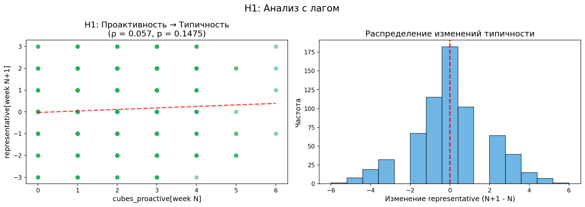
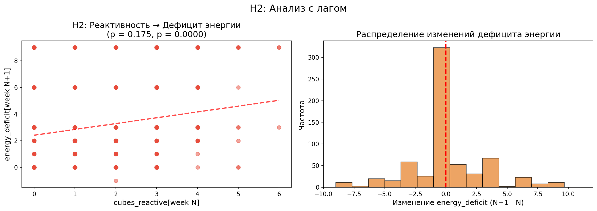
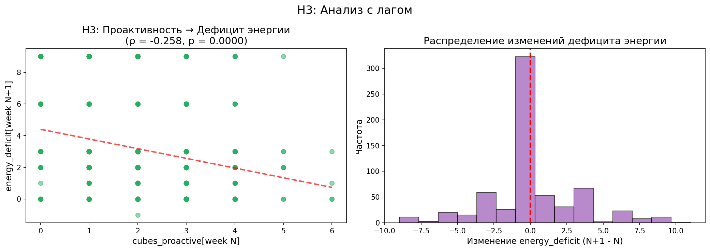
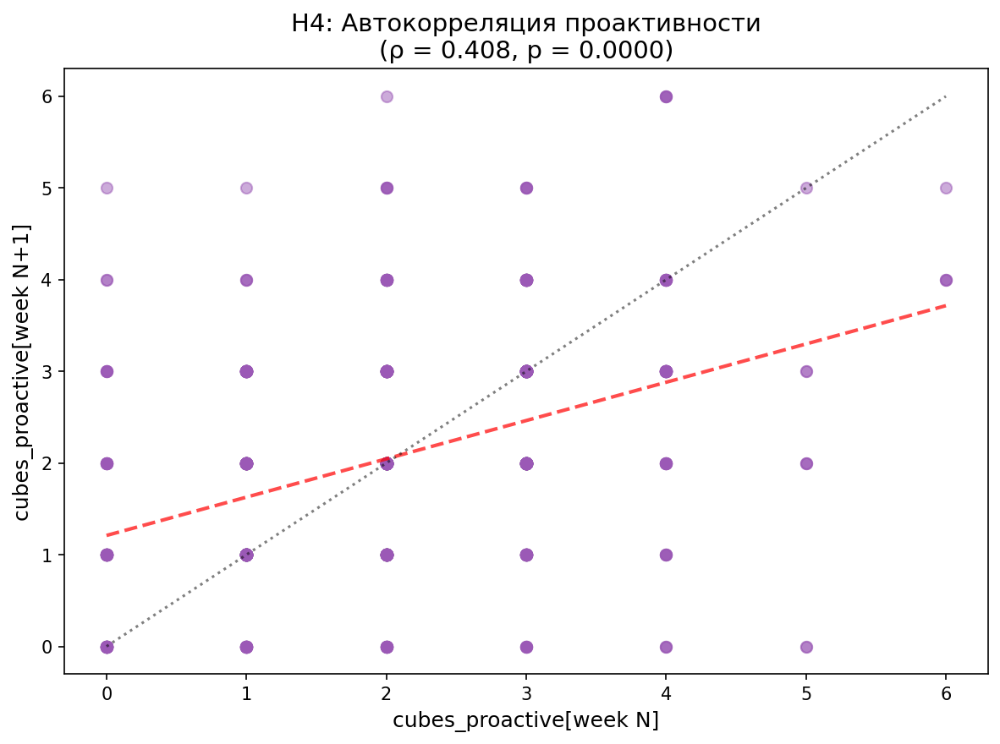
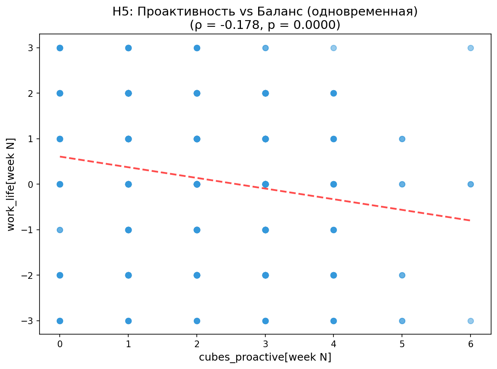
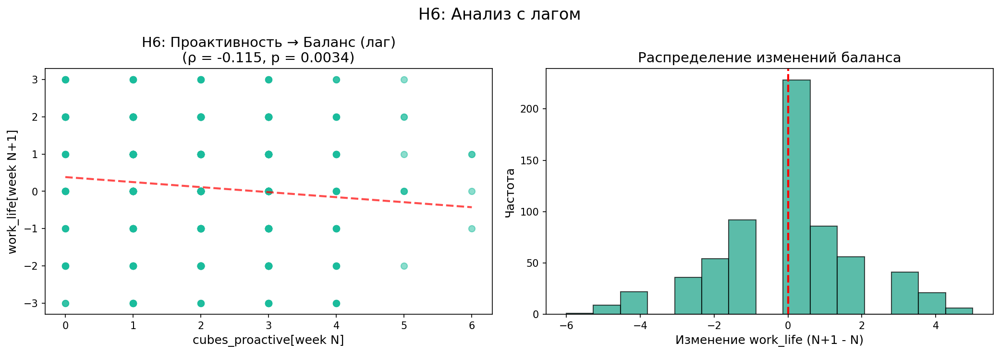
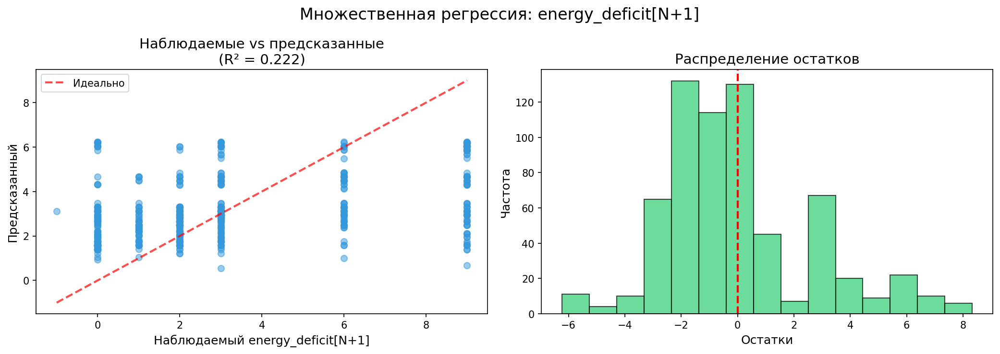
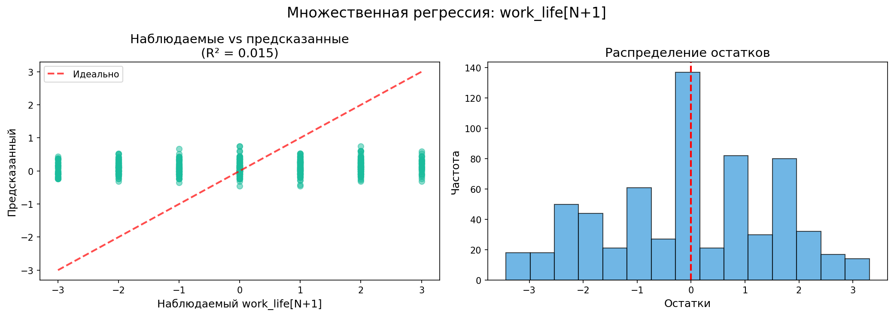

# Отчёт по лонгитюдному пульс-опросу (Q2 2026)

**Дата генерации:** 2026-06-29 16:51
**Всего наблюдений:** 805
**Участников:** 153
**Недель:** 13

---

## Введение

Это лонгитюдное исследование с еженедельными пульс-опросами. 
Каждый участник заполнял опрос раз в неделю в течение нескольких недель.

**Цель анализа:** проверить гипотезы с временным лагом — влияние поведения на одной неделе 
на показатели следующей недели.

---

## Описательная статистика

**Всего наблюдений:** 805

**Уникальных участников:** 153

**Недели:** ['${НомерНедели}', '1', '10', '11', '12', '2', '3', '4', '5', '6', '7', '8', '9']

**Распределение переменных:**

| Переменная | Среднее | Медиана | Стд. откл. | Диапазон |
| :---------------- | :------ | :------ | :--------- | :---------- |
| cubes_reactive | 1.7 | 1.0 | 1.23 | [0.0, 6.0] |
| cubes_proactive | 2.0 | 2.0 | 1.19 | [0.0, 6.0] |
| cubes_operational | 2.3 | 2.0 | 1.13 | [0.0, 6.0] |
| representative | 0.1 | 0.0 | 1.49 | [-3.0, 3.0] |
| work_life | 0.2 | 0.0 | 1.60 | [-3.0, 3.0] |
| energy_deficit | 3.2 | 3.0 | 2.91 | [-3.0, 9.0] |

## Проверка гипотез с временным лагом

**Методология:**

Для проверки гипотез с лагом используется корреляционный анализ Спирмена:
- Корреляция Спирмена подходит для ранговых данных (ипсативные кубики, Likert-шкалы)
- Проверяется связь предиктора на неделе N с исходом на неделе N+1
- Контроль автокорреляции через включение базового уровня исхода

**Гипотезы:**

1. **H1:** `cubes_proactive[week N]` положительно коррелирует с `representative[week N+1]`
   - Ожидание: проактивное планирование улучшает типичность следующей недели

2. **H2:** `cubes_reactive[week N]` положительно коррелирует с `energy_deficit[week N+1]`
   - Ожидание: реактивность приводит к накоплению дефицита энергии

3. **H3:** `cubes_proactive[week N]` отрицательно коррелирует с `energy_deficit[week N+1]`
   - Ожидание: проактивность снижает накопление дефицита энергии

4. **H4:** `cubes_proactive[week N]` положительно коррелирует с `cubes_proactive[week N+1]`
   - Ожидание: проактивность — устойчивая привычка (автокорреляция)

5. **H5:** `cubes_proactive[week N]` положительно коррелирует с `work_life[week N]`
   - Ожидание: проактивность связана с лучшим балансом работа/личное

6. **H6:** `cubes_proactive[week N]` положительно коррелирует с `work_life[week N+1]`
   - Ожидание: проактивность улучшает баланс на следующей неделе

**Размер выборки (пары наблюдений):** n = 652

### H1: Влияние проактивности на типичность следующей недели

**Результаты:**

- Корреляция Спирмена: ρ = 0.057, p = 0.1475 n.s.

- Частичная корреляция (контроль автокорреляции): ρ = -0.022, p = 0.5743

- Направление связи: Положительное

- ⚪ **Гипотеза H1 НЕ подтверждается:** связь не статистически значима

### H2: Влияние реактивности на дефицит энергии следующей недели

**Результаты:**

- Корреляция Спирмена: ρ = 0.175, p = 0.0000 ***

- Частичная корреляция (контроль автокорреляции): ρ = 0.044, p = 0.2629

- Направление связи: Положительное

- ✅ **Гипотеза H2 ПОДТВЕРЖДАЕТСЯ:** реактивность на неделе N предсказывает больший дефицит энергии на неделе N+1

### H3: Влияние проактивности на дефицит энергии следующей недели

**Результаты:**

- Корреляция Спирмена: ρ = -0.258, p = 0.0000 ***

- Частичная корреляция (контроль автокорреляции): ρ = -0.095, p = 0.0158

- Направление связи: Отрицательное

- ✅ **Гипотеза H3 ПОДТВЕРЖДАЕТСЯ:** проактивность на неделе N предсказывает меньший дефицит энергии на неделе N+1

### H4: Автокорреляция проактивности (устойчивость привычки)

**Результаты:**

- Корреляция Спирмена: ρ = 0.408, p = 0.0000 ***

- Направление связи: Положительное

- ✅ **Гипотеза H4 ПОДТВЕРЖДАЕТСЯ:** проактивность — устойчивая привычка (значимая автокорреляция)

### H5: Связь проактивности с балансом работа/личное (одновременная)

**Результаты:**

- Корреляция Спирмена: ρ = -0.178, p = 0.0000 ***

- Направление связи: Отрицательное

- ❌ **Гипотеза H5 Опровергается:** наблюдается отрицательная связь

### H6: Влияние проактивности на баланс следующей недели

**Результаты:**

- Корреляция Спирмена: ρ = -0.115, p = 0.0034 **

- Частичная корреляция (контроль автокорреляции): ρ = -0.068, p = 0.0845

- Направление связи: Отрицательное

- ❌ **Гипотеза H6 Опровергается:** наблюдается отрицательная связь

### Сводные результаты

| Гипотеза | Предиктор[week N] | Исход[week N+1] | Ожидание | ρ (Спирмен) | p-value | Частичная ρ | p (частичная) | Вывод |
| :------- | :---------------- | :-------------- | :---------------- | :---------- | :------ | :---------- | :------------ | :---------------- |
| H1 | cubes_proactive | representative | Положительная (+) | 0.057 | 0.1475 | -0.022 | 0.5743 | Не подтверждается |
| H2 | cubes_reactive | energy_deficit | Положительная (+) | 0.175 | 0.0000 | 0.044 | 0.2629 | Подтверждается |
| H3 | cubes_proactive | energy_deficit | Отрицательная (-) | -0.258 | 0.0000 | -0.095 | 0.0158 | Подтверждается |
| H4 | cubes_proactive | cubes_proactive | Положительная (+) | 0.408 | 0.0000 | — | — | Подтверждается |
| H5 | cubes_proactive | work_life | Положительная (+) | -0.178 | 0.0000 | — | — | Не подтверждается |
| H6 | cubes_proactive | work_life | Положительная (+) | -0.115 | 0.0034 | -0.068 | 0.0845 | Не подтверждается |

## Множественная регрессия: предсказание дефицита энергии

**Цель:** Оценить вклад проактивности и реактивности в дефицит энергии следующей недели,
контролируя базовый уровень дефицита.

**Модель:** `energy_deficit[N+1] = β₀ + β₁×cubes_proactive[N] + β₂×cubes_reactive[N] + β₃×energy_deficit[N]`

**Интерпретация:**
- β₁ < 0: проактивность снижает дефицит энергии
- β₂ > 0: реактивность увеличивает дефицит энергии
- β₃ > 0: автокорреляция дефицита энергии

**Размер выборки:** n = 652

**Результаты регрессии:**

- R² = 0.222

- Adjusted R² = 0.219

- F(3, 648) = 61.68, p = 0.000000

| Предиктор | β | SE | t | p | Значимость |
| :----------------- | :------ | :----- | :---- | :----- | :--------- |
| Intercept | 2.1282 | 0.3976 | 5.35 | 0.0000 | *** |
| cubes_proactive[N] | -0.1821 | 0.1106 | -1.65 | 0.1002 | n.s. |
| cubes_reactive[N] | -0.0077 | 0.1037 | -0.07 | 0.9405 | n.s. |
| energy_deficit[N] | 0.4564 | 0.0395 | 11.56 | 0.0000 | *** |

**Интерпретация коэффициентов:**

- **cubes_proactive[N]:** β = -0.1821, p = 0.1002 — не значимый предиктор

- **cubes_reactive[N]:** β = -0.0077, p = 0.9405 — не значимый предиктор

- **energy_deficit[N]:** β = 0.4564, p = 0.0000 — значимая автокорреляция дефицита энергии

**Сравнение с корреляционным анализом:**

- В корреляционном анализе без контроля автокорреляции:

  - cubes_proactive → energy_deficit[N+1]: ρ = -0.258, p = 0.0000

  - cubes_reactive → energy_deficit[N+1]: ρ = 0.175, p = 0.0000

- В регрессии с контролем energy_deficit[N]:

  - cubes_proactive: β = -0.1821, p = 0.1002

  - cubes_reactive: β = -0.0077, p = 0.9405

## Множественная регрессия: предсказание баланса работа/личное

**Цель:** Оценить вклад проактивности, реактивности и дефицита энергии в баланс работа/личное на следующей неделе.

**Модель:** `work_life[N+1] = β₀ + β₁×cubes_proactive[N] + β₂×cubes_reactive[N] + β₃×energy_deficit[N]`

**Интерпретация:**
- β₁ > 0: проактивность улучшает баланс
- β₂ < 0: реактивность ухудшает баланс
- β₃ < 0: дефицит энергии ухудшает баланс

**Размер выборки:** n = 652

**Результаты регрессии:**

- R² = 0.015

- Adjusted R² = 0.011

- F(3, 648) = 3.32, p = 0.019406

| Предиктор | β | SE | t | p | Значимость |
| :----------------- | :------ | :----- | :---- | :----- | :--------- |
| Intercept | 0.4419 | 0.2391 | 1.85 | 0.0650 | n.s. |
| cubes_proactive[N] | -0.1498 | 0.0665 | -2.25 | 0.0246 | * |
| cubes_reactive[N] | -0.0795 | 0.0624 | -1.27 | 0.2028 | n.s. |
| energy_deficit[N] | 0.0344 | 0.0237 | 1.45 | 0.1475 | n.s. |

**Интерпретация коэффициентов:**

- **cubes_proactive[N]:** β = -0.1498, p = 0.0246 — проактивность ухудшает баланс ✅

- **cubes_reactive[N]:** β = -0.0795, p = 0.2028 — не значимый

- **energy_deficit[N]:** β = 0.0344, p = 0.1475 — не значимый

**Итоговые выводы:**

⚪ Ни один предиктор не показал значимого влияния на баланс

## Методология

**Статистические методы:**

1. **Корреляция Спирмена** — непараметрическая мера монотонной связи для ранговых данных
2. **Частичная корреляция** — контроль автокорреляции (влияние базового уровня исхода)
3. **Лаговый анализ** — создание пар наблюдений (week N, week N+1) для каждого участника

**Обоснование выбора методов:**

- Все переменные имеют ранговую природу (ипсативные кубики, шкалы Likert)
- Корреляция Спирмена не требует предположений о нормальности распределения
- Контроль автокорреляции важен для корректной оценки лаговых эффектов

---

**Примечание к интерпретации:**
- ρ (Спирмен): слабая |ρ| < 0.3, средняя 0.3 ≤ |ρ| < 0.5, сильная |ρ| ≥ 0.5
- p < 0.05 — статистически значимый результат
- Частичная корреляция контролирует влияние базового уровня зависимой переменной

---
*Отчёт сгенерирован автоматически*

