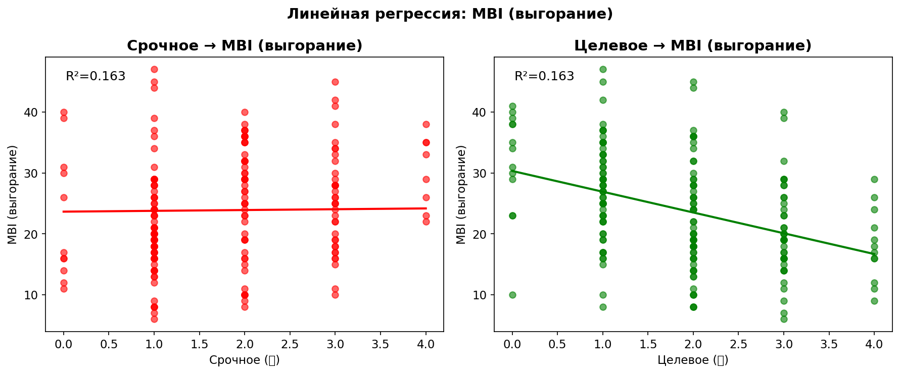
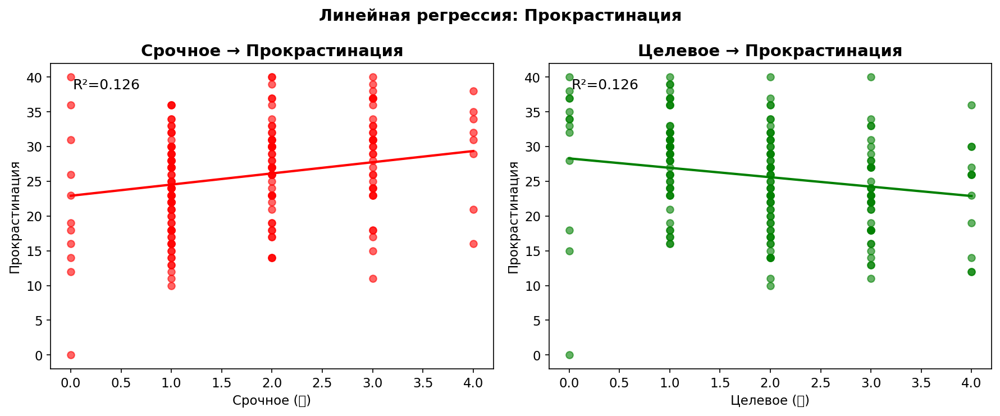
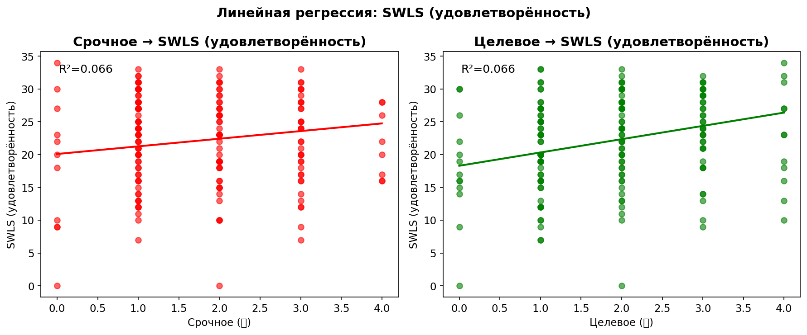

# Отчёт анализа данных опроса "Три коробочки"

**Дата генерации:** 2026-04-06 12:41
**Всего респондентов:** 307
**Завершили опрос:** 184

---

## Описание исследования

Методика "Три коробочки" — ипсативный инструмент распределения ограниченного 
ресурса (6 единиц энергии) между тремя функциональными категориями:

- 🔴 **Срочное (Реактивность)** — задачи, требующие немедленного решения
- 🟢 **Целевое (Проактивность)** — задачи, приближающие к долгосрочным целям
- ⚪ **Операционное (Поддержание)** — рутинные задачи и восстановление

Цель исследования — валидация инструмента через анализ связи с продуктивностью,
выгоранием и удовлетворённостью жизнью.

---

## Описательная статистика

**Демография завершённых анкет:**

- Возраст: M = 37.2, SD = 8.3, диапазон = 19-61, n = 182

- Пол: {'male': 132, 'female': 50}

- Должности: {'Старший специалист': 42, 'Менеджер среднего звена': 38, 'Специалист': 34, 'Тимлид': 20, 'Высший менеджмент': 15, 'Владелец бизнеса': 14, 'Фрилансер': 12, 'Младший специалист': 3, 'Другое': 2, 'Безработный': 1, 'Школьник / Студент': 1}

**Распределение кубиков по зонам:**

- Срочное ●: M = 1.75, SD = 0.99, диапазон = 0-4

- Целевое ●: M = 1.89, SD = 1.03, диапазон = 0-4

- Операционное ●: M = 2.33, SD = 0.94, диапазон = 0-6

**Распределение уровней профиля:**

| Уровень | Профиль | n | % |
| --- | --- | --- | --- |
| 1 | Хаос (все зоны равны) | 17 | 9.2% |
| 2 | Выживание (К>З>С) | 15 | 8.2% |
| 3 | Кризис (К>С>З или С>К>З) | 55 | 29.9% |
| 4 | Не сдаёмся (З>К>С) | 17 | 9.2% |
| 5 | Рост (З>С>К) | 35 | 19.0% |
| 6 | Дзен (С>З>К) | 45 | 24.5% |

**Шкалы валидации:**

- Прокрастинация: M = 25.7, SD = 7.4, диапазон = 0-40

- SWLS (удовлетворённость): M = 22.1, SD = 6.8, диапазон = 0-34

- MBI (выгорание): M = 23.9, SD = 8.9, диапазон = 6-47

## Визуализации распределений

**Контекстуальные показатели:**

*Значимость: *** p<0.001, ** p<0.01, * p<0.05, n.s. - не значимо | eps=1*

## Проверка гипотез исследования

### H0: Различия между уровнями профиля

Различия между уровнями 1-6 по MBI, прокрастинации и SWLS

**Прокрастинация:**

**Односторонний ANOVA**:

- Статистика: 6.555

- p-value: 0.0000

- Размер эффекта: 0.155

**Вывод**: Результат значим (p < 0.05). Подтверждается

*Post-hoc сравнения доступны в детальном анализе*

| Уровень | M | SD | n |
| --- | --- | --- | --- |
| 1 | 23.8 | 9.5 | 17 |
| 2 | 26.1 | 7.3 | 15 |
| 3 | 29.4 | 6.3 | 55 |
| 4 | 26.9 | 7.0 | 17 |
| 5 | 21.3 | 5.8 | 35 |
| 6 | 24.9 | 7.1 | 45 |

**SWLS:**

**Односторонний ANOVA**:

- Статистика: 1.009

- p-value: 0.4140

- Размер эффекта: 0.028

**Вывод**: Результат не значим (p > 0.05). Не подтверждается

| Уровень | M | SD | n |
| --- | --- | --- | --- |
| 1 | 20.6 | 10.1 | 17 |
| 2 | 22.5 | 5.3 | 15 |
| 3 | 21.0 | 6.4 | 55 |
| 4 | 24.4 | 5.9 | 17 |
| 5 | 23.2 | 6.7 | 35 |
| 6 | 22.2 | 6.7 | 45 |

**MBI (выгорание):**

**Односторонний ANOVA**:

- Статистика: 6.486

- p-value: 0.0000

- Размер эффекта: 0.154

**Вывод**: Результат значим (p < 0.05). Подтверждается

*Post-hoc сравнения доступны в детальном анализе*

| Уровень | M | SD | n |
| --- | --- | --- | --- |
| 1 | 21.2 | 10.4 | 17 |
| 2 | 26.0 | 5.9 | 15 |
| 3 | 28.4 | 8.1 | 55 |
| 4 | 21.8 | 6.5 | 17 |
| 5 | 18.9 | 7.5 | 35 |
| 6 | 23.3 | 9.5 | 45 |

### H1: Корреляция 🔴 с валидационными шкалами

🔴 положительно коррелирует с прокрастинацией и MBI

**🔴 (0-4) vs Прокрастинация (0-40):**

Коэффициент корреляции r = 0.324, p = 0.0000

Диапазон значений: 🔴 [0; 4], Прокрастинация [0; 40]

**Вывод**: Подтверждается (положительная связь)

**🔴 (0-4) vs MBI (выгорание) (6-47):**

Коэффициент корреляции r = 0.253, p = 0.0005

Диапазон значений: 🔴 [0; 4], MBI (выгорание) [6; 47]

**Вывод**: Подтверждается (положительная связь)

**🔴 (0-4) vs SWLS (удовлетворённость) (0-34) (дополнительно):**

Коэффициент корреляции r = -0.030, p = 0.6815

Диапазон значений: 🔴 [0; 4], SWLS (удовлетворённость) [0; 34]

**Вывод**: Связь не обнаружена

### H2: Корреляция 🟢 с валидационными шкалами

🟢 положительно коррелирует с SWLS и отрицательно с MBI

**🟢 (0-4) vs SWLS (0-34):**

Коэффициент корреляции r = 0.224, p = 0.0023

Диапазон значений: 🟢 [0; 4], SWLS [0; 34]

**Вывод**: Подтверждается (положительная связь)

**🟢 (0-4) vs MBI (6-47):**

Коэффициент корреляции r = -0.416, p = 0.0000

Диапазон значений: 🟢 [0; 4], MBI [6; 47]

**Вывод**: Подтверждается (отрицательная связь)

**🟢 (0-4) vs Прокрастинация (0-40) (дополнительно):**

Коэффициент корреляции r = -0.356, p = 0.0000

Диапазон значений: 🟢 [0; 4], Прокрастинация [0; 40]

**Вывод**: Обнаружена отрицательная связь

### H3: Низкое 🔴 и выгорание

Низкое 🔴 связано с более низким выгоранием

- Низкое 🔴 (<2): n = 88, M = 21.6, SD = 8.6

- Высокое 🔴 (≥2): n = 96, M = 25.9, SD = 8.7

**U-критерий Манна-Уитни**:

- Статистика: 2928.000

- p-value: 0.0003

**Вывод**: Результат значим (p < 0.05). Подтверждается

### H4: Доминирование 🟢 и удовлетворённость

Профили с доминированием 🟢 имеют высокие баллы SWLS

- Уровни 5-6 (доминирование 🟢): n = 80, M = 22.7, SD = 6.7

- Другие уровни: n = 104, M = 21.7, SD = 6.9

**U-критерий Манна-Уитни**:

- Статистика: 4498.500

- p-value: 0.1723

**Вывод**: Результат не значим (p > 0.05). Не подтверждается

### H5: Модерация записями

Модерация записями: восстановление по записям vs памяти

- По записям (4-5): n = 22

- По памяти (1-2): n = 148

| Зона | По записям | По памяти | Разница | p-value |
| --- | --- | --- | --- | --- |
| Целевое ● | 2.36 | 1.80 | +0.57 | p=0.026* |
| Срочное ● | 1.41 | 1.84 | -0.43 | p=0.046* |
| Операционное ● | 2.23 | 2.36 | -0.14 | p=0.494 |

Прокрастинация: по записям = 23.0, по памяти = 26.8 (p=0.028*)

MBI: по записям = 22.0, по памяти = 24.4 (p=0.223)

*Значимость: * p<0.05*

### H6: Модерация 🔴

Модерация красным: связь ⚪ с прокрастинацией усиливается при высоком 🔴

- Низкое 🔴 (0-1): корреляция ⚪-прокрастинация r = 0.261, p = 0.0140

- Высокое 🔴 (3+): корреляция ⚪-прокрастинация r = 0.314, p = 0.0359

**Вывод**: Подтверждается (связь сильнее при высоком 🔴)

### H7: Криволинейная связь 🟢 и MBI

Криволинейная связь 🟢 и выгорания (U-образная)

- Линейная модель: r = -0.403, p = 0.0000

*Требуется большая выборка для надёжной проверки U-образной зависимости*

### H8: Модерация балансом работа/личное

Баланс работа/личное как модератор связи 🔴 и выгорания

- Больше работы (work_life < 0): корреляция 🔴-MBI r = 0.137, p = 0.3089

- Больше личного (work_life > 0): корреляция 🔴-MBI r = 0.301, p = 0.0030

**Вывод**: Не подтверждается

### H9: Дефицит как медиатор

Энергетический дефицит как медиатор

- Прямая связь 🔴 → MBI: r = 0.253, p = 0.0005

- Связь 🔴 → дефицит: r = 0.292, p = 0.0001

- Связь дефицит → MBI: r = 0.345, p = 0.0000

*Полный медиационный анализ требует большей выборки*

### H10: Гендерные различия

Гендерные различия в распределении зон

- Мужчины: n = 132

- Женщины: n = 50

| Зона | Мужчины (M) | Женщины (M) | Разница | p-value |
| --- | --- | --- | --- | --- |
| Срочное ● | 1.73 | 1.78 | -0.05 | p=0.999 |
| Целевое ● | 1.92 | 1.82 | +0.10 | p=0.665 |
| Операционное ● | 2.30 | 2.40 | -0.10 | p=0.542 |

**Вывод**: Не подтверждается — нет значимых гендерных различий

### H11: Возрастной тренд

Возрастной тренд: с возрастом доля 🔴 снижается

- Срочное ●: r = nan, p = nan  — с возрастом растёт

- Целевое ●: r = nan, p = nan  — с возрастом растёт

- Операционное ●: r = nan, p = nan  — с возрастом растёт

### H12: Профиль Дзен и дефицит

Профиль "Дзен" связан с наименьшим энергетическим дефицитом

- Уровень 6 (Дзен): n = 45, M = 2.38

- Другие уровни: n = 139, M = 3.43

**U-критерий Манна-Уитни**:

- Статистика: 2452.500

- p-value: 0.0108

**Вывод**: Результат значим (p < 0.05). Подтверждается

### H7a: Линейная регрессия - предсказание по кубикам

Линейная регрессия: MBI, Прокрастинация и SWLS предсказываются числом красных и зеленых кубиков

**MBI (выгорание):**

- Уравнение: MBI (выгорание) = 30.10 + 0.13×Срочное + -3.41×Целевое

- R² = 0.163 (16.3% дисперсии объясняется моделью)

- Коэффициенты:

  - Intercept: 30.10 (p=0.000)

  - Срочное (🔴): 0.13 (p=0.857)

  - Целевое (🟢): -3.41 (p=0.000)

- Предсказательная способность модели: умеренная (R²=0.163)

**Прокрастинация:**

- Уравнение: Прокрастинация = 25.49 + 1.61×Срочное + -1.35×Целевое

- R² = 0.126 (12.6% дисперсии объясняется моделью)

- Коэффициенты:

  - Intercept: 25.49 (p=0.000)

  - Срочное (🔴): 1.61 (p=0.010)

  - Целевое (🟢): -1.35 (p=0.024)

- Предсказательная способность модели: умеренная (R²=0.126)

**SWLS (удовлетворённость):**

- Уравнение: SWLS (удовлетворённость) = 16.27 + 1.16×Срочное + 2.02×Целевое

- R² = 0.066 (6.6% дисперсии объясняется моделью)

- Коэффициенты:

  - Intercept: 16.27 (p=0.000)

  - Срочное (🔴): 1.16 (p=0.051)

  - Целевое (🟢): 2.02 (p=0.000)

- Предсказательная способность модели: слабая (R²=0.066)

### H10a: Владельцы бизнеса и высшее руководство

Владельцы бизнеса и высшее руководство отличаются по распределению кубиков от остальных

- Владельцы бизнеса и высшее руководство: n = 29

- Остальные: n = 155

| Зона | Руководство (M) | Остальные (M) | Разница | p-value |
| --- | --- | --- | --- | --- |
| Срочное ● | 1.48 | 1.80 | -0.32 | p=0.132 |
| Целевое ● | 2.14 | 1.85 | +0.29 | p=0.159 |
| Операционное ● | 2.38 | 2.32 | +0.06 | p=0.375 |

**Валидационные шкалы:**

- Прокрастинация: руководство = 23.7, остальные = 26.1 (p=0.142)

- SWLS: руководство = 24.0, остальные = 21.8 (p=0.122)

- MBI: руководство = 21.2, остальные = 24.4 (p=0.125)

**Вывод**: Не подтверждается — нет значимых различий между группами

## Анализ индекса ProductivityIndex (log₂(Целевое/Срочное))

**Описание индекса:**

ProductivityIndex — это логарифм по основанию 2 отношения количества кубиков в зоне "Целевое" к количеству
кубиков в зоне "Срочное" с добавлением небольшого смещения (eps) для избежания
деления на ноль и логарифмирования нуля.

Формула: ProductivityIndex = log₂((Целевое + eps) / (Срочное + eps))

Интерпретация:
- ProductivityIndex > 0: преобладание проактивности (целевые задачи доминируют)
- ProductivityIndex ≈ 0: баланс между срочными и целевыми задачами
- ProductivityIndex < 0: преобладание реактивности (срочные задачи доминируют)

Преимущество логарифмической шкалы по основанию 2:
- Симметрия: отношения 2:1 и 1:2 дают равные по модулю, но противоположные по знаку значения (+1 и -1)
- Интерпретируемость: значение +1 означает в 2 раза больше целевых, -1 — в 2 раза больше срочных
- При 7 кубиках и eps=1 диапазон составляет [-3, 3]

Высокий ProductivityIndex указывает на более продуктивный профиль распределения энергии.

**Параметр смещения:** eps = 1 (диапазон при 7 кубиках: [-3, 3])

**Описательная статистика ProductivityIndex:**

- M = 0.07, SD = 0.97

- Медиана = 0.00

- Диапазон = -2.32 – 2.32

**Распределение по категориям:**

- Преобладание проактивности (PI > 0.585): 44 (23.9%)

- Баланс (-0.585 ≤ PI ≤ 0.585): 103 (56.0%)

- Преобладание реактивности (PI < -0.585): 37 (20.1%)

**Корреляции ProductivityIndex с валидационными шкалами:**

- Прокрастинация: r = -0.382, p = 0.0000 * (умеренная отрицательная)

- SWLS: r = 0.150, p = 0.0427 * (слабая положительная)

- MBI: r = -0.382, p = 0.0000 * (умеренная отрицательная)

**Линейная регрессия с ProductivityIndex:**

*Модель: Зависимая переменная = β₀ + β₁ × ProductivityIndex*

**MBI (выгорание):**

- Уравнение: MBI (выгорание) = 24.10 + -3.34 × ProductivityIndex

- R² = 0.132 (13.2% дисперсии объясняется)

- Коэффициент ProductivityIndex: -3.34 (p=0.000)

- Предсказательная способность: умеренная (R²=0.132)

- Интерпретация: чем выше ProductivityIndex (больше проактивности), тем ниже MBI (выгорание)

**Прокрастинация:**

- Уравнение: Прокрастинация = 25.93 + -2.76 × ProductivityIndex

- R² = 0.132 (13.2% дисперсии объясняется)

- Коэффициент ProductivityIndex: -2.76 (p=0.000)

- Предсказательная способность: умеренная (R²=0.132)

- Интерпретация: чем выше ProductivityIndex (больше проактивности), тем ниже Прокрастинация

**SWLS (удовлетворённость):**

- Уравнение: SWLS (удовлетворённость) = 22.08 + 0.86 × ProductivityIndex

- R² = 0.015 (1.5% дисперсии объясняется)

- Коэффициент ProductivityIndex: 0.86 (p=0.096)

- Предсказательная способность: слабая (R²=0.015)

- Интерпретация: чем выше ProductivityIndex (больше проактивности), тем выше SWLS (удовлетворённость)

**Линейная регрессия с ProductivityIndex (типовая неделя, representative ∈ [-1, 1]):**

*Выборка: 124 из 184 респондентов (67.4%)*

| Показатель | Полная (β₁) | Полная (R²) | Полная (p) | Типовая (β₁) | Типовая (R²) | Типовая (p) | ΔR² |
| --- | --- | --- | --- | --- | --- | --- | --- |
| MBI (выгорание) | -3.340 | 0.132 | 0.0000 | -3.346 | 0.148 | 0.0000 | +0.016 |
| Прокрастинация | -2.765 | 0.132 | 0.0000 | -2.937 | 0.154 | 0.0000 | +0.022 |
| SWLS (удовлетворённость) | 0.864 | 0.015 | 0.0961 | 0.833 | 0.013 | 0.2002 | -0.002 |

**Детальная статистика (типовая неделя):**

- **MBI (выгорание):** MBI (выгорание) = 23.58 + -3.35 × PI, R² = 0.148, p = 0.0000

  → Чем выше ProductivityIndex, тем ниже MBI (выгорание)

- **Прокрастинация:** Прокрастинация = 26.03 + -2.94 × PI, R² = 0.154, p = 0.0000

  → Чем выше ProductivityIndex, тем ниже Прокрастинация

- **SWLS (удовлетворённость):** SWLS (удовлетворённость) = 21.71 + 0.83 × PI, R² = 0.013, p = 0.2002

  → Чем выше ProductivityIndex, тем выше SWLS (удовлетворённость)

**Выводы по индексу ProductivityIndex:**

- Наиболее сильная связь: с MBI (r=-0.382, p=0.000)

- Чем выше ProductivityIndex (больше проактивности), тем ниже MBI

- Логарифмическая шкала по основанию 2 обеспечивает симметрию и интерпретируемость:

  значения +X и -X соответствуют равному по силе, но противоположному по направлению дисбалансу

  Значение +1 означает в 2 раза больше целевых, -1 — в 2 раза больше срочных

- При 7 кубиках и eps=1 диапазон ProductivityIndex составляет [-3, 3]

- ProductivityIndex может быть полезен как компактный индикатор продуктивного профиля

- Используемый eps = 1 обеспечивает диапазон [-3, 3] при логарифме по основанию 2

## Анализ времени ответа на странице 2 (распределение кубиков)

**Описание анализа:**

Время, затраченное респондентом на распределение кубиков по зонам, может быть
связано с когнитивной нагрузкой при принятии решения. Например:
- Быстрое решение может указывать на уверенность или интуитивный выбор
- Длительное размышление может свидетельствовать о внутренней борьбе или
  желании дать социально ожидаемый ответ

Здесь анализируется корреляция между временем на странице 2 (в секундах)
и количеством кубиков в каждой зоне.

**Выборка:** 183 респондентов из 184 завершённых

**Отброшено выбросов:** 1 респондентов с временем > 3200 сек (100 × медиана = 32 сек)

**Время на странице 2:**

- M = 40.2 сек, SD = 36.6

- Медиана = 32.0 сек

- Диапазон = 2 – 397 сек

- Q1 = 24 сек, Q3 = 45 сек

**Корреляции Спирмена: время vs кубики:**

- Срочное ●: r = -0.042, p = 0.5740 n.s. (слабая отрицательная)

- Целевое ●: r = 0.123, p = 0.0972 n.s. (слабая положительная)

- Операционное ●: r = -0.035, p = 0.6410 n.s. (слабая отрицательная)

**Время ответа по уровням профиля:**

| Уровень | Профиль | n | M (сек) | SD |
| --- | --- | --- | --- | --- |
| 1 | Хаос (все зоны равны) | 17 | 33.8 | 16.2 |
| 2 | Выживание (К>З>С) | 15 | 42.9 | 22.9 |
| 3 | Кризис (К>С>З или С>К>З) | 55 | 33.9 | 16.6 |
| 4 | Не сдаёмся (З>К>С) | 17 | 32.8 | 14.9 |
| 5 | Рост (З>С>К) | 34 | 42.6 | 26.0 |
| 6 | Дзен (С>З>К) | 45 | 50.6 | 64.3 |

**Тест Крускала-Уоллиса: различия времени по уровням:**

- H = 4.100, p = 0.5351

- **Результат не значим**: нет статистически значимых различий во времени ответа между уровнями профиля (p > 0.05)

**Выводы по анализу времени:**

- Наиболее сильная связь времени с зоной Целевое ●: r = 0.123, p = 0.0972

- Направление: больше кубиков — больше времени

- Значимых корреляций (p < 0.05) не обнаружено

## Проверка гипотез на типовой неделе

**Описание анализа:**

Один из источников шума в данных — нетипичные недели. Респонденты, у которых
неделя была «значительно хуже» или «значительно лучше» обычной, могут иметь
искажённое распределение кубиков, не отражающее их типичный паттерн.

Здесь проверяются те же гипотезы, но только для респондентов, которые указали,
что их неделя была близка к обычной (значение representative от -1 до 1 включительно).

Сравниваются коэффициенты корреляции Спирмена для полной выборки и для
подвыборки типовой недели.

**Полная выборка:** 184 респондентов

**Типовая неделя (representative ∈ [-1, 1]):** 124 респондентов (67.4%)

**Сравнительная таблица корреляций Спирмена:**

| Гипотеза | Полная (r) | Полная (p) | Типовая (r) | Типовая (p) | delta_r | Значимо? |
| --- | --- | --- | --- | --- | --- | --- |
| 🔴 → Прокрастинация | 0.324 | 0.0000 | 0.368 | 0.0000 | +0.044 | — |
| 🔴 → MBI | 0.253 | 0.0005 | 0.274 | 0.0021 | +0.021 | — |
| 🔴 → SWLS | -0.030 | 0.6815 | -0.055 | 0.5439 | +0.025 | — |
| 🟢 → SWLS | 0.224 | 0.0023 | 0.193 | 0.0319 | -0.031 | — |
| 🟢 → MBI | -0.416 | 0.0000 | -0.424 | 0.0000 | +0.008 | — |
| 🟢 → Прокрастинация | -0.356 | 0.0000 | -0.422 | 0.0000 | +0.066 | — |
| Записи → MBI | nan | nan | nan | nan | N/A | N/A |
| 🟢² → MBI | -0.416 | 0.0000 | -0.424 | 0.0000 | +0.008 | — |
| Баланс×🔴 → MBI | 0.197 | 0.0073 | 0.309 | 0.0005 | +0.111 | ↑ усиление |
| Дефицит → MBI | 0.345 | 0.0000 | 0.276 | 0.0019 | -0.069 | — |

*delta_r — изменение абсолютного значения корреляции при переходе к типовой неделе*

**Корреляции зон с валидационными шкалами (типовая неделя):**

| Зона | Шкала | r | p | Знач. |
| --- | --- | --- | --- | --- |
| Срочное ● | Прокрастинация | 0.368 | 0.0000 | *** |
| Срочное ● | SWLS | -0.055 | 0.5439 |  |
| Срочное ● | MBI | 0.274 | 0.0021 | ** |
| Целевое ● | Прокрастинация | -0.422 | 0.0000 | *** |
| Целевое ● | SWLS | 0.193 | 0.0319 | * |
| Целевое ● | MBI | -0.424 | 0.0000 | *** |
| Операционное ● | Прокрастинация | 0.099 | 0.2725 |  |
| Операционное ● | SWLS | -0.049 | 0.5866 |  |
| Операционное ● | MBI | 0.116 | 0.2007 |  |

**Выводы по анализу типовой недели:**

- При фильтрации по типовой неделе:

  - Усилились корреляции: 1

  - Ослабели корреляции: 0

  - Стали значимыми: 0

  - Потеряли значимость: 0

- Фильтрация по типовой неделе не привела к появлению новых значимых связей

## Заключение

**Примечание к интерпретации:**
- p < 0.05 — статистически значимый результат
- Размер эффекта: малый = 0.2, средний = 0.5, большой = 0.8
- Корреляции: слабая |r| < 0.3, средняя 0.3 ≤ |r| < 0.5, сильная |r| ≥ 0.5

---
*Отчёт сгенерирован автоматически*

