# Отчёт анализа данных опроса "Три коробочки"

**Дата генерации:** 2026-04-21 14:19
**Всего респондентов:** 748
**Завершили опрос:** 502

---

## Описание исследования

Методика "Три коробочки" — ипсативный инструмент распределения ограниченного 
ресурса (6 единиц энергии) между тремя функциональными категориями:

- 🔴 **Срочное (Реактивность)** — задачи, требующие немедленного решения
- 🟢 **Целевое (Проактивность)** — задачи, приближающие к долгосрочным целям
- ⚪ **Операционное (Поддержание)** — рутинные задачи и восстановление

Цель исследования — валидация инструмента через анализ связи с продуктивностью,
выгоранием и удовлетворённостью жизнью.

---

## Описательная статистика

**Демография завершённых анкет:**

- Возраст: M = 37.1, SD = 8.1, диапазон = 19-61, n = 500

- Пол: {'male': 341, 'female': 159}

- Должности: {'Старший специалист': 122, 'Менеджер среднего звена': 98, 'Специалист': 82, 'Тимлид': 58, 'Высший менеджмент': 42, 'Фрилансер': 30, 'Владелец бизнеса': 26, 'Другое': 16, 'Безработный': 11, 'Школьник / Студент': 8, 'Младший специалист': 5, 'Ведение домашнего хозяйства': 2}

**Распределение кубиков по зонам:**

- Срочное ●: M = 1.84, SD = 1.03, диапазон = 0-6

- Целевое ●: M = 1.77, SD = 1.05, диапазон = 0-5

- Операционное ●: M = 2.36, SD = 1.01, диапазон = 0-6

**Распределение уровней профиля:**

| Уровень | Профиль | n | % |
| --- | --- | --- | --- |
| 1 | Хаос (2-2-2) | 34 | 6.8% |
| 2 | Выживание (К>З>С) | 53 | 10.6% |
| 3 | Апатия (С>К>З) | 90 | 17.9% |
| 4 | Кризис (К>С>З) | 86 | 17.1% |
| 5 | Не сдаёмся (З>К>С) | 41 | 8.2% |
| 6 | Рост (З>С>К) | 92 | 18.3% |
| 7 | Дзен (С>З>К) | 106 | 21.1% |

**Шкалы валидации:**

- Прокрастинация: M = 26.4, SD = 6.8, диапазон = 9-40

- SWLS (удовлетворённость): M = 21.8, SD = 6.3, диапазон = 5-34

- MBI (выгорание): M = 24.5, SD = 8.8, диапазон = 6-48

## Визуализации распределений

**Контекстуальные показатели:**

*Значимость: *** p<0.001, ** p<0.01, * p<0.05, n.s. - не значимо, ? - ненадёжно (мало данных/константа) | eps=1*

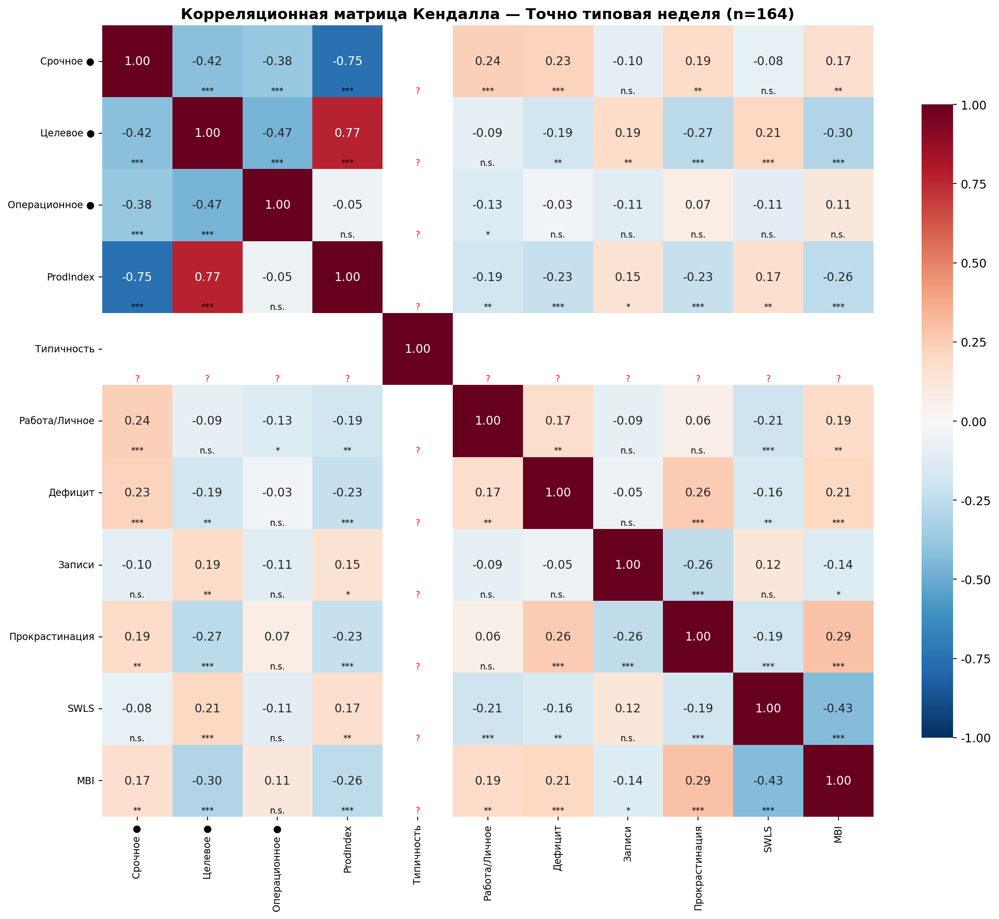

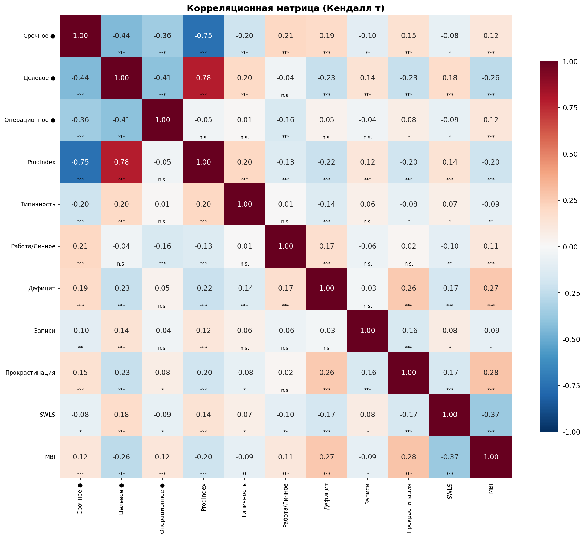

*Корреляция Кендалла (τ): *** p<0.001, ** p<0.01, * p<0.05, n.s. - не значимо | eps=1*

### Проверка нормальности распределений шкал

Для оценки соответствия распределений шкал нормальному закону проведены:
- **Тест Шапиро-Уилка** (Shapiro-Wilk): чувствителен к различным отклонениям от нормальности
- **Тест Д'Агостино** (D'Agostino-Pearson): основан на проверке асимметрии и эксцесса
- **Z-критерий для асимметрии и эксцесса**: |Z| > 1.96 указывает на значимое отклонение
- **QQ-plot**: визуальная проверка (точки должны лежать на прямой)

| Шкала | Описательная стат. | Шапиро-Уилк | Д'Агостино | Асимметрия | Эксцесс | Вывод |
| --- | --- | --- | --- | --- | --- | --- |
| Прокрастинация | 500, M = 26.4, SD = 6.8 | W = 0.9843, p = 0.0000 | K² = 16.859, p = 0.0002 | -0.198 (Z = -1.81) | -0.582 (Z = -6.60) | ❌ Значимое отклонение от нормальности |
| SWLS | 500, M = 21.8, SD = 6.3 | W = 0.9772, p = 0.0000 | K² = 26.298, p = 0.0000 | -0.291 (Z = -2.67) | -0.653 (Z = -7.39) | ❌ Значимое отклонение от нормальности |
| MBI | 502, M = 24.5, SD = 8.8 | W = 0.9869, p = 0.0002 | K² = 14.432, p = 0.0007 | 0.252 (Z = 2.31) | -0.509 (Z = -5.77) | ❌ Значимое отклонение от нормальности |

**Интерпретация:**

**Прокрастинация:**

Распределение левосторонняя асимметрия (склон к высоким значениям, Z = -1.81), значимый эксцесс (тяжёлые/лёгкие хвосты).

**SWLS:**

Распределение левосторонняя асимметрия (склон к высоким значениям, Z = -2.67), значимый эксцесс (тяжёлые/лёгкие хвосты).

**MBI:**

Распределение правосторонняя асимметрия (склон к низким значениям, Z = 2.31), значимый эксцесс (тяжёлые/лёгкие хвосты).

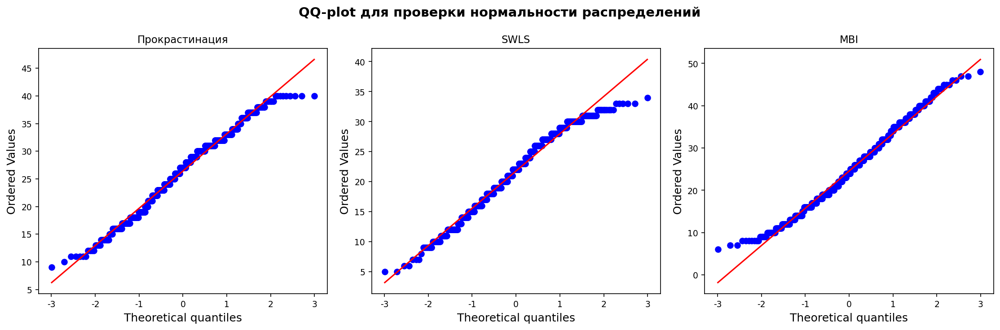

**Примечание:** При больших выборках (n > 200) тесты на нормальность обладают высокой мощностью и часто отвергают H₀ о нормальности даже при незначительных отклонениях. Для таких случаев рекомендуется использовать непараметрические тесты (Kruskal-Wallis, Манна-Уитни, Jonckheere-Terpstra), которые не требуют предположения о нормальности.

## Проверка гипотез исследования

### H0: Различия между уровнями профиля

Различия между уровнями 1-7 по MBI, прокрастинации и SWLS

**Прокрастинация:**

**Односторонний ANOVA**:

- Статистика: 7.639

- p-value: 0.0000

- Размер эффекта: 0.000

**Вывод**: Результат значим (p < 0.05). Подтверждается

*Post-hoc сравнения доступны в детальном анализе*

| Уровень | M | SD | n |
| --- | --- | --- | --- |
| 4 — Кризис (К>С>З) | 29.4 | 6.0 | 86 |
| 3 — Апатия (С>К>З) | 27.4 | 6.2 | 90 |
| 7 — Дзен (С>З>К) | 26.7 | 6.8 | 106 |
| 2 — Выживание (К>З>С) | 26.4 | 6.8 | 53 |
| 5 — Не сдаёмся (З>К>С) | 25.8 | 6.3 | 41 |
| 1 — Хаос (2-2-2) | 24.6 | 6.9 | 32 |
| 6 — Рост (З>С>К) | 23.2 | 6.6 | 92 |

**SWLS:**

**Односторонний ANOVA**:

- Статистика: 4.035

- p-value: 0.0006

- Размер эффекта: 0.000

**Вывод**: Результат значим (p < 0.05). Подтверждается

*Post-hoc сравнения доступны в детальном анализе*

| Уровень | M | SD | n |
| --- | --- | --- | --- |
| 6 — Рост (З>С>К) | 23.5 | 6.1 | 92 |
| 5 — Не сдаёмся (З>К>С) | 22.9 | 5.2 | 41 |
| 2 — Выживание (К>З>С) | 22.7 | 4.7 | 53 |
| 1 — Хаос (2-2-2) | 22.6 | 6.6 | 32 |
| 7 — Дзен (С>З>К) | 21.9 | 6.5 | 106 |
| 3 — Апатия (С>К>З) | 20.4 | 6.5 | 90 |
| 4 — Кризис (К>С>З) | 19.8 | 6.5 | 86 |

**MBI (выгорание):**

**Односторонний ANOVA**:

- Статистика: 7.593

- p-value: 0.0000

- Размер эффекта: 0.084

**Вывод**: Результат значим (p < 0.05). Подтверждается

*Post-hoc сравнения доступны в детальном анализе*

| Уровень | M | SD | n |
| --- | --- | --- | --- |
| 3 — Апатия (С>К>З) | 28.0 | 8.2 | 90 |
| 4 — Кризис (К>С>З) | 27.2 | 8.6 | 86 |
| 7 — Дзен (С>З>К) | 24.6 | 9.2 | 106 |
| 2 — Выживание (К>З>С) | 23.6 | 6.9 | 53 |
| 1 — Хаос (2-2-2) | 22.6 | 10.0 | 34 |
| 5 — Не сдаёмся (З>К>С) | 21.7 | 7.0 | 41 |
| 6 — Рост (З>С>К) | 21.1 | 8.7 | 92 |

## H0a: Тренд по позиции 🟢 (все респонденты, Jonckheere-Terpstra)

Тренд по позиции 🟢 (все респонденты): MBI и прокрастинация X < Y < Z, SWLS X > Y > Z

**Описание (полная выборка):**

Все респонденты делятся на 3 группы по позиции зоны «Целевое» (🟢) при сортировке зон по убыванию:
- **Уровень R1:** 🟢 на 1-м месте (или все зоны равны)
- **Уровень R2:** 🟢 на 2-м месте
- **Уровень R3:** 🟢 на 3-м месте

Направленная гипотеза:
MBI (выгорание) растёт: R1 < R2 < R3, Прокрастинация растёт: R1 < R2 < R3, SWLS убывает: R1 > R2 > R3

Для проверки используется **тест Джонкхира-Терпстры (Jonckheere-Terpstra)** — непараметрический тест для упорядоченных альтернатив.

**Распределение по позициям 🟢 (полная выборка):**

| Позиция 🟢 | n |
| --- | --- |
| R1 (🟢 1-е) | 165 |
| R2 (🟢 2-е) | 125 |
| R3 (🟢 3-е) | 212 |

**MBI (выгорание):**

| Позиция 🟢 | M | SD | n |
| --- | --- | --- | --- |
| R1 (🟢 1-е) | 21.6 | 8.6 | 165 |
| R2 (🟢 2-е) | 23.3 | 8.4 | 125 |
| R3 (🟢 3-е) | 27.6 | 8.4 | 212 |

- **Ожидаемый тренд:** R1 < R2 < R3 (рост)

- **Jonckheere-Terpstra:** J = 53028, p = 0.000000

- ✅ **Подтверждается**: направленная гипотеза подтверждается (p < 0.05)

**Попарные сравнения (U-тест, α = 0.0167, Бонферрони):**

- **R1 vs R2:** M(21.6) vs M(23.3), Δ = +1.7, U = 9074, p = 0.0798, p_adj = 0.2394 ❌

- **R2 vs R3:** M(23.3) vs M(27.6), Δ = +4.2, U = 9316, p = 0.0000, p_adj = 0.0000 ✅

- **R1 vs R3:** M(21.6) vs M(27.6), Δ = +6.0, U = 10687, p = 0.0000, p_adj = 0.0000 ✅

**Прокрастинация:**

| Позиция 🟢 | M | SD | n |
| --- | --- | --- | --- |
| R1 (🟢 1-е) | 24.0 | 6.6 | 163 |
| R2 (🟢 2-е) | 25.8 | 6.8 | 125 |
| R3 (🟢 3-е) | 28.6 | 6.2 | 212 |

- **Ожидаемый тренд:** R1 < R2 < R3 (рост)

- **Jonckheere-Terpstra:** J = 52044, p = 0.000000

- ✅ **Подтверждается**: направленная гипотеза подтверждается (p < 0.05)

**Попарные сравнения (U-тест, α = 0.0167, Бонферрони):**

- **R1 vs R2:** M(24.0) vs M(25.8), Δ = +1.8, U = 8650, p = 0.0281, p_adj = 0.0842 ❌

- **R2 vs R3:** M(25.8) vs M(28.6), Δ = +2.8, U = 10154, p = 0.0003, p_adj = 0.0010 ✅

- **R1 vs R3:** M(24.0) vs M(28.6), Δ = +4.6, U = 10584, p = 0.0000, p_adj = 0.0000 ✅

**SWLS:**

| Позиция 🟢 | M | SD | n |
| --- | --- | --- | --- |
| R1 (🟢 1-е) | 23.2 | 6.0 | 163 |
| R2 (🟢 2-е) | 22.8 | 5.6 | 125 |
| R3 (🟢 3-е) | 20.1 | 6.5 | 212 |

- **Ожидаемый тренд:** R1 > R2 > R3 (убывание)

- **Jonckheere-Terpstra:** J = 32261, p = 0.000001

- ✅ **Подтверждается**: направленная гипотеза подтверждается (p < 0.05)

**Попарные сравнения (U-тест, α = 0.0167, Бонферрони):**

- **R1 vs R2:** M(23.2) vs M(22.8), Δ = -0.4, U = 10696, p = 0.4677, p_adj = 1.0000 ❌

- **R2 vs R3:** M(22.8) vs M(20.1), Δ = -2.7, U = 16462, p = 0.0002, p_adj = 0.0006 ✅

- **R1 vs R3:** M(23.2) vs M(20.1), Δ = -3.1, U = 22012, p = 0.0000, p_adj = 0.0000 ✅

## H0b: Тренд по позиции 🟢 (типовая неделя rep=0, Jonckheere-Terpstra)

Тренд по позиции 🟢 (rep=0): MBI и прокрастинация X < Y < Z, SWLS X > Y > Z

**Описание (типовая неделя (n = 164)):**

Все респонденты делятся на 3 группы по позиции зоны «Целевое» (🟢) при сортировке зон по убыванию:
- **Уровень R1:** 🟢 на 1-м месте (или все зоны равны)
- **Уровень R2:** 🟢 на 2-м месте
- **Уровень R3:** 🟢 на 3-м месте

Направленная гипотеза:
MBI (выгорание) растёт: R1 < R2 < R3, Прокрастинация растёт: R1 < R2 < R3, SWLS убывает: R1 > R2 > R3

Для проверки используется **тест Джонкхира-Терпстры (Jonckheere-Terpstra)** — непараметрический тест для упорядоченных альтернатив.

**Распределение по позициям 🟢 (типовая неделя (n = 164)):**

| Позиция 🟢 | n |
| --- | --- |
| R1 (🟢 1-е) | 51 |
| R2 (🟢 2-е) | 34 |
| R3 (🟢 3-е) | 79 |

**MBI (выгорание):**

| Позиция 🟢 | M | SD | n |
| --- | --- | --- | --- |
| R1 (🟢 1-е) | 21.9 | 8.8 | 51 |
| R2 (🟢 2-е) | 22.6 | 8.0 | 34 |
| R3 (🟢 3-е) | 28.0 | 8.1 | 79 |

- **Ожидаемый тренд:** R1 < R2 < R3 (рост)

- **Jonckheere-Terpstra:** J = 5613, p = 0.000009

- ✅ **Подтверждается**: направленная гипотеза подтверждается (p < 0.05)

**Попарные сравнения (U-тест, α = 0.0167, Бонферрони):**

- **R1 vs R2:** M(21.9) vs M(22.6), Δ = +0.7, U = 826, p = 0.7125, p_adj = 1.0000 ❌

- **R2 vs R3:** M(22.6) vs M(28.0), Δ = +5.4, U = 841, p = 0.0017, p_adj = 0.0050 ✅

- **R1 vs R3:** M(21.9) vs M(28.0), Δ = +6.1, U = 1170, p = 0.0001, p_adj = 0.0002 ✅

**Прокрастинация:**

| Позиция 🟢 | M | SD | n |
| --- | --- | --- | --- |
| R1 (🟢 1-е) | 23.4 | 7.0 | 51 |
| R2 (🟢 2-е) | 26.0 | 7.3 | 34 |
| R3 (🟢 3-е) | 28.4 | 5.9 | 79 |

- **Ожидаемый тренд:** R1 < R2 < R3 (рост)

- **Jonckheere-Terpstra:** J = 5514, p = 0.000032

- ✅ **Подтверждается**: направленная гипотеза подтверждается (p < 0.05)

**Попарные сравнения (U-тест, α = 0.0167, Бонферрони):**

- **R1 vs R2:** M(23.4) vs M(26.0), Δ = +2.6, U = 688, p = 0.1097, p_adj = 0.3292 ❌

- **R2 vs R3:** M(26.0) vs M(28.4), Δ = +2.4, U = 1070, p = 0.0875, p_adj = 0.2624 ❌

- **R1 vs R3:** M(23.4) vs M(28.4), Δ = +5.0, U = 1176, p = 0.0001, p_adj = 0.0002 ✅

**SWLS:**

| Позиция 🟢 | M | SD | n |
| --- | --- | --- | --- |
| R1 (🟢 1-е) | 22.8 | 6.4 | 51 |
| R2 (🟢 2-е) | 23.1 | 5.5 | 34 |
| R3 (🟢 3-е) | 19.8 | 6.0 | 79 |

- **Ожидаемый тренд:** R1 > R2 > R3 (убывание)

- **Jonckheere-Terpstra:** J = 3268, p = 0.001523

- ✅ **Подтверждается**: направленная гипотеза подтверждается (p < 0.05)

**Попарные сравнения (U-тест, α = 0.0167, Бонферрони):**

- **R1 vs R2:** M(22.8) vs M(23.1), Δ = +0.2, U = 870, p = 0.9821, p_adj = 1.0000 ❌

- **R2 vs R3:** M(23.1) vs M(19.8), Δ = -3.2, U = 1746, p = 0.0115, p_adj = 0.0346 ✅

- **R1 vs R3:** M(22.8) vs M(19.8), Δ = -3.0, U = 2564, p = 0.0088, p_adj = 0.0263 ✅

## H0c: Тренд по позиции 🔴 (все респонденты, Jonckheere-Terpstra)

Тренд по позиции 🔴 (все респонденты): MBI и прокрастинация R1 > R2 > R3, SWLS R1 < R2 < R3

**Описание (полная выборка):**

Все респонденты делятся на 3 группы по позиции зоны «Срочное» (🔴) при сортировке зон по убыванию:
- **Уровень R1:** 🔴 на 1-м месте (или все зоны равны)
- **Уровень R2:** 🔴 на 2-м месте
- **Уровень R3:** 🔴 на 3-м месте

Направленная гипотеза:
SWLS растёт: R1 < R2 < R3, MBI (выгорание) убывает: R1 > R2 > R3, Прокрастинация убывает: R1 > R2 > R3

Для проверки используется **тест Джонкхира-Терпстры (Jonckheere-Terpstra)** — непараметрический тест для упорядоченных альтернатив.

**Распределение по позициям 🔴 (полная выборка):**

| Позиция 🔴 | n |
| --- | --- |
| R1 (🔴 1-е) | 175 |
| R2 (🔴 2-е) | 165 |
| R3 (🔴 3-е) | 162 |

**SWLS:**

| Позиция 🔴 | M | SD | n |
| --- | --- | --- | --- |
| R1 (🔴 1-е) | 21.3 | 6.1 | 173 |
| R2 (🔴 2-е) | 20.9 | 6.3 | 165 |
| R3 (🔴 3-е) | 23.2 | 6.2 | 162 |

- **Ожидаемый тренд:** R1 < R2 < R3 (рост)

- **Jonckheere-Terpstra:** J = 46569, p = 0.002521

- ✅ **Подтверждается**: направленная гипотеза подтверждается (p < 0.05)

**Попарные сравнения (U-тест, α = 0.0167, Бонферрони):**

- **R1 vs R2:** M(21.3) vs M(20.9), Δ = -0.3, U = 14820, p = 0.5423, p_adj = 1.0000 ❌

- **R2 vs R3:** M(20.9) vs M(23.2), Δ = +2.3, U = 10494, p = 0.0008, p_adj = 0.0023 ✅

- **R1 vs R3:** M(21.3) vs M(23.2), Δ = +1.9, U = 11418, p = 0.0034, p_adj = 0.0101 ✅

**MBI (выгорание):**

| Позиция 🔴 | M | SD | n |
| --- | --- | --- | --- |
| R1 (🔴 1-е) | 25.1 | 8.6 | 175 |
| R2 (🔴 2-е) | 26.4 | 8.3 | 165 |
| R3 (🔴 3-е) | 22.0 | 9.0 | 162 |

- **Ожидаемый тренд:** R1 > R2 > R3 (убывание)

- **Jonckheere-Terpstra:** J = 35999, p = 0.000357

- ✅ **Подтверждается**: направленная гипотеза подтверждается (p < 0.05)

**Попарные сравнения (U-тест, α = 0.0167, Бонферрони):**

- **R1 vs R2:** M(25.1) vs M(26.4), Δ = +1.3, U = 13107, p = 0.1417, p_adj = 0.4252 ❌

- **R2 vs R3:** M(26.4) vs M(22.0), Δ = -4.4, U = 17568, p = 0.0000, p_adj = 0.0000 ✅

- **R1 vs R3:** M(25.1) vs M(22.0), Δ = -3.1, U = 17280, p = 0.0005, p_adj = 0.0015 ✅

**Прокрастинация:**

| Позиция 🔴 | M | SD | n |
| --- | --- | --- | --- |
| R1 (🔴 1-е) | 27.6 | 6.7 | 173 |
| R2 (🔴 2-е) | 27.5 | 6.3 | 165 |
| R3 (🔴 3-е) | 24.0 | 6.7 | 162 |

- **Ожидаемый тренд:** R1 > R2 > R3 (убывание)

- **Jonckheere-Terpstra:** J = 32756, p = 0.000000

- ✅ **Подтверждается**: направленная гипотеза подтверждается (p < 0.05)

**Попарные сравнения (U-тест, α = 0.0167, Бонферрони):**

- **R1 vs R2:** M(27.6) vs M(27.5), Δ = -0.2, U = 14894, p = 0.4886, p_adj = 1.0000 ❌

- **R2 vs R3:** M(27.5) vs M(24.0), Δ = -3.4, U = 17288, p = 0.0000, p_adj = 0.0000 ✅

- **R1 vs R3:** M(27.6) vs M(24.0), Δ = -3.6, U = 18364, p = 0.0000, p_adj = 0.0000 ✅

## H0a1: Тренд по числу кубиков 🟢 (0→7, все респонденты, Jonckheere-Terpstra)

Тренд по числу кубиков 🟢 (0→7, все респонденты): MBI и прокрастинация ↓, SWLS ↑

**Описание (полная выборка):**

Все респонденты группируются по количеству кубиков в зоне «Целевое» (🟢) от 0 до 7:
- **0 кубиков 🟢** — зона полностью отсутствует
- **1 кубик 🟢**
- ...
- **7 кубиков 🟢** — все кубики в Целевое

Направленная гипотеза:
SWLS растёт: 0 < 1 < 2 < ... < 7, MBI (выгорание) убывает: 0 > 1 > 2 > ... > 7, Прокрастинация убывает: 0 > 1 > 2 > ... > 7

Для проверки используется **тест Джонкхира-Терпстры (Jonckheere-Terpstra)** — непараметрический тест для упорядоченных альтернатив.

**Распределение по количеству кубиков 🟢 (полная выборка):**

| Уровень (🟢) | n |
| --- | --- |
| 0 кубик(ов) 🟢 | 42 |
| 1 кубик(ов) 🟢 | 191 |
| 2 кубик(ов) 🟢 | 136 |
| 3 кубик(ов) 🟢 | 106 |
| 4 кубик(ов) 🟢 | 25 |
| 5 кубик(ов) 🟢 | 2 |

**SWLS:**

| Уровень (🟢) | M | SD | n |
| --- | --- | --- | --- |
| 0 🟢 | 18.0 | 6.6 | 41 |
| 1 🟢 | 20.7 | 6.2 | 191 |
| 2 🟢 | 22.9 | 5.9 | 135 |
| 3 🟢 | 23.4 | 5.7 | 106 |
| 4 🟢 | 22.6 | 6.4 | 25 |
| 5 🟢 | 26.0 | 7.1 | 2 (n<10, искл.) |

- **Ожидаемый тренд:** рост с 0 до 7 кубиков

- **Jonckheere-Terpstra:** J = 54159, p = 0.000000

- ✅ **Подтверждается**: направленная гипотеза подтверждается (p < 0.05)

**Попарные сравнения (U-тест, α = 0.0050, Бонферрони, 10 сравнений):**

- **0 vs 1 🟢:** M(18.0) vs M(20.7), Δ = +2.7, U = 2938, p = 0.0122, p_adj = 0.1217 ❌

- **0 vs 2 🟢:** M(18.0) vs M(22.9), Δ = +4.9, U = 1578, p = 0.0000, p_adj = 0.0003 ✅

- **0 vs 3 🟢:** M(18.0) vs M(23.4), Δ = +5.4, U = 1140, p = 0.0000, p_adj = 0.0001 ✅

- **0 vs 4 🟢:** M(18.0) vs M(22.6), Δ = +4.6, U = 302, p = 0.0054, p_adj = 0.0540 ❌

- **1 vs 2 🟢:** M(20.7) vs M(22.9), Δ = +2.2, U = 10239, p = 0.0015, p_adj = 0.0153 ✅

- **1 vs 3 🟢:** M(20.7) vs M(23.4), Δ = +2.7, U = 7491, p = 0.0002, p_adj = 0.0020 ✅

- **1 vs 4 🟢:** M(20.7) vs M(22.6), Δ = +1.9, U = 2024, p = 0.2155, p_adj = 1.0000 ❌

- **2 vs 3 🟢:** M(22.9) vs M(23.4), Δ = +0.5, U = 6801, p = 0.5099, p_adj = 1.0000 ❌

- **2 vs 4 🟢:** M(22.9) vs M(22.6), Δ = -0.3, U = 1768, p = 0.7082, p_adj = 1.0000 ❌

- **3 vs 4 🟢:** M(23.4) vs M(22.6), Δ = -0.8, U = 1440, p = 0.5035, p_adj = 1.0000 ❌

**MBI (выгорание):**

| Уровень (🟢) | M | SD | n |
| --- | --- | --- | --- |
| 0 🟢 | 30.1 | 8.4 | 42 |
| 1 🟢 | 27.0 | 8.1 | 191 |
| 2 🟢 | 22.5 | 8.8 | 136 |
| 3 🟢 | 21.9 | 8.3 | 106 |
| 4 🟢 | 18.8 | 7.7 | 25 |
| 5 🟢 | 22.5 | 6.4 | 2 (n<10, искл.) |

- **Ожидаемый тренд:** убывание с 0 до 7 кубиков

- **Jonckheere-Terpstra:** J = 31667, p = 0.000000

- ✅ **Подтверждается**: направленная гипотеза подтверждается (p < 0.05)

**Попарные сравнения (U-тест, α = 0.0050, Бонферрони, 10 сравнений):**

- **0 vs 1 🟢:** M(30.1) vs M(27.0), Δ = -3.1, U = 4854, p = 0.0329, p_adj = 0.3290 ❌

- **0 vs 2 🟢:** M(30.1) vs M(22.5), Δ = -7.6, U = 4206, p = 0.0000, p_adj = 0.0000 ✅

- **0 vs 3 🟢:** M(30.1) vs M(21.9), Δ = -8.2, U = 3386, p = 0.0000, p_adj = 0.0000 ✅

- **0 vs 4 🟢:** M(30.1) vs M(18.8), Δ = -11.3, U = 881, p = 0.0000, p_adj = 0.0000 ✅

- **1 vs 2 🟢:** M(27.0) vs M(22.5), Δ = -4.5, U = 17042, p = 0.0000, p_adj = 0.0000 ✅

- **1 vs 3 🟢:** M(27.0) vs M(21.9), Δ = -5.2, U = 13784, p = 0.0000, p_adj = 0.0000 ✅

- **1 vs 4 🟢:** M(27.0) vs M(18.8), Δ = -8.3, U = 3706, p = 0.0000, p_adj = 0.0001 ✅

- **2 vs 3 🟢:** M(22.5) vs M(21.9), Δ = -0.7, U = 7392, p = 0.7339, p_adj = 1.0000 ❌

- **2 vs 4 🟢:** M(22.5) vs M(18.8), Δ = -3.8, U = 2140, p = 0.0403, p_adj = 0.4028 ❌

- **3 vs 4 🟢:** M(21.9) vs M(18.8), Δ = -3.1, U = 1642, p = 0.0639, p_adj = 0.6389 ❌

**Прокрастинация:**

| Уровень (🟢) | M | SD | n |
| --- | --- | --- | --- |
| 0 🟢 | 30.2 | 6.9 | 40 |
| 1 🟢 | 28.1 | 6.2 | 191 |
| 2 🟢 | 25.4 | 6.6 | 136 |
| 3 🟢 | 24.0 | 6.6 | 106 |
| 4 🟢 | 23.6 | 6.8 | 25 |
| 5 🟢 | 28.5 | 3.5 | 2 (n<10, искл.) |

- **Ожидаемый тренд:** убывание с 0 до 7 кубиков

- **Jonckheere-Terpstra:** J = 32937, p = 0.000000

- ✅ **Подтверждается**: направленная гипотеза подтверждается (p < 0.05)

**Попарные сравнения (U-тест, α = 0.0050, Бонферрони, 10 сравнений):**

- **0 vs 1 🟢:** M(30.2) vs M(28.1), Δ = -2.1, U = 4713, p = 0.0200, p_adj = 0.2003 ❌

- **0 vs 2 🟢:** M(30.2) vs M(25.4), Δ = -4.8, U = 3879, p = 0.0000, p_adj = 0.0004 ✅

- **0 vs 3 🟢:** M(30.2) vs M(24.0), Δ = -6.2, U = 3223, p = 0.0000, p_adj = 0.0000 ✅

- **0 vs 4 🟢:** M(30.2) vs M(23.6), Δ = -6.6, U = 774, p = 0.0002, p_adj = 0.0022 ✅

- **1 vs 2 🟢:** M(28.1) vs M(25.4), Δ = -2.7, U = 15986, p = 0.0004, p_adj = 0.0037 ✅

- **1 vs 3 🟢:** M(28.1) vs M(24.0), Δ = -4.1, U = 13589, p = 0.0000, p_adj = 0.0000 ✅

- **1 vs 4 🟢:** M(28.1) vs M(23.6), Δ = -4.5, U = 3300, p = 0.0019, p_adj = 0.0189 ✅

- **2 vs 3 🟢:** M(25.4) vs M(24.0), Δ = -1.4, U = 8036, p = 0.1250, p_adj = 1.0000 ❌

- **2 vs 4 🟢:** M(25.4) vs M(23.6), Δ = -1.8, U = 1971, p = 0.2062, p_adj = 1.0000 ❌

- **3 vs 4 🟢:** M(24.0) vs M(23.6), Δ = -0.4, U = 1375, p = 0.7716, p_adj = 1.0000 ❌

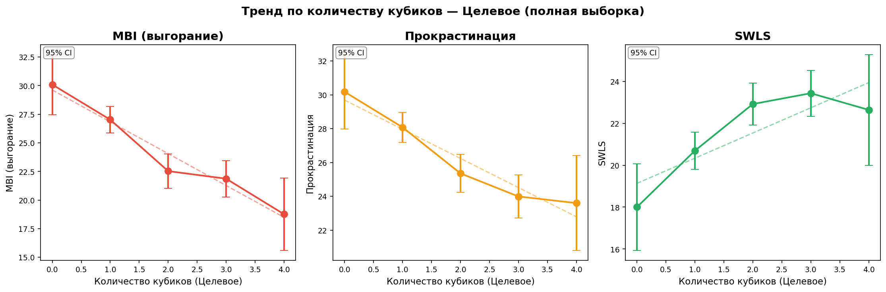

## H0b1: Тренд по числу кубиков 🟢 (0→7, типовая неделя rep=0, Jonckheere-Terpstra, n = 164)

Тренд по числу кубиков 🟢 (0→7, rep=0): MBI и прокрастинация ↓, SWLS ↑

**Описание (типовая неделя (n = 164)):**

Все респонденты группируются по количеству кубиков в зоне «Целевое» (🟢) от 0 до 7:
- **0 кубиков 🟢** — зона полностью отсутствует
- **1 кубик 🟢**
- ...
- **7 кубиков 🟢** — все кубики в Целевое

Направленная гипотеза:
SWLS растёт: 0 < 1 < 2 < ... < 7, MBI (выгорание) убывает: 0 > 1 > 2 > ... > 7, Прокрастинация убывает: 0 > 1 > 2 > ... > 7

Для проверки используется **тест Джонкхира-Терпстры (Jonckheere-Terpstra)** — непараметрический тест для упорядоченных альтернатив.

**Распределение по количеству кубиков 🟢 (типовая неделя (n = 164)):**

| Уровень (🟢) | n |
| --- | --- |
| 0 кубик(ов) 🟢 | 14 |
| 1 кубик(ов) 🟢 | 70 |
| 2 кубик(ов) 🟢 | 41 |
| 3 кубик(ов) 🟢 | 33 |
| 4 кубик(ов) 🟢 | 6 |

**SWLS:**

| Уровень (🟢) | M | SD | n |
| --- | --- | --- | --- |
| 0 🟢 | 16.8 | 5.7 | 14 |
| 1 🟢 | 20.5 | 5.8 | 70 |
| 2 🟢 | 23.0 | 5.8 | 41 |
| 3 🟢 | 23.9 | 6.3 | 33 |
| 4 🟢 | 18.7 | 6.5 | 6 (n<10, искл.) |

- **Ожидаемый тренд:** рост с 0 до 7 кубиков

- **Jonckheere-Terpstra:** J = 5547, p = 0.000022

- ✅ **Подтверждается**: направленная гипотеза подтверждается (p < 0.05)

**Попарные сравнения (U-тест, α = 0.0083, Бонферрони, 6 сравнений):**

- **0 vs 1 🟢:** M(16.8) vs M(20.5), Δ = +3.7, U = 319, p = 0.0404, p_adj = 0.2426 ❌

- **0 vs 2 🟢:** M(16.8) vs M(23.0), Δ = +6.2, U = 132, p = 0.0027, p_adj = 0.0161 ✅

- **0 vs 3 🟢:** M(16.8) vs M(23.9), Δ = +7.2, U = 92, p = 0.0013, p_adj = 0.0078 ✅

- **1 vs 2 🟢:** M(20.5) vs M(23.0), Δ = +2.5, U = 1089, p = 0.0345, p_adj = 0.2070 ❌

- **1 vs 3 🟢:** M(20.5) vs M(23.9), Δ = +3.5, U = 768, p = 0.0062, p_adj = 0.0370 ✅

- **2 vs 3 🟢:** M(23.0) vs M(23.9), Δ = +0.9, U = 602, p = 0.4231, p_adj = 1.0000 ❌

**MBI (выгорание):**

| Уровень (🟢) | M | SD | n |
| --- | --- | --- | --- |
| 0 🟢 | 31.4 | 7.3 | 14 |
| 1 🟢 | 27.4 | 7.9 | 70 |
| 2 🟢 | 22.5 | 9.0 | 41 |
| 3 🟢 | 20.8 | 7.4 | 33 |
| 4 🟢 | 22.7 | 11.3 | 6 (n<10, искл.) |

- **Ожидаемый тренд:** убывание с 0 до 7 кубиков

- **Jonckheere-Terpstra:** J = 2698, p = 0.000000

- ✅ **Подтверждается**: направленная гипотеза подтверждается (p < 0.05)

**Попарные сравнения (U-тест, α = 0.0083, Бонферрони, 6 сравнений):**

- **0 vs 1 🟢:** M(31.4) vs M(27.4), Δ = -4.0, U = 637, p = 0.0778, p_adj = 0.4671 ❌

- **0 vs 2 🟢:** M(31.4) vs M(22.5), Δ = -9.0, U = 445, p = 0.0023, p_adj = 0.0138 ✅

- **0 vs 3 🟢:** M(31.4) vs M(20.8), Δ = -10.6, U = 396, p = 0.0001, p_adj = 0.0007 ✅

- **1 vs 2 🟢:** M(27.4) vs M(22.5), Δ = -4.9, U = 1908, p = 0.0039, p_adj = 0.0233 ✅

- **1 vs 3 🟢:** M(27.4) vs M(20.8), Δ = -6.6, U = 1755, p = 0.0000, p_adj = 0.0001 ✅

- **2 vs 3 🟢:** M(22.5) vs M(20.8), Δ = -1.7, U = 710, p = 0.7190, p_adj = 1.0000 ❌

**Прокрастинация:**

| Уровень (🟢) | M | SD | n |
| --- | --- | --- | --- |
| 0 🟢 | 29.1 | 7.6 | 14 |
| 1 🟢 | 28.4 | 5.6 | 70 |
| 2 🟢 | 25.2 | 7.2 | 41 |
| 3 🟢 | 22.7 | 7.1 | 33 |
| 4 🟢 | 24.0 | 5.9 | 6 (n<10, искл.) |

- **Ожидаемый тренд:** убывание с 0 до 7 кубиков

- **Jonckheere-Terpstra:** J = 2910, p = 0.000006

- ✅ **Подтверждается**: направленная гипотеза подтверждается (p < 0.05)

**Попарные сравнения (U-тест, α = 0.0083, Бонферрони, 6 сравнений):**

- **0 vs 1 🟢:** M(29.1) vs M(28.4), Δ = -0.7, U = 564, p = 0.3798, p_adj = 1.0000 ❌

- **0 vs 2 🟢:** M(29.1) vs M(25.2), Δ = -4.0, U = 385, p = 0.0591, p_adj = 0.3548 ❌

- **0 vs 3 🟢:** M(29.1) vs M(22.7), Δ = -6.5, U = 347, p = 0.0071, p_adj = 0.0427 ✅

- **1 vs 2 🟢:** M(28.4) vs M(25.2), Δ = -3.3, U = 1804, p = 0.0239, p_adj = 0.1435 ❌

- **1 vs 3 🟢:** M(28.4) vs M(22.7), Δ = -5.8, U = 1708, p = 0.0001, p_adj = 0.0006 ✅

- **2 vs 3 🟢:** M(25.2) vs M(22.7), Δ = -2.5, U = 831, p = 0.0934, p_adj = 0.5605 ❌

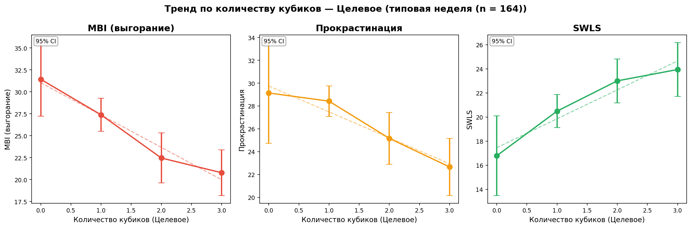

## H0c1: Тренд по числу кубиков 🔴 (0→7, все респонденты, Jonckheere-Terpstra)

Тренд по числу кубиков 🔴 (0→7, все респонденты): MBI и прокрастинация ↑, SWLS ↓

**Описание (полная выборка):**

Все респонденты группируются по количеству кубиков в зоне «Срочное» (🔴) от 0 до 7:
- **0 кубиков 🔴** — зона полностью отсутствует
- **1 кубик 🔴**
- ...
- **7 кубиков 🔴** — все кубики в Срочное

Направленная гипотеза:
MBI (выгорание) растёт: 0 < 1 < 2 < ... < 7, Прокрастинация растёт: 0 < 1 < 2 < ... < 7, SWLS убывает: 0 > 1 > 2 > ... > 7

Для проверки используется **тест Джонкхира-Терпстры (Jonckheere-Terpstra)** — непараметрический тест для упорядоченных альтернатив.

**Распределение по количеству кубиков 🔴 (полная выборка):**

| Уровень (🔴) | n |
| --- | --- |
| 0 кубик(ов) 🔴 | 32 |
| 1 кубик(ов) 🔴 | 186 |
| 2 кубик(ов) 🔴 | 143 |
| 3 кубик(ов) 🔴 | 115 |
| 4 кубик(ов) 🔴 | 25 |
| 6 кубик(ов) 🔴 | 1 |

**MBI (выгорание):**

| Уровень (🔴) | M | SD | n |
| --- | --- | --- | --- |
| 0 🔴 | 22.7 | 9.7 | 32 |
| 1 🔴 | 23.1 | 9.0 | 186 |
| 2 🔴 | 25.7 | 8.7 | 143 |
| 3 🔴 | 25.1 | 8.1 | 115 |
| 4 🔴 | 28.7 | 8.1 | 25 |
| 6 🔴 | 28.0 | nan | 1 (n<10, искл.) |

- **Ожидаемый тренд:** рост с 0 до 7 кубиков

- **Jonckheere-Terpstra:** J = 51541, p = 0.000223

- ✅ **Подтверждается**: направленная гипотеза подтверждается (p < 0.05)

**Попарные сравнения (U-тест, α = 0.0050, Бонферрони, 10 сравнений):**

- **0 vs 1 🔴:** M(22.7) vs M(23.1), Δ = +0.4, U = 2858, p = 0.7224, p_adj = 1.0000 ❌

- **0 vs 2 🔴:** M(22.7) vs M(25.7), Δ = +3.1, U = 1825, p = 0.0740, p_adj = 0.7400 ❌

- **0 vs 3 🔴:** M(22.7) vs M(25.1), Δ = +2.4, U = 1542, p = 0.1630, p_adj = 1.0000 ❌

- **0 vs 4 🔴:** M(22.7) vs M(28.7), Δ = +6.0, U = 250, p = 0.0158, p_adj = 0.1576 ❌

- **1 vs 2 🔴:** M(23.1) vs M(25.7), Δ = +2.7, U = 10721, p = 0.0026, p_adj = 0.0256 ✅

- **1 vs 3 🔴:** M(23.1) vs M(25.1), Δ = +2.0, U = 9082, p = 0.0278, p_adj = 0.2780 ❌

- **1 vs 4 🔴:** M(23.1) vs M(28.7), Δ = +5.6, U = 1458, p = 0.0025, p_adj = 0.0248 ✅

- **2 vs 3 🔴:** M(25.7) vs M(25.1), Δ = -0.7, U = 8704, p = 0.4196, p_adj = 1.0000 ❌

- **2 vs 4 🔴:** M(25.7) vs M(28.7), Δ = +2.9, U = 1476, p = 0.1661, p_adj = 1.0000 ❌

- **3 vs 4 🔴:** M(25.1) vs M(28.7), Δ = +3.6, U = 1084, p = 0.0546, p_adj = 0.5457 ❌

**Прокрастинация:**

| Уровень (🔴) | M | SD | n |
| --- | --- | --- | --- |
| 0 🔴 | 24.5 | 7.5 | 30 |
| 1 🔴 | 25.3 | 6.9 | 186 |
| 2 🔴 | 26.4 | 6.4 | 143 |
| 3 🔴 | 28.5 | 6.2 | 115 |
| 4 🔴 | 27.5 | 7.6 | 25 |
| 6 🔴 | 32.0 | nan | 1 (n<10, искл.) |

- **Ожидаемый тренд:** рост с 0 до 7 кубиков

- **Jonckheere-Terpstra:** J = 52634, p = 0.000005

- ✅ **Подтверждается**: направленная гипотеза подтверждается (p < 0.05)

**Попарные сравнения (U-тест, α = 0.0050, Бонферрони, 10 сравнений):**

- **0 vs 1 🔴:** M(24.5) vs M(25.3), Δ = +0.8, U = 2550, p = 0.4495, p_adj = 1.0000 ❌

- **0 vs 2 🔴:** M(24.5) vs M(26.4), Δ = +1.9, U = 1744, p = 0.1073, p_adj = 1.0000 ❌

- **0 vs 3 🔴:** M(24.5) vs M(28.5), Δ = +4.0, U = 1131, p = 0.0037, p_adj = 0.0372 ✅

- **0 vs 4 🔴:** M(24.5) vs M(27.5), Δ = +3.0, U = 280, p = 0.1098, p_adj = 1.0000 ❌

- **1 vs 2 🔴:** M(25.3) vs M(26.4), Δ = +1.2, U = 12049, p = 0.1436, p_adj = 1.0000 ❌

- **1 vs 3 🔴:** M(25.3) vs M(28.5), Δ = +3.2, U = 7760, p = 0.0001, p_adj = 0.0006 ✅

- **1 vs 4 🔴:** M(25.3) vs M(27.5), Δ = +2.2, U = 1877, p = 0.1181, p_adj = 1.0000 ❌

- **2 vs 3 🔴:** M(26.4) vs M(28.5), Δ = +2.0, U = 6506, p = 0.0039, p_adj = 0.0391 ✅

- **2 vs 4 🔴:** M(26.4) vs M(27.5), Δ = +1.0, U = 1548, p = 0.2861, p_adj = 1.0000 ❌

- **3 vs 4 🔴:** M(28.5) vs M(27.5), Δ = -1.0, U = 1526, p = 0.6335, p_adj = 1.0000 ❌

**SWLS:**

| Уровень (🔴) | M | SD | n |
| --- | --- | --- | --- |
| 0 🔴 | 21.8 | 7.1 | 31 |
| 1 🔴 | 22.7 | 6.2 | 186 |
| 2 🔴 | 21.4 | 6.3 | 142 |
| 3 🔴 | 21.0 | 6.1 | 115 |
| 4 🔴 | 20.4 | 5.4 | 25 |
| 6 🔴 | 26.0 | nan | 1 (n<10, искл.) |

- **Ожидаемый тренд:** убывание с 0 до 7 кубиков

- **Jonckheere-Terpstra:** J = 40494, p = 0.006907

- ✅ **Подтверждается**: направленная гипотеза подтверждается (p < 0.05)

**Попарные сравнения (U-тест, α = 0.0050, Бонферрони, 10 сравнений):**

- **0 vs 1 🔴:** M(21.8) vs M(22.7), Δ = +0.9, U = 2680, p = 0.5310, p_adj = 1.0000 ❌

- **0 vs 2 🔴:** M(21.8) vs M(21.4), Δ = -0.4, U = 2286, p = 0.7361, p_adj = 1.0000 ❌

- **0 vs 3 🔴:** M(21.8) vs M(21.0), Δ = -0.8, U = 1916, p = 0.5224, p_adj = 1.0000 ❌

- **0 vs 4 🔴:** M(21.8) vs M(20.4), Δ = -1.4, U = 441, p = 0.3815, p_adj = 1.0000 ❌

- **1 vs 2 🔴:** M(22.7) vs M(21.4), Δ = -1.3, U = 14782, p = 0.0638, p_adj = 0.6378 ❌

- **1 vs 3 🔴:** M(22.7) vs M(21.0), Δ = -1.7, U = 12368, p = 0.0225, p_adj = 0.2250 ❌

- **1 vs 4 🔴:** M(22.7) vs M(20.4), Δ = -2.2, U = 2840, p = 0.0722, p_adj = 0.7220 ❌

- **2 vs 3 🔴:** M(21.4) vs M(21.0), Δ = -0.4, U = 8446, p = 0.6349, p_adj = 1.0000 ❌

- **2 vs 4 🔴:** M(21.4) vs M(20.4), Δ = -1.0, U = 1944, p = 0.4477, p_adj = 1.0000 ❌

- **3 vs 4 🔴:** M(21.0) vs M(20.4), Δ = -0.6, U = 1516, p = 0.6689, p_adj = 1.0000 ❌

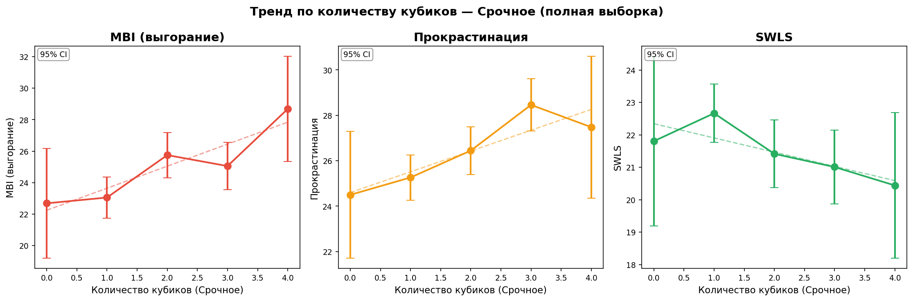

### H10a: Владельцы бизнеса и высшее руководство

Владельцы бизнеса и высшее руководство отличаются по распределению кубиков от остальных

- Владельцы бизнеса и высшее руководство: n = 68

- Остальные: n = 434

| Зона | Руководство (M) | Остальные (M) | Разница | p-value |
| --- | --- | --- | --- | --- |
| 🔴 Срочное | 1.81 | 1.84 | -0.03 | p=0.973 |
| 🟢 Целевое | 1.81 | 1.77 | +0.04 | p=0.675 |
| ⚪ Операционное | 2.38 | 2.36 | +0.02 | p=0.516 |

**Валидационные шкалы:**

- Прокрастинация: руководство = 25.6, остальные = 26.5 (p=nan)

- SWLS: руководство = 22.4, остальные = 21.7 (p=nan)

- MBI: руководство = 23.8, остальные = 24.7 (p=0.554)

**Вывод**: Не подтверждается — нет значимых различий между группами

### H13: IT vs другие сферы

В IT больше прокрастинация, выгорание и ниже удовлетворённость жизнью, чем в других сферах

**Описание:**

Сравниваем респондентов из IT с остальными по трём шкалам:
- **Прокрастинация:** выше в IT?
- **MBI (выгорание):** выше в IT?
- **SWLS (удовлетворённость жизнью):** ниже в IT?

IT определяется по колонке `profession` (содержит 'IT' или 'it') или `position`.

**Размер групп:**

- IT: n = 261

- Другие сферы: n = 241

**Распределение кубиков:**

| Зона | IT (M) | Другие (M) | Разница | p-value |
| --- | --- | --- | --- | --- |
| 🔴 Срочное | 1.85 | 1.82 | +0.03 | 0.7756  |
| 🟢 Целевое | 1.80 | 1.75 | +0.05 | 0.6943  |
| ⚪ Операционное | 2.32 | 2.41 | -0.08 | 0.3050  |

**Валидационные шкалы:**

- **Прокрастинация:** IT = 27.0 ± 6.6, Другие = 25.8 ± 6.9, p = nan  ❌

- **MBI (выгорание):** IT = 25.2 ± 9.0, Другие = 23.9 ± 8.6, p = 0.0658  ❌

- **SWLS:** IT = 21.4 ± 6.1, Другие = 22.2 ± 6.4, p = nan  ❌

| Шкала | IT (M ± SD) | Другие (M ± SD) | Разница | p-value | Гипотеза |
| --- | --- | --- | --- | --- | --- |
| Прокрастинация | 27.0 ± 6.6 | 25.8 ± 6.9 | +1.1 | nan  | ❌ |
| MBI (выгорание) | 25.2 ± 9.0 | 23.9 ± 8.6 | +1.3 | 0.0658  | ❌ |
| SWLS | 21.4 ± 6.1 | 22.2 ± 6.4 | -0.7 | nan  | ❌ |

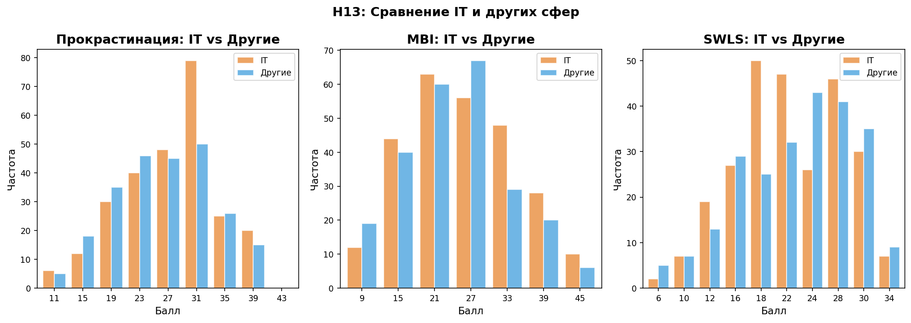

**Выводы по H13:**

- ❌ Прокрастинация: нет значимых различий (p = nan)

- ❌ MBI (выгорание): нет значимых различий (p = 0.0658)

- ❌ SWLS: нет значимых различий (p = nan)

**Итог:** Гипотеза **не подтверждается** — значимых различий по ожидаемым направлениям нет

### H1: Корреляция 🔴 с валидационными шкалами

🔴 положительно коррелирует с прокрастинацией и MBI

**🔴 (0-6) vs Прокрастинация (9-40):**

Коэффициент корреляции r = nan, p = nan

Диапазон значений: 🔴 [0; 6], Прокрастинация [9; 40]

**Вывод**: Не подтверждается

**🔴 (0-6) vs MBI (выгорание) (6-48):**

Коэффициент корреляции r = 0.158, p = 0.0004

Диапазон значений: 🔴 [0; 6], MBI (выгорание) [6; 48]

**Вывод**: Подтверждается (положительная связь)

**🔴 (0-6) vs SWLS (удовлетворённость) (5-34) (дополнительно):**

Коэффициент корреляции r = nan, p = nan

Диапазон значений: 🔴 [0; 6], SWLS (удовлетворённость) [5; 34]

**Вывод**: Связь не обнаружена

### H2: Корреляция 🟢 с валидационными шкалами

🟢 положительно коррелирует с SWLS и отрицательно с MBI

**🟢 (0-5) vs SWLS (5-34):**

Коэффициент корреляции r = nan, p = nan

Диапазон значений: 🟢 [0; 5], SWLS [5; 34]

**Вывод**: Не подтверждается

**🟢 (0-5) vs MBI (6-48):**

Коэффициент корреляции r = -0.341, p = 0.0000

Диапазон значений: 🟢 [0; 5], MBI [6; 48]

**Вывод**: Подтверждается (отрицательная связь)

**🟢 (0-5) vs Прокрастинация (9.0-40.0) (дополнительно):**

Коэффициент корреляции r = nan, p = nan

Диапазон значений: 🟢 [0; 5], Прокрастинация [9.0; 40.0]

**Вывод**: Связь не обнаружена

### H3: Низкое 🔴 и выгорание

Низкое 🔴 связано с более низким выгоранием

- Низкое 🔴 (<2): n = 218, M = 23.0, SD = 9.1

- Высокое 🔴 (≥2): n = 284, M = 25.7, SD = 8.4

**U-критерий Манна-Уитни**:

- Статистика: 24938.500

- p-value: 0.0002

**Вывод**: Результат значим (p < 0.05). Подтверждается

### H4: Доминирование 🟢 и удовлетворённость

Профили с доминированием 🟢 имеют высокие баллы SWLS

- Уровни 6-7 (доминирование 🟢): n = 198, M = 22.6, SD = 6.3

- Другие уровни: n = 302, M = 21.2, SD = 6.1

**U-критерий Манна-Уитни**:

- Статистика: 34101.500

- p-value: 0.0039

**Вывод**: Результат значим (p < 0.05). Подтверждается

### H5: Модерация записями

Модерация записями: восстановление по записям vs памяти

- По записям (4-5): n = 45

- По памяти (1-2): n = 425

| Зона | По записям | По памяти | Разница | p-value |
| --- | --- | --- | --- | --- |
| 🔴 Срочное | 1.53 | 1.89 | -0.36 | p=0.029* |
| 🟢 Целевое | 2.33 | 1.70 | +0.64 | p=0.000* |
| ⚪ Операционное | 2.13 | 2.41 | -0.28 | p=0.080 |

**Шкалы валидации:**

| Шкала | По записям (M) | По памяти (M) | Разница | p-value |
| --- | --- | --- | --- | --- |
| Прокрастинация | 23.5 | 27.0 | -3.6 | p=0.001* |
| SWLS | 22.9 | 21.5 | +1.4 | p=0.111 |
| MBI (выгорание) | 22.7 | 24.9 | -2.1 | p=0.112 |

*Значимость: * p<0.05*

### H5a: Детальное сравнение «по памяти» (1-2) vs «по записям» (4-5)

Детальное сравнение респондентов «по памяти» (1-2) и «по записям» (4-5): кубики, шкалы, демография, контекст

**Описание:**

На вопрос *«Когда вы распределяли "энергию" по коробочкам, то какую часть вы восстановили по памяти, а какую по своим записям (дневники, ежедневник, календарь, список задач и т.п.)?»*
респонденты отвечали по шкале от 1 до 5:
- **1-2:** опирались преимущественно на **память**
- **4-5:** опирались преимущественно на **записи**

Сравниваем обе группы по всем доступным параметрам.

**Размер групп:**

- По памяти (1-2): n = 425

- По записям (4-5): n = 45

**Распределение кубиков по зонам:**

| Зона | По памяти (M ± SD) | По записям (M ± SD) | Разница | p-value |
| --- | --- | --- | --- | --- |
| 🔴 Срочное | 1.89 ± 1.04 | 1.53 ± 0.84 | -0.36 | 0.0289 * |
| 🟢 Целевое | 1.70 ± 1.04 | 2.33 ± 1.04 | +0.64 | 0.0002 *** |
| ⚪ Операционное | 2.41 ± 1.04 | 2.13 ± 0.81 | -0.28 | 0.0795  |

**Шкалы валидации:**

| Шкала | По памяти (M ± SD) | По записям (M ± SD) | Разница | p-value | Тест |
| --- | --- | --- | --- | --- | --- |
| Прокрастинация | 27.0 ± 6.5 | 23.5 ± 7.0 | -3.6 | 0.0013 ** | U-тест |
| SWLS | 21.5 ± 6.2 | 22.9 ± 6.4 | +1.4 | 0.1108  | U-тест |
| MBI (выгорание) | 24.9 ± 8.8 | 22.7 ± 8.8 | -2.1 | 0.1124  | U-тест |

**Контекстные показатели:**

| Показатель | По памяти (Медиана [Q1;Q3]) | По записям (Медиана [Q1;Q3]) | p-value |
| --- | --- | --- | --- |
| Типичность недели | 0 [-1; 1] | 0 [-1; 1] | 0.0782  |
| Баланс работа/личное | 1 [-1; 2] | 0 [0; 1] | 0.3715  |
| Энергетический дефицит | 3 [3; 6] | 3 [0; 6] | 0.2330  |

**Распределение уровней профиля:**

| Профиль | По памяти | По записям |
| --- | --- | --- |
| 1 — Хаос (2-2-2) | 24 (5.6%) | 4 (8.9%) |
| 2 — Выживание (К>З>С) | 48 (11.3%) | 3 (6.7%) |
| 3 — Апатия (С>К>З) | 79 (18.6%) | 6 (13.3%) |
| 4 — Кризис (К>С>З) | 79 (18.6%) | 4 (8.9%) |
| 5 — Не сдаёмся (З>К>С) | 33 (7.8%) | 7 (15.6%) |
| 6 — Рост (З>С>К) | 67 (15.8%) | 13 (28.9%) |
| 7 — Дзен (С>З>К) | 95 (22.4%) | 8 (17.8%) |

- **Тест различия уровней:** U = 8902, p = 0.4395

- ❌ Распределение уровней **не различается** значимо

**Демография:**

- **Возраст:** память = 37.1 ± 8.0, записи = 36.8 ± 9.2 (U-тест, p = 0.6639 )

- **Пол:**

  - Мужской: память = 297 (69.9%), записи = 26 (57.8%)

  - Женский: память = 126 (29.6%), записи = 19 (42.2%)

- **Тест на различие пола:** χ² = 2.39, p = 0.1222 

**ProductivityIndex:**

- Память: M = -0.11, SD = 1.00

- Записи: M = 0.41, SD = 0.89

- U-тест: p = 0.0009 ***

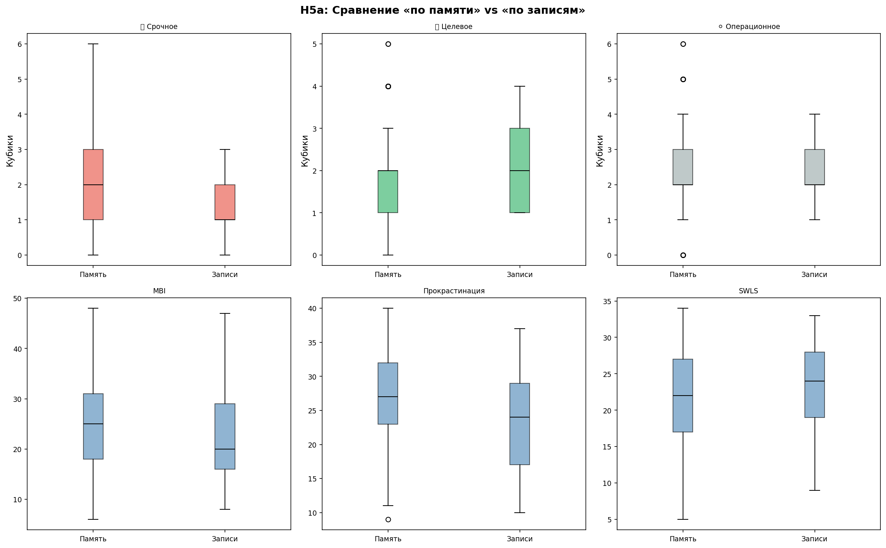

**Итог по H5a:**

- Обнаружены значимые различия по 1 шкале(ам) валидации

- Значимые различия по 2 зоне(ам) кубиков

- **Значимые параметры:** Прокрастинация, 🔴 Срочное, 🟢 Целевое

### H6: Модерация 🔴

Модерация красным: связь ⚪ с прокрастинацией усиливается при высоком 🔴

- Низкое 🔴 (0-1): корреляция ⚪-прокрастинация r = nan, p = nan

- Высокое 🔴 (3+): корреляция ⚪-прокрастинация r = 0.254, p = 0.0024

**Вывод**: Не подтверждается

### H7: Криволинейная связь 🟢 и MBI

Криволинейная связь 🟢 и выгорания (U-образная)

- Линейная модель: r = -0.327, p = 0.0000

*Требуется большая выборка для надёжной проверки U-образной зависимости*

### H8: Модерация балансом работа/личное

Баланс работа/личное как модератор связи 🔴 и выгорания

- Больше работы (work_life < 0): корреляция 🔴-MBI r = 0.039, p = 0.6558

- Больше личного (work_life > 0): корреляция 🔴-MBI r = 0.129, p = 0.0347

**Вывод**: Не подтверждается

### H9: Дефицит как медиатор

Энергетический дефицит как медиатор

- Прямая связь 🔴 → MBI: r = 0.158, p = 0.0004

- Связь 🔴 → дефицит: r = 0.227, p = 0.0000

- Связь дефицит → MBI: r = 0.343, p = 0.0000

*Полный медиационный анализ требует большей выборки*

### H10: Гендерные различия

Гендерные различия в распределении зон

- Мужчины: n = 341

- Женщины: n = 159

| Зона | Мужчины (M) | Женщины (M) | Разница | p-value |
| --- | --- | --- | --- | --- |
| 🔴 Срочное | 1.84 | 1.84 | -0.01 | p=0.755 |
| 🟢 Целевое | 1.81 | 1.70 | +0.10 | p=0.511 |
| ⚪ Операционное | 2.32 | 2.45 | -0.13 | p=0.210 |

**Вывод**: Не подтверждается — нет значимых гендерных различий

### H11: Возрастной тренд

Возрастной тренд: с возрастом доля 🔴 снижается

- Срочное ●: r = nan, p = nan  — с возрастом растёт

- Целевое ●: r = nan, p = nan  — с возрастом растёт

- Операционное ●: r = nan, p = nan  — с возрастом растёт

### H12: Профиль Дзен и дефицит

Профиль "Дзен" связан с наименьшим энергетическим дефицитом

- Уровень 7 (Дзен): n = 106, M = 2.87

- Другие уровни: n = 396, M = 3.66

**U-критерий Манна-Уитни**:

- Статистика: 17868.000

- p-value: 0.0067

**Вывод**: Результат значим (p < 0.05). Подтверждается

### H14: Линейная или нелинейная связь MBI и SWLS

Связь MBI и SWLS: линейная или нелинейная (квадратичная)?

**Описание:**

Выгорание (MBI) и удовлетворённость жизнью (SWLS) тесно связаны.
Остаётся вопрос: является ли эта связь строго линейной,
или она имеет нелинейный (квадратичный) характер?

Подход:
1. **Линейная модель:** SWLS = β₀ + β₁ × MBI
2. **Квадратичная модель:** SWLS = β₀ + β₁ × MBI + β₂ × MBI²
3. **Сравнение моделей:** F-тест (ANOVA) — улучшает ли квадратичный член модель?
4. **Проверка квадратичного члена:** t-тест для β₂

**Размер выборки:** n = 502

**Линейная модель:**

- SWLS = nan + (nan) × MBI

- R² = nan (nan% дисперсии объясняется)

**Квадратичная модель:**

- SWLS = nan + (nan) × MBI + (nan) × MBI²

- R² = nan (nan% дисперсии объясняется)

**Сравнение моделей (F-тест):**

- F(1, 499) = nan, p = nan

- ❌ Квадратичная модель **не значимо лучше** линейной (p = nan > 0.05)

**Тест для квадратичного члена β₂:**

- β₂ = nan, SE = nan, t = nan, p = nan

- ❌ Квадратичный член **не значим** (p = nan > 0.05)

**Итог:**

- Связь MBI–SWLS **линейная**: квадратичный член не улучшает модель

- Линейная модель: R² = nan

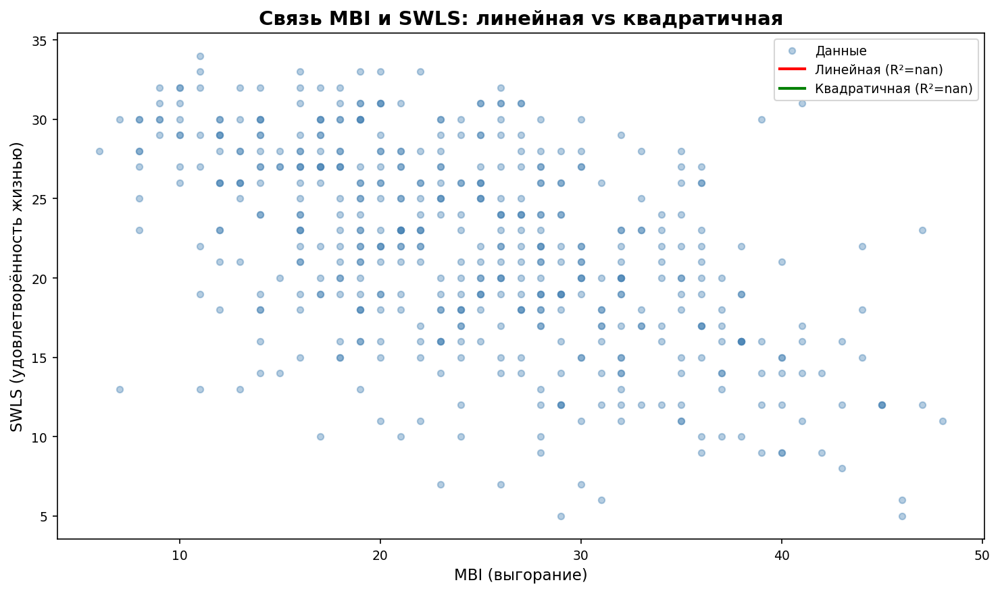

**Корреляция Спирмена:** r = nan, p = nan

### H15: Множественная регрессия — предсказание по 🟢, 🔴, балансу и дефициту

Множественная регрессия: MBI, Прокрастинация и SWLS предсказываются кубиками 🟢, 🔴, балансом работа/личное и дефицитом энергии

**Описание:**

Множественная линейная регрессия: `Шкала = β₀ + β₁×🟢 + β₂×🔴 + β₃×Баланс + β₄×Дефицит`

Предикторы:
- **🟢 Целевое** — количество кубиков в целевой зоне
- **🔴 Срочное** — количество кубиков в срочной зоне
- **Баланс работа/личное** — шкала от −3 (всё на работу) до +3 (всё на личное)
- **Дефицит энергии** — шкала от −3 (избыток) до +9 (острый дефицит)

Зависимые переменные: MBI, Прокрастинация, SWLS.

**Размер выборки (полные данные):** n = 502

**Сводная таблица регрессий:**

| Показатель | R² | Adj R² | F | p(F) |
| --- | --- | --- | --- | --- |
| MBI (выгорание) | 0.189 | 0.183 | 29.0 | 0.000000 *** |
| Прокрастинация | 0.151 | 0.144 | 22.0 | 0.000000 *** |
| SWLS | 0.092 | 0.085 | 12.6 | 0.000000 *** |

*Значимость: *** p<0.001, ** p<0.01, * p<0.05*

**MBI (выгорание):**

- R² = 0.189, Adj R² = 0.183

- F(4, 497) = 29.0, p = 0.000000

**Коэффициенты:**

| Предиктор | β | SE | t | p |  |
| --- | --- | --- | --- | --- | --- |
| Intercept | 27.291 | 1.413 | 19.31 | 0.0000 | *** |
| 🟢 Целевое | -2.519 | 0.404 | -6.24 | 0.0000 | *** |
| 🔴 Срочное | -0.715 | 0.420 | -1.70 | 0.0892 |  |
| Баланс работа/личное | 0.460 | 0.255 | 1.80 | 0.0722 |  |
| Дефицит энергии | 0.818 | 0.127 | 6.46 | 0.0000 | *** |

**Интерпретация:**

- 🟢 Целевое: β = -2.519 (отрицательная), ✅ значим

- 🔴 Срочное: β = -0.715 (отрицательная), ❌ не значим

- Баланс работа/личное: β = 0.460 (положительная), ❌ не значим

- Дефицит энергии: β = 0.818 (положительная), ✅ значим

**Прокрастинация:**

- R² = 0.151, Adj R² = 0.144

- F(4, 495) = 22.0, p = 0.000000

**Коэффициенты:**

| Предиктор | β | SE | t | p |  |
| --- | --- | --- | --- | --- | --- |
| Intercept | 26.107 | 1.136 | 22.97 | 0.0000 | *** |
| 🟢 Целевое | -1.257 | 0.322 | -3.90 | 0.0001 | *** |
| 🔴 Срочное | 0.270 | 0.336 | 0.80 | 0.4213 |  |
| Баланс работа/личное | -0.342 | 0.201 | -1.70 | 0.0895 |  |
| Дефицит энергии | 0.626 | 0.099 | 6.30 | 0.0000 | *** |

**Интерпретация:**

- 🟢 Целевое: β = -1.257 (отрицательная), ✅ значим

- 🔴 Срочное: β = 0.270 (положительная), ❌ не значим

- Баланс работа/личное: β = -0.342 (отрицательная), ❌ не значим

- Дефицит энергии: β = 0.626 (положительная), ✅ значим

**SWLS:**

- R² = 0.092, Adj R² = 0.085

- F(4, 495) = 12.6, p = 0.000000

**Коэффициенты:**

| Предиктор | β | SE | t | p |  |
| --- | --- | --- | --- | --- | --- |
| Intercept | 19.756 | 1.072 | 18.42 | 0.0000 | *** |
| 🟢 Целевое | 1.383 | 0.306 | 4.53 | 0.0000 | *** |
| 🔴 Срочное | 0.517 | 0.319 | 1.62 | 0.1054 |  |
| Баланс работа/личное | -0.370 | 0.192 | -1.92 | 0.0549 |  |
| Дефицит энергии | -0.358 | 0.095 | -3.77 | 0.0002 | *** |

**Интерпретация:**

- 🟢 Целевое: β = 1.383 (положительная), ✅ значим

- 🔴 Срочное: β = 0.517 (положительная), ❌ не значим

- Баланс работа/личное: β = -0.370 (отрицательная), ❌ не значим

- Дефицит энергии: β = -0.358 (отрицательная), ✅ значим

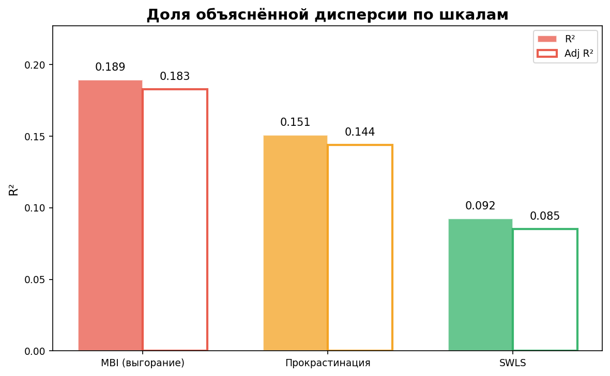

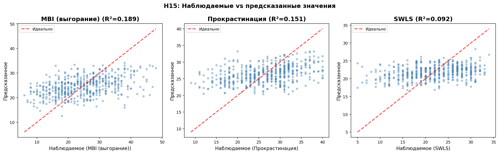

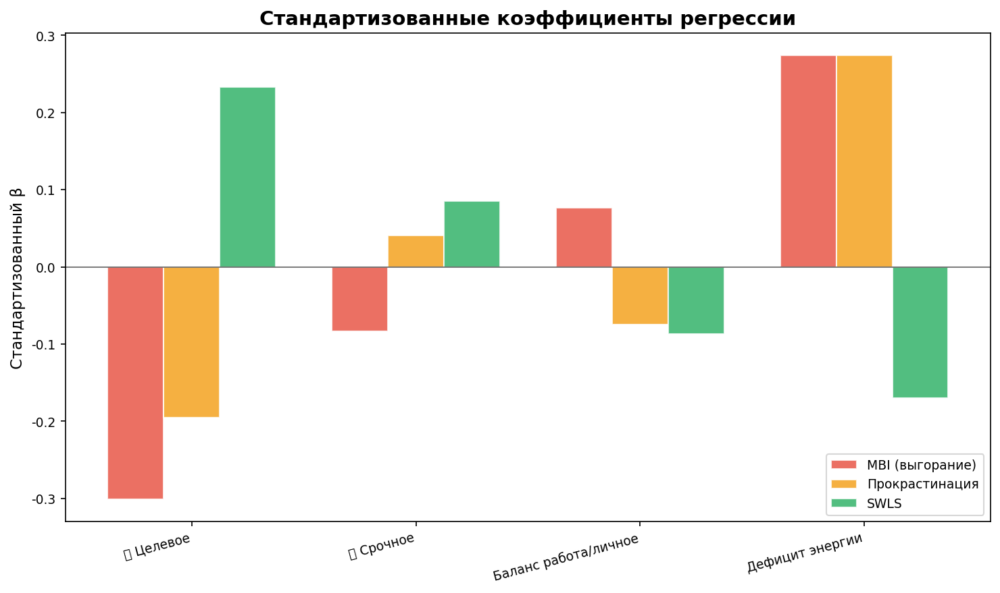

**Выводы по H15:**

- **MBI (выгорание):** R²=0.189, значимые предикторы: 🟢 Целевое, Дефицит энергии, сильнейший — Дефицит энергии (β=0.818, p=0.0000)

- **Прокрастинация:** R²=0.151, значимые предикторы: 🟢 Целевое, Дефицит энергии, сильнейший — Дефицит энергии (β=0.626, p=0.0000)

- **SWLS:** R²=0.092, значимые предикторы: 🟢 Целевое, Дефицит энергии, сильнейший — 🟢 Целевое (β=1.383, p=0.0000)

### H7a: Линейная регрессия — предсказание по 🔴 и 🟢

Линейная регрессия: MBI, Прокрастинация и SWLS предсказываются числом срочных и целевых кубиков (🔴, 🟢)

Множественная линейная регрессия: `Шкала = β₀ + β₁×🔴 + β₂×🟢`

Анализ выполняется для трёх подвыборок:
- **Полная** — все завершённые респонденты
- **Почти типовую** — representative ∈ [-1, 1]
- **Точно типовая** — representative = 0

**Сводная таблица регрессий:**

| Выборка | n | Показатель | R² | β₀ | β₁(🔴) | p(🔴) | β₂(🟢) | p(🟢) |
| --- | --- | --- | --- | --- | --- | --- | --- | --- |
| Полная | 502 | MBI | 0.107 | 30.02 | -0.226 | 0.5922 | -2.849 | 0.0000*** |
| Полная | 502 | Прокрастинация | nan | nan | nan | nan | nan | nan |
| Полная | 502 | SWLS | nan | nan | nan | nan | nan | nan |
| Почти типовая (−1..1) | 352 | MBI | 0.105 | 28.95 | 0.024 | 0.9640 | -2.645 | 0.0000*** |
| Почти типовая (−1..1) | 352 | Прокрастинация | nan | nan | nan | nan | nan | nan |
| Почти типовая (−1..1) | 352 | SWLS | nan | nan | nan | nan | nan | nan |
| Точно типовая (0) | 164 | MBI | 0.128 | 29.21 | 0.381 | 0.6180 | -2.923 | 0.0001*** |
| Точно типовая (0) | 164 | Прокрастинация | 0.115 | 28.55 | 0.613 | 0.3106 | -1.968 | 0.0008*** |
| Точно типовая (0) | 164 | SWLS | 0.060 | 18.24 | 0.272 | 0.6278 | 1.606 | 0.0031** |

*Значимость: *** p<0.001, ** p<0.01, * p<0.05*

**Выводы по H7a:**

- Полная, MBI: R²=0.107, значимые: 🟢

- Полная, Прокрастинация: R²=nan, значимые: нет значимых

- Полная, SWLS: R²=nan, значимые: нет значимых

- Почти типовая (−1..1), MBI: R²=0.105, значимые: 🟢

- Почти типовая (−1..1), Прокрастинация: R²=nan, значимые: нет значимых

- Почти типовая (−1..1), SWLS: R²=nan, значимые: нет значимых

- Точно типовая (0), MBI: R²=0.128, значимые: 🟢

- Точно типовая (0), Прокрастинация: R²=0.115, значимые: 🟢

- Точно типовая (0), SWLS: R²=0.060, значимые: 🟢

### H10a: Владельцы бизнеса и высшее руководство

Владельцы бизнеса и высшее руководство отличаются по распределению кубиков от остальных

- Владельцы бизнеса и высшее руководство: n = 68

- Остальные: n = 434

| Зона | Руководство (M) | Остальные (M) | Разница | p-value |
| --- | --- | --- | --- | --- |
| 🔴 Срочное | 1.81 | 1.84 | -0.03 | p=0.973 |
| 🟢 Целевое | 1.81 | 1.77 | +0.04 | p=0.675 |
| ⚪ Операционное | 2.38 | 2.36 | +0.02 | p=0.516 |

**Валидационные шкалы:**

- Прокрастинация: руководство = 25.6, остальные = 26.5 (p=nan)

- SWLS: руководство = 22.4, остальные = 21.7 (p=nan)

- MBI: руководство = 23.8, остальные = 24.7 (p=0.554)

**Вывод**: Не подтверждается — нет значимых различий между группами

## Анализ индекса ProductivityIndex (log₂(Целевое/Срочное))

**Описание индекса:**

ProductivityIndex — это логарифм по основанию 2 отношения количества кубиков в зоне "Целевое" к количеству
кубиков в зоне "Срочное" с добавлением небольшого смещения (eps) для избежания
деления на ноль и логарифмирования нуля.

Формула: ProductivityIndex = log₂((Целевое + eps) / (Срочное + eps))

Интерпретация:
- ProductivityIndex > 0: преобладание проактивности (целевые задачи доминируют)
- ProductivityIndex ≈ 0: баланс между срочными и целевыми задачами
- ProductivityIndex < 0: преобладание реактивности (срочные задачи доминируют)

Преимущество логарифмической шкалы по основанию 2:
- Симметрия: отношения 2:1 и 1:2 дают равные по модулю, но противоположные по знаку значения (+1 и -1)
- Интерпретируемость: значение +1 означает в 2 раза больше целевых, -1 — в 2 раза больше срочных
- При 7 кубиках и eps=1 диапазон составляет [-3, 3]

Высокий ProductivityIndex указывает на более продуктивный профиль распределения энергии.

**Параметр смещения:** eps = 1 (диапазон при 7 кубиках: [-3, 3])

**Описательная статистика ProductivityIndex:**

- M = -0.04, SD = 0.99

- Медиана = 0.00

- Диапазон = -2.81 – 2.58

**Распределение по категориям:**

- Преобладание проактивности (PI > 0.585): 114 (22.7%)

- Баланс (-0.585 ≤ PI ≤ 0.585): 269 (53.6%)

- Преобладание реактивности (PI < -0.585): 119 (23.7%)

**Корреляции ProductivityIndex с валидационными шкалами:**

- Прокрастинация: r = nan, p = nan  (слабая отрицательная)

- SWLS: r = nan, p = nan  (слабая отрицательная)

- MBI: r = -0.285, p = 0.0000 * (слабая отрицательная)

**Линейная регрессия с ProductivityIndex:**

*Модель: Зависимая переменная = β₀ + β₁ × ProductivityIndex*

**MBI (выгорание):**

- Уравнение: MBI (выгорание) = 24.44 + -2.49 × ProductivityIndex

- R² = 0.079 (7.9% дисперсии объясняется)

- Коэффициент ProductivityIndex: -2.49 (p=0.000)

- Предсказательная способность: слабая (R²=0.079)

- Интерпретация: чем выше ProductivityIndex (больше проактивности), тем ниже MBI (выгорание)

**Прокрастинация:**

- Уравнение: Прокрастинация = nan + nan × ProductivityIndex

- R² = nan (nan% дисперсии объясняется)

- Коэффициент ProductivityIndex: nan (p=nan)

- Предсказательная способность: слабая (R²=nan)

- Интерпретация: чем выше ProductivityIndex (больше проактивности), тем ниже Прокрастинация

**SWLS (удовлетворённость):**

- Уравнение: SWLS (удовлетворённость) = nan + nan × ProductivityIndex

- R² = nan (nan% дисперсии объясняется)

- Коэффициент ProductivityIndex: nan (p=nan)

- Предсказательная способность: слабая (R²=nan)

- Интерпретация: чем выше ProductivityIndex (больше проактивности), тем ниже SWLS (удовлетворённость)

**Линейная регрессия с ProductivityIndex по подвыборкам:**

| Выборка | n | Показатель | β₁ | R² | p |
| --- | --- | --- | --- | --- | --- |
| Полная | 502 | MBI (выгорание) | -2.494 | 0.079 | 0.0000 *** |
| Полная | 500 | Прокрастинация | -1.854 | 0.075 | 0.0000 *** |
| Полная | 500 | SWLS (удовлетворённость) | 1.247 | 0.040 | 0.0000 *** |
| Почти типовая (−1..1) | 352 | MBI (выгорание) | -2.564 | 0.087 | 0.0000 *** |
| Почти типовая (−1..1) | 351 | Прокрастинация | -1.853 | 0.076 | 0.0000 *** |
| Почти типовая (−1..1) | 350 | SWLS (удовлетворённость) | 1.139 | 0.033 | 0.0006 *** |
| Точно типовая (0) | 164 | MBI (выгорание) | -3.109 | 0.113 | 0.0000 *** |
| Точно типовая (0) | 164 | Прокрастинация | -2.278 | 0.099 | 0.0000 *** |
| Точно типовая (0) | 164 | SWLS (удовлетворённость) | 1.355 | 0.043 | 0.0076 ** |

**Выводы по индексу ProductivityIndex:**

- Наиболее сильная связь: с Прокрастинация (r=nan, p=nan)

- Чем выше ProductivityIndex (больше проактивности), тем ниже Прокрастинация

- Логарифмическая шкала по основанию 2 обеспечивает симметрию и интерпретируемость:

  значения +X и -X соответствуют равному по силе, но противоположному по направлению дисбалансу

  Значение +1 означает в 2 раза больше целевых, -1 — в 2 раза больше срочных

- При 7 кубиках и eps=1 диапазон ProductivityIndex составляет [-3, 3]

- ProductivityIndex может быть полезен как компактный индикатор продуктивного профиля

- Используемый eps = 1 обеспечивает диапазон [-3, 3] при логарифме по основанию 2

## Анализ времени ответа на странице 2 (распределение кубиков)

**Описание анализа:**

Время, затраченное респондентом на распределение кубиков по зонам, может быть
связано с когнитивной нагрузкой при принятии решения. Например:
- Быстрое решение может указывать на уверенность или интуитивный выбор
- Длительное размышление может свидетельствовать о внутренней борьбе или
  желании дать социально ожидаемый ответ

Здесь анализируется корреляция между временем на странице 2 (в секундах)
и количеством кубиков в каждой зоне.

**Выборка:** 501 респондентов из 502 завершённых

**Отброшено выбросов:** 1 респондентов с временем > 3400 сек (100 × медиана = 34 сек)

**Время на странице 2:**

- M = 41.5 сек, SD = 31.3

- Медиана = 34.0 сек

- Диапазон = 1 – 397 сек

- Q1 = 26 сек, Q3 = 47 сек

**Корреляции Спирмена: время vs кубики:**

- Срочное ●: r = -0.047, p = 0.2963 n.s. (слабая отрицательная)

- Целевое ●: r = 0.047, p = 0.2914 n.s. (слабая положительная)

- Операционное ●: r = 0.013, p = 0.7799 n.s. (слабая положительная)

**Выводы по анализу времени:**

- Наиболее сильная связь времени с зоной Целевое ●: r = 0.047, p = 0.2914

- Направление: больше кубиков — больше времени

- Значимых корреляций (p < 0.05) не обнаружено

## Заключение

**Примечание к интерпретации:**
- p < 0.05 — статистически значимый результат
- Размер эффекта: малый = 0.2, средний = 0.5, большой = 0.8
- Корреляции: слабая |r| < 0.3, средняя 0.3 ≤ |r| < 0.5, сильная |r| ≥ 0.5

---
*Отчёт сгенерирован автоматически*

