# Краткий отчёт анализа данных опроса "Три коробочки"

**Дата генерации:** 2026-04-22 19:54
**Всего респондентов:** 748
**Завершили опрос:** 502

---

## Описание исследования

Методика "Три коробочки" — ипсативный инструмент распределения ограниченного 
ресурса (6 единиц энергии) между тремя функциональными категориями:

- 🔴 **Срочное (Реактивность)** — задачи, требующие немедленного решения
- 🟢 **Целевое (Проактивность)** — задачи, приближающие к долгосрочным целям
- ⚪ **Операционное (Поддержание)** — рутинные задачи и восстановление

Цель исследования — валидация инструмента через анализ связи с продуктивностью,
выгоранием и удовлетворённостью жизнью.

---

## Описательная статистика и характеристики выборки

**Демография завершённых анкет:**

- Возраст: M = 37.1, SD = 8.1, диапазон = 19-61, n = 500

- Пол: {'Мужской': 341, 'Женский': 159}

- Должности (топ-5): {'Старший специалист': 122, 'Менеджер среднего звена': 98, 'Специалист': 82, 'Тимлид': 58, 'Высший менеджмент': 42}

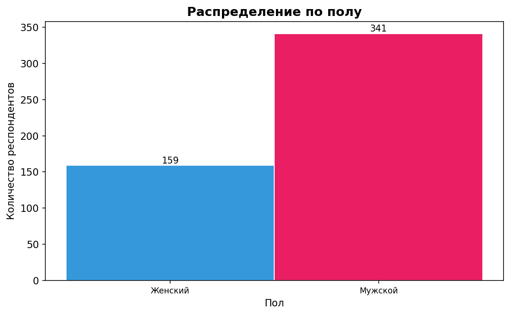

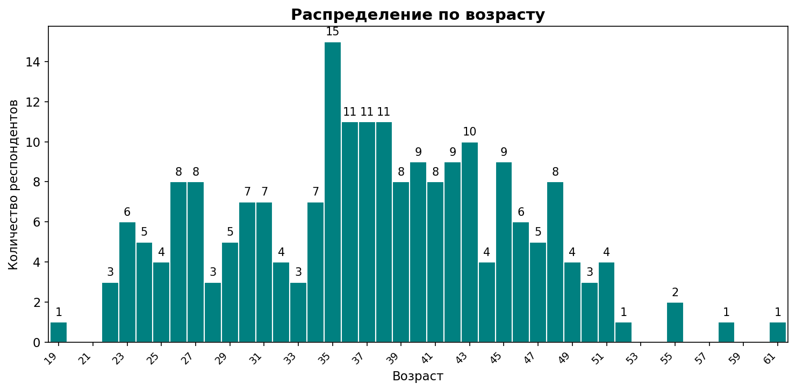

**Распределение кубиков по зонам:**

- Reactive: M = 1.84, SD = 1.03, диапазон = 0-6

- Proactive: M = 1.77, SD = 1.05, диапазон = 0-5

- Operational: M = 2.36, SD = 1.01, диапазон = 0-6

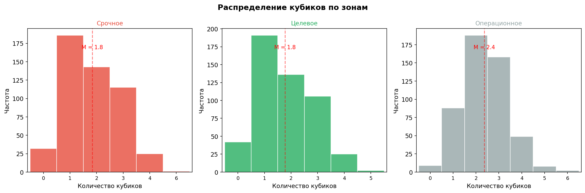

**Шкалы валидации:**

- Прокрастинация: M = 26.4, SD = 6.8, диапазон = 9-40

- SWLS (удовлетворённость): M = 21.8, SD = 6.3, диапазон = 5-34

- MBI (выгорание): M = 24.5, SD = 8.8, диапазон = 6-48

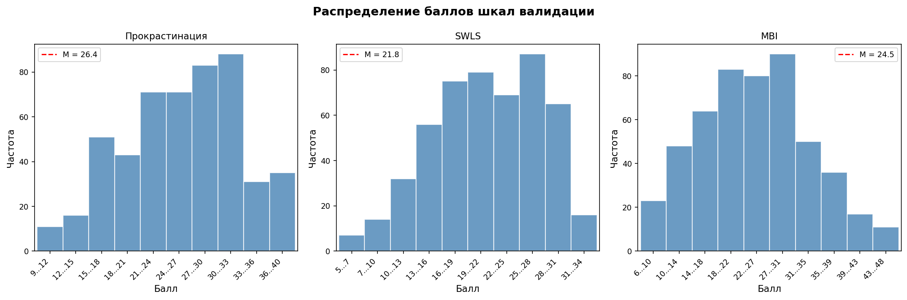

## Корреляционные матрицы (Спирмен)

**Описание:**

Корреляционный анализ выполнен для трёх подвыборок:
- **Полная выборка** — все завершённые респонденты
- **Почти типовая неделя** — респонденты с representative ∈ [-1, 1]
- **Точно типовая неделя** — респонденты с representative = 0

Использован коэффициент ранговой корреляции Спирмена (ρ), устойчивый к отклонениям от нормальности.

**1. Полная выборка**

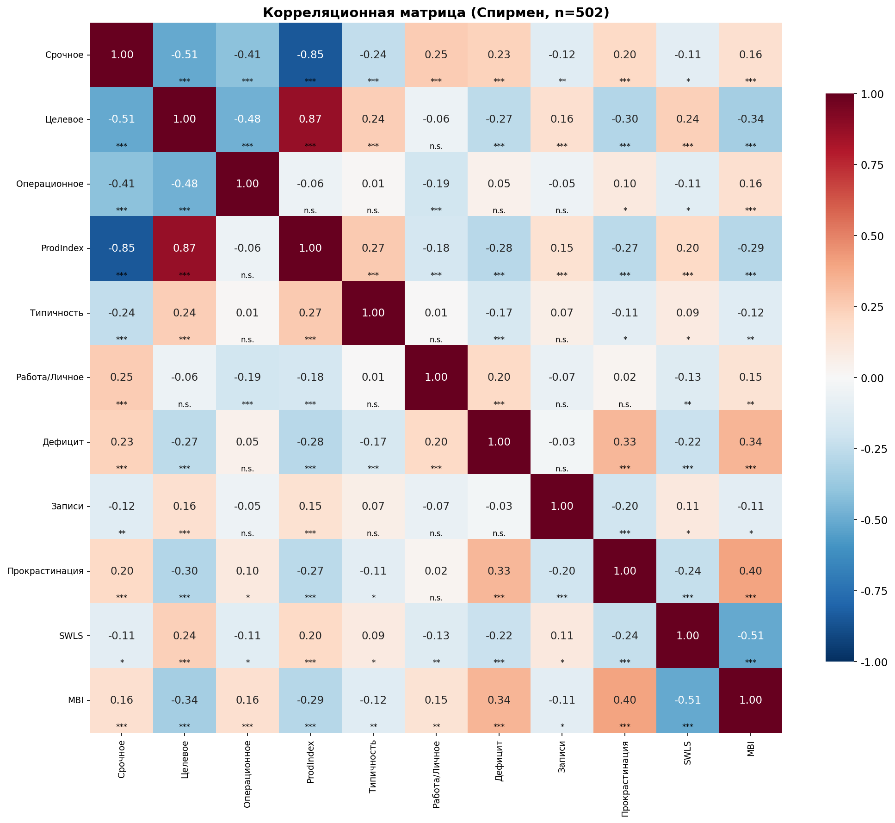

*Значимость: *** p<0.001, ** p<0.01, * p<0.05, n.s. - не значимо, ? - ненадёжно (мало данных)*

**2. Почти типовая неделя (representative ∈ [-1, 1], n = 352)**

*Значимость: *** p<0.001, ** p<0.01, * p<0.05, n.s. - не значимо, ? - ненадёжно (мало данных)*

**3. Точно типовая неделя (representative = 0, n = 164)**

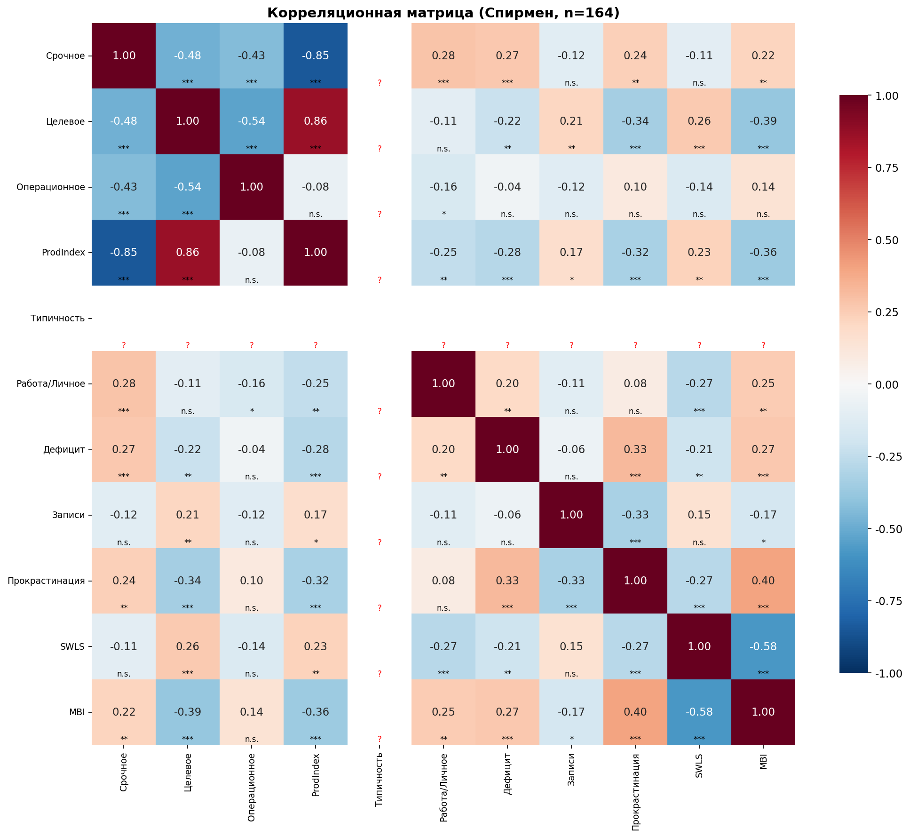

*Значимость: *** p<0.001, ** p<0.01, * p<0.05, n.s. - не значимо, ? - ненадёжно (мало данных)*

## Проверка гипотез исследования

## H0a1: Тренд по числу кубиков 🟢 (0→7, все респонденты)

**Гипотеза:** H0a1

**Описание (полная выборка):**

Все респонденты группируются по количеству кубиков в зоне «Целевое» (🟢) от 0 до 7.

Направленная гипотеза проверяется с помощью **теста Джонкхира-Терпстры (Jonckheere-Terpstra)** — 
непараметрического теста для упорядоченных альтернатив.

**Методология:**
- Использована исправленная формула дисперсии Var(J) согласно Jonckheere (1954)
- Applied continuity correction ±0.5 для консервативности теста
- Для значимых результатов проведены post-hoc попарные сравнения (Mann-Whitney U с Bonferroni correction)

**Распределение по количеству кубиков 🟢 (полная выборка):**

| Уровень | n |
| --- | --- |
| 0 кубик(ов) 🟢 | 42 |
| 1 кубик(ов) 🟢 | 191 |
| 2 кубик(ов) 🟢 | 136 |
| 3 кубик(ов) 🟢 | 106 |
| 4 кубик(ов) 🟢 | 25 |
| 5 кубик(ов) 🟢 | 2 |

**SWLS:**

| Уровень | M | SD | n |
| --- | --- | --- | --- |
| 0 🟢 | 18.0 | 6.6 | 41 |
| 1 🟢 | 20.7 | 6.2 | 191 |
| 2 🟢 | 22.9 | 5.9 | 135 |
| 3 🟢 | 23.4 | 5.7 | 106 |
| 4 🟢 | 22.6 | 6.4 | 25 |
| 5 🟢 | 26.0 | 7.1 | 2 (n<10, искл.) |

- **Ожидаемый тренд:** рост с 0 до 7 кубиков

- **Jonckheere-Terpstra:** J = 54159, p = 0.000000

- ✅ **Подтверждается**: направленная гипотеза подтверждается (p < 0.05)

**MBI:**

| Уровень | M | SD | n |
| --- | --- | --- | --- |
| 0 🟢 | 30.1 | 8.4 | 42 |
| 1 🟢 | 27.0 | 8.1 | 191 |
| 2 🟢 | 22.5 | 8.8 | 136 |
| 3 🟢 | 21.9 | 8.3 | 106 |
| 4 🟢 | 18.8 | 7.7 | 25 |
| 5 🟢 | 22.5 | 6.4 | 2 (n<10, искл.) |

- **Ожидаемый тренд:** убывание с 0 до 7 кубиков

- **Jonckheere-Terpstra:** J = 31667, p = 0.000000

- ✅ **Подтверждается**: направленная гипотеза подтверждается (p < 0.05)

**Прокрастинация:**

| Уровень | M | SD | n |
| --- | --- | --- | --- |
| 0 🟢 | 30.2 | 6.9 | 40 |
| 1 🟢 | 28.1 | 6.2 | 191 |
| 2 🟢 | 25.4 | 6.6 | 136 |
| 3 🟢 | 24.0 | 6.6 | 106 |
| 4 🟢 | 23.6 | 6.8 | 25 |
| 5 🟢 | 28.5 | 3.5 | 2 (n<10, искл.) |

- **Ожидаемый тренд:** убывание с 0 до 7 кубиков

- **Jonckheere-Terpstra:** J = 32937, p = 0.000000

- ✅ **Подтверждается**: направленная гипотеза подтверждается (p < 0.05)

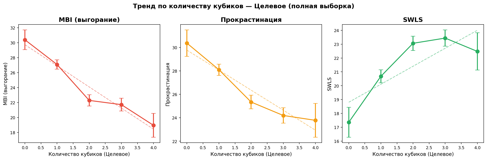

## H0b1: Тренд по числу кубиков 🟢 (0→7, типовая неделя rep=0, n = 164)

**Гипотеза:** H0b1

**Описание (типовая неделя (n = 164)):**

Все респонденты группируются по количеству кубиков в зоне «Целевое» (🟢) от 0 до 7.

Направленная гипотеза проверяется с помощью **теста Джонкхира-Терпстры (Jonckheere-Terpstra)** — 
непараметрического теста для упорядоченных альтернатив.

**Методология:**
- Использована исправленная формула дисперсии Var(J) согласно Jonckheere (1954)
- Applied continuity correction ±0.5 для консервативности теста
- Для значимых результатов проведены post-hoc попарные сравнения (Mann-Whitney U с Bonferroni correction)

**Распределение по количеству кубиков 🟢 (типовая неделя (n = 164)):**

| Уровень | n |
| --- | --- |
| 0 кубик(ов) 🟢 | 14 |
| 1 кубик(ов) 🟢 | 70 |
| 2 кубик(ов) 🟢 | 41 |
| 3 кубик(ов) 🟢 | 33 |
| 4 кубик(ов) 🟢 | 6 |

**SWLS:**

| Уровень | M | SD | n |
| --- | --- | --- | --- |
| 0 🟢 | 16.8 | 5.7 | 14 |
| 1 🟢 | 20.5 | 5.8 | 70 |
| 2 🟢 | 23.0 | 5.8 | 41 |
| 3 🟢 | 23.9 | 6.3 | 33 |
| 4 🟢 | 18.7 | 6.5 | 6 (n<10, искл.) |

- **Ожидаемый тренд:** рост с 0 до 7 кубиков

- **Jonckheere-Terpstra:** J = 5547, p = 0.000021

- ✅ **Подтверждается**: направленная гипотеза подтверждается (p < 0.05)

**MBI:**

| Уровень | M | SD | n |
| --- | --- | --- | --- |
| 0 🟢 | 31.4 | 7.3 | 14 |
| 1 🟢 | 27.4 | 7.9 | 70 |
| 2 🟢 | 22.5 | 9.0 | 41 |
| 3 🟢 | 20.8 | 7.4 | 33 |
| 4 🟢 | 22.7 | 11.3 | 6 (n<10, искл.) |

- **Ожидаемый тренд:** убывание с 0 до 7 кубиков

- **Jonckheere-Terpstra:** J = 2698, p = 0.000000

- ✅ **Подтверждается**: направленная гипотеза подтверждается (p < 0.05)

**Прокрастинация:**

| Уровень | M | SD | n |
| --- | --- | --- | --- |
| 0 🟢 | 29.1 | 7.6 | 14 |
| 1 🟢 | 28.4 | 5.6 | 70 |
| 2 🟢 | 25.2 | 7.2 | 41 |
| 3 🟢 | 22.7 | 7.1 | 33 |
| 4 🟢 | 24.0 | 5.9 | 6 (n<10, искл.) |

- **Ожидаемый тренд:** убывание с 0 до 7 кубиков

- **Jonckheere-Terpstra:** J = 2910, p = 0.000006

- ✅ **Подтверждается**: направленная гипотеза подтверждается (p < 0.05)

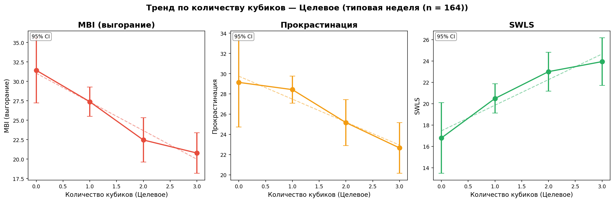

## H0c1: Тренд по числу кубиков 🔴 (0→7, все респонденты)

**Гипотеза:** H0c1

**Описание (полная выборка):**

Все респонденты группируются по количеству кубиков в зоне «Срочное» (🔴) от 0 до 7.

Направленная гипотеза проверяется с помощью **теста Джонкхира-Терпстры (Jonckheere-Terpstra)** — 
непараметрического теста для упорядоченных альтернатив.

**Методология:**
- Использована исправленная формула дисперсии Var(J) согласно Jonckheere (1954)
- Applied continuity correction ±0.5 для консервативности теста
- Для значимых результатов проведены post-hoc попарные сравнения (Mann-Whitney U с Bonferroni correction)

**Распределение по количеству кубиков 🔴 (полная выборка):**

| Уровень | n |
| --- | --- |
| 0 кубик(ов) 🔴 | 32 |
| 1 кубик(ов) 🔴 | 186 |
| 2 кубик(ов) 🔴 | 143 |
| 3 кубик(ов) 🔴 | 115 |
| 4 кубик(ов) 🔴 | 25 |
| 6 кубик(ов) 🔴 | 1 |

**MBI:**

| Уровень | M | SD | n |
| --- | --- | --- | --- |
| 0 🔴 | 22.7 | 9.7 | 32 |
| 1 🔴 | 23.1 | 9.0 | 186 |
| 2 🔴 | 25.7 | 8.7 | 143 |
| 3 🔴 | 25.1 | 8.1 | 115 |
| 4 🔴 | 28.7 | 8.1 | 25 |
| 6 🔴 | 28.0 | nan | 1 (n<10, искл.) |

- **Ожидаемый тренд:** рост с 0 до 7 кубиков

- **Jonckheere-Terpstra:** J = 51541, p = 0.000220

- ✅ **Подтверждается**: направленная гипотеза подтверждается (p < 0.05)

**Прокрастинация:**

| Уровень | M | SD | n |
| --- | --- | --- | --- |
| 0 🔴 | 24.5 | 7.5 | 30 |
| 1 🔴 | 25.3 | 6.9 | 186 |
| 2 🔴 | 26.4 | 6.4 | 143 |
| 3 🔴 | 28.5 | 6.2 | 115 |
| 4 🔴 | 27.5 | 7.6 | 25 |
| 6 🔴 | 32.0 | nan | 1 (n<10, искл.) |

- **Ожидаемый тренд:** рост с 0 до 7 кубиков

- **Jonckheere-Terpstra:** J = 52634, p = 0.000005

- ✅ **Подтверждается**: направленная гипотеза подтверждается (p < 0.05)

**SWLS:**

| Уровень | M | SD | n |
| --- | --- | --- | --- |
| 0 🔴 | 21.8 | 7.1 | 31 |
| 1 🔴 | 22.7 | 6.2 | 186 |
| 2 🔴 | 21.4 | 6.3 | 142 |
| 3 🔴 | 21.0 | 6.1 | 115 |
| 4 🔴 | 20.4 | 5.4 | 25 |
| 6 🔴 | 26.0 | nan | 1 (n<10, искл.) |

- **Ожидаемый тренд:** убывание с 0 до 7 кубиков

- **Jonckheere-Terpstra:** J = 40494, p = 0.006858

- ✅ **Подтверждается**: направленная гипотеза подтверждается (p < 0.05)

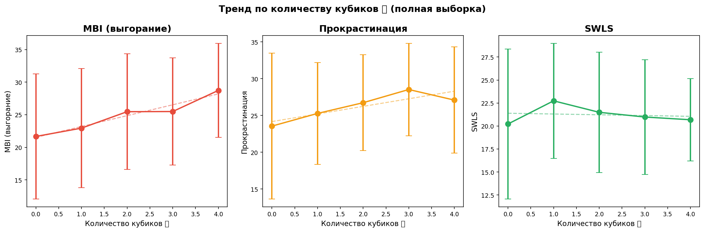

## H0d1: Тренд по числу кубиков 🔴 (0→7, типовая неделя rep=0, n = 164)

**Гипотеза:** H0d1

**Описание (типовая неделя (n = 164)):**

Все респонденты группируются по количеству кубиков в зоне «Срочное» (🔴) от 0 до 7.

Направленная гипотеза проверяется с помощью **теста Джонкхира-Терпстры (Jonckheere-Terpstra)** — 
непараметрического теста для упорядоченных альтернатив.

**Методология:**
- Использована исправленная формула дисперсии Var(J) согласно Jonckheere (1954)
- Applied continuity correction ±0.5 для консервативности теста
- Для значимых результатов проведены post-hoc попарные сравнения (Mann-Whitney U с Bonferroni correction)

**Распределение по количеству кубиков 🔴 (типовая неделя (n = 164)):**

| Уровень | n |
| --- | --- |
| 0 кубик(ов) 🔴 | 10 |
| 1 кубик(ов) 🔴 | 58 |
| 2 кубик(ов) 🔴 | 57 |
| 3 кубик(ов) 🔴 | 32 |
| 4 кубик(ов) 🔴 | 7 |

**MBI:**

| Уровень | M | SD | n |
| --- | --- | --- | --- |
| 0 🔴 | 23.3 | 10.1 | 10 |
| 1 🔴 | 22.7 | 8.2 | 58 |
| 2 🔴 | 26.2 | 9.0 | 57 |
| 3 🔴 | 26.4 | 9.0 | 32 |
| 4 🔴 | 29.9 | 3.8 | 7 (n<10, искл.) |

- **Ожидаемый тренд:** рост с 0 до 7 кубиков

- **Jonckheere-Terpstra:** J = 4946, p = 0.010235

- ✅ **Подтверждается**: направленная гипотеза подтверждается (p < 0.05)

**Прокрастинация:**

| Уровень | M | SD | n |
| --- | --- | --- | --- |
| 0 🔴 | 24.4 | 8.1 | 10 |
| 1 🔴 | 25.0 | 7.3 | 58 |
| 2 🔴 | 26.3 | 6.3 | 57 |
| 3 🔴 | 28.8 | 6.1 | 32 |
| 4 🔴 | 29.6 | 6.7 | 7 (n<10, искл.) |

- **Ожидаемый тренд:** рост с 0 до 7 кубиков

- **Jonckheere-Terpstra:** J = 5127, p = 0.001823

- ✅ **Подтверждается**: направленная гипотеза подтверждается (p < 0.05)

**SWLS:**

| Уровень | M | SD | n |
| --- | --- | --- | --- |
| 0 🔴 | 20.1 | 7.2 | 10 |
| 1 🔴 | 22.7 | 6.8 | 58 |
| 2 🔴 | 20.9 | 5.6 | 57 |
| 3 🔴 | 20.8 | 6.2 | 32 |
| 4 🔴 | 20.4 | 4.2 | 7 (n<10, искл.) |

- **Ожидаемый тренд:** убывание с 0 до 7 кубиков

- **Jonckheere-Terpstra:** J = 3832, p = 0.100087

- ❌ **Не подтверждается**: p = 0.1001 > 0.05

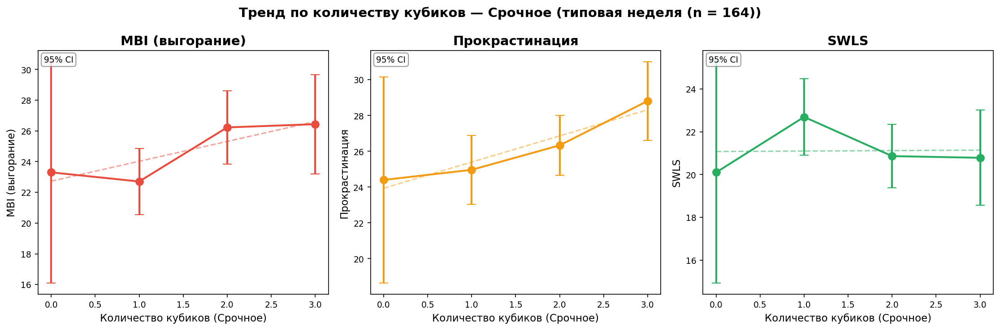

### H15: Множественная регрессия — предсказание по 4 предикторам

**Описание:**

Множественная линейная регрессия: `Шкала = β₀ + β₁×🟢 + β₂×🔴 + β₃×Баланс + β₄×Дефицит`

Предикторы:
- **🟢 Целевое** — количество кубиков в целевой зоне
- **🔴 Срочное** — количество кубиков в срочной зоне
- **Баланс работа/личное** — шкала от −3 (всё на работу) до +3 (всё на личное)
- **Дефицит энергии** — шкала от −3 (избыток) до +9 (острый дефицит)

Зависимые переменные: MBI, Прокрастинация, SWLS.

**Размер выборки (полные данные):** n = 502

**Сводная таблица регрессий:**

| Показатель | R² | Adj R² | F | p(F) |
| --- | --- | --- | --- | --- |
| MBI (выгорание) | 0.189 | 0.183 | 29.0 | 0.000000 *** |
| Прокрастинация | 0.151 | 0.144 | 22.0 | 0.000000 *** |
| SWLS | 0.092 | 0.085 | 12.6 | 0.000000 *** |

*Значимость: *** p<0.001, ** p<0.01, * p<0.05*

**MBI (выгорание):**

- R² = 0.189, Adj R² = 0.183

- F(4, 497) = 29.0, p = 0.000000

| Предиктор | β | SE | t | p |  |
| --- | --- | --- | --- | --- | --- |
| Intercept | 27.291 | 1.413 | 19.31 | 0.0000 | *** |
| 🟢 Целевое | -2.519 | 0.404 | -6.24 | 0.0000 | *** |
| 🔴 Срочное | -0.715 | 0.420 | -1.70 | 0.0892 |  |
| Баланс работа/личное | 0.460 | 0.255 | 1.80 | 0.0722 |  |
| Дефицит энергии | 0.818 | 0.127 | 6.46 | 0.0000 | *** |

**Прокрастинация:**

- R² = 0.151, Adj R² = 0.144

- F(4, 495) = 22.0, p = 0.000000

| Предиктор | β | SE | t | p |  |
| --- | --- | --- | --- | --- | --- |
| Intercept | 26.107 | 1.136 | 22.97 | 0.0000 | *** |
| 🟢 Целевое | -1.257 | 0.322 | -3.90 | 0.0001 | *** |
| 🔴 Срочное | 0.270 | 0.336 | 0.80 | 0.4213 |  |
| Баланс работа/личное | -0.342 | 0.201 | -1.70 | 0.0895 |  |
| Дефицит энергии | 0.626 | 0.099 | 6.30 | 0.0000 | *** |

**SWLS:**

- R² = 0.092, Adj R² = 0.085

- F(4, 495) = 12.6, p = 0.000000

| Предиктор | β | SE | t | p |  |
| --- | --- | --- | --- | --- | --- |
| Intercept | 19.756 | 1.072 | 18.42 | 0.0000 | *** |
| 🟢 Целевое | 1.383 | 0.306 | 4.53 | 0.0000 | *** |
| 🔴 Срочное | 0.517 | 0.319 | 1.62 | 0.1054 |  |
| Баланс работа/личное | -0.370 | 0.192 | -1.92 | 0.0549 |  |
| Дефицит энергии | -0.358 | 0.095 | -3.77 | 0.0002 | *** |

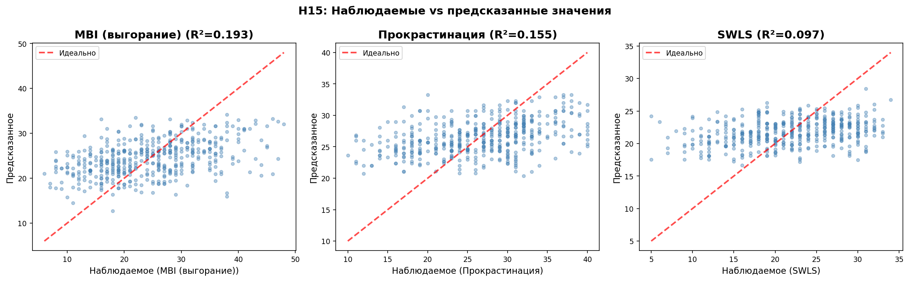

**Выводы по H15:**

- **MBI (выгорание):** R²=0.189, значимые предикторы: 🟢 Целевое, Дефицит энергии

- **Прокрастинация:** R²=0.151, значимые предикторы: 🟢 Целевое, Дефицит энергии

- **SWLS:** R²=0.092, значимые предикторы: 🟢 Целевое, Дефицит энергии

## Заключение

**Примечание к интерпретации:**
- p < 0.05 — статистически значимый результат
- Корреляции: слабая |r| < 0.3, средняя 0.3 ≤ |r| < 0.5, сильная |r| ≥ 0.5
- R²: малый = 0.01, средний = 0.09, большой = 0.25 (Cohen, 1988)

---
*Отчёт сгенерирован автоматически*

